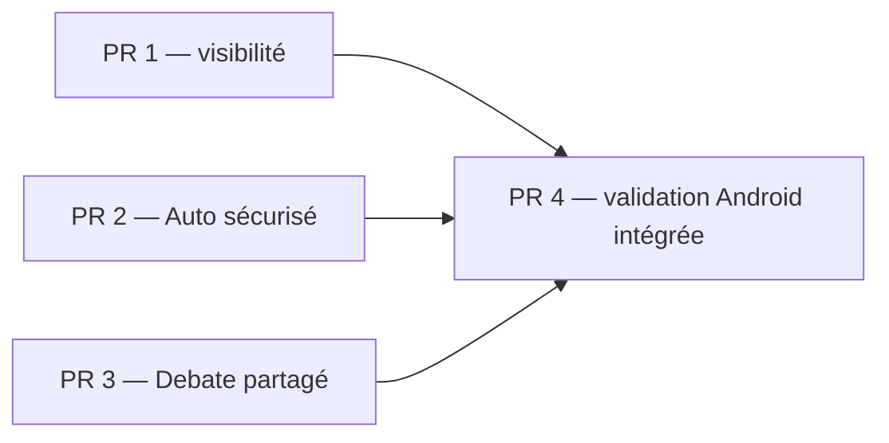

# Plan de convergence CLI, Desktop et Android

## Résultat cible

Les trois clients présentent les mêmes capacités sans exposer leurs mécanismes internes :

- `cloud-lean` reste invisible dans toutes les interfaces, tout en pouvant être choisi automatiquement par le runtime si un flux interne en a besoin ;
- Desktop et Android utilisent l'unique sélecteur existant `Ask / Auto Edit / Full Auto` ; l'agent technique `auto` n'apparaît pas dans le sélecteur d'agents graphique ;
- `Full Auto` reste mémorisé, mais chaque nouveau démarrage de l'application exige une confirmation avant de le réactiver ; un refus repasse en `Ask` et persiste ce choix ;
- le mode `Debate` ouvre sur Desktop et Android le même configurateur que le CLI, avec deux modèles annexes minimum en plus du modèle principal ;
- l'observabilité mobile existante est validée sur Android, corrigée uniquement si la QA révèle des défauts, puis intégrée aux gates de build.

Le plan réutilise les contrôles déjà présents et fonctionnels. Il ne prévoit ni leur reconstruction, ni un refactoring préalable de `prompt-input.tsx`.

## État vérifié

| Capacité | CLI | Desktop / Android partagé | Écart réel |
|---|---|---|---|
| Visibilité des agents | Filtre `hidden` et `cli_hidden` | Filtre `hidden` | `cloud-lean` n'est caché partout que si sa configuration utilise `hidden: true` |
| Auto | Agent backend `auto` disponible | Combobox `Ask / Auto Edit / Full Auto` déjà opérationnelle | Agent technique encore potentiellement visible et absence de confirmation de redémarrage |
| Debate | Configurateur complet et endpoints existants | Aucun branchement dans `packages/app` | Ajouter l'UI partagée, pas le backend |
| Observabilité | Backend et routes présents | Écrans partagés déjà reliés à la navigation mobile | Build et parcours Android non validés de bout en bout |

Aucun appel du code inspecté ne sélectionne explicitement `cloud-lean` par son nom. La sélection perçue peut venir d'un état de session ou d'une configuration persistée ; masquer l'agent ne doit donc pas casser sa disponibilité interne.

## Décisions d'architecture

### 1. Deux niveaux de visibilité explicites

- `hidden`: agent invisible dans tous les sélecteurs utilisateurs, CLI compris. C'est le contrat de `cloud-lean`.
- `app_hidden`: agent invisible uniquement dans l'application graphique partagée Desktop/Android. C'est le contrat de l'agent technique `auto` tant que le CLI le conserve.
- `cli_hidden` reste disponible pour les éventuels agents destinés à l'application graphique mais pas au TUI ; il ne doit plus porter la politique de `cloud-lean`.

Le filtrage appartient à la source des agents sélectionnables (`local.tsx`), pas à chaque composant visuel. Une ancienne sélection persistée devenue cachée retombe sur l'ordre déterministe déjà produit par le backend : `default_agent` visible, sinon `build`, puis ordre alphabétique. L'application ne doit pas réordonner cette liste. Si aucun agent primaire n'est visible, la sélection vaut `undefined`, l'envoi est désactivé et une erreur explicite est affichée.

`app_hidden` est optionnel et vaut `false` par défaut. Un client ancien ignore ce champ sans casser le payload ; un client récent connecté à un serveur ancien le considère absent donc `false`. Le déploiement doit donc mettre à jour le serveur et l'application ensemble pour garantir que l'agent `auto` est caché.

### 2. Une seule commande Auto visible dans l'application

La combobox existante reste l'autorité UX :

- `Ask`: aucune réponse automatique ;
- `Auto Edit`: réponses automatiques limitées aux permissions d'édition déjà définies ;
- `Full Auto`: réponses automatiques à toutes les demandes de permission compatibles avec la politique backend.

L'agent backend `auto` reste un alias de compatibilité CLI. Cette livraison ne prétend pas unifier sa permission `allow` avec l'auto-réponse de l'application : ce sont aujourd'hui deux mécanismes distincts. Leur fusion ou la dépréciation de l'agent exigera une RFC séparée.

### 3. Confirmation de sécurité au démarrage (choix B)

`PermissionProvider` conserve le mode persisté et ajoute un acquittement valable uniquement pour son instance racine. La machine d'état est :

| État | Persisté | Effectif | Affiché dans la combobox | Transition |
|---|---|---|---|---|
| normal | `Ask` ou `Auto Edit` | identique | identique | aucun dialogue |
| confirmation requise | `Full Auto` | `Ask` | `Ask` + dialogue indiquant le mode mémorisé | accepter ou refuser |
| confirmé | `Full Auto` | `Full Auto` | `Full Auto` | valable jusqu'à destruction du provider racine |
| refusé | `Ask` | `Ask` | `Ask` | le refus écrase la valeur persistée |

Un « démarrage » signifie l'initialisation du `PermissionProvider` racine : lancement du process Desktop, lancement de l'APK ou reload complet de l'application. Un simple passage Android arrière-plan → premier plan ne recrée pas le provider et ne redemande pas de confirmation. Le dialogue n'est montré qu'une fois par instance racine et ne doit pas bloquer le rendu initial.

La logique réside dans le contexte de permissions. `prompt-input.tsx` ne reçoit que le branchement minimal vers l'action ou le dialogue existant.

### 4. Debate partagé par Desktop et Android

Créer un composant partagé `DialogDebateSetup` dans `packages/app`, aligné sur le comportement TUI :

- modèle principal prérempli avec le modèle courant ;
- sélection de deux modèles annexes minimum, sans doublon avec le principal ;
- lecture et écriture via les endpoints SDK `debate.config` déjà générés ;
- sauvegarde globale via `debate.config`, exactement comme le store TUI actuel ; les endpoints de session restent hors périmètre ;
- action `Reconfigurer le débat` disponible même si la configuration est valide ;
- resynchronisation du modèle principal juste avant l'envoi ;
- erreurs réseau et modèles indisponibles affichés sans fermer ni vider le dialogue.

Le schéma backend `Collective.DebateSelection` reste l'autorité et impose deux annexes minimum. L'application et le TUI gardent une prévalidation UX miroir ; un test de contrat de l'endpoint vérifie que le backend refuse moins de deux annexes, et les tests des deux clients verrouillent le même seuil. Le contrôle existant sélectionne `Debate`; le nouveau code intercepte uniquement cette branche. Aucun nouveau sélecteur de mode n'est créé.

### 5. Observabilité Android : validation d'abord

Les composants et la navigation mobile existent déjà. Le travail commence donc par un build et une QA sur appareil ou émulateur. Les corrections sont limitées aux défauts reproduits : responsive, clavier, scroll, états vides/erreur, appels au serveur local ou distant. Aucune nouvelle fonction d'observabilité backend n'entre dans ce chantier.

## Découpage en quatre workstreams livrables

### PR 1 — Contrat de visibilité des agents [DONE]

**Validation 2026-07-13** : `app_hidden` est disponible dans le contrat backend/SDK partage, l agent `auto` est masque dans Desktop/Android, le fallback CLI est deterministe, les selections invalides retombent sur un agent visible et `cloud-lean` est `hidden: true` dans la configuration utilisateur. Tests : typecheck opencode/app, 45 tests agent, 5 tests de filtrage app, generation SDK reussie.

**Fichiers probables**

- `packages/opencode/src/agent/agent.ts`
- `packages/opencode/src/config/config-schema.ts`
- `packages/app/src/context/local.tsx`
- génération SDK si le schéma public change
- tests ciblés agent et contexte local

**Travail**

- ajouter le contrat de visibilité graphique explicite ;
- cacher l'agent backend `auto` sur Desktop et Android ;
- migrer la configuration locale de `cloud-lean` vers `hidden: true` ;
- garantir le fallback déterministe d'une sélection persistée désormais cachée et le cas sans agent visible ;
- vérifier que le CLI conserve `auto` et ne montre pas `cloud-lean`.

**Critères de sortie**

- aucun sélecteur CLI, Desktop ou Android n'affiche `cloud-lean` ;
- Desktop et Android n'affichent pas l'agent `auto` ;
- les appels internes d'agents cachés restent possibles ;
- le changement de schéma est couvert par un test de sérialisation ou de génération.

Le test d'invocation directe charge un agent `hidden`, l'appelle par son nom via le registre backend et vérifie qu'il fonctionne tout en restant absent des listes sélectionnables.

### PR 2 — Sécurité du mode Auto graphique

**Fichiers probables**

- `packages/app/src/context/permission.tsx`
- `packages/app/src/context/permission-auto-respond.ts`
- un dialogue de confirmation dédié dans `packages/app/src/components/`
- branchement minimal dans le shell ou `prompt-input.tsx`
- tests unitaires du contexte de permissions

**Travail**

- conserver la combobox actuelle comme seule entrée utilisateur ;
- distinguer mode persisté et mode effectif du processus ;
- ajouter la confirmation de réactivation de `Full Auto` au démarrage ;
- faire persister `Ask` après refus ;
- empêcher toute auto-réponse avant acquittement.

**Critères de sortie**

- `Ask` et `Auto Edit` redémarrent sans dialogue ;
- un `Full Auto` mémorisé redémarre effectivement en `Ask` jusqu'à confirmation ;
- acceptation et refus ont les effets définis, sans double dialogue ;
- le comportement est identique sur Desktop et Android.

### PR 3 — Configurateur Debate partagé

### PR 3A - Contrat partage et configurateur Desktop [DONE - 2026-07-13]

- Contrat pur validateDebateSelection ajoute et teste : deux annexes minimum, disponibilite, doublons et exclusion de la primaire.
- Etat Debate global ajoute dans useLocal avec chargement, sauvegarde et validation explicites via debate.config.
- DialogDebateSetup ajoute dans packages/app et ouvert au choix de l'agent Debate.
- Le submit resynchronise la primaire sur le modele courant avant validation et sauvegarde.
- Valide : test cible Debate (5/5) et packages/app bun typecheck.
- Reste pour PR 3B : tests de parcours, retry visuel dedie et action de reconfiguration accessible hors changement d'agent.
- Correction 2026-07-13 : le cycle clavier Mod+. ouvre maintenant le configurateur Debate, et l ordre des agents est fixe : chat, plan, debate, build, auto.
- Correction finale 2026-07-13 : une seule combobox multi-selection "Modeles annexes" permet de choisir autant de modeles que voulu.

**Fichiers probables**

- nouveau `packages/app/src/components/dialog-debate-setup.tsx`
- hook ou service partagé de sélection Debate, stateless autant que possible
- branchement minimal dans `packages/app/src/components/prompt-input.tsx`
- traductions et tests unitaires/composant

**Travail**

- charger la configuration existante ;
- ouvrir le configurateur si elle manque ou devient invalide ;
- sélectionner, valider et sauvegarder les participants ;
- fournir une action de reconfiguration ;
- resynchroniser le modèle principal au moment de l'envoi ;
- gérer chargement, erreur, double soumission et modèles disparus.

**Critères de sortie**

- impossible de démarrer avec moins de deux modèles annexes ;
- la sélection est persistée globalement et réutilisée entre sessions, comme dans le CLI ;
- Desktop et Android utilisent le même composant et les mêmes endpoints ;
- une configuration valide n'impose pas de dialogue à chaque message ;
- les erreurs sont récupérables sans perdre la sélection.

Le nouveau hook/service de validation est stateless : ajouter ses tests dans cette PR protège le minimum de participants, les doublons et la resynchronisation du principal.

### PR 4 — Gate Android Observability

**Fichiers probables**

- tests des composants `settings-observability*`
- styles ou composants partagés uniquement si un défaut est reproduit
- workflow Android et documentation de validation

**Environnement reproductible**

- gate automatique : `bun test` partagé, build APK debug `aarch64`, conservation de l'APK et du hash du commit ;
- smoke émulateur : image Pixel 6 / API 35 `x86_64` avec APK debug `x86_64` dédiée ;
- gate manuel de release : appareil physique ARM64 Android 14 ou 15, version et modèle consignés ;
- serveur embarqué construit au même commit, puis serveur distant de staging à la même version d'API ;
- données fixtures : projet vide, une session avec événements/tokens/coûts, un exporter désactivé, erreur réseau simulée ;
- timeout de chargement : 10 secondes avant affichage obligatoire d'un état d'erreur et d'une action Réessayer.

**Travail**

- produire les APK debug `aarch64` et `x86_64` avec `TEMP` et `TMP` hors de `C:` ;
- installer et tester le serveur embarqué puis un serveur distant ;
- valider portrait, paysage, petit écran, clavier ouvert et retour arrière ;
- couvrir activation, sessions, timeline, coûts, confidentialité, exporters, rétention et suppression ;
- conserver les APK, captures des écrans clés et rapport de smoke test comme artefacts CI ;
- corriger uniquement les écarts observés, avec test de non-régression.

**Critères de sortie**

- build Android debug reproductible dans la PR ; signature de release vérifiée séparément par le workflow de tag ;
- chaque entrée Observability est atteignable, le bouton retour revient aux réglages et aucun contrôle n'est hors viewport à 360×800 en portrait ou 800×360 en paysage ;
- états vide, chargement et erreur réseau montrent respectivement un message, un indicateur et une action Réessayer ;
- smoke test local et distant documenté avec version d'APK.

## Ordre et dépendances

PR 1, PR 2 et PR 3 n'ont pas de dépendance fonctionnelle et peuvent partir du même commit de base. Leur intégration reste séquentielle si PR 2 et PR 3 touchent le même point de branchement dans `prompt-input.tsx`. PR 4 est le gate intégré sur leur somme.

Chaque PR vise moins de 400 LOC modifiées. Si le configurateur Debate dépasse ce budget, le workstream PR 3 devient deux PR mergeables : 3A ajoute le dialogue partagé testé sans modifier le comportement existant ; 3B branche le dialogue et ajoute les tests de parcours. Chaque commit intermédiaire compile et passe les tests.

## Matrice de validation

| Parcours | Desktop | Android | CLI |
|---|---:|---:|---:|
|cloud-lean absent des listes | test composant + smoke | smoke appareil | test TUI/config |
| invocation directe de `cloud-lean` caché | test backend | via serveur partagé | test backend |
| agent `auto` absent de l'UI | test contexte | smoke appareil | doit rester disponible |
| sélection cachée persistée | unit | unit partagé | non concerné |
| Ask / Auto Edit / Full Auto | unit + e2e | smoke appareil | non régressé |
| confirmation Full Auto au restart | e2e restart | relance APK | non concerné |
| Debate ≥ 2 annexes | composant + e2e | tactile + rotation | tests existants non régressés |
| Debate erreur/réessai | composant | réseau coupé/rétabli | non régressé |
| Observability local | smoke | appareil | routes backend |
| Observability distant | smoke | appareil | routes backend |
| Build de release | desktop existant | APK aarch64 | CLI existant |

**Commandes minimales par PR**

- `packages/opencode`: `bun typecheck`, tests ciblés `agent` et `debate`, puis test TUI Debate existant ;
- `packages/app`: `bun typecheck`, `bun test`, puis Playwright ciblé si le parcours traverse un redémarrage ;
- `packages/mobile`: `bun test`, build Android `aarch64`, installation et smoke test ;
- après modification des relations de modules : `graphify update .`.

## Risques et garde-fous

- **Confusion entre agent `auto` et `Full Auto`** : noms distincts dans le code et aucun agent technique visible dans l'application.
- **Fausse sécurité au redémarrage** : le contexte expose un mode effectif bloqué sur `Ask`, pas seulement un dialogue décoratif.
- **Configuration Debate périmée** : revalidation des identifiants de modèles et resynchronisation du principal avant envoi.
- **Écart Desktop/Android** : aucune logique métier spécifique à la plateforme ; seuls les adapters/builds restent propres à Tauri mobile.
- **Serveur mobile plus ancien que l'UI** : état d'erreur explicite et test de compatibilité, jamais un écran vide silencieux.
- **Régression de gros composant** : branchements minimaux dans `prompt-input.tsx`; les nouvelles responsabilités vivent dans des fichiers dédiés.
- **Modifications locales concurrentes** : partir de branches feature propres et ne pas inclure les changements non liés déjà présents dans le worktree.

## Hors périmètre

- refaire les contrôles Auto/Debate existants ;
- supprimer immédiatement l'agent backend `auto` ;
- unifier toute la politique de permissions CLI et application ;
- ajouter de nouvelles fonctions d'observabilité ou modifier son stockage ;
- valider iOS dans ce chantier Android ;
- refactorer globalement `prompt-input.tsx` ;
- attribuer à `cloud-lean` une sélection automatique non démontrée par le code inspecté.

## Définition de cohérence atteinte

La version est publiable quand une même configuration serveur produit les mêmes capacités visibles sur Desktop et Android, que le CLI conserve ses fonctions avancées sans exposer `cloud-lean`, que `Full Auto` ne se réactive jamais silencieusement après redémarrage, et que l'APK Android a passé la matrice Observability réelle.

## GSTACK REVIEW REPORT

| Runs | Status | Findings |
|---|---|---|
| Plan Engineering Review | completed | Architecture fondée sur les contrôles, routes et composants existants ; quatre workstreams livrables et gates explicites |
| Outside Voice | completed | 3 ambiguïtés résolues : cardinalité et persistance Debate, machine d'état Full Auto ; gates/fallback/dépendances renforcés |

NO UNRESOLVED DECISIONS
