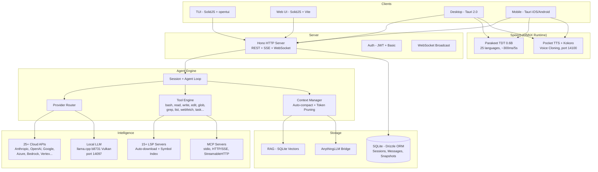

<p align="center">
  <a href="https://opencode.ai">
    <picture>
      <source srcset="packages/console/app/src/asset/logo-ornate-dark.svg" media="(prefers-color-scheme: dark)">
      <source srcset="packages/console/app/src/asset/logo-ornate-light.svg" media="(prefers-color-scheme: light)">
      
    </picture>
  </a>
</p>
<p align="center">وكيل برمجة بالذكاء الاصطناعي مفتوح المصدر.</p>
<p align="center">
  <a href="https://opencode.ai/discord"></a>
  <a href="https://www.npmjs.com/package/opencode-ai"></a>
  <a href="https://github.com/anomalyco/opencode/actions/workflows/publish.yml"></a>
</p>

<p align="center">
  <a href="README.md">English</a> |
  <a href="README.zh.md">简体中文</a> |
  <a href="README.zht.md">繁體中文</a> |
  <a href="README.ko.md">한국어</a> |
  <a href="README.de.md">Deutsch</a> |
  <a href="README.es.md">Español</a> |
  <a href="README.fr.md">Français</a> |
  <a href="README.it.md">Italiano</a> |
  <a href="README.da.md">Dansk</a> |
  <a href="README.ja.md">日本語</a> |
  <a href="README.pl.md">Polski</a> |
  <a href="README.ru.md">Русский</a> |
  <a href="README.bs.md">Bosanski</a> |
  <a href="README.ar.md">العربية</a> |
  <a href="README.no.md">Norsk</a> |
  <a href="README.br.md">Português (Brasil)</a> |
  <a href="README.th.md">ไทย</a> |
  <a href="README.tr.md">Türkçe</a> |
  <a href="README.uk.md">Українська</a> |
  <a href="README.bn.md">বাংলা</a> |
  <a href="README.gr.md">Ελληνικά</a> |
  <a href="README.vi.md">Tiếng Việt</a>
</p>

[](https://opencode.ai)

---

## ميزات الفورك

> هذا فورك من [anomalyco/opencode](https://github.com/anomalyco/opencode) يديره [Rwanbt](https://github.com/Rwanbt).
> يتم الحفاظ على المزامنة مع المستودع الأصلي. راجع [فرع dev](https://github.com/Rwanbt/opencode/tree/dev) لآخر التغييرات.

#### الذكاء الاصطناعي المحلي أولاً

يشغّل OpenCode نماذج AI محلياً على أجهزة المستهلك (8 جيجابايت VRAM / 16 جيجابايت RAM)، دون أي اعتماد على السحابة لنماذج 4B–7B.

**تحسين الأوامر (تخفيض 94%)**
- ~1K رمز للأمر النظامي للنماذج المحلية (مقابل ~16K للسحابية)
- مخططات أدوات هيكلية (توقيعات من سطر واحد بدلاً من أوصاف بالكيلوبايت)
- قائمة بيضاء من 7 أدوات (bash, read, edit, write, glob, grep, question)
- بدون قسم skills، معلومات بيئة محدودة

**محرك الاستدلال (llama.cpp b8731)**
- واجهة GPU خلفية Vulkan، تُحمَّل تلقائياً عند أول تحميل نموذج
- **تكوين تكيُّفي أثناء التشغيل** (`packages/opencode/src/local-llm-server/auto-config.ts`): `n_gpu_layers`، الخيوط، حجم batch/ubatch، تكميم ذاكرة KV المؤقتة وحجم السياق، كلها مُستنبطة من VRAM المكتشفة وRAM الحرة وتقسيم CPU big.LITTLE وواجهة GPU الخلفية (CUDA/ROCm/Vulkan/Metal/OpenCL) والحالة الحرارية. يحلّ محل `--n-gpu-layers 99` المُرمَّز سابقاً — جهاز Android بسعة 4 جيجابايت يعمل الآن بوضع CPU الاحتياطي بدلاً من قتله بسبب OOM، وأجهزة سطح المكتب الرائدة تحصل على batch مضبوط بدلاً من الافتراضي 512.
- `--flash-attn on` — Flash Attention لكفاءة الذاكرة
- `--cache-type-k/v` — ذاكرة KV المؤقتة مع دوران Hadamard؛ مستوى تكيُّفي (f16 / q8_0 / q4_0) حسب هامش VRAM
- `--fit on` — تعديل VRAM ثانوي خاص بالـfork (اختياري عبر `OPENCODE_LLAMA_ENABLE_FIT=1`)
- فك الترميز التخميني (`--model-draft`) مع حماية VRAM (تعطيل تلقائي عند < 1.5 جيجابايت حرة)
- فتحة واحدة (`-np 1`) لتقليل استهلاك الذاكرة
- **إطار قياس الأداء** (`bun run bench:llm`): قياس قابل للتكرار لـFTL / TPS / ذروة RSS / زمن الجدار لكل نموذج ولكل تشغيل، مع إخراج JSONL للأرشفة في CI

**تحويل الكلام إلى نص (Parakeet TDT 0.6B v3 INT8)**
- NVIDIA Parakeet عبر ONNX Runtime — ~300 مللي ثانية لـ 5 ثوانٍ من الصوت (18x الوقت الفعلي)
- 25 لغة أوروبية (الإنجليزية، الفرنسية، الألمانية، الإسبانية، إلخ)
- صفر VRAM: معالج فقط (~700 ميجابايت RAM)
- تحميل تلقائي للنموذج (~460 ميجابايت) عند أول ضغطة ميكروفون
- رسم متحرك لشكل الموجة أثناء التسجيل

**تحويل النص إلى كلام (Kyutai Pocket TTS)**
- TTS فرنسي الأصل من Kyutai (باريس)، 100 مليون معامل
- 8 أصوات مدمجة: Alba, Fantine, Cosette, Eponine, Azelma, Marius, Javert, Jean
- استنساخ صوت بدون تدريب: ارفع ملف WAV أو سجّل من الميكروفون
- معالج فقط، ~6x الوقت الفعلي، خادم HTTP على المنفذ 14100
- بديل: محرك Kokoro TTS ONNX (54 صوتاً، 9 لغات، CMUDict G2P)

**إدارة النماذج**
- بحث HuggingFace مع شارات توافق VRAM/RAM لكل نموذج
- تحميل وتشغيل وإيقاف وحذف نماذج GGUF من الواجهة
- كتالوج مُنتقى مسبقاً: Gemma 4 E4B, Qwen 3.5 (4B/2B/0.8B), Phi-4 Mini, Llama 3.2
- عدد رموز إخراج ديناميكي حسب حجم النموذج
- كشف تلقائي لنموذج المسودة (0.5B–0.8B) لفك الترميز التخميني

**التكوين**
- إعدادات مسبقة: Fast / Quality / Eco / Long Context (تحسين بنقرة واحدة)
- أداة مراقبة VRAM مع شريط استخدام مرمّز بالألوان (أخضر / أصفر / أحمر)
- نوع ذاكرة KV المؤقتة: auto / q8_0 / q4_0 / f16
- تفريغ GPU: auto / gpu-max / balanced
- تعيين الذاكرة: auto / on / off
- مفتاح البحث على الويب (أيقونة الكرة الأرضية في شريط الأوامر)

**موثوقية الوكيل (النماذج المحلية)**
- فحوصات ما قبل التنفيذ (على مستوى الكود، 0 رمز): فحص وجود الملف قبل التحرير، التحقق من محتوى old_string، فرض القراءة قبل التحرير، منع الكتابة على ملف موجود
- كسر تلقائي لحلقة الدوران: استدعاءان متطابقان لأداة → حقن خطأ (حماية على مستوى الكود، وليس الأمر)
- قياس أداء الأدوات: معدل نجاح/خطأ لكل جلسة مع تفصيل لكل أداة، تسجيل تلقائي
- الهدف: >85% معدل نجاح الأدوات على نماذج 4B

**متعدد المنصات**: Windows (Vulkan)، Linux، macOS، Android

#### المهام الخلفية

فوّض العمل إلى وكلاء فرعيين يعملون بشكل غير متزامن. اضبط `mode: "background"` على أداة task وستُرجع `task_id` فوراً بينما يعمل الوكيل في الخلفية. يتم نشر أحداث الناقل (`TaskCreated`، `TaskCompleted`، `TaskFailed`) لتتبع دورة الحياة.

#### فرق الوكلاء

نسّق وكلاء متعددين بالتوازي باستخدام أداة `team`. حدد المهام الفرعية مع حواف التبعية؛ تبني `computeWaves()` رسم DAG وتنفذ المهام المستقلة بشكل متزامن (حتى 5 وكلاء متوازيين). التحكم في الميزانية عبر `max_cost` (بالدولار) و`max_agents`. يتم تمرير السياق من المهام المكتملة تلقائياً إلى المهام التابعة.

#### عزل Git worktree

تحصل كل مهمة خلفية تلقائياً على git worktree خاص بها. يرتبط مساحة العمل بالجلسة في قاعدة البيانات. إذا لم تُنتج المهمة أي تغييرات في الملفات، يتم تنظيف worktree تلقائياً. يوفر هذا عزلاً على مستوى git دون الحاجة إلى حاويات.

#### API لإدارة المهام

REST API كامل لإدارة دورة حياة المهام:

| Method | Path | Description |
|--------|------|-------------|
| GET | `/task/` | List tasks (filter by parent, status) |
| GET | `/task/:id` | Get task details + status + worktree info |
| GET | `/task/:id/messages` | Retrieve task session messages |
| POST | `/task/:id/cancel` | Cancel a running or queued task |
| POST | `/task/:id/resume` | Resume completed/failed/blocked task |
| POST | `/task/:id/followup` | Send follow-up message to idle task |
| POST | `/task/:id/promote` | Promote background task to foreground |
| GET | `/task/:id/team` | Aggregated team view (costs, diffs per member) |

#### لوحة مهام TUI

إضافة شريط جانبي تعرض المهام الخلفية النشطة مع أيقونات الحالة في الوقت الفعلي:

| Icon | Status |
|------|--------|
| `~` | Running / Retrying |
| `?` | Queued / Awaiting input |
| `!` | Blocked |
| `x` | Failed |
| `*` | Completed |
| `-` | Cancelled |

نافذة حوار مع إجراءات: فتح جلسة المهمة، إلغاء، استئناف، إرسال متابعة، التحقق من الحالة.

#### تحديد نطاق وكيل MCP

قوائم سماح/منع لخوادم MCP لكل وكيل. يتم الإعداد في `opencode.json` تحت حقل `mcp` لكل وكيل. تقوم دالة `toolsForAgent()` بتصفية أدوات MCP المتاحة بناءً على نطاق الوكيل المستدعي.

```json
{
  "agents": {
    "explore": {
      "mcp": { "deny": ["dangerous-server"] }
    }
  }
}
```

#### دورة حياة الجلسة ذات 9 حالات

تتبع الجلسات إحدى 9 حالات، محفوظة في قاعدة البيانات:

`idle` · `busy` · `retry` · `queued` · `blocked` · `awaiting_input` · `completed` · `failed` · `cancelled`

الحالات الدائمة (`queued`، `blocked`، `awaiting_input`، `completed`، `failed`، `cancelled`) تبقى بعد إعادة تشغيل قاعدة البيانات. الحالات المؤقتة في الذاكرة (`idle`، `busy`، `retry`) تُعاد تهيئتها عند إعادة التشغيل.

#### وكيل التنسيق

وكيل تنسيق للقراءة فقط (50 خطوة كحد أقصى). لديه صلاحية الوصول إلى أدوات `task` و`team` لكن جميع أدوات التحرير محظورة. يفوّض التنفيذ إلى وكلاء البناء/العامين ويجمّع النتائج.

---

## البنية التقنية

### دعم مزودين متعددين

أكثر من 25 مزوداً جاهزاً: Anthropic، OpenAI، Google Gemini، Azure، AWS Bedrock، Vertex AI، OpenRouter، GitHub Copilot، XAI، Mistral، Groq، DeepInfra، Cerebras، Cohere، TogetherAI، Perplexity، Vercel، Venice، GitLab، Gateway، Ollama Cloud، بالإضافة إلى أي endpoint متوافق مع OpenAI (Ollama، LM Studio، vLLM، LocalAI). الأسعار مأخوذة من [models.dev](https://models.dev).

### نظام الوكلاء

| Agent | Mode | Access | Description |
|-------|------|--------|-------------|
| **build** | primary | full | وكيل التطوير الافتراضي |
| **plan** | primary | read-only | التحليل واستكشاف الكود |
| **general** | subagent | full (no todowrite) | مهام معقدة متعددة الخطوات |
| **explore** | subagent | read-only | بحث سريع في قاعدة الكود |
| **orchestrator** | subagent | read-only + task/team | منسق متعدد الوكلاء (50 خطوة) |
| **critic** | subagent | read-only + bash + LSP | مراجعة الكود: أخطاء، أمان، أداء |
| **tester** | subagent | full (no todowrite) | كتابة وتشغيل الاختبارات، التحقق من التغطية |
| **documenter** | subagent | full (no todowrite) | JSDoc، README، توثيق مضمّن |
| compaction | hidden | none | تلخيص السياق بالذكاء الاصطناعي |
| title | hidden | none | توليد عنوان الجلسة |
| summary | hidden | none | تلخيص الجلسة |

### تكامل LSP

دعم كامل لبروتوكول خادم اللغة مع فهرسة الرموز والتشخيصات ودعم لغات متعددة (TypeScript، Deno، Vue، وقابل للتوسيع). يتنقل الوكيل في الكود عبر رموز LSP بدلاً من البحث النصي، مما يتيح go-to-definition دقيق وfind-references واكتشاف أخطاء الأنواع في الوقت الفعلي.

### دعم MCP

عميل وخادم Model Context Protocol. يدعم نقل stdio وHTTP/SSE وStreamableHTTP. تدفق مصادقة OAuth للخوادم البعيدة. إمكانيات الأدوات والمطالبات والموارد. تحديد النطاق لكل وكيل عبر قوائم السماح/المنع.

### بنية العميل/الخادم

REST API مبني على Hono مع مسارات مُنَمَّطة وتوليد مواصفات OpenAPI. دعم WebSocket لـ PTY (الطرفية الزائفة). SSE لبث الأحداث في الوقت الفعلي. مصادقة أساسية، CORS، ضغط gzip. واجهة TUI هي واحدة من الواجهات الأمامية؛ يمكن التحكم بالخادم من أي عميل HTTP أو واجهة الويب أو تطبيق الجوال.

### إدارة السياق

ضغط تلقائي مع تلخيص مدفوع بالذكاء الاصطناعي عندما يقترب استخدام الرموز من حد سياق النموذج. تقليم واعٍ بالرموز مع عتبات قابلة للتكوين (`PRUNE_MINIMUM` 20KB، `PRUNE_PROTECT` 40KB). مخرجات أداة Skill محمية من التقليم.

### محرك التحرير

ترقيع unified diff مع التحقق من الأجزاء. يطبق أجزاء مستهدفة على مناطق محددة من الملف بدلاً من إعادة كتابة الملف بالكامل. أداة multi-edit للعمليات المجمعة عبر الملفات.

### نظام الصلاحيات

صلاحيات من 3 حالات (`allow` / `deny` / `ask`) مع مطابقة أنماط wildcard. أكثر من 100 تعريف لعدد معاملات أوامر bash للتحكم الدقيق. فرض حدود المشروع يمنع الوصول إلى الملفات خارج مساحة العمل.

### التراجع المدعوم بـ Git

نظام لقطات يسجل حالة الملف قبل كل تنفيذ أداة. يدعم `revert` و`unrevert` مع حساب الفروقات. يمكن التراجع عن التغييرات لكل رسالة أو لكل جلسة.

### تتبع التكاليف

تكلفة لكل رسالة مع تفصيل كامل للرموز (input، output، reasoning، cache read، cache write). حدود ميزانية لكل فريق (`max_cost`). أمر `stats` مع تجميع لكل نموذج ولكل يوم. تكلفة الجلسة في الوقت الفعلي معروضة في TUI. بيانات الأسعار مأخوذة من models.dev.

### نظام الإضافات

SDK كامل (`@opencode/plugin`) مع بنية hooks. تحميل ديناميكي من حزم npm أو نظام الملفات. إضافات مدمجة لمصادقة Codex وGitHub Copilot وGitLab وPoe.

---

## المفاهيم الخاطئة الشائعة

لمنع الالتباس من الملخصات المولّدة بالذكاء الاصطناعي لهذا المشروع:

- **واجهة TUI مكتوبة بـ TypeScript** (SolidJS + @opentui لعرض الطرفية)، وليس Rust.
- **Tree-sitter** يُستخدم فقط لتلوين بناء الجملة في TUI وتحليل أوامر bash، وليس لتحليل الكود على مستوى الوكيل.
- **Docker sandboxing** اختياري (`experimental.sandbox.type: "docker"`)؛ العزل الافتراضي يتم عبر git worktrees.
- **RAG** اختياري (`experimental.rag.enabled: true`)؛ إدارة السياق الافتراضية عبر فهرسة رموز LSP + الضغط التلقائي.
- **لا يوجد "وضع مراقبة" يقترح إصلاحات تلقائية** -- مراقب الملفات موجود لأغراض البنية التحتية فقط.
- **التصحيح الذاتي** يستخدم حلقة الوكيل القياسية (يرى LLM الأخطاء في نتائج الأدوات ويعيد المحاولة)، وليس آلية إصلاح تلقائي متخصصة.

## مصفوفة القدرات

### ميزات الوكيل الأساسية
| Capability | Status | Notes |
|-----------|--------|-------|
| Background tasks | Implemented | `mode: "background"` on task tool |
| Agent teams (DAG) | Implemented | Wave-based parallel execution, budget control |
| Git worktree isolation | Implemented | Auto-created per background task |
| Task REST API | Implemented | 8 endpoints for full lifecycle |
| TUI task dashboard | Implemented | Sidebar + dialog actions |
| MCP agent scoping | Implemented | Per-agent allow/deny config |
| 9-state lifecycle | Implemented | Persistent to SQLite |
| Orchestrator agent | Implemented | Read-only coordinator |
| Multi-provider (25+) | Implemented | Including local models via OpenAI-compatible API |
| LSP integration | Implemented | Symbols, diagnostics, multi-language |
| MCP protocol | Implemented | Client + server, 3 transports |
| Plugin system | Implemented | SDK + hook architecture |
| Cost tracking | Implemented | Per-message, per-team, per-model |
| Context auto-compact | Implemented | AI summarization + pruning |
| Git rollback/snapshots | Implemented | Revert/unrevert per message |
| Specialized agents | Implemented | critic, tester, documenter subagents |
| Dry run / command preview | Implemented | `dry_run` param on bash/edit/write tools |
| Auto-learn | Implemented | Post-session lesson extraction to `.opencode/learnings/` |
| Web search | Implemented | Globe toggle in prompt toolbar |

### الذكاء الاصطناعي المحلي (سطح المكتب + الجوال)
| Capability | Status | Notes |
|-----------|--------|-------|
| Local LLM (llama.cpp b8731) | Implemented | Vulkan GPU, auto-download runtime, `--fit` auto-VRAM |
| **تكوين تكيُّفي أثناء التشغيل** | Implemented | `auto-config.ts`: n_gpu_layers / الخيوط / batch / تكميم KV مستنبطة من VRAM المكتشفة وRAM وbig.LITTLE وواجهة GPU الخلفية والحالة الحرارية |
| **إطار قياس الأداء** | Implemented | `bun run bench:llm` يقيس FTL وTPS وذروة RSS وزمن الجدار لكل نموذج؛ إخراج JSONL |
| Flash Attention | Implemented | `--flash-attn on` on desktop and mobile |
| KV cache quantization | Implemented | q4_0 / q8_0 / f16 adaptive with Hadamard rotation (72% memory savings) |
| Exact tokenizer (OpenAI) | Implemented | `js-tiktoken` لـ gpt-*/o1/o3/o4؛ تقدير تجريبي 3.5 حرف/رمز لـLlama/Qwen/Gemma |
| Speculative decoding | Implemented | VRAM Guard (desktop) / RAM Guard (mobile), draft model auto-detection |
| VRAM / RAM monitoring | Implemented | Desktop: nvidia-smi, Mobile: `/proc/meminfo` |
| Configuration presets | Implemented | Fast / Quality / Eco / Long Context |
| HuggingFace model search | Implemented | استجابة مُتحقَّق منها عبر Zod، شارات VRAM، مدير التنزيل، 9 نماذج مُنتقاة مسبقاً |
| **تنزيلات GGUF قابلة للاستئناف** | Implemented | رأس HTTP `Range` — انقطاع 4G لا يُعيد تشغيل نقل 4 جيجابايت من الصفر |
| STT (Parakeet TDT 0.6B) | Implemented | ONNX Runtime, ~300ms/5s, 25 languages, desktop + mobile |
| TTS (Pocket TTS) | Implemented | 8 voices, zero-shot voice cloning, French-native (desktop) |
| TTS (Kokoro fallback) | Implemented | 54 voices, 9 languages, ONNX (desktop) |
| Prompt reduction (94%) | Implemented | ~1K tokens vs ~16K for cloud, skeleton tool schemas |
| Pre-flight guards | Implemented | File-exists, old_string verification, read-before-edit, write-on-existing (code-level, 0 tokens) |
| Doom loop auto-break | Implemented | Auto-injects error on 2x identical calls (code-level, not prompt) |
| Tool telemetry | Implemented | Per-session success/error rate logging with per-tool breakdown |
| إعادة تشغيل قاطع التيار | Implemented | `ensureCorrectModel` يتوقف بعد 3 إعادات تشغيل خلال 120 ثانية لتفادي حلقات الاحتراق |

### الأمان والحوكمة
| Capability | Status | Notes |
|-----------|--------|-------|
| Docker sandboxing | Implemented | Optional via `experimental.sandbox.type: "docker"` |
| Vulnerability scanner | Implemented | Auto-scan on edit/write for secrets, injections, unsafe patterns |
| DLP / AgentShield | Implemented | `experimental.dlp.enabled: true`, redacts secrets before LLM calls |
| Policy engine | Implemented | `experimental.policy.enabled: true`, conditional rules + custom policies |
| **CSP صارمة (سطح المكتب + الجوال)** | Implemented | `connect-src` مقصورة على loopback + HuggingFace + مزوّدات HTTPS؛ بدون `unsafe-eval`، `object-src 'none'`، `frame-ancestors 'none'` |
| **تقوية إصدار Android** | Implemented | `isDebuggable=false`، `allowBackup=false`، `isShrinkResources=true`، `FOREGROUND_SERVICE_TYPE_SPECIAL_USE` |
| **التحقق من مدخلات أوامر Tauri** | Implemented | حُرّاس `download_model` / `load_llm_model` / `delete_model`: charset اسم الملف، قائمة سماح HTTPS لـ `huggingface.co` / `hf.co` |
| **سلسلة تسجيل Rust** | Implemented | `log` + `android_logger` على الجوال؛ لا `eprintln!` في الإصدار → لا تسرّب مسار/URL إلى logcat |

### المعرفة والذاكرة
| Capability | Status | Notes |
|-----------|--------|-------|
| Vector DB / RAG | Implemented | `experimental.rag.enabled: true`, SQLite + cosine similarity |
| Confidence/decay | Implemented | Time-based scoring for RAG embeddings, exponential decay |
| Memory conflict resolution | Implemented | Detects and resolves duplicate/contradictory embeddings |

### امتدادات المنصة (تجريبية)
| Capability | Status | Notes |
|-----------|--------|-------|
| Mobile app (Tauri) | Implemented | Android: embedded runtime, on-device LLM, STT. iOS: remote mode |
| Collaborative mode | Experimental | JWT auth, presence, file locking, WebSocket broadcast |
| AnythingLLM bridge | Experimental | MCP adapter, context injection, vector store bridge |
| Per-message token display | Partial | Stored in DB, shown as session aggregate |

---

## البنية المعمارية



### منافذ الخدمات

| Service | Port | Protocol |
|---------|------|----------|
| OpenCode Server | 4096 | HTTP (REST + SSE + WebSocket) |
| LLM (llama-server) | 14097 | HTTP (OpenAI-compatible) |
| TTS (pocket-tts) | 14100 | HTTP (FastAPI) |

## الأمان والحوكمة

| Feature | Description |
|---------|-------------|
| **Sandbox** | تنفيذ Docker اختياري (`experimental.sandbox.type: "docker"`) أو وضع المضيف مع فرض حدود المشروع |
| **Permissions** | نظام من 3 حالات (`allow` / `deny` / `ask`) مع مطابقة أنماط wildcard. أكثر من 100 تعريف لأوامر bash للتحكم الدقيق |
| **DLP** | منع فقدان البيانات (`experimental.dlp`) — إخفاء المفاتيح السرية ومفاتيح API وبيانات الاعتماد قبل إرسالها لمزودي LLM |
| **Policy Engine** | قواعد شرطية (`experimental.policy`) مع إجراءات `block` أو `warn`. حماية المسارات، تحديد حجم التحرير، أنماط regex مخصصة |
| **Privacy** | المحلي أولاً: جميع البيانات في SQLite على القرص. لا قياس عن بُعد افتراضياً. المفاتيح السرية لا تُسجَّل أبداً. لا تُرسل بيانات لأطراف ثالثة باستثناء مزود LLM المُعدّ |

## واجهة الذكاء

| Feature | Description |
|---------|-------------|
| **MCP Compliant** | دعم كامل لـ Model Context Protocol — أوضاع العميل والخادم، تحديد نطاق الأدوات لكل وكيل عبر قوائم allow/deny |
| **Context Files** | مجلد `.opencode/` مع إعداد `opencode.jsonc`. الوكلاء مُعرَّفون كـ markdown مع YAML frontmatter. تعليمات مخصصة عبر إعداد `instructions` |
| **Provider Router** | أكثر من 25 مزوداً عبر `Provider.parseModel("provider/model")`. انتقال تلقائي، تتبع التكاليف، توجيه واعٍ بالرموز |
| **RAG System** | بحث متجهي محلي اختياري (`experimental.rag`) مع نماذج تضمين قابلة للتكوين (OpenAI/Google). فهرسة تلقائية للملفات المعدَّلة |
| **AnythingLLM Bridge** | تكامل اختياري (`experimental.anythingllm`) — حقن السياق، محول خادم MCP، جسر مخزن المتجهات، Agent Skills HTTP API |

---

## فروع الميزات (مُنفَّذة على `dev`)

تم تنفيذ ثلاث ميزات رئيسية في فروع مخصصة ودمجها في `dev`. كل منها مُدارة بأعلام الميزات ومتوافقة مع الإصدارات السابقة.

### الوضع التعاوني (`dev_collaborative_mode`)

تعاون متعدد المستخدمين في الوقت الفعلي. تم التنفيذ:
- **مصادقة JWT** — رموز HMAC-SHA256 مع تدوير التحديث، متوافقة مع basic auth
- **إدارة المستخدمين** — تسجيل، أدوار (admin/member/viewer)، تطبيق RBAC
- **WebSocket broadcast** — بث أحداث في الوقت الفعلي عبر GlobalBus → Broadcast
- **نظام الحضور** — حالة online/idle/away مع heartbeat كل 30 ثانية
- **قفل الملفات** — أقفال متفائلة على أدوات edit/write مع كشف التعارضات
- **الواجهة الأمامية** — نموذج تسجيل الدخول، مؤشر الحضور، شارة المراقب، WebSocket hooks

الإعداد: `experimental.collaborative.enabled: true`

### النسخة المحمولة (`dev_mobile`)

تطبيق Android/iOS أصلي عبر Tauri 2.0 مع **بيئة تشغيل مدمجة** — APK واحد، صفر تبعيات خارجية. تم التنفيذ:

**الطبقة 1 — بيئة التشغيل المدمجة (Android، أداء أصلي 100%):**
- **ملفات ثنائية ثابتة في APK** — Bun، Git، Bash، Ripgrep (aarch64-linux-musl) تُستخرج عند أول تشغيل (~15 ثانية)
- **CLI مُجمَّع** — OpenCode CLI كحزمة JS يشغّلها Bun المدمج، لا حاجة للشبكة للنواة
- **إطلاق عمليات مباشر** — بدون Termux، بدون intents — `std::process::Command` من Rust مباشرة
- **تشغيل تلقائي للخادم** — `bun opencode-cli.js serve` على localhost مع مصادقة UUID، مثل sidecar سطح المكتب

**الطبقة 2 — استدلال LLM على الجهاز:**
- **llama.cpp عبر JNI** — Kotlin LlamaEngine يحمّل مكتبات .so الأصلية عبر جسر JNI
- **IPC عبر الملفات** — Rust يكتب الأوامر في `llm_ipc/request`، خدمة Kotlin تستطلع وتُرجع النتائج
- **llama-server** — HTTP API متوافق مع OpenAI على المنفذ 14097 لتكامل المزود
- **إدارة النماذج** — تحميل نماذج GGUF من HuggingFace، تشغيل/إيقاف/حذف، 9 نماذج مُنتقاة مسبقاً
- **تسجيل المزود** — النموذج المحلي يظهر كمزود "Local AI" في محدد النموذج
- **Flash Attention** — `--flash-attn on` لاستدلال فعال الذاكرة
- **تكميم ذاكرة KV المؤقتة** — `--cache-type-k/v q4_0` مع دوران Hadamard (توفير 72% من الذاكرة)
- **فك الترميز التخميني** — كشف تلقائي لنموذج المسودة (0.5B–0.8B) مع RAM Guard عبر `/proc/meminfo`
- **مراقبة RAM** — أداة ذاكرة الجهاز (إجمالي/مستخدم/حر) عبر `/proc/meminfo`
- **إعدادات التكوين المسبقة** — نفس إعدادات Fast/Quality/Eco/Long Context كسطح المكتب
- **اختيار GPU ذكي** — Vulkan لـ Adreno 730+ (SD 8 Gen 1+)، OpenCL لـ SoC الأقدم، CPU احتياطي
- **تثبيت الأنوية الكبيرة** — يكتشف طوبولوجيا ARM big.LITTLE، يثبّت الاستدلال على أنوية الأداء فقط

**الطبقة 3 — البيئة الموسعة (تحميل اختياري، ~150 ميجابايت):**
- **proot + Alpine rootfs** — Linux كامل مع `apt install` للحزم الإضافية
- **Bind-mounted الطبقة 1** — Bun/Git/rg لا تزال تعمل بسرعة أصلية داخل proot
- **عند الطلب** — تُحمَّل فقط عندما يُمكّن المستخدم "Extended Environment" في الإعدادات

**الطبقة 4 — الكلام والوسائط:**
- **STT (Parakeet TDT 0.6B)** — نفس محرك ONNX Runtime كسطح المكتب، ~300 مللي ثانية/5 ثوانٍ صوت، 25 لغة
- **رسم متحرك لشكل الموجة** — تغذية بصرية راجعة أثناء التسجيل
- **منتقي ملفات أصلي** — `tauri-plugin-dialog` لاختيار الملفات/المجلدات والمرفقات

**مشترك (Android + iOS):**
- **تجريد المنصة** — نوع `Platform` موسّع مع `"mobile"` + كشف نظام التشغيل `"ios"/"android"`
- **اتصال عن بُعد** — الاتصال بخادم OpenCode على سطح المكتب عبر الشبكة (iOS فقط أو Android احتياطي)
- **طرفية تفاعلية** — PTY كامل عبر musl مخصص `librust_pty.so` (غلاف forkpty)، Ghostty WASM renderer مع canvas احتياطي
- **تخزين خارجي** — روابط رمزية من HOME الخادم إلى مجلدات `/sdcard/` (Documents، Downloads، projects)
- **واجهة جوال** — شريط جانبي متجاوب، إدخال رسائل محسّن للمس، عرض diff للجوال، أهداف لمس 44px، دعم safe area
- **إشعارات فورية** — جسر SSE→إشعارات أصلية لإكمال المهام الخلفية
- **محدد الوضع** — اختيار Local (Android) أو Remote (iOS + Android) عند أول تشغيل
- **قائمة إجراءات الجوال** — وصول سريع للطرفية، fork، البحث والإعدادات من رأس الجلسة

### دمج AnythingLLM (`dev_anything`)

جسر بين OpenCode ومنصة AnythingLLM لـ RAG الوثائقي. تم التنفيذ:
- **عميل REST** — غلاف API كامل لمساحات عمل AnythingLLM، الوثائق، البحث، المحادثة
- **محول خادم MCP** — 4 أدوات: `anythingllm_search`، `anythingllm_list_workspaces`، `anythingllm_get_document`، `anythingllm_chat`
- **حقن السياق عبر الإضافة** — خطاف `experimental.chat.system.transform` يحقن الوثائق ذات الصلة في الأمر النظامي
- **Agent Skills HTTP API** — `GET /agent-skills` + `POST /agent-skills/:toolId/execute` لتوفير أدوات OpenCode في AnythingLLM
- **جسر مخزن المتجهات** — بحث مركّب يدمج SQLite RAG المحلي مع نتائج قاعدة بيانات المتجهات في AnythingLLM
- **Docker Compose** — `docker-compose.anythingllm.yml` جاهز للاستخدام مع شبكة مشتركة

الإعداد: `experimental.anythingllm.enabled: true`

### التثبيت

```bash
# YOLO
curl -fsSL https://opencode.ai/install | bash

# مديري الحزم
npm i -g opencode-ai@latest        # او bun/pnpm/yarn
scoop install opencode             # Windows
choco install opencode             # Windows
brew install anomalyco/tap/opencode # macOS و Linux (موصى به، دائما محدث)
brew install opencode              # macOS و Linux (صيغة brew الرسمية، تحديث اقل)
sudo pacman -S opencode            # Arch Linux (Stable)
paru -S opencode-bin               # Arch Linux (Latest from AUR)
mise use -g opencode               # اي نظام
nix run nixpkgs#opencode           # او github:anomalyco/opencode لاحدث فرع dev
```

> [!TIP]
> احذف الاصدارات الاقدم من 0.1.x قبل التثبيت.

### تطبيق سطح المكتب (BETA)

يتوفر OpenCode ايضا كتطبيق سطح مكتب. قم بالتنزيل مباشرة من [صفحة الاصدارات](https://github.com/anomalyco/opencode/releases) او من [opencode.ai/download](https://opencode.ai/download).

| المنصة                | التنزيل                               |
| --------------------- | ------------------------------------- |
| macOS (Apple Silicon) | `opencode-desktop-darwin-aarch64.dmg` |
| macOS (Intel)         | `opencode-desktop-darwin-x64.dmg`     |
| Windows               | `opencode-desktop-windows-x64.exe`    |
| Linux                 | `.deb` او `.rpm` او AppImage          |

```bash
# macOS (Homebrew)
brew install --cask opencode-desktop
# Windows (Scoop)
scoop bucket add extras; scoop install extras/opencode-desktop
```

#### مجلد التثبيت

يحترم سكربت التثبيت ترتيب الاولوية التالي لمسار التثبيت:

1. `$OPENCODE_INSTALL_DIR` - مجلد تثبيت مخصص
2. `$XDG_BIN_DIR` - مسار متوافق مع مواصفات XDG Base Directory
3. `$HOME/bin` - مجلد الثنائيات القياسي للمستخدم (ان وجد او امكن انشاؤه)
4. `$HOME/.opencode/bin` - المسار الافتراضي الاحتياطي

```bash
# امثلة
OPENCODE_INSTALL_DIR=/usr/local/bin curl -fsSL https://opencode.ai/install | bash
XDG_BIN_DIR=$HOME/.local/bin curl -fsSL https://opencode.ai/install | bash
```

### Agents

يتضمن OpenCode وكيليْن (Agents) مدمجين يمكنك التبديل بينهما باستخدام زر `Tab`.

- **build** - الافتراضي، وكيل بصلاحيات كاملة لاعمال التطوير
- **plan** - وكيل للقراءة فقط للتحليل واستكشاف الكود
  - يرفض تعديل الملفات افتراضيا
  - يطلب الاذن قبل تشغيل اوامر bash
  - مثالي لاستكشاف قواعد كود غير مألوفة او لتخطيط التغييرات

بالاضافة الى ذلك يوجد وكيل فرعي **general** للبحث المعقد والمهام متعددة الخطوات.
يستخدم داخليا ويمكن استدعاؤه بكتابة `@general` في الرسائل.

تعرف على المزيد حول [agents](https://opencode.ai/docs/agents).

### التوثيق

لمزيد من المعلومات حول كيفية ضبط OpenCode، [**راجع التوثيق**](https://opencode.ai/docs).

### المساهمة

اذا كنت مهتما بالمساهمة في OpenCode، يرجى قراءة [contributing docs](./CONTRIBUTING.md) قبل ارسال pull request.

### البناء فوق OpenCode

اذا كنت تعمل على مشروع مرتبط بـ OpenCode ويستخدم "opencode" كجزء من اسمه (مثل "opencode-dashboard" او "opencode-mobile")، يرجى اضافة ملاحظة في README توضح انه ليس مبنيا بواسطة فريق OpenCode ولا يرتبط بنا بأي شكل.

### FAQ

#### ما الفرق عن Claude Code؟

هو مشابه جدا لـ Claude Code من حيث القدرات. هذه هي الفروقات الاساسية:

- 100% مفتوح المصدر
- غير مقترن بمزود معين. نوصي بالنماذج التي نوفرها عبر [OpenCode Zen](https://opencode.ai/zen)؛ لكن يمكن استخدام OpenCode مع Claude او OpenAI او Google او حتى نماذج محلية. مع تطور النماذج ستتقلص الفجوات وستنخفض الاسعار، لذا من المهم ان يكون مستقلا عن المزود.
- دعم LSP جاهز للاستخدام
- تركيز على TUI. تم بناء OpenCode بواسطة مستخدمي neovim ومنشئي [terminal.shop](https://terminal.shop)؛ وسندفع حدود ما هو ممكن داخل الطرفية.
- معمارية عميل/خادم. على سبيل المثال، يمكن تشغيل OpenCode على جهازك بينما تقوده عن بعد من تطبيق جوال. هذا يعني ان واجهة TUI هي واحدة فقط من العملاء الممكنين.

---

**انضم الى مجتمعنا** [Discord](https://discord.gg/opencode) | [X.com](https://x.com/opencode)
