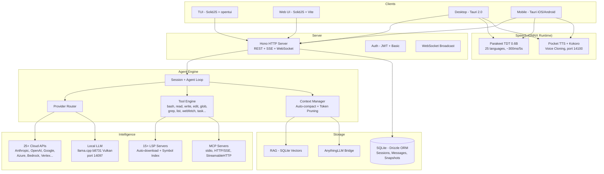

<p align="center">
  <a href="https://opencode.ai">
    <picture>
      <source srcset="packages/console/app/src/asset/logo-ornate-dark.svg" media="(prefers-color-scheme: dark)">
      <source srcset="packages/console/app/src/asset/logo-ornate-light.svg" media="(prefers-color-scheme: light)">
      
    </picture>
  </a>
</p>
<p align="center">O agente de programação com IA de código aberto.</p>
<p align="center">
  <a href="https://opencode.ai/discord"></a>
  <a href="https://www.npmjs.com/package/opencode-ai"></a>
  <a href="https://github.com/anomalyco/opencode/actions/workflows/publish.yml"></a>
</p>

<p align="center">
  <a href="README.md">English</a> |
  <a href="README.zh.md">简体中文</a> |
  <a href="README.zht.md">繁體中文</a> |
  <a href="README.ko.md">한국어</a> |
  <a href="README.de.md">Deutsch</a> |
  <a href="README.es.md">Español</a> |
  <a href="README.fr.md">Français</a> |
  <a href="README.it.md">Italiano</a> |
  <a href="README.da.md">Dansk</a> |
  <a href="README.ja.md">日本語</a> |
  <a href="README.pl.md">Polski</a> |
  <a href="README.ru.md">Русский</a> |
  <a href="README.bs.md">Bosanski</a> |
  <a href="README.ar.md">العربية</a> |
  <a href="README.no.md">Norsk</a> |
  <a href="README.br.md">Português (Brasil)</a> |
  <a href="README.th.md">ไทย</a> |
  <a href="README.tr.md">Türkçe</a> |
  <a href="README.uk.md">Українська</a> |
  <a href="README.bn.md">বাংলা</a> |
  <a href="README.gr.md">Ελληνικά</a> |
  <a href="README.vi.md">Tiếng Việt</a>
</p>

[](https://opencode.ai)

<!-- WHY-FORK-MATRIX -->
## Por que este fork?

> **Em resumo** — o único agente de codificação open source que entrega um orquestrador baseado em DAG, uma API REST de tarefas, escopo MCP por agente, uma FSM de sessão com 9 estados, um scanner de vulnerabilidades embutido *e* um aplicativo Android de primeira linha com inferência LLM no dispositivo. Nenhum outro CLI — proprietário ou aberto — combina tudo isso.

> See the English [README.md](README.md) for the full positioning prose (vs. vendor-locked CLIs, vs. BYOM peers, vs. specialized CLIs) and architecture diagram.

### Capability matrix — this fork vs. the 2026 landscape

Legend: ✅ shipped · ❌ absent · *partial* limited/incomplete · *plugin* via community add-on · *paid* behind a subscription tier.

#### Orchestration, API surface, governance

| Capability                             | **This fork** | Claude Code | Codex CLI | Gemini CLI | opencode (upstream) | Aider | Goose | Cline | Roo Code | Cursor | Continue | Crush | Qwen Code |
| -------------------------------------- | :-----------: | :---------: | :-------: | :--------: | :-----------------: | :---: | :---: | :---: | :------: | :----: | :------: | :---: | :-------: |
| Open source                            |       ✅       |      ❌      |  partial  |      ✅     |          ✅          |   ✅   |   ✅   |   ✅   |    ✅     |    ❌    |     ✅     |   ✅   |     ✅     |
| BYOM (bring your own model)            |       ✅       |      ❌      |     ❌     |      ❌     |          ✅          |   ✅   |   ✅   |   ✅   |    ✅     |  partial |     ✅     |   ✅   |   partial  |
| Local models (llama.cpp / Ollama)      |       ✅       |      ❌      |     ❌     |      ❌     |          ✅          |   ✅   |   ✅   |   ✅   |    ✅     |    ❌    |     ✅     |   ✅   |     ✅     |
| Parallel agents in isolated worktrees  |    ✅ native   |  ✅ (Teams)  |  partial  |      ❌     |      via plugin     |   ❌   | partial | ✅ (v3.58) | partial | ❌ | ❌ | ❌ |     ❌     |
| Explicit **DAG orchestration**         | ✅ **unique**  |    ad-hoc   |     ❌     |      ❌     |          ❌          |   ❌   | recipes (linear) | ❌ | ❌ | ❌ |     ❌     |   ❌   |     ❌     |
| **REST task API** (programmable)       | ✅ **unique**  | partial (SDK) |  ❌    |      ❌     |          ❌          |   ❌   |   ❌   |   ❌   |    ❌     |    ❌    |     ❌     |   ❌   |     ❌     |
| **TUI task dashboard**                 |       ✅       |      ❌      |     ❌     |      ❌     |       partial       |   ❌   |   ❌   |   ❌   |    ❌     |   n/a   |    n/a    |   ❌   |   partial  |
| MCP support                            | ✅ + **per-agent scoping** | ✅ | ✅ | ✅ | ✅ | via plugins | ✅ | ✅ | ✅ | partial | ✅ |   ❌   |     ✅     |
| **9-state session FSM (persistent)**   | ✅ **unique**  |      ❌      |     ❌     |      ❌     |        basic        |   ❌   |   ❌   |   ❌   |    ❌     |    ❌    |     ❌     |   ❌   |     ❌     |
| Built-in **vulnerability scanner**     | ✅ **unique**  |      ❌      |     ❌     |      ❌     |          ❌          |   ❌   |   ❌   |   ❌   |    ❌     |    ❌    |     ❌     |   ❌   |     ❌     |
| **DLP / secret redaction** before LLM call | ✅         |   partial    |     ❌     |      ❌     |          ❌          |   ❌   |   ❌   |   ❌   |    ❌     |    ❌    |     ❌     |   ❌   |     ❌     |
| **Per-agent tool allow/deny**          |       ✅       |   partial    |     ❌     |      ❌     |        basic        |   ❌   |   ❌   |   ❌   |  partial  |    ❌    |     ❌     |   ❌   |     ❌     |
| Docker sandboxing (opt-in)             |       ✅       |      ❌      |     ✅     |      ❌     |          ❌          |   ❌   |   ❌   |   ❌   |    ❌     |    ❌    |     ❌     |   ❌   |     ❌     |
| Git auto-commits / rollback            |       ✅       |      ✅      |     ✅     |      ✅     |      ✅ (signed)     |   ✅   |   ✅   |   ✅   |    ✅     |    ✅    |     ✅     |   ✅   |     ✅     |

#### Intelligence, context, developer UX

| Capability                             | **This fork** | Claude Code | Codex CLI | Gemini CLI | opencode (upstream) | Aider | Goose | Cline | Roo Code | Cursor | Continue | Crush | Qwen Code |
| -------------------------------------- | :-----------: | :---------: | :-------: | :--------: | :-----------------: | :---: | :---: | :---: | :------: | :----: | :------: | :---: | :-------: |
| LSP integration (go-to-def, diagnostics) | ✅           |   partial    |  partial  |   partial   |          ✅          | partial | partial | ✅   |    ✅     |    ✅    |     ✅     | partial |  partial  |
| Plugin SDK (`@opencode/plugin`)        |       ✅       |   partial    |     ❌     |      ❌     |          ✅          |   ❌   |   ✅   |   ✅   |    ✅     |    ✅    |     ✅     |   ❌   |     ❌     |
| Prompt caching (cloud + local KV)      |       ✅       |      ✅      |     ✅     |      ✅     |          ✅          |   ✅   |   ✅   |   ✅   |    ✅     |    ✅    |     ✅     |   ✅   |     ✅     |
| **Hybrid RAG (BM25 + vector + decay)** | ✅ **unique**  |      ❌      |     ❌     |      ❌     |          ❌          |   ❌   |   ❌   | partial | ❌      |  vector only |  vector only |  ❌   |     ❌     |
| **Memory conflict resolution**         | ✅ **unique**  |      ❌      |     ❌     |      ❌     |          ❌          |   ❌   |   ❌   |   ❌   |    ❌     |    ❌    |     ❌     |   ❌   |     ❌     |
| **Auto-learn** (lesson extraction)     | ✅ **unique**  |      ❌      |     ❌     |      ❌     |          ❌          |   ❌   |   ❌   |   ❌   |    ❌     |    ❌    |     ❌     |   ❌   |     ❌     |
| Auto-compact (AI summarization)        |       ✅       |      ✅      |     ✅     |      ✅     |          ✅          |   ✅   |   ✅   |   ✅   |    ✅     |    ✅    |     ✅     | partial |     ✅     |
| Unified-diff edit engine               |       ✅       |      ✅      |     ✅     |   partial   |          ✅          |   ✅   | partial | partial |    ✅     | partial |  partial  | partial |  partial  |
| ACP (Agent Client Protocol) layer      |       ✅       |      ❌      |     ❌     |      ❌     |        basic        |   ❌   |   ❌   |   ❌   |    ❌     |    ❌    |     ❌     |   ❌   |     ❌     |

#### Platform reach & multimodal

| Capability                             | **This fork** | Claude Code | Codex CLI | Gemini CLI | opencode (upstream) | Aider | Goose | Cline | Roo Code | Cursor | Continue | Crush | Qwen Code |
| -------------------------------------- | :-----------: | :---------: | :-------: | :--------: | :-----------------: | :---: | :---: | :---: | :------: | :----: | :------: | :---: | :-------: |
| First-class **Android app**            | ✅ **unique**  |      ❌      |     ❌     |      ❌     |          ❌          |   ❌   |   ❌   |   ❌   |    ❌     |    ❌    |     ❌     |   ❌   |     ❌     |
| iOS (remote mode)                      |       ✅       |      ❌      |     ❌     |      ❌     |          ❌          |   ❌   |   ❌   |   ❌   |    ❌     |    ❌    |     ❌     |   ❌   |     ❌     |
| Adaptive runtime (VRAM/CPU/thermal)    | ✅ **unique**  |      ❌      |     ❌     |      ❌     |      hardcoded      | hardcoded | hardcoded | hardcoded | hardcoded | n/a | hardcoded | hardcoded | hardcoded |
| **STT** (voice-to-text, built-in)      | ✅ (Parakeet)  |      ❌      |     ❌     |      ❌     |          ❌          |   ❌   |   ❌   | partial  |    ❌     |    ❌    |     ❌     |   ❌   |     ❌     |
| **TTS** (text-to-speech + voice clone) | ✅ (Pocket/Kokoro) |  ❌       |     ❌     |      ❌     |          ❌          |   ❌   |   ❌   |   ❌   |    ❌     |    ❌    |     ❌     |   ❌   |     ❌     |
| **OAuth deep-link callback**           |       ✅       |      ❌      |     ❌     |      ❌     |          ❌          |   ❌   |   ❌   |   ❌   |    ❌     |    ❌    |     ❌     |   ❌   |     ❌     |
| **mDNS service discovery**             | ✅ **unique**  |      ❌      |     ❌     |      ❌     |          ❌          |   ❌   |   ❌   |   ❌   |    ❌     |    ❌    |     ❌     |   ❌   |     ❌     |
| **Upstream branch watcher** (`vcs.branch.behind`) | ✅ **unique** | ❌ |    ❌     |      ❌     |          ❌          |   ❌   |   ❌   |   ❌   |    ❌     |    ❌    |     ❌     |   ❌   |     ❌     |
| **Collaborative mode** (JWT + presence + file-lock) | ✅ | ❌      |     ❌     |      ❌     |          ❌          |   ❌   |   ❌   |   ❌   |    ❌     | partial |     ❌     |   ❌   |     ❌     |
| **AnythingLLM bridge**                 | ✅ **unique**  |      ❌      |     ❌     |      ❌     |          ❌          |   ❌   |   ❌   |   ❌   |    ❌     |    ❌    |     ❌     |   ❌   |     ❌     |
| **GDPR export/erasure route**          | ✅ **unique**  |      ❌      |     ❌     |      ❌     |          ❌          |   ❌   |   ❌   |   ❌   |    ❌     |    ❌    |     ❌     |   ❌   |     ❌     |
| Price                                  |  free + BYOM  |  $20/mo sub |$20/mo sub |  1000/day free | free + BYOM    | free + BYOM | free + BYOM | free + BYOM | free + BYOM | $20/mo sub | free + BYOM | free + BYOM | free + BYOM |

---

## Funcionalidades do Fork

> Este é um fork de [anomalyco/opencode](https://github.com/anomalyco/opencode) mantido por [Rwanbt](https://github.com/Rwanbt).
> Mantido em sincronia com o upstream. Veja a [branch dev](https://github.com/Rwanbt/opencode/tree/dev) para as últimas alterações.

#### IA Local

O OpenCode executa modelos de IA localmente em hardware consumer (8 GB VRAM / 16 GB RAM), sem nenhuma dependência de nuvem para modelos de 4B a 7B.

**Otimização de Prompt (redução de 94%)**
- Prompt de sistema de ~1K tokens para modelos locais (vs ~16K para nuvem)
- Esquemas de ferramentas esqueleto (assinaturas de 1 linha vs descrições multi-KB)
- Whitelist de 7 ferramentas (bash, read, edit, write, glob, grep, question)
- Sem seção de skills, informações de ambiente mínimas

**Motor de Inferência (llama.cpp b8731)**
- Backend GPU Vulkan, baixado automaticamente no primeiro carregamento do modelo
- **Configuração adaptativa em runtime** (`packages/opencode/src/local-llm-server/auto-config.ts`): `n_gpu_layers`, threads, tamanho de batch/ubatch, quantização de cache KV e tamanho do contexto derivados da VRAM detectada, RAM livre, divisão CPU big.LITTLE, backend GPU (CUDA/ROCm/Vulkan/Metal/OpenCL) e estado térmico. Substitui o antigo `--n-gpu-layers 99` fixo — um Android de 4 GB agora roda em fallback CPU em vez de ser morto por OOM, desktops top obtêm batch ajustado em vez do padrão 512.
- `--flash-attn on` — Flash Attention para eficiência de memória
- `--cache-type-k/v` — Cache KV com rotação de Hadamard; nível adaptativo (f16 / q8_0 / q4_0) conforme a margem de VRAM
- `--fit on` — ajuste secundário de VRAM exclusivo do fork (opt-in via `OPENCODE_LLAMA_ENABLE_FIT=1`)
- Decodificação especulativa (`--model-draft`) com VRAM Guard (desativa automaticamente se < 1.5 GB livres)
- Slot único (`-np 1`) para minimizar o consumo de memória
- **Harness de benchmark** (`bun run bench:llm`): medição reprodutível de FTL / TPS / pico de RSS / tempo total por modelo, por execução, com saída JSONL para arquivamento em CI

**Speech-to-Text (Parakeet TDT 0.6B v3 INT8)**
- NVIDIA Parakeet via ONNX Runtime — ~300ms para 5s de áudio (18x tempo real)
- 25 idiomas europeus (inglês, francês, alemão, espanhol, etc.)
- Zero VRAM: apenas CPU (~700 MB RAM)
- Download automático do modelo (~460 MB) ao primeiro toque no microfone
- Animação de forma de onda durante a gravação

**Text-to-Speech (Kyutai Pocket TTS)**
- TTS nativo francês criado pela Kyutai (Paris), 100M parâmetros
- 8 vozes integradas: Alba, Fantine, Cosette, Eponine, Azelma, Marius, Javert, Jean
- Clonagem de voz zero-shot: envie WAV ou grave pelo microfone
- Apenas CPU, ~6x tempo real, servidor HTTP na porta 14100
- Fallback: motor TTS Kokoro ONNX (54 vozes, 9 idiomas, CMUDict G2P)

**Gerenciamento de Modelos**
- Busca no HuggingFace com badges de compatibilidade VRAM/RAM por modelo
- Baixar, carregar, descarregar, excluir modelos GGUF pela interface
- Catálogo pré-curado: Gemma 4 E4B, Qwen 3.5 (4B/2B/0.8B), Phi-4 Mini, Llama 3.2
- Tokens de saída dinâmicos baseados no tamanho do modelo
- Detecção automática de modelo draft (0.5B–0.8B) para decodificação especulativa

**Configuração**
- Presets: Fast / Quality / Eco / Long Context (otimização com um clique)
- Widget de monitoramento VRAM com barra de uso colorida (verde / amarelo / vermelho)
- Tipo de cache KV: auto / q8_0 / q4_0 / f16
- Offloading GPU: auto / gpu-max / balanced
- Memory mapping: auto / on / off
- Toggle de busca web (ícone de globo na barra do prompt)

**Confiabilidade do Agente (modelos locais)**
- Verificações pré-voo (nível de código, 0 tokens): verificação de existência de arquivo antes da edição, verificação de conteúdo old_string, obrigatoriedade de leitura antes da edição, prevenção de escrita em arquivo existente
- Interrupção automática de doom loop: 2 chamadas idênticas consecutivas → erro injetado (guarda em nível de código, não apenas prompt)
- Telemetria de ferramentas: taxa de sucesso/erro por sessão com detalhamento por ferramenta, registrado automaticamente
- Objetivo: >85% de taxa de sucesso de ferramentas em modelos 4B

**Multiplataforma**: Windows (Vulkan), Linux, macOS, Android

#### Tarefas em Segundo Plano

Delegue trabalho a subagentes que executam de forma assíncrona. Defina `mode: "background"` na ferramenta task e ela retorna um `task_id` imediatamente enquanto o agente trabalha em segundo plano. Eventos de barramento (`TaskCreated`, `TaskCompleted`, `TaskFailed`) são publicados para rastreamento do ciclo de vida.

#### Equipes de Agentes

Orquestre múltiplos agentes em paralelo usando a ferramenta `team`. Defina subtarefas com arestas de dependência; `computeWaves()` constrói um DAG e executa tarefas independentes simultaneamente (até 5 agentes paralelos). Controle de orçamento via `max_cost` (dólares) e `max_agents`. O contexto de tarefas concluídas é automaticamente passado para as dependentes.

#### Isolamento com Git Worktree

Cada tarefa em segundo plano recebe automaticamente seu próprio git worktree. O espaço de trabalho é vinculado à sessão no banco de dados. Se uma tarefa não produz alterações em arquivos, o worktree é limpo automaticamente. Isso fornece isolamento em nível git sem contêineres.

#### API de Gerenciamento de Tarefas

REST API completa para gerenciamento do ciclo de vida de tarefas:

| Method | Path | Description |
|--------|------|-------------|
| GET | `/task/` | List tasks (filter by parent, status) |
| GET | `/task/:id` | Get task details + status + worktree info |
| GET | `/task/:id/messages` | Retrieve task session messages |
| POST | `/task/:id/cancel` | Cancel a running or queued task |
| POST | `/task/:id/resume` | Resume completed/failed/blocked task |
| POST | `/task/:id/followup` | Send follow-up message to idle task |
| POST | `/task/:id/promote` | Promote background task to foreground |
| GET | `/task/:id/team` | Aggregated team view (costs, diffs per member) |

#### Painel de Tarefas TUI

Plugin de barra lateral mostrando tarefas em segundo plano ativas com ícones de status em tempo real:

| Icon | Status |
|------|--------|
| `~` | Running / Retrying |
| `?` | Queued / Awaiting input |
| `!` | Blocked |
| `x` | Failed |
| `*` | Completed |
| `-` | Cancelled |

Diálogo com ações: abrir sessão da tarefa, cancelar, retomar, enviar acompanhamento, verificar status.

#### Escopo de Agente MCP

Listas de permissão/negação de servidores MCP por agente. Configure em `opencode.json` no campo `mcp` de cada agente. A função `toolsForAgent()` filtra as ferramentas MCP disponíveis com base no escopo do agente chamador.

```json
{
  "agents": {
    "explore": {
      "mcp": { "deny": ["dangerous-server"] }
    }
  }
}
```

#### Ciclo de Vida de Sessão com 9 Estados

As sessões rastreiam um dos 9 estados, persistidos no banco de dados:

`idle` · `busy` · `retry` · `queued` · `blocked` · `awaiting_input` · `completed` · `failed` · `cancelled`

Estados persistentes (`queued`, `blocked`, `awaiting_input`, `completed`, `failed`, `cancelled`) sobrevivem a reinicializações do banco de dados. Estados em memória (`idle`, `busy`, `retry`) são redefinidos ao reiniciar.

#### Agente Orquestrador

Agente coordenador somente leitura (máximo 50 passos). Tem acesso às ferramentas `task` e `team`, mas todas as ferramentas de edição são negadas. Delega a implementação a agentes de build/gerais e sintetiza os resultados.

---

## Arquitetura Técnica

### Suporte a Múltiplos Provedores

25+ provedores inclusos: Anthropic, OpenAI, Google Gemini, Azure, AWS Bedrock, Vertex AI, OpenRouter, GitHub Copilot, XAI, Mistral, Groq, DeepInfra, Cerebras, Cohere, TogetherAI, Perplexity, Vercel, Venice, GitLab, Gateway, Ollama Cloud, além de qualquer endpoint compatível com OpenAI (Ollama, LM Studio, vLLM, LocalAI). Preços obtidos de [models.dev](https://models.dev).

### Sistema de Agentes

| Agent | Mode | Access | Description |
|-------|------|--------|-------------|
| **build** | primary | full | Agente de desenvolvimento padrão |
| **plan** | primary | read-only | Análise e exploração de código |
| **general** | subagent | full (no todowrite) | Tarefas complexas em múltiplas etapas |
| **explore** | subagent | read-only | Busca rápida no codebase |
| **orchestrator** | subagent | read-only + task/team | Coordenador multi-agente (50 passos) |
| **critic** | subagent | read-only + bash + LSP | Revisão de código: bugs, segurança, desempenho |
| **tester** | subagent | full (no todowrite) | Escrever e executar testes, verificar cobertura |
| **documenter** | subagent | full (no todowrite) | JSDoc, README, documentação inline |
| compaction | hidden | none | Sumarização de contexto orientada por IA |
| title | hidden | none | Geração de título da sessão |
| summary | hidden | none | Sumarização da sessão |

### Integração LSP

Suporte completo ao Language Server Protocol com indexação de símbolos, diagnósticos e suporte a múltiplas linguagens (TypeScript, Deno, Vue e extensível). O agente navega pelo código via símbolos LSP em vez de busca textual, permitindo go-to-definition preciso, find-references e detecção de erros de tipo em tempo real.

### Suporte MCP

Cliente e servidor Model Context Protocol. Suporta transportes stdio, HTTP/SSE e StreamableHTTP. Fluxo de autenticação OAuth para servidores remotos. Capacidades de ferramentas, prompts e recursos. Escopo por agente via listas de permissão/negação.

### Arquitetura Cliente/Servidor

REST API baseada em Hono com rotas tipadas e geração de especificação OpenAPI. Suporte a WebSocket para PTY (pseudo-terminal). SSE para streaming de eventos em tempo real. Basic auth, CORS, compressão gzip. A TUI é um frontend; o servidor pode ser controlado por qualquer cliente HTTP, pela interface web ou por um aplicativo mobile.

### Gerenciamento de Contexto

Compactação automática com sumarização orientada por IA quando o uso de tokens se aproxima do limite de contexto do modelo. Poda consciente de tokens com limiares configuráveis (`PRUNE_MINIMUM` 20KB, `PRUNE_PROTECT` 40KB). Saídas da ferramenta Skill são protegidas contra poda.

### Motor de Edição

Patching de unified diff com verificação de hunks. Aplica hunks direcionados a regiões específicas do arquivo em vez de reescrever o arquivo inteiro. Ferramenta multi-edit para operações em lote entre arquivos.

### Sistema de Permissões

Permissões de 3 estados (`allow` / `deny` / `ask`) com correspondência de padrões wildcard. 100+ definições de aridade de comandos bash para controle granular. Aplicação de limites do projeto impede acesso a arquivos fora do espaço de trabalho.

### Reversão com Suporte Git

Sistema de snapshots que registra o estado do arquivo antes de cada execução de ferramenta. Suporta `revert` e `unrevert` com cálculo de diff. Alterações podem ser revertidas por mensagem ou por sessão.

### Rastreamento de Custos

Custo por mensagem com detalhamento completo de tokens (input, output, reasoning, cache read, cache write). Limites de orçamento por equipe (`max_cost`). Comando `stats` com agregação por modelo e por dia. Custo da sessão em tempo real exibido na TUI. Dados de preços obtidos de models.dev.

### Sistema de Plugins

SDK completo (`@opencode/plugin`) com arquitetura de hooks. Carregamento dinâmico a partir de pacotes npm ou sistema de arquivos. Plugins integrados para autenticação Codex, GitHub Copilot, GitLab e Poe.

---

## Conceitos Equivocados Comuns

Para evitar confusão a partir de resumos gerados por IA deste projeto:

- A **TUI é TypeScript** (SolidJS + @opentui para renderização de terminal), não Rust.
- **Tree-sitter** é usado apenas para destaque de sintaxe na TUI e parsing de comandos bash, não para análise de código no nível do agente.
- O **sandboxing Docker** é opcional (`experimental.sandbox.type: "docker"`); o isolamento padrão é via git worktrees.
- O **RAG** é opcional (`experimental.rag.enabled: true`); o contexto padrão é gerenciado via indexação de símbolos LSP + auto-compact.
- **Não há "watch mode" que propõe correções automáticas** -- o file watcher existe apenas para fins de infraestrutura.
- A **autocorreção** usa o loop padrão do agente (o LLM vê erros nos resultados das ferramentas e tenta novamente), não um mecanismo especializado de reparo automático.

## Matriz de Capacidades

### Funcionalidades Core do Agente
| Capability | Status | Notes |
|-----------|--------|-------|
| Background tasks | Implemented | `mode: "background"` on task tool |
| Agent teams (DAG) | Implemented | Wave-based parallel execution, budget control |
| Git worktree isolation | Implemented | Auto-created per background task |
| Task REST API | Implemented | 8 endpoints for full lifecycle |
| TUI task dashboard | Implemented | Sidebar + dialog actions |
| MCP agent scoping | Implemented | Per-agent allow/deny config |
| 9-state lifecycle | Implemented | Persistent to SQLite |
| Orchestrator agent | Implemented | Read-only coordinator |
| Multi-provider (25+) | Implemented | Including local models via OpenAI-compatible API |
| LSP integration | Implemented | Symbols, diagnostics, multi-language |
| MCP protocol | Implemented | Client + server, 3 transports |
| Plugin system | Implemented | SDK + hook architecture |
| Cost tracking | Implemented | Per-message, per-team, per-model |
| Context auto-compact | Implemented | AI summarization + pruning |
| Git rollback/snapshots | Implemented | Revert/unrevert per message |
| Specialized agents | Implemented | critic, tester, documenter subagents |
| Dry run / command preview | Implemented | `dry_run` param on bash/edit/write tools |
| Auto-learn | Implemented | Post-session lesson extraction to `.opencode/learnings/` |
| Web search | Implemented | Globe toggle in prompt toolbar |

### IA Local (Desktop + Mobile)
| Capability | Status | Notes |
|-----------|--------|-------|
| Local LLM (llama.cpp b8731) | Implemented | Vulkan GPU, auto-download runtime, `--fit` auto-VRAM |
| **Configuração adaptativa em runtime** | Implemented | `auto-config.ts`: n_gpu_layers / threads / batch / quant KV derivados de VRAM detectada, RAM, big.LITTLE, backend GPU, estado térmico |
| **Harness de benchmark** | Implemented | `bun run bench:llm` mede FTL, TPS, pico de RSS, tempo total por modelo; saída JSONL |
| Flash Attention | Implemented | `--flash-attn on` on desktop and mobile |
| KV cache quantization | Implemented | q4_0 / q8_0 / f16 adaptive with Hadamard rotation (72% memory savings) |
| Exact tokenizer (OpenAI) | Implemented | `js-tiktoken` para gpt-*/o1/o3/o4; empírico 3.5 caracteres/token para Llama/Qwen/Gemma |
| Speculative decoding | Implemented | VRAM Guard (desktop) / RAM Guard (mobile), draft model auto-detection |
| VRAM / RAM monitoring | Implemented | Desktop: nvidia-smi, Mobile: `/proc/meminfo` |
| Configuration presets | Implemented | Fast / Quality / Eco / Long Context |
| HuggingFace model search | Implemented | Resposta validada com Zod, badges de VRAM, gerenciador de download, 9 modelos pré-selecionados |
| **Downloads GGUF retomáveis** | Implemented | Cabeçalho HTTP `Range` — uma interrupção 4G não reinicia uma transferência de 4 GB do zero |
| STT (Parakeet TDT 0.6B) | Implemented | ONNX Runtime, ~300ms/5s, 25 idiomas, desktop + mobile (listener do microfone ligado dos dois lados) |
| TTS (Pocket TTS) | Implemented | 8 vozes, clonagem de voz zero-shot, nativo em francês (apenas desktop — sem sidecar Python no Android) |
| TTS (Kokoro) | Implemented | 54 vozes, 9 idiomas, ONNX em **desktop + Android** (6 comandos Tauri ligados em `speech.rs` mobile, CPUExecutionProvider) |
| Prompt reduction (94%) | Implemented | ~1K tokens vs ~16K for cloud, skeleton tool schemas |
| Pre-flight guards | Implemented | File-exists, old_string verification, read-before-edit, write-on-existing (code-level, 0 tokens) |
| Doom loop auto-break | Implemented | Auto-injects error on 2x identical calls (code-level, not prompt) |
| Tool telemetry | Implemented | Per-session success/error rate logging with per-tool breakdown |
| Reinício com circuit breaker | Implemented | `ensureCorrectModel` desiste após 3 reinícios em 120 s para evitar loops de burn-cycle |

### Segurança e Governança
| Capability | Status | Notes |
|-----------|--------|-------|
| Docker sandboxing | Implemented | Optional via `experimental.sandbox.type: "docker"` |
| Vulnerability scanner | Implemented | Auto-scan on edit/write for secrets, injections, unsafe patterns |
| DLP / AgentShield | Implemented | `experimental.dlp.enabled: true`, redacts secrets before LLM calls |
| Policy engine | Implemented | `experimental.policy.enabled: true`, conditional rules + custom policies |
| **CSP estrita (desktop + mobile)** | Implemented | `connect-src` restrito a loopback + HuggingFace + provedores HTTPS; sem `unsafe-eval`, `object-src 'none'`, `frame-ancestors 'none'` |
| **Hardening de release Android** | Implemented | `isDebuggable=false`, `allowBackup=false`, `isShrinkResources=true`, `FOREGROUND_SERVICE_TYPE_SPECIAL_USE` |
| **Hardening de release desktop** | Implemented | Devtools não mais forçadas — padrão do Tauri 2 (apenas em debug) restaurado para que uma brecha de XSS não possa se conectar a `__TAURI__` em produção |
| **Validação de entrada dos comandos Tauri** | Implemented | Guards de `download_model` / `load_llm_model` / `delete_model`: charset do nome de arquivo, allowlist HTTPS para `huggingface.co` / `hf.co` |
| **Cadeia de logging Rust** | Implemented | `log` + `android_logger` no mobile; sem `eprintln!` em release → sem vazamentos de path/URL para logcat |
| **Rastreador de auditoria de segurança** | Implemented | [`SECURITY_AUDIT.md`](SECURITY_AUDIT.md) — todos os achados classificados S1/S2/S3 com `path:line`, status e justificativa de correção adiada |

### Conhecimento e Memória
| Capability | Status | Notes |
|-----------|--------|-------|
| Vector DB / RAG | Implemented | `experimental.rag.enabled: true`, SQLite + cosine similarity |
| Confidence/decay | Implemented | Time-based scoring for RAG embeddings, exponential decay |
| Memory conflict resolution | Implemented | Detects and resolves duplicate/contradictory embeddings |

### Extensões da Plataforma (Experimentais)
| Capability | Status | Notes |
|-----------|--------|-------|
| Mobile app (Tauri) | Implemented | Android: runtime embarcado, LLM no dispositivo, STT + TTS (Kokoro). iOS: modo remoto |
| **Deep link de callback OAuth** | Implemented | `opencode://oauth/callback?providerID=…&code=…&state=…` finaliza automaticamente a troca de token; sem necessidade de copiar/colar o código de autenticação |
| **Observador de branch upstream** | Implemented | `git fetch` periódico (aquecimento 30 s, intervalo 5 min) emite `vcs.branch.behind` quando o HEAD local diverge do upstream rastreado; exibido via `platform.notify()` no desktop e mobile |
| **Spawn de PTY no tamanho do viewport** | Implemented | `Pty.create({cols, rows})` usa um estimador de `window.innerWidth/innerHeight` — os shells iniciam já com suas dimensões finais em vez de 80×24→36×11, corrige o bug do primeiro prompt invisível no Android em mksh/bash |
| Collaborative mode | Experimental | JWT auth, presence, file locking, WebSocket broadcast |
| AnythingLLM bridge | Experimental | MCP adapter, context injection, vector store bridge |
| Per-message token display | Partial | Stored in DB, shown as session aggregate |

---

## Arquitetura



### Portas dos Serviços

| Service | Port | Protocol |
|---------|------|----------|
| OpenCode Server | 4096 | HTTP (REST + SSE + WebSocket) |
| LLM (llama-server) | 14097 | HTTP (OpenAI-compatible) |
| TTS (pocket-tts) | 14100 | HTTP (FastAPI) |

## Segurança e Governança

| Feature | Description |
|---------|-------------|
| **Sandbox** | Execução opcional em Docker (`experimental.sandbox.type: "docker"`) ou modo host com aplicação de limites do projeto |
| **Permissões** | Sistema de 3 estados (`allow` / `deny` / `ask`) com correspondência de padrões wildcard. 100+ definições de comandos bash para controle granular |
| **DLP** | Data Loss Prevention (`experimental.dlp`) redige segredos, chaves de API e credenciais antes do envio aos provedores LLM |
| **Policy Engine** | Regras condicionais (`experimental.policy`) com ações `block` ou `warn`. Proteção de caminhos, limite de tamanho de edição, padrões regex personalizados |
| **Privacidade** | Local primeiro: todos os dados em SQLite no disco. Sem telemetria por padrão. Segredos nunca registrados. Nenhum dado enviado a terceiros além do provedor LLM configurado |

## Interface de Inteligência

| Feature | Description |
|---------|-------------|
| **MCP Compliant** | Suporte completo ao Model Context Protocol — modos cliente e servidor, escopo de ferramentas por agente via listas allow/deny |
| **Context Files** | Diretório `.opencode/` com configuração `opencode.jsonc`. Agentes definidos como markdown com frontmatter YAML. Instruções personalizadas via configuração `instructions` |
| **Provider Router** | 25+ provedores via `Provider.parseModel("provider/model")`. Fallback automático, rastreamento de custos, roteamento consciente de tokens |
| **Sistema RAG** | Busca vetorial local opcional (`experimental.rag`) com modelos de embedding configuráveis (OpenAI/Google). Indexação automática de arquivos modificados |
| **Bridge AnythingLLM** | Integração opcional (`experimental.anythingllm`) — injeção de contexto, adaptador de servidor MCP, bridge de vector store, API HTTP Agent Skills |

---

## Branches de Funcionalidades (Implementados em `dev`)

Três funcionalidades principais foram implementadas em branches dedicados e integradas ao `dev`. Cada uma é protegida por feature gate e retrocompatível.

### Modo Colaborativo (`dev_collaborative_mode`)

Colaboração multi-usuário em tempo real. Implementado:
- **Autenticação JWT** — Tokens HMAC-SHA256 com rotação de refresh, retrocompatível com basic auth
- **Gerenciamento de usuários** — Registro, papéis (admin/member/viewer), aplicação RBAC
- **Broadcast WebSocket** — Streaming de eventos em tempo real via GlobalBus → Broadcast wiring
- **Sistema de presença** — Status online/idle/away com heartbeat a cada 30s
- **Bloqueio de arquivos** — Bloqueios otimistas nas ferramentas edit/write com detecção de conflitos
- **Frontend** — Formulário de login, indicador de presença, badge de observador, hooks WebSocket

Config: `experimental.collaborative.enabled: true`

### Versão Mobile (`dev_mobile`)

App nativa Android/iOS via Tauri 2.0 com **runtime embarcado** — um único APK, zero dependências externas. Implementado:

**Layer 1 — Runtime Embarcado (Android, 100% desempenho nativo):**
- **Binários estáticos no APK** — Bun, Git, Bash, Ripgrep (aarch64-linux-musl) extraídos na primeira inicialização (~15s)
- **CLI embarcada** — CLI do OpenCode como bundle JS executado pelo Bun embarcado, sem rede necessária para o core
- **Spawn direto de processos** — Sem Termux, sem intents — `std::process::Command` do Rust diretamente
- **Inicialização automática do servidor** — `bun opencode-cli.js serve` em localhost com autenticação UUID, mesmo que o sidecar desktop

**Layer 2 — Inferência LLM no Dispositivo:**
- **llama.cpp via JNI** — Kotlin LlamaEngine carrega bibliotecas nativas .so com bridge JNI
- **IPC baseado em arquivos** — Rust escreve comandos em `llm_ipc/request`, daemon Kotlin faz polling e retorna resultados
- **llama-server** — API HTTP compatível com OpenAI na porta 14097 para integração com provedores
- **Gerenciamento de modelos** — Baixar modelos GGUF do HuggingFace, carregar/descarregar/excluir, 9 modelos pré-curados
- **Registro de provedor** — Modelo local aparece como provedor "Local AI" no seletor de modelos
- **Flash Attention** — `--flash-attn on` para inferência eficiente em memória
- **Quantização de cache KV** — `--cache-type-k/v q4_0` com rotação de Hadamard (economia de 72% de memória)
- **Decodificação especulativa** — Detecção automática de modelo draft (0.5B–0.8B) com RAM Guard via `/proc/meminfo`
- **Monitoramento de RAM** — Widget de memória do dispositivo (total/usada/livre) via `/proc/meminfo`
- **Presets de configuração** — Mesmos presets Fast/Quality/Eco/Long Context do desktop
- **Seleção inteligente de GPU** — Vulkan para Adreno 730+ (SD 8 Gen 1+), OpenCL para SoCs mais antigos, fallback CPU
- **Pinning big-core** — Detecta topologia ARM big.LITTLE, fixa a inferência apenas nos cores de desempenho

**Layer 3 — Ambiente Estendido (download opcional, ~150MB):**
- **proot + Alpine rootfs** — Linux completo com `apt install` para pacotes adicionais
- **Layer 1 montado via bind** — Bun/Git/rg ainda executam em velocidade nativa dentro do proot
- **Sob demanda** — Baixado apenas quando o usuário ativa "Extended Environment" nas configurações

**Layer 4 — Voz e Mídia:**
- **STT (Parakeet TDT 0.6B)** — Mesmo motor ONNX Runtime do desktop, ~300ms/5s áudio, 25 idiomas
- **Animação de forma de onda** — Feedback visual durante a gravação
- **File picker nativo** — `tauri-plugin-dialog` para seleção de arquivos/diretórios e anexos

**Compartilhado (Android + iOS):**
- **Abstração de plataforma** — Tipo `Platform` estendido com detecção `"mobile"` + `"ios"/"android"` OS
- **Conexão remota** — Conexão ao servidor OpenCode desktop pela rede (apenas iOS ou fallback Android)
- **Terminal interativo** — PTY completo via `librust_pty.so` musl personalizado (wrapper forkpty), renderizador Ghostty WASM com fallback canvas
- **Armazenamento externo** — Symlinks do HOME do servidor para diretórios `/sdcard/` (Documents, Downloads, projects)
- **UI mobile** — Barra lateral responsiva, input de mensagens otimizado para toque, visualização diff mobile, alvos de toque de 44px, suporte a safe area
- **Notificações push** — Bridge SSE-to-native notification para conclusão de tarefas em segundo plano
- **Seletor de modo** — Escolha Local (Android) ou Remote (iOS + Android) na primeira inicialização
- **Menu de ações mobile** — Acesso rápido a terminal, fork, busca e configurações pelo cabeçalho da sessão

### Fusão AnythingLLM (`dev_anything`)

Bridge entre o OpenCode e a plataforma RAG de documentos do AnythingLLM. Implementado:
- **Cliente REST** — Wrapper de API completo para workspaces, documentos, busca, chat do AnythingLLM
- **Adaptador de servidor MCP** — 4 ferramentas: `anythingllm_search`, `anythingllm_list_workspaces`, `anythingllm_get_document`, `anythingllm_chat`
- **Injeção de contexto via plugin** — Hook `experimental.chat.system.transform` injeta documentos relevantes no prompt de sistema
- **API HTTP Agent Skills** — `GET /agent-skills` + `POST /agent-skills/:toolId/execute` para expor ferramentas do OpenCode ao AnythingLLM
- **Bridge de vector store** — Busca composta mesclando RAG SQLite local com resultados do vector DB do AnythingLLM
- **Docker Compose** — `docker-compose.anythingllm.yml` pronto para uso com rede compartilhada

Config: `experimental.anythingllm.enabled: true`

### Instalação

```bash
# YOLO
curl -fsSL https://opencode.ai/install | bash

# Gerenciadores de pacotes
npm i -g opencode-ai@latest        # ou bun/pnpm/yarn
scoop install opencode             # Windows
choco install opencode             # Windows
brew install anomalyco/tap/opencode # macOS e Linux (recomendado, sempre atualizado)
brew install opencode              # macOS e Linux (fórmula oficial do brew, atualiza menos)
sudo pacman -S opencode            # Arch Linux (Stable)
paru -S opencode-bin               # Arch Linux (Latest from AUR)
mise use -g opencode               # qualquer sistema
nix run nixpkgs#opencode           # ou github:anomalyco/opencode para a branch dev mais recente
```

> [!TIP]
> Remova versões anteriores a 0.1.x antes de instalar.

### App desktop (BETA)

O OpenCode também está disponível como aplicativo desktop. Baixe diretamente pela [página de releases](https://github.com/anomalyco/opencode/releases) ou em [opencode.ai/download](https://opencode.ai/download).

| Plataforma            | Download                              |
| --------------------- | ------------------------------------- |
| macOS (Apple Silicon) | `opencode-desktop-darwin-aarch64.dmg` |
| macOS (Intel)         | `opencode-desktop-darwin-x64.dmg`     |
| Windows               | `opencode-desktop-windows-x64.exe`    |
| Linux                 | `.deb`, `.rpm` ou AppImage            |

```bash
# macOS (Homebrew)
brew install --cask opencode-desktop
# Windows (Scoop)
scoop bucket add extras; scoop install extras/opencode-desktop
```

#### Diretório de instalação

O script de instalação respeita a seguinte ordem de prioridade para o caminho de instalação:

1. `$OPENCODE_INSTALL_DIR` - Diretório de instalação personalizado
2. `$XDG_BIN_DIR` - Caminho compatível com a especificação XDG Base Directory
3. `$HOME/bin` - Diretório binário padrão do usuário (se existir ou puder ser criado)
4. `$HOME/.opencode/bin` - Fallback padrão

```bash
# Exemplos
OPENCODE_INSTALL_DIR=/usr/local/bin curl -fsSL https://opencode.ai/install | bash
XDG_BIN_DIR=$HOME/.local/bin curl -fsSL https://opencode.ai/install | bash
```

### Agents

O OpenCode inclui dois agents integrados, que você pode alternar com a tecla `Tab`.

- **build** - Padrão, agent com acesso total para trabalho de desenvolvimento
- **plan** - Agent somente leitura para análise e exploração de código
  - Nega edições de arquivos por padrão
  - Pede permissão antes de executar comandos bash
  - Ideal para explorar codebases desconhecidas ou planejar mudanças

Também há um subagent **general** para buscas complexas e tarefas em várias etapas.
Ele é usado internamente e pode ser invocado com `@general` nas mensagens.

Saiba mais sobre [agents](https://opencode.ai/docs/agents).

### Documentação

Para mais informações sobre como configurar o OpenCode, [**veja nossa documentação**](https://opencode.ai/docs).

### Contribuir

Se você tem interesse em contribuir com o OpenCode, leia os [contributing docs](./CONTRIBUTING.md) antes de enviar um pull request.

### Construindo com OpenCode

Se você estiver trabalhando em um projeto relacionado ao OpenCode e estiver usando "opencode" como parte do nome (por exemplo, "opencode-dashboard" ou "opencode-mobile"), adicione uma nota no README para deixar claro que não foi construído pela equipe do OpenCode e não é afiliado a nós de nenhuma forma.

### FAQ

#### Como isso é diferente do Claude Code?

É muito parecido com o Claude Code em termos de capacidade. Aqui estão as principais diferenças:

- 100% open source
- Não está acoplado a nenhum provedor. Embora recomendemos os modelos que oferecemos pelo [OpenCode Zen](https://opencode.ai/zen); o OpenCode pode ser usado com Claude, OpenAI, Google ou até modelos locais. À medida que os modelos evoluem, as diferenças diminuem e os preços caem, então ser provider-agnostic é importante.
- Suporte a LSP pronto para uso
- Foco em TUI. O OpenCode é construído por usuários de neovim e pelos criadores do [terminal.shop](https://terminal.shop); vamos levar ao limite o que é possível no terminal.
- Arquitetura cliente/servidor. Isso, por exemplo, permite executar o OpenCode no seu computador enquanto você o controla remotamente por um aplicativo mobile. Isso significa que o frontend TUI é apenas um dos possíveis clientes.

---

**Junte-se à nossa comunidade** [Discord](https://discord.gg/opencode) | [X.com](https://x.com/opencode)
