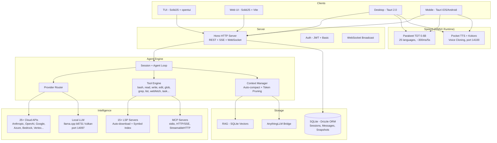

<p align="center">
  <a href="https://opencode.ai">
    <picture>
      <source srcset="packages/console/app/src/asset/logo-ornate-dark.svg" media="(prefers-color-scheme: dark)">
      <source srcset="packages/console/app/src/asset/logo-ornate-light.svg" media="(prefers-color-scheme: light)">
      
    </picture>
  </a>
</p>
<p align="center">L’agente di coding AI open source.</p>
<p align="center">
  <a href="https://opencode.ai/discord"></a>
  <a href="https://www.npmjs.com/package/opencode-ai"></a>
  <a href="https://github.com/anomalyco/opencode/actions/workflows/publish.yml"></a>
</p>

<p align="center">
  <a href="README.md">English</a> |
  <a href="README.zh.md">简体中文</a> |
  <a href="README.zht.md">繁體中文</a> |
  <a href="README.ko.md">한국어</a> |
  <a href="README.de.md">Deutsch</a> |
  <a href="README.es.md">Español</a> |
  <a href="README.fr.md">Français</a> |
  <a href="README.it.md">Italiano</a> |
  <a href="README.da.md">Dansk</a> |
  <a href="README.ja.md">日本語</a> |
  <a href="README.pl.md">Polski</a> |
  <a href="README.ru.md">Русский</a> |
  <a href="README.bs.md">Bosanski</a> |
  <a href="README.ar.md">العربية</a> |
  <a href="README.no.md">Norsk</a> |
  <a href="README.br.md">Português (Brasil)</a> |
  <a href="README.th.md">ไทย</a> |
  <a href="README.tr.md">Türkçe</a> |
  <a href="README.uk.md">Українська</a> |
  <a href="README.bn.md">বাংলা</a> |
  <a href="README.gr.md">Ελληνικά</a> |
  <a href="README.vi.md">Tiếng Việt</a>
</p>

[](https://opencode.ai)

---

## Funzionalità del Fork

> Questo è un fork di [anomalyco/opencode](https://github.com/anomalyco/opencode) mantenuto da [Rwanbt](https://github.com/Rwanbt).
> Sincronizzato con upstream. Vedi il [branch dev](https://github.com/Rwanbt/opencode/tree/dev) per le ultime modifiche.

#### IA Locale

OpenCode esegue modelli IA localmente su hardware consumer (8 GB VRAM / 16 GB RAM), senza dipendenze cloud per modelli da 4B a 7B.

**Ottimizzazione del Prompt (riduzione del 94%)**
- Prompt di sistema di ~1K token per modelli locali (vs ~16K per cloud)
- Schemi degli strumenti scheletrici (firme di 1 riga vs descrizioni multi-KB)
- Whitelist di 7 strumenti (bash, read, edit, write, glob, grep, question)
- Nessuna sezione skill, informazioni ambiente minimali

**Motore di Inferenza (llama.cpp b8731)**
- Backend GPU Vulkan, scaricato automaticamente al primo caricamento del modello
- **Configurazione adattiva a runtime** (`packages/opencode/src/local-llm-server/auto-config.ts`): `n_gpu_layers`, thread, dimensione batch/ubatch, quantizzazione cache KV e dimensione del contesto derivate da VRAM rilevata, RAM libera, split CPU big.LITTLE, backend GPU (CUDA/ROCm/Vulkan/Metal/OpenCL) e stato termico. Sostituisce il vecchio `--n-gpu-layers 99` hardcoded — un Android da 4 GB ora funziona in fallback CPU invece di essere ucciso per OOM, i desktop di punta ottengono un batch ottimizzato invece del default 512.
- `--flash-attn on` — Flash Attention per efficienza di memoria
- `--cache-type-k/v` — Cache KV con rotazione di Hadamard; tier adattivo (f16 / q8_0 / q4_0) in base al margine VRAM
- `--fit on` — aggiustamento secondario VRAM esclusivo del fork (opt-in tramite `OPENCODE_LLAMA_ENABLE_FIT=1`)
- Decodifica speculativa (`--model-draft`) con VRAM Guard (disattivazione automatica se < 1.5 GB liberi)
- Slot singolo (`-np 1`) per minimizzare l'impronta di memoria
- **Harness di benchmark** (`bun run bench:llm`): misurazione riproducibile di FTL / TPS / RSS di picco / tempo di esecuzione per modello, per run, output JSONL per archivio CI

**Speech-to-Text (Parakeet TDT 0.6B v3 INT8)**
- NVIDIA Parakeet via ONNX Runtime — ~300ms per 5s di audio (18x tempo reale)
- 25 lingue europee (inglese, francese, tedesco, spagnolo, ecc.)
- Zero VRAM: solo CPU (~700 MB RAM)
- Download automatico del modello (~460 MB) alla prima pressione del microfono
- Animazione della forma d'onda durante la registrazione

**Text-to-Speech (Kyutai Pocket TTS)**
- TTS nativo francese creato da Kyutai (Parigi), 100M parametri
- 8 voci integrate: Alba, Fantine, Cosette, Eponine, Azelma, Marius, Javert, Jean
- Clonazione vocale zero-shot: carica WAV o registra dal microfono
- Solo CPU, ~6x tempo reale, server HTTP sulla porta 14100
- Fallback: motore TTS Kokoro ONNX (54 voci, 9 lingue, CMUDict G2P)

**Gestione dei Modelli**
- Ricerca HuggingFace con badge di compatibilità VRAM/RAM per modello
- Scarica, carica, scarica, elimina modelli GGUF dall'interfaccia
- Catalogo pre-curato: Gemma 4 E4B, Qwen 3.5 (4B/2B/0.8B), Phi-4 Mini, Llama 3.2
- Token di output dinamici basati sulla dimensione del modello
- Rilevamento automatico del modello draft (0.5B–0.8B) per la decodifica speculativa

**Configurazione**
- Preset: Fast / Quality / Eco / Long Context (ottimizzazione con un clic)
- Widget di monitoraggio VRAM con barra di utilizzo colorata (verde / giallo / rosso)
- Tipo cache KV: auto / q8_0 / q4_0 / f16
- Offloading GPU: auto / gpu-max / balanced
- Memory mapping: auto / on / off
- Toggle ricerca web (icona globo nella barra del prompt)

**Affidabilità dell'Agente (modelli locali)**
- Controlli pre-volo (a livello di codice, 0 token): verifica esistenza file prima della modifica, verifica contenuto old_string, obbligo di lettura prima della modifica, prevenzione scrittura su file esistente
- Interruzione automatica doom loop: 2 chiamate identiche consecutive → errore iniettato (guardia a livello di codice, non solo prompt)
- Telemetria degli strumenti: tasso di successo/errore per sessione con dettaglio per strumento, registrato automaticamente
- Obiettivo: >85% di tasso di successo degli strumenti su modelli 4B

**Multipiattaforma**: Windows (Vulkan), Linux, macOS, Android

#### Attività in Background

Delega il lavoro a sotto-agenti che vengono eseguiti in modo asincrono. Imposta `mode: "background"` sullo strumento task e restituisce immediatamente un `task_id` mentre l'agente lavora in background. Gli eventi bus (`TaskCreated`, `TaskCompleted`, `TaskFailed`) vengono pubblicati per il tracciamento del ciclo di vita.

#### Team di Agenti

Orchestrare più agenti in parallelo usando lo strumento `team`. Definisci sotto-attività con archi di dipendenza; `computeWaves()` costruisce un DAG ed esegue le attività indipendenti in modo concorrente (fino a 5 agenti paralleli). Controllo del budget tramite `max_cost` (dollari) e `max_agents`. Il contesto delle attività completate viene automaticamente passato ai dipendenti.

#### Isolamento Git Worktree

Ogni attività in background ottiene automaticamente il proprio git worktree. Il workspace è collegato alla sessione nel database. Se un'attività non produce modifiche ai file, il worktree viene ripulito automaticamente. Questo fornisce isolamento a livello git senza container.

#### API di Gestione Attività

API REST completa per la gestione del ciclo di vita delle attività:

| Method | Path | Description |
|--------|------|-------------|
| GET | `/task/` | List tasks (filter by parent, status) |
| GET | `/task/:id` | Get task details + status + worktree info |
| GET | `/task/:id/messages` | Retrieve task session messages |
| POST | `/task/:id/cancel` | Cancel a running or queued task |
| POST | `/task/:id/resume` | Resume completed/failed/blocked task |
| POST | `/task/:id/followup` | Send follow-up message to idle task |
| POST | `/task/:id/promote` | Promote background task to foreground |
| GET | `/task/:id/team` | Aggregated team view (costs, diffs per member) |

#### Dashboard Attività TUI

Plugin nella barra laterale che mostra le attività in background attive con icone di stato in tempo reale:

| Icon | Status |
|------|--------|
| `~` | Running / Retrying |
| `?` | Queued / Awaiting input |
| `!` | Blocked |
| `x` | Failed |
| `*` | Completed |
| `-` | Cancelled |

Dialogo con azioni: aprire la sessione dell'attività, annullare, riprendere, inviare follow-up, verificare lo stato.

#### Scoping MCP per Agente

Liste di consentire/negare per server MCP per ogni agente. Configura in `opencode.json` sotto il campo `mcp` di ciascun agente. La funzione `toolsForAgent()` filtra gli strumenti MCP disponibili in base all'ambito dell'agente chiamante.

```json
{
  "agents": {
    "explore": {
      "mcp": { "deny": ["dangerous-server"] }
    }
  }
}
```

#### Ciclo di Vita della Sessione a 9 Stati

Le sessioni tracciano uno dei 9 stati, persistiti nel database:

`idle` · `busy` · `retry` · `queued` · `blocked` · `awaiting_input` · `completed` · `failed` · `cancelled`

Gli stati persistenti (`queued`, `blocked`, `awaiting_input`, `completed`, `failed`, `cancelled`) sopravvivono ai riavvii del database. Gli stati in memoria (`idle`, `busy`, `retry`) vengono reimpostati al riavvio.

#### Agente Orchestratore

Agente coordinatore in sola lettura (massimo 50 passaggi). Ha accesso agli strumenti `task` e `team` ma tutti gli strumenti di modifica sono negati. Delega l'implementazione agli agenti di build/generali e sintetizza i risultati.

---

## Architettura Tecnica

### Supporto Multi-Provider

25+ provider pronti all'uso: Anthropic, OpenAI, Google Gemini, Azure, AWS Bedrock, Vertex AI, OpenRouter, GitHub Copilot, XAI, Mistral, Groq, DeepInfra, Cerebras, Cohere, TogetherAI, Perplexity, Vercel, Venice, GitLab, Gateway, Ollama Cloud, più qualsiasi endpoint compatibile con OpenAI (Ollama, LM Studio, vLLM, LocalAI). Prezzi provenienti da [models.dev](https://models.dev).

### Sistema di Agenti

| Agent | Mode | Access | Description |
|-------|------|--------|-------------|
| **build** | primary | full | Agente di sviluppo predefinito |
| **plan** | primary | read-only | Analisi ed esplorazione del codice |
| **general** | subagent | full (no todowrite) | Attività complesse multi-step |
| **explore** | subagent | read-only | Ricerca rapida nel codebase |
| **orchestrator** | subagent | read-only + task/team | Coordinatore multi-agente (50 passaggi) |
| **critic** | subagent | read-only + bash + LSP | Revisione codice: bug, sicurezza, prestazioni |
| **tester** | subagent | full (no todowrite) | Scrivere ed eseguire test, verificare copertura |
| **documenter** | subagent | full (no todowrite) | JSDoc, README, documentazione inline |
| compaction | hidden | none | Riassunto del contesto guidato dall'IA |
| title | hidden | none | Generazione del titolo della sessione |
| summary | hidden | none | Riassunto della sessione |

### Integrazione LSP

Supporto completo del Language Server Protocol con indicizzazione dei simboli, diagnostica e supporto multi-linguaggio (TypeScript, Deno, Vue ed estensibile). L'agente naviga il codice tramite simboli LSP anziché ricerca testuale, abilitando go-to-definition preciso, find-references e rilevamento errori di tipo in tempo reale.

### Supporto MCP

Client e server Model Context Protocol. Supporta trasporti stdio, HTTP/SSE e StreamableHTTP. Flusso di autenticazione OAuth per server remoti. Capacità di tool, prompt e risorse. Scoping per agente tramite liste allow/deny.

### Architettura Client/Server

API REST basata su Hono con route tipizzate e generazione di specifiche OpenAPI. Supporto WebSocket per PTY (pseudo-terminale). SSE per streaming di eventi in tempo reale. Autenticazione di base, CORS, compressione gzip. La TUI è un frontend; il server può essere gestito da qualsiasi client HTTP, l'interfaccia web o un'app mobile.

### Gestione del Contesto

Auto-compact con riassunto guidato dall'IA quando l'utilizzo dei token si avvicina al limite del contesto del modello. Potatura consapevole dei token con soglie configurabili (`PRUNE_MINIMUM` 20KB, `PRUNE_PROTECT` 40KB). Gli output dello strumento Skill sono protetti dalla potatura.

### Motore di Modifica

Patching diff unificato con verifica degli hunk. Applica hunk mirati a regioni specifiche del file anziché sovrascritture complete del file. Strumento multi-edit per operazioni batch su più file.

### Sistema di Permessi

Permessi a 3 stati (`allow` / `deny` / `ask`) con corrispondenza di pattern con caratteri jolly. 100+ definizioni di arità dei comandi bash per un controllo granulare. L'applicazione dei confini del progetto impedisce l'accesso ai file al di fuori del workspace.

### Rollback Basato su Git

Sistema di snapshot che registra lo stato dei file prima di ogni esecuzione di strumento. Supporta `revert` e `unrevert` con calcolo delle differenze. Le modifiche possono essere annullate per messaggio o per sessione.

### Tracciamento dei Costi

Costo per messaggio con dettaglio completo dei token (input, output, reasoning, cache read, cache write). Limiti di budget per team (`max_cost`). Comando `stats` con aggregazione per modello e per giorno. Costo della sessione in tempo reale visualizzato nella TUI. Dati di prezzo recuperati da models.dev.

### Sistema di Plugin

SDK completo (`@opencode/plugin`) con architettura a hook. Caricamento dinamico da pacchetti npm o filesystem. Plugin integrati per l'autenticazione Codex, GitHub Copilot, GitLab e Poe.

---

## Idee Sbagliate Comuni

Per evitare confusione da riassunti generati dall'IA di questo progetto:

- La **TUI è in TypeScript** (SolidJS + @opentui per il rendering nel terminale), non Rust.
- **Tree-sitter** è usato solo per l'evidenziazione della sintassi nella TUI e il parsing dei comandi bash, non per l'analisi del codice a livello di agente.
- Il **sandboxing Docker** è opzionale (`experimental.sandbox.type: "docker"`); l'isolamento predefinito è tramite git worktree.
- Il **RAG** è opzionale (`experimental.rag.enabled: true`); il contesto predefinito è gestito tramite indicizzazione dei simboli LSP + auto-compact.
- **Non c'è una "modalità watch" che propone correzioni automatiche** -- il file watcher esiste solo per scopi infrastrutturali.
- L'**auto-correzione** usa il loop standard dell'agente (l'LLM vede gli errori nei risultati degli strumenti e riprova), non un meccanismo specializzato di auto-riparazione.

## Matrice delle Capacità

### Funzionalità Core dell'Agente
| Capability | Status | Notes |
|-----------|--------|-------|
| Background tasks | Implemented | `mode: "background"` on task tool |
| Agent teams (DAG) | Implemented | Wave-based parallel execution, budget control |
| Git worktree isolation | Implemented | Auto-created per background task |
| Task REST API | Implemented | 8 endpoints for full lifecycle |
| TUI task dashboard | Implemented | Sidebar + dialog actions |
| MCP agent scoping | Implemented | Per-agent allow/deny config |
| 9-state lifecycle | Implemented | Persistent to SQLite |
| Orchestrator agent | Implemented | Read-only coordinator |
| Multi-provider (25+) | Implemented | Including local models via OpenAI-compatible API |
| LSP integration | Implemented | Symbols, diagnostics, multi-language |
| MCP protocol | Implemented | Client + server, 3 transports |
| Plugin system | Implemented | SDK + hook architecture |
| Cost tracking | Implemented | Per-message, per-team, per-model |
| Context auto-compact | Implemented | AI summarization + pruning |
| Git rollback/snapshots | Implemented | Revert/unrevert per message |
| Specialized agents | Implemented | critic, tester, documenter subagents |
| Dry run / command preview | Implemented | `dry_run` param on bash/edit/write tools |
| Auto-learn | Implemented | Post-session lesson extraction to `.opencode/learnings/` |
| Web search | Implemented | Globe toggle in prompt toolbar |

### IA Locale (Desktop + Mobile)
| Capability | Status | Notes |
|-----------|--------|-------|
| Local LLM (llama.cpp b8731) | Implemented | Vulkan GPU, auto-download runtime, `--fit` auto-VRAM |
| **Configurazione adattiva a runtime** | Implemented | `auto-config.ts`: n_gpu_layers / thread / batch / quant KV derivati da VRAM rilevata, RAM, big.LITTLE, backend GPU, stato termico |
| **Harness di benchmark** | Implemented | `bun run bench:llm` misura FTL, TPS, RSS di picco, tempo di esecuzione per modello; output JSONL |
| Flash Attention | Implemented | `--flash-attn on` on desktop and mobile |
| KV cache quantization | Implemented | q4_0 / q8_0 / f16 adaptive with Hadamard rotation (72% memory savings) |
| Exact tokenizer (OpenAI) | Implemented | `js-tiktoken` per gpt-*/o1/o3/o4; empirico 3.5 caratteri/token per Llama/Qwen/Gemma |
| Speculative decoding | Implemented | VRAM Guard (desktop) / RAM Guard (mobile), draft model auto-detection |
| VRAM / RAM monitoring | Implemented | Desktop: nvidia-smi, Mobile: `/proc/meminfo` |
| Configuration presets | Implemented | Fast / Quality / Eco / Long Context |
| HuggingFace model search | Implemented | Risposta validata con Zod, badge VRAM, gestore di download, 9 modelli pre-curati |
| **Download GGUF ripristinabili** | Implemented | Header HTTP `Range` — un'interruzione 4G non ricomincia un trasferimento da 4 GB da zero |
| STT (Parakeet TDT 0.6B) | Implemented | ONNX Runtime, ~300ms/5s, 25 lingue, desktop + mobile (listener del microfono collegato su entrambi i lati) |
| TTS (Pocket TTS) | Implemented | 8 voci, clonazione vocale zero-shot, nativo francese (solo desktop — nessun sidecar Python su Android) |
| TTS (Kokoro) | Implemented | 54 voci, 9 lingue, ONNX su **desktop + Android** (6 comandi Tauri collegati in `speech.rs` mobile, CPUExecutionProvider) |
| Prompt reduction (94%) | Implemented | ~1K tokens vs ~16K for cloud, skeleton tool schemas |
| Pre-flight guards | Implemented | File-exists, old_string verification, read-before-edit, write-on-existing (code-level, 0 tokens) |
| Doom loop auto-break | Implemented | Auto-injects error on 2x identical calls (code-level, not prompt) |
| Tool telemetry | Implemented | Per-session success/error rate logging with per-tool breakdown |
| Ripartenza con circuit breaker | Implemented | `ensureCorrectModel` si arresta dopo 3 riavvii in 120 s per evitare loop di burn-cycle |

### Sicurezza e Governance
| Capability | Status | Notes |
|-----------|--------|-------|
| Docker sandboxing | Implemented | Optional via `experimental.sandbox.type: "docker"` |
| Vulnerability scanner | Implemented | Auto-scan on edit/write for secrets, injections, unsafe patterns |
| DLP / AgentShield | Implemented | `experimental.dlp.enabled: true`, redacts secrets before LLM calls |
| Policy engine | Implemented | `experimental.policy.enabled: true`, conditional rules + custom policies |
| **CSP stretta (desktop + mobile)** | Implemented | `connect-src` limitato a loopback + HuggingFace + provider HTTPS; nessun `unsafe-eval`, `object-src 'none'`, `frame-ancestors 'none'` |
| **Hardening release Android** | Implemented | `isDebuggable=false`, `allowBackup=false`, `isShrinkResources=true`, `FOREGROUND_SERVICE_TYPE_SPECIAL_USE` |
| **Hardening release desktop** | Implemented | Devtools non più forzate — ripristinato il default di Tauri 2 (solo debug) in modo che un punto d'appoggio XSS non possa agganciarsi a `__TAURI__` in produzione |
| **Validazione input comandi Tauri** | Implemented | Guard di `download_model` / `load_llm_model` / `delete_model`: charset del nome file, allowlist HTTPS verso `huggingface.co` / `hf.co` |
| **Catena di logging Rust** | Implemented | `log` + `android_logger` su mobile; nessun `eprintln!` in release → nessuna fuga di path/URL verso logcat |
| **Tracker di audit di sicurezza** | Implemented | [`SECURITY_AUDIT.md`](SECURITY_AUDIT.md) — tutti i findings classificati S1/S2/S3 con `path:line`, stato e motivazione delle correzioni rinviate |

### Conoscenza e Memoria
| Capability | Status | Notes |
|-----------|--------|-------|
| Vector DB / RAG | Implemented | `experimental.rag.enabled: true`, SQLite + cosine similarity |
| Confidence/decay | Implemented | Time-based scoring for RAG embeddings, exponential decay |
| Memory conflict resolution | Implemented | Detects and resolves duplicate/contradictory embeddings |

### Estensioni della Piattaforma (Sperimentali)
| Capability | Status | Notes |
|-----------|--------|-------|
| Mobile app (Tauri) | Implemented | Android: runtime integrato, LLM on-device, STT + TTS (Kokoro). iOS: modalità remota |
| **Deep link di callback OAuth** | Implemented | `opencode://oauth/callback?providerID=…&code=…&state=…` finalizza automaticamente lo scambio di token; nessun copia-incolla del codice di autenticazione |
| **Watcher del branch upstream** | Implemented | `git fetch` periodico (warm-up 30 s, intervallo 5 min) emette `vcs.branch.behind` quando HEAD locale diverge dall'upstream tracciato; mostrato tramite `platform.notify()` su desktop e mobile |
| **Spawn PTY dimensionato sul viewport** | Implemented | `Pty.create({cols, rows})` usa uno stimatore da `window.innerWidth/innerHeight` — le shell partono con le loro dimensioni finali invece di 80×24→36×11, risolve il bug del primo prompt invisibile su Android con mksh/bash |
| Collaborative mode | Experimental | JWT auth, presence, file locking, WebSocket broadcast |
| AnythingLLM bridge | Experimental | MCP adapter, context injection, vector store bridge |
| Per-message token display | Partial | Stored in DB, shown as session aggregate |

---

## Architettura



### Porte dei Servizi

| Service | Port | Protocol |
|---------|------|----------|
| OpenCode Server | 4096 | HTTP (REST + SSE + WebSocket) |
| LLM (llama-server) | 14097 | HTTP (OpenAI-compatible) |
| TTS (pocket-tts) | 14100 | HTTP (FastAPI) |

## Sicurezza e Governance

| Feature | Description |
|---------|-------------|
| **Sandbox** | Esecuzione opzionale in Docker (`experimental.sandbox.type: "docker"`) o modalità host con applicazione dei confini del progetto |
| **Permessi** | Sistema a 3 stati (`allow` / `deny` / `ask`) con corrispondenza di pattern con caratteri jolly. 100+ definizioni di comandi bash per controllo granulare |
| **DLP** | Data Loss Prevention (`experimental.dlp`) redige segreti, chiavi API e credenziali prima dell'invio ai provider LLM |
| **Policy Engine** | Regole condizionali (`experimental.policy`) con azioni `block` o `warn`. Protezione dei percorsi, limite dimensione modifiche, pattern regex personalizzati |
| **Privacy** | Locale per primo: tutti i dati in SQLite su disco. Nessuna telemetria per impostazione predefinita. I segreti non vengono mai registrati. Nessun dato inviato a terze parti oltre al provider LLM configurato |

## Interfaccia di Intelligenza

| Feature | Description |
|---------|-------------|
| **MCP Compliant** | Supporto completo Model Context Protocol — modalità client e server, scoping degli strumenti per agente tramite liste allow/deny |
| **Context Files** | Directory `.opencode/` con configurazione `opencode.jsonc`. Agenti definiti come markdown con frontmatter YAML. Istruzioni personalizzate tramite configurazione `instructions` |
| **Provider Router** | 25+ provider tramite `Provider.parseModel("provider/model")`. Fallback automatico, tracciamento costi, routing consapevole dei token |
| **Sistema RAG** | Ricerca vettoriale locale opzionale (`experimental.rag`) con modelli di embedding configurabili (OpenAI/Google). Indicizzazione automatica dei file modificati |
| **Bridge AnythingLLM** | Integrazione opzionale (`experimental.anythingllm`) — iniezione di contesto, adattatore server MCP, bridge vector store, API HTTP Agent Skills |

---

## Branch delle Funzionalità (Implementati su `dev`)

Tre funzionalità principali sono state implementate su branch dedicati e integrate in `dev`. Ciascuna è protetta da feature gate e retrocompatibile.

### Modalità Collaborativa (`dev_collaborative_mode`)

Collaborazione multi-utente in tempo reale. Implementato:
- **Autenticazione JWT** — Token HMAC-SHA256 con rotazione del refresh, retrocompatibile con basic auth
- **Gestione utenti** — Registrazione, ruoli (admin/member/viewer), applicazione RBAC
- **Broadcast WebSocket** — Streaming di eventi in tempo reale tramite GlobalBus → Broadcast wiring
- **Sistema di presenza** — Stato online/idle/away con heartbeat ogni 30s
- **Blocco file** — Blocchi ottimistici sugli strumenti edit/write con rilevamento conflitti
- **Frontend** — Modulo di login, indicatore di presenza, badge osservatore, hook WebSocket

Config: `experimental.collaborative.enabled: true`

### Versione Mobile (`dev_mobile`)

App nativa Android/iOS tramite Tauri 2.0 con **runtime integrato** — un singolo APK, zero dipendenze esterne. Implementato:

**Layer 1 — Runtime Integrato (Android, 100% prestazioni native):**
- **Binari statici nell'APK** — Bun, Git, Bash, Ripgrep (aarch64-linux-musl) estratti al primo avvio (~15s)
- **CLI integrata** — CLI OpenCode come bundle JS eseguito dal Bun integrato, nessuna rete richiesta per il core
- **Spawn diretto dei processi** — Nessun Termux, nessun intent — `std::process::Command` da Rust direttamente
- **Avvio automatico del server** — `bun opencode-cli.js serve` su localhost con autenticazione UUID, come il sidecar desktop

**Layer 2 — Inferenza LLM sul Dispositivo:**
- **llama.cpp via JNI** — Kotlin LlamaEngine carica librerie native .so con bridge JNI
- **IPC basato su file** — Rust scrive comandi in `llm_ipc/request`, il daemon Kotlin effettua polling e restituisce i risultati
- **llama-server** — API HTTP compatibile OpenAI sulla porta 14097 per l'integrazione con i provider
- **Gestione modelli** — Scarica modelli GGUF da HuggingFace, carica/scarica/elimina, 9 modelli pre-curati
- **Registrazione provider** — Il modello locale appare come provider "Local AI" nel selettore modelli
- **Flash Attention** — `--flash-attn on` per inferenza efficiente in memoria
- **Quantizzazione cache KV** — `--cache-type-k/v q4_0` con rotazione di Hadamard (risparmio memoria del 72%)
- **Decodifica speculativa** — Rilevamento automatico del modello draft (0.5B–0.8B) con RAM Guard tramite `/proc/meminfo`
- **Monitoraggio RAM** — Widget memoria del dispositivo (totale/usata/libera) tramite `/proc/meminfo`
- **Preset di configurazione** — Stessi preset Fast/Quality/Eco/Long Context del desktop
- **Selezione GPU intelligente** — Vulkan per Adreno 730+ (SD 8 Gen 1+), OpenCL per SoC più vecchi, fallback CPU
- **Pinning big-core** — Rileva topologia ARM big.LITTLE, vincola l'inferenza ai soli core ad alte prestazioni

**Layer 3 — Ambiente Esteso (download opzionale, ~150MB):**
- **proot + Alpine rootfs** — Linux completo con `apt install` per pacchetti aggiuntivi
- **Layer 1 montato tramite bind** — Bun/Git/rg funzionano ancora a velocità nativa dentro proot
- **Su richiesta** — Scaricato solo quando l'utente abilita "Extended Environment" nelle impostazioni

**Layer 4 — Voce e Media:**
- **STT (Parakeet TDT 0.6B)** — Stesso motore ONNX Runtime del desktop, ~300ms/5s audio, 25 lingue
- **Animazione della forma d'onda** — Feedback visivo durante la registrazione
- **File picker nativo** — `tauri-plugin-dialog` per selezione file/directory e allegati

**Condiviso (Android + iOS):**
- **Astrazione della piattaforma** — Tipo `Platform` esteso con rilevamento `"mobile"` + `"ios"/"android"` OS
- **Connessione remota** — Connessione al server OpenCode desktop tramite rete (solo iOS o fallback Android)
- **Terminale interattivo** — PTY completo tramite `librust_pty.so` musl personalizzato (wrapper forkpty), renderer Ghostty WASM con fallback canvas
- **Storage esterno** — Symlink dalla HOME del server alle directory `/sdcard/` (Documents, Downloads, projects)
- **UI mobile** — Barra laterale responsive, input messaggi ottimizzato per touch, vista diff mobile, target touch 44px, supporto safe area
- **Notifiche push** — Bridge SSE-to-native notification per il completamento delle attività in background
- **Selettore modalità** — Scegli Local (Android) o Remote (iOS + Android) al primo avvio
- **Menu azioni mobile** — Accesso rapido a terminale, fork, ricerca e impostazioni dall'intestazione della sessione

### Fusione AnythingLLM (`dev_anything`)

Bridge tra OpenCode e la piattaforma RAG per documenti di AnythingLLM. Implementato:
- **Client REST** — Wrapper API completo per workspace, documenti, ricerca, chat di AnythingLLM
- **Adattatore server MCP** — 4 strumenti: `anythingllm_search`, `anythingllm_list_workspaces`, `anythingllm_get_document`, `anythingllm_chat`
- **Iniezione contesto plugin** — Hook `experimental.chat.system.transform` inietta documenti rilevanti nel prompt di sistema
- **API HTTP Agent Skills** — `GET /agent-skills` + `POST /agent-skills/:toolId/execute` per esporre gli strumenti OpenCode ad AnythingLLM
- **Bridge vector store** — Ricerca composita che unisce RAG SQLite locale con risultati del vector DB di AnythingLLM
- **Docker Compose** — `docker-compose.anythingllm.yml` pronto all'uso con rete condivisa

Config: `experimental.anythingllm.enabled: true`

### Installazione

```bash
# YOLO
curl -fsSL https://opencode.ai/install | bash

# Package manager
npm i -g opencode-ai@latest        # oppure bun/pnpm/yarn
scoop install opencode             # Windows
choco install opencode             # Windows
brew install anomalyco/tap/opencode # macOS e Linux (consigliato, sempre aggiornato)
brew install opencode              # macOS e Linux (formula brew ufficiale, aggiornata meno spesso)
sudo pacman -S opencode            # Arch Linux (Stable)
paru -S opencode-bin               # Arch Linux (Latest from AUR)
mise use -g opencode               # Qualsiasi OS
nix run nixpkgs#opencode           # oppure github:anomalyco/opencode per l’ultima branch di sviluppo
```

> [!TIP]
> Rimuovi le versioni precedenti alla 0.1.x prima di installare.

### App Desktop (BETA)

OpenCode è disponibile anche come applicazione desktop. Puoi scaricarla direttamente dalla [pagina delle release](https://github.com/anomalyco/opencode/releases) oppure da [opencode.ai/download](https://opencode.ai/download).

| Piattaforma           | Download                              |
| --------------------- | ------------------------------------- |
| macOS (Apple Silicon) | `opencode-desktop-darwin-aarch64.dmg` |
| macOS (Intel)         | `opencode-desktop-darwin-x64.dmg`     |
| Windows               | `opencode-desktop-windows-x64.exe`    |
| Linux                 | `.deb`, `.rpm`, oppure AppImage       |

```bash
# macOS (Homebrew)
brew install --cask opencode-desktop
# Windows (Scoop)
scoop bucket add extras; scoop install extras/opencode-desktop
```

#### Directory di installazione

Lo script di installazione rispetta il seguente ordine di priorità per il percorso di installazione:

1. `$OPENCODE_INSTALL_DIR` – Directory di installazione personalizzata
2. `$XDG_BIN_DIR` – Percorso conforme alla XDG Base Directory Specification
3. `$HOME/bin` – Directory binaria standard dell’utente (se esiste o può essere creata)
4. `$HOME/.opencode/bin` – Fallback predefinito

```bash
# Esempi
OPENCODE_INSTALL_DIR=/usr/local/bin curl -fsSL https://opencode.ai/install | bash
XDG_BIN_DIR=$HOME/.local/bin curl -fsSL https://opencode.ai/install | bash
```

### Agenti

OpenCode include due agenti integrati tra cui puoi passare usando il tasto `Tab`.

- **build** – Predefinito, agente con accesso completo per il lavoro di sviluppo
- **plan** – Agente in sola lettura per analisi ed esplorazione del codice
  - Nega le modifiche ai file per impostazione predefinita
  - Chiede il permesso prima di eseguire comandi bash
  - Ideale per esplorare codebase sconosciute o pianificare modifiche

È inoltre incluso un sotto-agente **general** per ricerche complesse e attività multi-step.
Viene utilizzato internamente e può essere invocato usando `@general` nei messaggi.

Scopri di più sugli [agenti](https://opencode.ai/docs/agents).

### Documentazione

Per maggiori informazioni su come configurare OpenCode, [**consulta la nostra documentazione**](https://opencode.ai/docs).

### Contribuire

Se sei interessato a contribuire a OpenCode, leggi la nostra [guida alla contribuzione](./CONTRIBUTING.md) prima di inviare una pull request.

### Costruire su OpenCode

Se stai lavorando a un progetto correlato a OpenCode e che utilizza “opencode” come parte del nome (ad esempio “opencode-dashboard” o “opencode-mobile”), aggiungi una nota nel tuo README per chiarire che non è sviluppato dal team OpenCode e che non è affiliato in alcun modo con noi.

### FAQ

#### In cosa è diverso da Claude Code?

È molto simile a Claude Code in termini di funzionalità. Ecco le principali differenze:

- 100% open source
- Non è legato a nessun provider. Anche se consigliamo i modelli forniti tramite [OpenCode Zen](https://opencode.ai/zen), OpenCode può essere utilizzato con Claude, OpenAI, Google o persino modelli locali. Con l’evoluzione dei modelli, le differenze tra di essi si ridurranno e i prezzi scenderanno, quindi essere indipendenti dal provider è importante.
- Supporto LSP pronto all’uso
- Forte attenzione alla TUI. OpenCode è sviluppato da utenti neovim e dai creatori di [terminal.shop](https://terminal.shop); spingeremo al limite ciò che è possibile fare nel terminale.
- Architettura client/server. Questo, ad esempio, permette a OpenCode di girare sul tuo computer mentre lo controlli da remoto tramite un’app mobile. La frontend TUI è quindi solo uno dei possibili client.

---

**Unisciti alla nostra community** [Discord](https://discord.gg/opencode) | [X.com](https://x.com/opencode)
