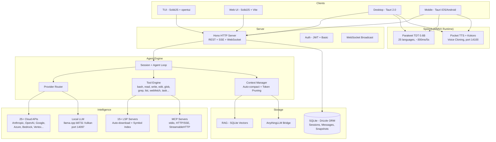

<p align="center">
  <a href="https://opencode.ai">
    <picture>
      <source srcset="packages/console/app/src/asset/logo-ornate-dark.svg" media="(prefers-color-scheme: dark)">
      <source srcset="packages/console/app/src/asset/logo-ornate-light.svg" media="(prefers-color-scheme: light)">
      
    </picture>
  </a>
</p>
<p align="center">オープンソースのAIコーディングエージェント。</p>
<p align="center">
  <a href="https://opencode.ai/discord"></a>
  <a href="https://www.npmjs.com/package/opencode-ai"></a>
  <a href="https://github.com/Rwanbt/opencode/actions/workflows/fork-release.yml"></a>
</p>

<p align="center">
  <a href="README.md">English</a> |
  <a href="README.zh.md">简体中文</a> |
  <a href="README.zht.md">繁體中文</a> |
  <a href="README.ko.md">한국어</a> |
  <a href="README.de.md">Deutsch</a> |
  <a href="README.es.md">Español</a> |
  <a href="README.fr.md">Français</a> |
  <a href="README.it.md">Italiano</a> |
  <a href="README.da.md">Dansk</a> |
  <a href="README.ja.md">日本語</a> |
  <a href="README.pl.md">Polski</a> |
  <a href="README.ru.md">Русский</a> |
  <a href="README.bs.md">Bosanski</a> |
  <a href="README.ar.md">العربية</a> |
  <a href="README.no.md">Norsk</a> |
  <a href="README.br.md">Português (Brasil)</a> |
  <a href="README.th.md">ไทย</a> |
  <a href="README.tr.md">Türkçe</a> |
  <a href="README.uk.md">Українська</a> |
  <a href="README.bn.md">বাংলা</a> |
  <a href="README.gr.md">Ελληνικά</a> |
  <a href="README.vi.md">Tiếng Việt</a>
</p>

[](https://opencode.ai)

<!-- WHY-FORK-MATRIX -->
## なぜこの Fork を選ぶのか？

> **要約** — DAG ベースのオーケストレーター、REST タスク API、エージェント単位の MCP スコーピング、9 状態のセッション FSM、組み込みの脆弱性スキャナ、*さらに* オンデバイス LLM 推論を備えた一級の Android アプリまで同梱する唯一のオープンソース・コーディング・エージェント。プロプライエタリであれオープンであれ、これら全てを兼ね備える CLI は他に存在しません。

> See the English [README.md](README.md) for the full positioning prose (vs. vendor-locked CLIs, vs. BYOM peers, vs. specialized CLIs) and architecture diagram.

### Capability matrix — this fork vs. the 2026 landscape

Legend: ✅ shipped · ❌ absent · *partial* limited/incomplete · *plugin* via community add-on · *paid* behind a subscription tier.

#### Orchestration, API surface, governance

| Capability                             | **This fork** | Claude Code | Codex CLI | Gemini CLI | opencode (upstream) | Aider | Goose | Cline | Roo Code | Cursor | Continue | Crush | Qwen Code |
| -------------------------------------- | :-----------: | :---------: | :-------: | :--------: | :-----------------: | :---: | :---: | :---: | :------: | :----: | :------: | :---: | :-------: |
| Open source                            |       ✅       |      ❌      |  partial  |      ✅     |          ✅          |   ✅   |   ✅   |   ✅   |    ✅     |    ❌    |     ✅     |   ✅   |     ✅     |
| BYOM (bring your own model)            |       ✅       |      ❌      |     ❌     |      ❌     |          ✅          |   ✅   |   ✅   |   ✅   |    ✅     |  partial |     ✅     |   ✅   |   partial  |
| Local models (llama.cpp / Ollama)      |       ✅       |      ❌      |     ❌     |      ❌     |          ✅          |   ✅   |   ✅   |   ✅   |    ✅     |    ❌    |     ✅     |   ✅   |     ✅     |
| Parallel agents in isolated worktrees  |    ✅ native   |  ✅ (Teams)  |  partial  |      ❌     |      via plugin     |   ❌   | partial | ✅ (v3.58) | partial | ❌ | ❌ | ❌ |     ❌     |
| Explicit **DAG orchestration**         | ✅ **unique**  |    ad-hoc   |     ❌     |      ❌     |          ❌          |   ❌   | recipes (linear) | ❌ | ❌ | ❌ |     ❌     |   ❌   |     ❌     |
| **REST task API** (programmable)       | ✅ **unique**  | partial (SDK) |  ❌    |      ❌     |          ❌          |   ❌   |   ❌   |   ❌   |    ❌     |    ❌    |     ❌     |   ❌   |     ❌     |
| **TUI task dashboard**                 |       ✅       |      ❌      |     ❌     |      ❌     |       partial       |   ❌   |   ❌   |   ❌   |    ❌     |   n/a   |    n/a    |   ❌   |   partial  |
| MCP support                            | ✅ + **per-agent scoping** | ✅ | ✅ | ✅ | ✅ | via plugins | ✅ | ✅ | ✅ | partial | ✅ |   ❌   |     ✅     |
| **9-state session FSM**                | ✅ **unique** (6/9 persisted) | ❌ |     ❌     |      ❌     |        basic        |   ❌   |   ❌   |   ❌   |    ❌     |    ❌    |     ❌     |   ❌   |     ❌     |
| Built-in **vulnerability scanner**     | ✅ **unique**  |      ❌      |     ❌     |      ❌     |          ❌          |   ❌   |   ❌   |   ❌   |    ❌     |    ❌    |     ❌     |   ❌   |     ❌     |
| **DLP / secret redaction** before LLM call | ✅         |   partial    |     ❌     |      ❌     |          ❌          |   ❌   |   ❌   |   ❌   |    ❌     |    ❌    |     ❌     |   ❌   |     ❌     |
| **Per-agent tool allow/deny**          |       ✅       |   partial    |     ❌     |      ❌     |        basic        |   ❌   |   ❌   |   ❌   |  partial  |    ❌    |     ❌     |   ❌   |     ❌     |
| Docker sandboxing (bash only) | ✅ bash-only | ❌         |     ✅     |      ❌     |          ❌          |   ❌   |   ❌   |   ❌   |    ❌     |    ❌    |     ❌     |   ❌   |     ❌     |
| Git auto-commits / rollback            |       ✅       |      ✅      |     ✅     |      ✅     |      ✅ (signed)     |   ✅   |   ✅   |   ✅   |    ✅     |    ✅    |     ✅     |   ✅   |     ✅     |

#### Intelligence, context, developer UX

| Capability                             | **This fork** | Claude Code | Codex CLI | Gemini CLI | opencode (upstream) | Aider | Goose | Cline | Roo Code | Cursor | Continue | Crush | Qwen Code |
| -------------------------------------- | :-----------: | :---------: | :-------: | :--------: | :-----------------: | :---: | :---: | :---: | :------: | :----: | :------: | :---: | :-------: |
| LSP integration (go-to-def, diagnostics) | ✅           |   partial    |  partial  |   partial   |          ✅          | partial | partial | ✅   |    ✅     |    ✅    |     ✅     | partial |  partial  |
| Plugin SDK (`@opencode/plugin`)        |       ✅       |   partial    |     ❌     |      ❌     |          ✅          |   ❌   |   ✅   |   ✅   |    ✅     |    ✅    |     ✅     |   ❌   |     ❌     |
| Prompt caching (cloud + local KV)      |       ✅       |      ✅      |     ✅     |      ✅     |          ✅          |   ✅   |   ✅   |   ✅   |    ✅     |    ✅    |     ✅     |   ✅   |     ✅     |
| **RAG: BM25 or vector (selectable)** + exponential decay | ✅ | ❌  |     ❌     |      ❌     |          ❌          |   ❌   |   ❌   | vector only | ❌      |  vector only |  vector only |  ❌   |     ❌     |
| **Auto-learn** (requires `learner` agent configured) | opt-in | ❌  |  ❌     |      ❌     |          ❌          |   ❌   |   ❌   |   ❌   |    ❌     |    ❌    |     ❌     |   ❌   |     ❌     |
| Auto-compact (AI summarization)        |       ✅       |      ✅      |     ✅     |      ✅     |          ✅          |   ✅   |   ✅   |   ✅   |    ✅     |    ✅    |     ✅     | partial |     ✅     |
| Unified-diff edit engine               |       ✅       |      ✅      |     ✅     |   partial   |          ✅          |   ✅   | partial | partial |    ✅     | partial |  partial  | partial |  partial  |
| ACP (Agent Client Protocol) layer      |       ✅       |      ❌      |     ❌     |      ❌     |        basic        |   ❌   |   ❌   |   ❌   |    ❌     |    ❌    |     ❌     |   ❌   |     ❌     |

#### Platform reach & multimodal

| Capability                             | **This fork** | Claude Code | Codex CLI | Gemini CLI | opencode (upstream) | Aider | Goose | Cline | Roo Code | Cursor | Continue | Crush | Qwen Code |
| -------------------------------------- | :-----------: | :---------: | :-------: | :--------: | :-----------------: | :---: | :---: | :---: | :------: | :----: | :------: | :---: | :-------: |
| First-class **Android app**            | ✅ **unique**  |      ❌      |     ❌     |      ❌     |          ❌          |   ❌   |   ❌   |   ❌   |    ❌     |    ❌    |     ❌     |   ❌   |     ❌     |
| iOS (remote mode)                      |       ✅       |      ❌      |     ❌     |      ❌     |          ❌          |   ❌   |   ❌   |   ❌   |    ❌     |    ❌    |     ❌     |   ❌   |     ❌     |
| Adaptive runtime (VRAM/CPU, thermal Android-only) | ✅ partial | ❌ |  ❌     |      ❌     |      hardcoded      | hardcoded | hardcoded | hardcoded | hardcoded | n/a | hardcoded | hardcoded | hardcoded |
| **STT** (voice-to-text, Parakeet) | ✅ desktop + mobile | ❌ |     ❌     |      ❌     |          ❌          |   ❌   |   ❌   | partial  |    ❌     |    ❌    |     ❌     |   ❌   |     ❌     |
| **TTS** (Kokoro desktop + mobile; Pocket desktop only + voice clone) | ✅ | ❌ |    ❌     |      ❌     |          ❌          |   ❌   |   ❌   |   ❌   |    ❌     |    ❌    |     ❌     |   ❌   |     ❌     |
| **OAuth deep-link callback** (Tauri)   |       ✅       |      ❌      |     ❌     |      ❌     |          ❌          |   ❌   |   ❌   |   ❌   |    ❌     |    ❌    |     ❌     |   ❌   |     ❌     |
| **mDNS service discovery** (CLI flag `--mdns`) | opt-in | ❌ |   ❌     |      ❌     |          ❌          |   ❌   |   ❌   |   ❌   |    ❌     |    ❌    |     ❌     |   ❌   |     ❌     |
| **Upstream branch watcher** (`vcs.branch.behind`) | ✅ **unique** | ❌ |    ❌     |      ❌     |          ❌          |   ❌   |   ❌   |   ❌   |    ❌     |    ❌    |     ❌     |   ❌   |     ❌     |
| **Collaborative mode** (JWT + presence + file-lock) | ✅ | ❌      |     ❌     |      ❌     |          ❌          |   ❌   |   ❌   |   ❌   |    ❌     | partial |     ❌     |   ❌   |     ❌     |
| **AnythingLLM bridge**                 | ✅ **unique**  |      ❌      |     ❌     |      ❌     |          ❌          |   ❌   |   ❌   |   ❌   |    ❌     |    ❌    |     ❌     |   ❌   |     ❌     |
| **GDPR export/erasure route**          | ✅ **unique**  |      ❌      |     ❌     |      ❌     |          ❌          |   ❌   |   ❌   |   ❌   |    ❌     |    ❌    |     ❌     |   ❌   |     ❌     |
| Price                                  |  free + BYOM  |  $20/mo sub |$20/mo sub |  1000/day free | free + BYOM    | free + BYOM | free + BYOM | free + BYOM | free + BYOM | $20/mo sub | free + BYOM | free + BYOM | free + BYOM |

---

<!-- ACCORDION-APPLIED -->

<details>
<summary><b>⚡ 概要</b></summary>
<br>

## ⚡ 概要

OpenCode (フォーク) — **デスクトップ、サーバー、スマートフォン**で動作する AI コーディングエージェント。エンドツーエンドのローカルモデル、クラウド依存ゼロ、エンタープライズ級ガバナンス・プリミティブを組み込み済み。[Rwanbt](https://github.com/Rwanbt) が保守する [anomalyco/opencode](https://github.com/anomalyco/opencode) のフォーク。

### Install

```bash
# CLI (macOS / Linux / Windows)
curl -fsSL https://opencode.ai/install | bash

# Desktop app + Android APK
# → https://github.com/Rwanbt/opencode/releases/latest
```

### このフォークだけが同梱する 8 つのこと

|   |   |
| - | - |
| 🤖 **DAG orchestration** | Wave-based parallel agents, up to 5 concurrent |
| 🧠 **Local LLM end-to-end** | llama.cpp + runtime that auto-tunes to your VRAM / CPU |
| 📱 **Android app** | On-device inference, terminal, PTY — single APK |
| 🎙️ **Voice STT / TTS** | Parakeet (25 languages) + Kokoro desktop+mobile / Pocket TTS desktop |
| 🔒 **9-state session FSM** | 6 of 9 states persist to SQLite, audit log survives restart |
| 🔌 **REST task API** | 8 endpoints — drive the agent from cron, Temporal, Airflow |
| 🛡️ **Vulnerability scanner** | Auto-scans every edit / write for secrets & injection sinks |
| 🔍 **RAG: BM25 or vector** | Selectable at index time + exponential confidence decay |

### 最初のタスクを実行

```bash
opencode                                  # TUI
opencode run "fix the failing test in src/"   # one-shot
```

> 💡 詳細が必要ですか？以下の各セクションはすべて折りたたまれています — 興味のある部分だけ展開してください。

---


</details>

<details>
<summary><b>フォーク機能</b></summary>
<br>

## フォーク機能

> これは [anomalyco/opencode](https://github.com/anomalyco/opencode) のフォークで、[Rwanbt](https://github.com/Rwanbt) がメンテナンスしています。
> アップストリームと同期を維持。最新の変更は [dev ブランチ](https://github.com/Rwanbt/opencode/tree/dev) をご覧ください。

#### ローカルファースト AI

OpenCode はコンシューマー向けハードウェア（VRAM 8 GB / RAM 16 GB）でAIモデルをローカル実行し、4B〜7B モデルはクラウド依存ゼロで動作します。

**プロンプト最適化（94% 削減）**
- ローカルモデル向け ~1K トークンのシステムプロンプト（クラウド向けの ~16K と比較）
- スケルトンツールスキーマ（マルチKBの説明文に対して1行のシグネチャ）
- 7ツールのホワイトリスト（bash, read, edit, write, glob, grep, question）
- skills セクションなし、最小限の環境情報

**推論エンジン (llama.cpp b8731)**
- Vulkan GPU バックエンド、初回モデルロード時に自動ダウンロード
- **ランタイム適応設定**（`packages/opencode/src/local-llm-server/auto-config.ts`）: 検出された VRAM、空き RAM、big.LITTLE CPU 分割、GPU バックエンド（CUDA/ROCm/Vulkan/Metal/OpenCL）、温度状態から `n_gpu_layers`、スレッド数、batch/ubatch サイズ、KV キャッシュ量子化、コンテキストサイズを導出。以前のハードコードされた `--n-gpu-layers 99` を置き換え — 4 GB の Android は OOM キルされる代わりに CPU フォールバックで動作し、ハイエンドデスクトップはデフォルトの 512 ではなく調整された batch を取得します。
- `--flash-attn on` — メモリ効率向上のための Flash Attention
- `--cache-type-k/v` —  回転 KV キャッシュ；VRAM 余裕に応じた適応階層（f16 / q8_0 / q4_0）
- `--fit on` — フォーク専用の VRAM 二次調整（`OPENCODE_LLAMA_ENABLE_FIT=1` でオプトイン）
- 投機的デコーディング（`--model-draft`）と VRAM ガード（VRAM 空き容量 < 4 GB で自動無効化）
- シングルスロット（`-np 1`）でメモリフットプリントを最小化
- **ベンチマークハーネス**（`bun run bench:llm`）: モデル毎・実行毎に FTL / TPS / ピーク RSS / 実行時間を再現可能に計測、CI アーカイブ用の JSONL 出力

**音声認識 (Parakeet TDT 0.6B v3 INT8)**
- NVIDIA Parakeet（ONNX Runtime 経由） — 5秒の音声に対して ~300ms（18倍リアルタイム）
- 25のヨーロッパ言語（英語、フランス語、ドイツ語、スペイン語など）
- VRAM ゼロ：CPU のみ（~700 MB RAM）
- 初回マイク押下時にモデル自動ダウンロード（~460 MB）
- 録音中の波形アニメーション

**テキスト読み上げ (Kyutai Pocket TTS)**
- Kyutai（パリ）が開発したフランス語ネイティブ TTS、1億パラメータ
- 8つの組み込み音声：Alba, Fantine, Cosette, Eponine, Azelma, Marius, Javert, Jean
- ゼロショット音声クローニング：WAV アップロードまたはマイクから録音
- CPU のみ、~6倍リアルタイム、ポート 14100 の HTTP サーバー
- フォールバック：Kokoro TTS ONNX エンジン（54音声、9言語、CMUDict G2P）

**モデル管理**
- HuggingFace 検索（モデルごとの VRAM/RAM 互換性バッジ付き）
- UI から GGUF モデルのダウンロード、ロード、アンロード、削除
- 事前キュレーション済みカタログ：Gemma 3 4B, Qwen3 4B/1.7B/0.6B
- モデルサイズに応じた動的出力トークン
- 投機的デコーディング用のドラフトモデル自動検出（0.5B〜0.8B）

**設定**
- プリセット：Fast / Quality / Eco / Long Context（ワンクリック最適化）
- 色分けされた使用量バー（緑 / 黄 / 赤）付き VRAM 監視ウィジェット
- KV キャッシュタイプ：auto / q8_0 / q4_0 / f16
- GPU オフロード：auto / gpu-max / balanced
- メモリマッピング：auto / on / off
- Web 検索切り替え（プロンプトツールバーの地球アイコン）

**エージェントの信頼性（ローカルモデル）**
- プリフライトガード（コードレベル、0トークン）：編集前のファイル存在確認、old_string 内容検証、read-before-edit 強制、既存ファイルへの write 防止
- デスループ自動ブレーク：同一ツール呼び出し2回でエラー注入（コードレベルのガード、プロンプトのみではない）
- ツールテレメトリ：セッションごとの成功/エラー率とツール別内訳の自動ログ

**クロスプラットフォーム**：Windows (Vulkan)、Linux、macOS、Android

#### バックグラウンドタスク

非同期に実行されるサブエージェントに作業を委任します。task ツールで `mode: "background"` を設定すると、エージェントがバックグラウンドで動作している間に `task_id` が即座に返されます。ライフサイクル追跡のためにバスイベント（`TaskCreated`、`TaskCompleted`、`TaskFailed`）が発行されます。

#### エージェントチーム

`team` ツールを使用して複数のエージェントを並列にオーケストレーションします。依存関係のエッジを持つサブタスクを定義し、`computeWaves()` が DAG を構築して独立したタスクを同時に実行します（最大5つの並列エージェント）。`max_cost`（ドル）と `max_agents` によるバジェット制御。完了したタスクのコンテキストは依存タスクに自動的に渡されます。

#### Git Worktree 分離

各バックグラウンドタスクは自動的に独自の git worktree を取得します。ワークスペースはデータベース内のセッションにリンクされます。タスクがファイル変更を生成しない場合、worktree は自動的にクリーンアップされます。コンテナなしで git レベルの分離を提供します。

#### タスク管理 API

タスクライフサイクル管理のための完全な REST API：

| Method | Path | Description |
|--------|------|-------------|
| GET | `/task/` | List tasks (filter by parent, status) |
| GET | `/task/:id` | Get task details + status + worktree info |
| GET | `/task/:id/messages` | Retrieve task session messages |
| POST | `/task/:id/cancel` | Cancel a running or queued task |
| POST | `/task/:id/resume` | Resume completed/failed/blocked task |
| POST | `/task/:id/followup` | Send follow-up message to idle task |
| POST | `/task/:id/promote` | Promote background task to foreground |
| GET | `/task/:id/team` | Aggregated team view (costs, diffs per member) |

#### TUI タスクダッシュボード

アクティブなバックグラウンドタスクをリアルタイムのステータスアイコンで表示するサイドバープラグイン：

| Icon | Status |
|------|--------|
| `~` | Running / Retrying |
| `?` | Queued / Awaiting input |
| `!` | Blocked |
| `x` | Failed |
| `*` | Completed |
| `-` | Cancelled |

アクション付きダイアログ：タスクセッションを開く、キャンセル、再開、フォローアップ送信、ステータス確認。

#### MCP エージェントスコーピング

エージェントごとの MCP サーバー許可/拒否リスト。`opencode.json` の各エージェントの `mcp` フィールドで設定します。`toolsForAgent()` 関数が呼び出し元エージェントのスコープに基づいて利用可能な MCP ツールをフィルタリングします。

```json
{
  "agents": {
    "explore": {
      "mcp": { "deny": ["dangerous-server"] }
    }
  }
}
```

#### 9状態セッションライフサイクル

セッションは9つの状態のいずれかを追跡し、データベースに永続化されます：

`idle` · `busy` · `retry` · `queued` · `blocked` · `awaiting_input` · `completed` · `failed` · `cancelled`

永続状態（`queued`、`blocked`、`awaiting_input`、`completed`、`failed`、`cancelled`）はデータベース再起動後も保持されます。インメモリ状態（`idle`、`busy`、`retry`）は再起動時にリセットされます。

#### オーケストレーターエージェント

読み取り専用のコーディネーターエージェント（最大50ステップ）。`task` と `team` ツールにアクセスできますが、すべての編集ツールは拒否されます。実装をビルド/汎用エージェントに委任し、結果を統合します。

---


</details>

<details>
<summary><b>技術アーキテクチャ</b></summary>
<br>

## 技術アーキテクチャ

### マルチプロバイダー対応

25以上のプロバイダーをすぐに利用可能：Anthropic、OpenAI、Google Gemini、Azure、AWS Bedrock、Vertex AI、OpenRouter、GitHub Copilot、XAI、Mistral、Groq、DeepInfra、Cerebras、Cohere、TogetherAI、Perplexity、Vercel、Venice、GitLab、Gateway、Ollama Cloud、およびすべての OpenAI 互換エンドポイント（Ollama、LM Studio、vLLM、LocalAI）。料金は [models.dev](https://models.dev) から取得。

### エージェントシステム

| Agent | Mode | Access | Description |
|-------|------|--------|-------------|
| **build** | primary | full | デフォルトの開発エージェント |
| **plan** | primary | read-only | 分析とコード探索 |
| **general** | subagent | full (no todowrite) | 複雑なマルチステップタスク |
| **explore** | subagent | read-only | 高速なコードベース検索 |
| **orchestrator** | subagent | read-only + task/team | マルチエージェントコーディネーター（50ステップ） |
| **critic** | subagent | read-only + bash + LSP | コードレビュー：バグ、セキュリティ、パフォーマンス |
| **tester** | subagent | full (no todowrite) | テスト作成・実行、カバレッジ確認 |
| **documenter** | subagent | full (no todowrite) | JSDoc、README、インラインドキュメント |
| compaction | hidden | none | AI駆動のコンテキスト要約 |
| title | hidden | none | セッションタイトル生成 |
| summary | hidden | none | セッション要約 |

### LSP 統合

完全な Language Server Protocol サポート。シンボルインデックス、診断機能、マルチ言語対応（TypeScript、Deno、Vue、拡張可能）。エージェントはテキスト検索ではなく LSP シンボルを使ってコードをナビゲートし、正確な go-to-definition、find-references、リアルタイムの型エラー検出を実現します。

### MCP サポート

Model Context Protocol クライアントおよびサーバー。stdio、HTTP/SSE、StreamableHTTP トランスポートに対応。リモートサーバー向け OAuth 認証フロー。ツール、プロンプト、リソース機能。エージェントごとの許可/拒否リストによるスコーピング。

### クライアント/サーバーアーキテクチャ

Hono ベースの REST API（型付きルートと OpenAPI 仕様生成）。PTY（疑似端末）用 WebSocket サポート。リアルタイムイベントストリーミング用 SSE。Basic 認証、CORS、gzip 圧縮。TUI は1つのフロントエンド。サーバーは任意の HTTP クライアント、Web UI、モバイルアプリから操作可能。

### コンテキスト管理

トークン使用量がモデルのコンテキスト制限に近づくと、AI駆動の要約による自動コンパクション。設定可能なしきい値によるトークン対応プルーニング（`PRUNE_MINIMUM` 20KB、`PRUNE_PROTECT` 40KB）。skill ツールの出力はプルーニングから保護されます。

### 編集エンジン

hunk 検証付きの unified diff パッチ。ファイル全体の上書きではなく、ファイルの特定領域にターゲットした hunk を適用。複数ファイルにわたるバッチ操作用の multi-edit ツール。

### パーミッションシステム

ワイルドカードパターンマッチング付きの3状態パーミッション（`allow` / `deny` / `ask`）。きめ細かな制御のための100以上の bash コマンドアリティ定義。ワークスペース外のファイルアクセスを防止するプロジェクト境界強制。

### Git ベースのロールバック

各ツール実行前のファイル状態を記録するスナップショットシステム。diff 計算付きの `revert` と `unrevert` をサポート。メッセージ単位またはセッション単位で変更をロールバック可能。

### コスト追跡

メッセージごとのコストと完全なトークン内訳（input、output、reasoning、cache read、cache write）。チームごとの予算制限（`max_cost`）。モデル別・日別の集計が可能な `stats` コマンド。TUI にセッションコストをリアルタイム表示。料金データは models.dev から取得。

### プラグインシステム

フック構造を持つ完全な SDK（`@opencode/plugin`）。npm パッケージまたはファイルシステムからの動的ロード。Codex、GitHub Copilot、GitLab、Poe 認証用の組み込みプラグイン。

---


</details>

<details>
<summary><b>よくある誤解</b></summary>
<br>

## よくある誤解

本プロジェクトに関する AI 生成の要約による混乱を防ぐために：

- **TUI は TypeScript** で構築されています（SolidJS + @opentui によるターミナルレンダリング）。Rust ではありません。
- **Tree-sitter** は TUI のシンタックスハイライトと bash コマンドパースにのみ使用されており、エージェントレベルのコード分析には使われていません。
- **Docker サンドボックス**はオプションです（`experimental.sandbox.type: "docker"`）。デフォルトの分離は git worktree です。
- **RAG** はオプションです（`experimental.rag.enabled: true`）。デフォルトのコンテキストは LSP シンボルインデックス + 自動コンパクションで管理されます。
- **自動修正を提案する「ウォッチモード」はありません** -- ファイルウォッチャーはインフラ目的でのみ存在します。
- **自己修正**は標準的なエージェントループ（LLM がツール結果のエラーを見てリトライ）を使用しており、専用の自動修復メカニズムではありません。


</details>

<details>
<summary><b>機能マトリックス</b></summary>
<br>

## 機能マトリックス

### コアエージェント機能
| 機能 | Status | Notes |
|------|--------|-------|
| Background tasks | Implemented | `mode: "background"` on task tool |
| Agent teams (DAG) | Implemented | Wave-based parallel execution, budget control |
| Git worktree isolation | Implemented | Auto-created per background task |
| Task REST API | Implemented | 8 endpoints for full lifecycle |
| TUI task dashboard | Implemented | Sidebar + dialog actions |
| MCP agent scoping | Implemented | Per-agent allow/deny config |
| 9-state lifecycle | Implemented | Persistent to SQLite |
| Orchestrator agent | Implemented | Read-only coordinator |
| Multi-provider (25+) | Implemented | Including local models via OpenAI-compatible API |
| LSP integration | Implemented | Symbols, diagnostics, multi-language |
| MCP protocol | Implemented | Client + server, 3 transports |
| Plugin system | Implemented | SDK + hook architecture |
| Cost tracking | Implemented | Per-message, per-team, per-model |
| Context auto-compact | Implemented | AI summarization + pruning |
| Git rollback/snapshots | Implemented | Revert/unrevert per message |
| Specialized agents | Implemented | critic, tester, documenter subagents |
| Dry run / command preview | Implemented | `dry_run` param on bash/edit/write tools |
| Auto-learn | Implemented | Post-session lesson extraction to `.opencode/learnings/` |
| Web search | Implemented | Globe toggle in prompt toolbar |

### ローカル AI（デスクトップ + モバイル）
| 機能 | Status | Notes |
|------|--------|-------|
| Local LLM (llama.cpp b8731) | Implemented | Vulkan GPU, auto-download runtime, `--fit` auto-VRAM |
| **ランタイム適応設定** | Implemented | `auto-config.ts`: n_gpu_layers / スレッド / batch / KV 量子化を検出 VRAM、RAM、big.LITTLE、GPU バックエンド、温度状態から導出 |
| **ベンチマークハーネス** | Implemented | `bun run bench:llm` はモデル毎に FTL、TPS、ピーク RSS、実行時間を計測；JSONL 出力 |
| Flash Attention | Implemented | `--flash-attn on` on desktop and mobile |
| KV cache quantization | Implemented | q4_0 / q8_0 / f16 adaptive with standard llama.cpp quantization (~50% KV memory savings at q4_0) |
| Exact tokenizer (OpenAI) | Implemented | gpt-*/o1/o3/o4 用に `js-tiktoken`；Llama/Qwen/Gemma は経験値 3.5 文字/トークン |
| Speculative decoding | Implemented | VRAM Guard (desktop) / RAM Guard (mobile), draft model auto-detection |
| VRAM / RAM monitoring | Implemented | Desktop: nvidia-smi, Mobile: `/proc/meminfo` |
| Configuration presets | Implemented | Fast / Quality / Eco / Long Context |
| HuggingFace model search | Implemented | Zod で検証されたレスポンス、VRAM バッジ、ダウンロードマネージャ、9 個の事前キュレーションモデル |
| **再開可能な GGUF ダウンロード** | Implemented | HTTP `Range` ヘッダ — 4G の中断でも 4 GB の転送がゼロから再開することはない |
| STT (Parakeet TDT 0.6B) | Implemented | ONNX Runtime、~300ms/5s、25 言語、デスクトップ + モバイル（マイクリスナーは両側で配線済み） |
| TTS (Pocket TTS) | Implemented | 8 ボイス、ゼロショット音声クローン、フランス語ネイティブ（デスクトップのみ — Android には Python サイドカーなし） |
| TTS (Kokoro) | Implemented | 54 ボイス、9 言語、ONNX で **デスクトップ + Android** 対応（モバイルの `speech.rs` に 6 つの Tauri コマンドを配線、CPUExecutionProvider） |
| Prompt reduction (94%) | Implemented | ~1K tokens vs ~16K for cloud, skeleton tool schemas |
| Pre-flight guards | Implemented | File-exists, old_string verification, read-before-edit, write-on-existing (code-level, 0 tokens) |
| Doom loop auto-break | Implemented | Auto-injects error on 2x identical calls (code-level, not prompt) |
| Tool telemetry | Implemented | Per-session success/error rate logging with per-tool breakdown |
| サーキットブレーカー再起動 | Implemented | `ensureCorrectModel` は 120 秒以内に 3 回の再起動で停止し、バーンサイクルループを回避 |

### セキュリティとガバナンス
| 機能 | Status | Notes |
|------|--------|-------|
| Docker sandboxing | Implemented | Optional via `experimental.sandbox.type: "docker"` |
| Vulnerability scanner | Implemented | Auto-scan on edit/write for secrets, injections, unsafe patterns |
| DLP / AgentShield | Implemented | `experimental.dlp.enabled: true`, redacts secrets before LLM calls |
| Policy engine | Implemented | `experimental.policy.enabled: true`, conditional rules + custom policies |
| **厳格な CSP（デスクトップ + モバイル）** | Implemented | `connect-src` は loopback + HuggingFace + HTTPS プロバイダに限定；`unsafe-eval` なし、`object-src 'none'`、`frame-ancestors 'none'` |
| **Android リリースハードニング** | Implemented | `isDebuggable=false`、`allowBackup=false`、`isShrinkResources=true`、`FOREGROUND_SERVICE_TYPE_SPECIAL_USE` |
| **デスクトップリリースハードニング** | Implemented | Devtools の強制有効化を解除 — Tauri 2 のデフォルト（デバッグ時のみ）を復元し、XSS の足場が本番環境で `__TAURI__` にアタッチできないようにする |
| **Tauri コマンド入力検証** | Implemented | `download_model` / `load_llm_model` / `delete_model` ガード: ファイル名の charset、`huggingface.co` / `hf.co` への HTTPS 許可リスト |
| **Rust ロギングチェーン** | Implemented | モバイルで `log` + `android_logger`；release では `eprintln!` なし → logcat へのパス/URL 漏洩なし |
| **セキュリティ監査トラッカー** | Implemented | [`SECURITY_AUDIT.md`](SECURITY_AUDIT.md) — すべての所見を `path:line`、ステータス、延期された修正の理由付きで S1/S2/S3 に分類 |

### 知識とメモリ
| 機能 | Status | Notes |
|------|--------|-------|
| Vector DB / RAG | Implemented | `experimental.rag.enabled: true`, SQLite + cosine similarity |
| Confidence/decay | Implemented | Time-based scoring for RAG embeddings, exponential decay |
| Memory conflict resolution | Dead code | `rag/conflict.ts` is unit-tested but not invoked in production; treat as unimplemented |

### プラットフォーム拡張（実験的）
| 機能 | Status | Notes |
|------|--------|-------|
| Mobile app (Tauri) | Implemented | Android: 組み込みランタイム、オンデバイス LLM、STT + TTS (Kokoro)。iOS: リモートモード |
| **OAuth コールバックディープリンク** | Implemented | `opencode://oauth/callback?providerID=…&code=…&state=…` がトークン交換を自動的に完了；認証コードのコピー&ペーストは不要 |
| **アップストリームブランチウォッチャー** | Implemented | 定期的な `git fetch`（ウォームアップ 30 秒、間隔 5 分）でローカル HEAD が追跡中のアップストリームから乖離した際に `vcs.branch.behind` を発火；デスクトップとモバイルで `platform.notify()` 経由で表示 |
| **ビューポートサイズの PTY スポーン** | Implemented | `Pty.create({cols, rows})` は `window.innerWidth/innerHeight` からの推定器を使用 — シェルが 80×24→36×11 ではなく最終寸法で起動、mksh/bash の Android 初回プロンプト不可視バグを修正 |
| Collaborative mode | Experimental | JWT auth, presence, file locking, WebSocket broadcast |
| AnythingLLM bridge | Experimental | MCP adapter, context injection, vector store bridge |
| Per-message token display | Partial | Stored in DB, shown as session aggregate |

---


</details>

<details>
<summary><b>アーキテクチャ</b></summary>
<br>

## アーキテクチャ



### サービスポート

| Service | Port | Protocol |
|---------|------|----------|
| OpenCode Server | 4096 | HTTP (REST + SSE + WebSocket) |
| LLM (llama-server) | 14097 | HTTP (OpenAI-compatible) |
| TTS (pocket-tts) | 14100 | HTTP (FastAPI) |


</details>

<details>
<summary><b>セキュリティとガバナンス</b></summary>
<br>

## セキュリティとガバナンス

| 機能 | 説明 |
|------|------|
| **サンドボックス** | オプションの Docker 実行（`experimental.sandbox.type: "docker"`）またはプロジェクト境界強制付きホストモード |
| **パーミッション** | 3状態システム（`allow` / `deny` / `ask`）、ワイルドカードパターンマッチング付き。きめ細かな制御のための100以上の bash コマンド定義 |
| **DLP** | データ損失防止（`experimental.dlp`）、LLM プロバイダーに送信する前にシークレット、APIキー、認証情報を秘匿化 |
| **ポリシーエンジン** | 条件付きルール（`experimental.policy`）、`block` または `warn` アクション。パス保護、編集サイズ制限、カスタム正規表現パターン |
| **プライバシー** | ローカルファースト：すべてのデータはディスク上の SQLite に保存。デフォルトではテレメトリなし。シークレットはログに記録されない。設定された LLM プロバイダー以外にデータは送信されない |


</details>

<details>
<summary><b>インテリジェンスインターフェース</b></summary>
<br>

## インテリジェンスインターフェース

| 機能 | 説明 |
|------|------|
| **MCP 準拠** | 完全な Model Context Protocol サポート — クライアント/サーバーモード、エージェントごとの許可/拒否リストによるツールスコーピング |
| **コンテキストファイル** | `.opencode/` ディレクトリ、`opencode.jsonc` 設定ファイル。YAML フロントマター付きマークダウンとして定義されたエージェント。`instructions` 設定によるカスタムインストラクション |
| **プロバイダールーター** | `Provider.parseModel("provider/model")` で25以上のプロバイダー。自動フォールバック、コスト追跡、トークン対応ルーティング |
| **RAG システム** | オプションのローカルベクトル検索（`experimental.rag`）、設定可能なエンベディングモデル（OpenAI/Google）。変更されたファイルを自動インデックス |
| **AnythingLLM ブリッジ** | オプション統合（`experimental.anythingllm`） — コンテキスト注入、MCP サーバーアダプター、ベクトルストアブリッジ、Agent Skills HTTP API |

---


</details>

<details>
<summary><b>機能ブランチ（dev に実装済み）</b></summary>
<br>

## 機能ブランチ（`dev` に実装済み）

3つの主要機能が専用ブランチで実装され、`dev` にマージされました。それぞれ機能ゲート付きで後方互換性があります。

### コラボレーティブモード (`dev_collaborative_mode`)

マルチユーザーのリアルタイムコラボレーション。実装内容：
- **JWT 認証** — HMAC-SHA256 トークン、リフレッシュローテーション付き、Basic 認証と後方互換
- **ユーザー管理** — 登録、ロール（admin/member/viewer）、RBAC 強制
- **WebSocket ブロードキャスト** — GlobalBus → Broadcast 配線によるリアルタイムイベントストリーミング
- **プレゼンスシステム** — 30秒ハートビートによるオンライン/アイドル/離席ステータス
- **ファイルロック** — edit/write ツールでの楽観的ロックと競合検出
- **フロントエンド** — ログインフォーム、プレゼンスインジケーター、オブザーバーバッジ、WebSocket フック

設定：`experimental.collaborative.enabled: true`

### モバイルバージョン (`dev_mobile`)

Tauri 2.0 による Android/iOS ネイティブアプリ、**組み込みランタイム** — 単一 APK、外部依存ゼロ。実装内容：

**レイヤー 1 — 組み込みランタイム（Android、100% ネイティブパフォーマンス）：**
- **APK 内の静的バイナリ** — Bun、Bash、Ripgrep、Toybox (aarch64-linux-musl)、初回起動時に展開（~15秒）
- **バンドル済み CLI** — 組み込み Bun で実行される JS バンドルとしての OpenCode CLI、コア機能にネットワーク不要
- **直接プロセス起動** — Termux なし、intent なし — Rust から直接 `std::process::Command`
- **サーバー自動起動** — `bun opencode-cli.js serve`、デスクトップサイドカーと同じ UUID 認証付き localhost

**レイヤー 2 — オンデバイス LLM 推論：**
- **JNI 経由の llama.cpp** — Kotlin LlamaEngine が JNI ブリッジ付きネイティブ .so ライブラリをロード
- **ファイルベース IPC** — Rust が `llm_ipc/request` にコマンドを書き込み、Kotlin デーモンがポーリングして結果を返す
- **llama-server** — ポート 14097 の OpenAI 互換 HTTP API（プロバイダー統合用）
- **モデル管理** — HuggingFace から GGUF モデルをダウンロード、ロード/アンロード/削除、9つの事前キュレーション済みモデル
- **プロバイダー登録** — ローカルモデルがモデルセレクターで "Local AI" プロバイダーとして表示
- **Flash Attention** — メモリ効率的な推論のための `--flash-attn on`
- **KV キャッシュ量子化** —  回転付き `--cache-type-k/v q4_0`（72% メモリ節約）
- **投機的デコーディング** — `/proc/meminfo` 経由の RAM ガード付きドラフトモデル自動検出（0.5B〜0.8B）
- **RAM 監視** — `/proc/meminfo` 経由のデバイスメモリウィジェット（合計/使用/空き）
- **設定プリセット** — デスクトップと同じ Fast/Quality/Eco/Long Context プリセット
- **スマート GPU 選択** — Adreno 730+（SD 8 Gen 1+）に Vulkan、古い SoC に OpenCL、CPU フォールバック
- **ビッグコアピニング** — ARM big.LITTLE トポロジーを検出し、推論をパフォーマンスコアにのみ固定

**レイヤー 3 — 拡張環境（オプションダウンロード、~150MB）：**
- **proot + Alpine rootfs** — 追加パッケージ用の `apt install` 付き完全な Linux
- **バインドマウントされたレイヤー 1** — Bun/Git/rg は proot 内でもネイティブ速度で実行
- **オンデマンド** — 設定で「拡張環境」を有効にした場合のみダウンロード

**レイヤー 4 — 音声とメディア：**
- **STT (Parakeet TDT 0.6B)** — デスクトップと同じ ONNX Runtime エンジン、~300ms/5s 音声、25言語
- **波形アニメーション** — 録音中の視覚的フィードバック
- **ネイティブファイルピッカー** — ファイル/ディレクトリ選択と添付ファイル用の `tauri-plugin-dialog`

**共通（Android + iOS）：**
- **プラットフォーム抽象化** — `"mobile"` + `"ios"/"android"` OS 検出を含む拡張 `Platform` 型
- **リモート接続** — ネットワーク経由でデスクトップ OpenCode サーバーに接続（iOS のみまたは Android フォールバック）
- **インタラクティブターミナル** — カスタム musl `librust_pty.so`（forkpty ラッパー）経由の完全な PTY、canvas フォールバック付き Ghostty WASM レンダラー
- **外部ストレージ** — サーバー HOME から `/sdcard/` ディレクトリ（Documents、Downloads、projects）へのシンボリックリンク
- **モバイル UI** — レスポンシブサイドバー、タッチ最適化メッセージ入力、モバイル diff ビュー、44px タッチターゲット、セーフエリアサポート
- **プッシュ通知** — バックグラウンドタスク完了用の SSE-to-ネイティブ通知ブリッジ
- **モードセレクター** — 初回起動時に Local（Android）または Remote（iOS + Android）を選択
- **モバイルアクションメニュー** — セッションヘッダーからターミナル、フォーク、検索、設定へのクイックアクセス

### AnythingLLM Fusion (`dev_anything`)

OpenCode と AnythingLLM のドキュメント RAG プラットフォーム間のブリッジ。実装内容：
- **REST クライアント** — AnythingLLM ワークスペース、ドキュメント、検索、チャット用の完全な API ラッパー
- **MCP サーバーアダプター** — 4つのツール：`anythingllm_search`、`anythingllm_list_workspaces`、`anythingllm_get_document`、`anythingllm_chat`
- **プラグインコンテキスト注入** — `experimental.chat.system.transform` フックが関連ドキュメントをシステムプロンプトに注入
- **Agent Skills HTTP API** — `GET /agent-skills` + `POST /agent-skills/:toolId/execute` で OpenCode ツールを AnythingLLM に公開
- **ベクトルストアブリッジ** — ローカル SQLite RAG と AnythingLLM ベクトル DB 結果をマージするコンポジット検索
- **Docker Compose** — 共有ネットワーク付きの `docker-compose.anythingllm.yml`

設定：`experimental.anythingllm.enabled: true`

---

### インストール

```bash
# YOLO
curl -fsSL https://opencode.ai/install | bash

# パッケージマネージャー
npm i -g opencode-ai@latest        # bun/pnpm/yarn でもOK
scoop install opencode             # Windows
choco install opencode             # Windows
brew install anomalyco/tap/opencode # macOS と Linux（推奨。常に最新）
brew install opencode              # macOS と Linux（公式 brew formula。更新頻度は低め）
sudo pacman -S opencode            # Arch Linux (Stable)
paru -S opencode-bin               # Arch Linux (Latest from AUR)
mise use -g opencode               # どのOSでも
nix run nixpkgs#opencode           # または github:anomalyco/opencode で最新 dev ブランチ
```

> [!TIP]
> インストール前に 0.1.x より古いバージョンを削除してください。

### デスクトップアプリ (BETA)

OpenCode はデスクトップアプリとしても利用できます。[releases page](https://github.com/Rwanbt/opencode/releases) から直接ダウンロードするか、[opencode.ai/download](https://opencode.ai/download) を利用してください。

| プラットフォーム      | ダウンロード                          |
| --------------------- | ------------------------------------- |
| macOS (Apple Silicon) | `opencode-desktop-darwin-aarch64.dmg` |
| macOS (Intel)         | `opencode-desktop-darwin-x64.dmg`     |
| Windows               | `opencode-desktop-windows-x64.exe`    |
| Linux                 | `.deb`、`.rpm`、または AppImage       |

```bash
# macOS (Homebrew)
brew install --cask opencode-desktop
# Windows (Scoop)
scoop bucket add extras; scoop install extras/opencode-desktop
```

#### インストールディレクトリ

インストールスクリプトは、インストール先パスを次の優先順位で決定します。

1. `$OPENCODE_INSTALL_DIR` - カスタムのインストールディレクトリ
2. `$XDG_BIN_DIR` - XDG Base Directory Specification に準拠したパス
3. `$HOME/bin` - 標準のユーザー用バイナリディレクトリ（存在する場合、または作成できる場合）
4. `$HOME/.opencode/bin` - デフォルトのフォールバック

```bash
# 例
OPENCODE_INSTALL_DIR=/usr/local/bin curl -fsSL https://opencode.ai/install | bash
XDG_BIN_DIR=$HOME/.local/bin curl -fsSL https://opencode.ai/install | bash
```

### Agents

OpenCode には組み込みの Agent が2つあり、`Tab` キーで切り替えられます。

- **build** - デフォルト。開発向けのフルアクセス Agent
- **plan** - 分析とコード探索向けの読み取り専用 Agent
  - デフォルトでファイル編集を拒否
  - bash コマンド実行前に確認
  - 未知のコードベース探索や変更計画に最適

また、複雑な検索やマルチステップのタスク向けに **general** サブ Agent も含まれています。
内部的に使用されており、メッセージで `@general` と入力して呼び出せます。

[agents](https://opencode.ai/docs/agents) の詳細はこちら。

### ドキュメント

OpenCode の設定については [**ドキュメント**](https://opencode.ai/docs) を参照してください。

### コントリビュート

OpenCode に貢献したい場合は、Pull Request を送る前に [contributing docs](./CONTRIBUTING.md) を読んでください。

### OpenCode の上に構築する

OpenCode に関連するプロジェクトで、名前に "opencode"（例: "opencode-dashboard" や "opencode-mobile"）を含める場合は、そのプロジェクトが OpenCode チームによって作られたものではなく、いかなる形でも関係がないことを README に明記してください。

### FAQ

#### Claude Code との違いは？

機能面では Claude Code と非常に似ています。主な違いは次のとおりです。

- 100% オープンソース
- 特定のプロバイダーに依存しません。[OpenCode Zen](https://opencode.ai/zen) で提供しているモデルを推奨しますが、OpenCode は Claude、OpenAI、Google、またはローカルモデルでも利用できます。モデルが進化すると差は縮まり価格も下がるため、provider-agnostic であることが重要です。
- そのまま使える LSP サポート
- TUI にフォーカス。OpenCode は neovim ユーザーと [terminal.shop](https://terminal.shop) の制作者によって作られており、ターミナルで可能なことの限界を押し広げます。
- クライアント/サーバー構成。例えば OpenCode をあなたのPCで動かし、モバイルアプリからリモート操作できます。TUI フロントエンドは複数あるクライアントの1つにすぎません。

---

**コミュニティに参加** [Discord](https://discord.gg/opencode) | [X.com](https://x.com/opencode)


</details>