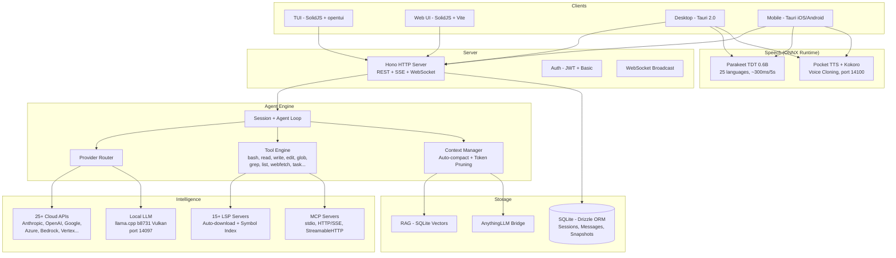

<p align="center">
  <a href="https://opencode.ai">
    <picture>
      <source srcset="packages/console/app/src/asset/logo-ornate-dark.svg" media="(prefers-color-scheme: dark)">
      <source srcset="packages/console/app/src/asset/logo-ornate-light.svg" media="(prefers-color-scheme: light)">
      
    </picture>
  </a>
</p>
<p align="center">오픈 소스 AI 코딩 에이전트.</p>
<p align="center">
  <a href="https://opencode.ai/discord"></a>
  <a href="https://www.npmjs.com/package/opencode-ai"></a>
  <a href="https://github.com/anomalyco/opencode/actions/workflows/publish.yml"></a>
</p>

<p align="center">
  <a href="README.md">English</a> |
  <a href="README.zh.md">简体中文</a> |
  <a href="README.zht.md">繁體中文</a> |
  <a href="README.ko.md">한국어</a> |
  <a href="README.de.md">Deutsch</a> |
  <a href="README.es.md">Español</a> |
  <a href="README.fr.md">Français</a> |
  <a href="README.it.md">Italiano</a> |
  <a href="README.da.md">Dansk</a> |
  <a href="README.ja.md">日本語</a> |
  <a href="README.pl.md">Polski</a> |
  <a href="README.ru.md">Русский</a> |
  <a href="README.bs.md">Bosanski</a> |
  <a href="README.ar.md">العربية</a> |
  <a href="README.no.md">Norsk</a> |
  <a href="README.br.md">Português (Brasil)</a> |
  <a href="README.th.md">ไทย</a> |
  <a href="README.tr.md">Türkçe</a> |
  <a href="README.uk.md">Українська</a> |
  <a href="README.bn.md">বাংলা</a> |
  <a href="README.gr.md">Ελληνικά</a> |
  <a href="README.vi.md">Tiếng Việt</a>
</p>

[](https://opencode.ai)

<!-- WHY-FORK-MATRIX -->
## 이 포크를 선택하는 이유

> **요약** — DAG 기반 오케스트레이터, REST 태스크 API, 에이전트별 MCP 스코핑, 9 상태 세션 FSM, 내장 취약점 스캐너 *그리고* 온디바이스 LLM 추론을 지원하는 일급 Android 앱까지 모두 제공하는 유일한 오픈소스 코딩 에이전트입니다. 독점이든 오픈소스든 이 모두를 결합한 다른 CLI는 없습니다.

> See the English [README.md](README.md) for the full positioning prose (vs. vendor-locked CLIs, vs. BYOM peers, vs. specialized CLIs) and architecture diagram.

### Capability matrix — this fork vs. the 2026 landscape

Legend: ✅ shipped · ❌ absent · *partial* limited/incomplete · *plugin* via community add-on · *paid* behind a subscription tier.

#### Orchestration, API surface, governance

| Capability                             | **This fork** | Claude Code | Codex CLI | Gemini CLI | opencode (upstream) | Aider | Goose | Cline | Roo Code | Cursor | Continue | Crush | Qwen Code |
| -------------------------------------- | :-----------: | :---------: | :-------: | :--------: | :-----------------: | :---: | :---: | :---: | :------: | :----: | :------: | :---: | :-------: |
| Open source                            |       ✅       |      ❌      |  partial  |      ✅     |          ✅          |   ✅   |   ✅   |   ✅   |    ✅     |    ❌    |     ✅     |   ✅   |     ✅     |
| BYOM (bring your own model)            |       ✅       |      ❌      |     ❌     |      ❌     |          ✅          |   ✅   |   ✅   |   ✅   |    ✅     |  partial |     ✅     |   ✅   |   partial  |
| Local models (llama.cpp / Ollama)      |       ✅       |      ❌      |     ❌     |      ❌     |          ✅          |   ✅   |   ✅   |   ✅   |    ✅     |    ❌    |     ✅     |   ✅   |     ✅     |
| Parallel agents in isolated worktrees  |    ✅ native   |  ✅ (Teams)  |  partial  |      ❌     |      via plugin     |   ❌   | partial | ✅ (v3.58) | partial | ❌ | ❌ | ❌ |     ❌     |
| Explicit **DAG orchestration**         | ✅ **unique**  |    ad-hoc   |     ❌     |      ❌     |          ❌          |   ❌   | recipes (linear) | ❌ | ❌ | ❌ |     ❌     |   ❌   |     ❌     |
| **REST task API** (programmable)       | ✅ **unique**  | partial (SDK) |  ❌    |      ❌     |          ❌          |   ❌   |   ❌   |   ❌   |    ❌     |    ❌    |     ❌     |   ❌   |     ❌     |
| **TUI task dashboard**                 |       ✅       |      ❌      |     ❌     |      ❌     |       partial       |   ❌   |   ❌   |   ❌   |    ❌     |   n/a   |    n/a    |   ❌   |   partial  |
| MCP support                            | ✅ + **per-agent scoping** | ✅ | ✅ | ✅ | ✅ | via plugins | ✅ | ✅ | ✅ | partial | ✅ |   ❌   |     ✅     |
| **9-state session FSM (persistent)**   | ✅ **unique**  |      ❌      |     ❌     |      ❌     |        basic        |   ❌   |   ❌   |   ❌   |    ❌     |    ❌    |     ❌     |   ❌   |     ❌     |
| Built-in **vulnerability scanner**     | ✅ **unique**  |      ❌      |     ❌     |      ❌     |          ❌          |   ❌   |   ❌   |   ❌   |    ❌     |    ❌    |     ❌     |   ❌   |     ❌     |
| **DLP / secret redaction** before LLM call | ✅         |   partial    |     ❌     |      ❌     |          ❌          |   ❌   |   ❌   |   ❌   |    ❌     |    ❌    |     ❌     |   ❌   |     ❌     |
| **Per-agent tool allow/deny**          |       ✅       |   partial    |     ❌     |      ❌     |        basic        |   ❌   |   ❌   |   ❌   |  partial  |    ❌    |     ❌     |   ❌   |     ❌     |
| Docker sandboxing (opt-in)             |       ✅       |      ❌      |     ✅     |      ❌     |          ❌          |   ❌   |   ❌   |   ❌   |    ❌     |    ❌    |     ❌     |   ❌   |     ❌     |
| Git auto-commits / rollback            |       ✅       |      ✅      |     ✅     |      ✅     |      ✅ (signed)     |   ✅   |   ✅   |   ✅   |    ✅     |    ✅    |     ✅     |   ✅   |     ✅     |

#### Intelligence, context, developer UX

| Capability                             | **This fork** | Claude Code | Codex CLI | Gemini CLI | opencode (upstream) | Aider | Goose | Cline | Roo Code | Cursor | Continue | Crush | Qwen Code |
| -------------------------------------- | :-----------: | :---------: | :-------: | :--------: | :-----------------: | :---: | :---: | :---: | :------: | :----: | :------: | :---: | :-------: |
| LSP integration (go-to-def, diagnostics) | ✅           |   partial    |  partial  |   partial   |          ✅          | partial | partial | ✅   |    ✅     |    ✅    |     ✅     | partial |  partial  |
| Plugin SDK (`@opencode/plugin`)        |       ✅       |   partial    |     ❌     |      ❌     |          ✅          |   ❌   |   ✅   |   ✅   |    ✅     |    ✅    |     ✅     |   ❌   |     ❌     |
| Prompt caching (cloud + local KV)      |       ✅       |      ✅      |     ✅     |      ✅     |          ✅          |   ✅   |   ✅   |   ✅   |    ✅     |    ✅    |     ✅     |   ✅   |     ✅     |
| **Hybrid RAG (BM25 + vector + decay)** | ✅ **unique**  |      ❌      |     ❌     |      ❌     |          ❌          |   ❌   |   ❌   | partial | ❌      |  vector only |  vector only |  ❌   |     ❌     |
| **Memory conflict resolution**         | ✅ **unique**  |      ❌      |     ❌     |      ❌     |          ❌          |   ❌   |   ❌   |   ❌   |    ❌     |    ❌    |     ❌     |   ❌   |     ❌     |
| **Auto-learn** (lesson extraction)     | ✅ **unique**  |      ❌      |     ❌     |      ❌     |          ❌          |   ❌   |   ❌   |   ❌   |    ❌     |    ❌    |     ❌     |   ❌   |     ❌     |
| Auto-compact (AI summarization)        |       ✅       |      ✅      |     ✅     |      ✅     |          ✅          |   ✅   |   ✅   |   ✅   |    ✅     |    ✅    |     ✅     | partial |     ✅     |
| Unified-diff edit engine               |       ✅       |      ✅      |     ✅     |   partial   |          ✅          |   ✅   | partial | partial |    ✅     | partial |  partial  | partial |  partial  |
| ACP (Agent Client Protocol) layer      |       ✅       |      ❌      |     ❌     |      ❌     |        basic        |   ❌   |   ❌   |   ❌   |    ❌     |    ❌    |     ❌     |   ❌   |     ❌     |

#### Platform reach & multimodal

| Capability                             | **This fork** | Claude Code | Codex CLI | Gemini CLI | opencode (upstream) | Aider | Goose | Cline | Roo Code | Cursor | Continue | Crush | Qwen Code |
| -------------------------------------- | :-----------: | :---------: | :-------: | :--------: | :-----------------: | :---: | :---: | :---: | :------: | :----: | :------: | :---: | :-------: |
| First-class **Android app**            | ✅ **unique**  |      ❌      |     ❌     |      ❌     |          ❌          |   ❌   |   ❌   |   ❌   |    ❌     |    ❌    |     ❌     |   ❌   |     ❌     |
| iOS (remote mode)                      |       ✅       |      ❌      |     ❌     |      ❌     |          ❌          |   ❌   |   ❌   |   ❌   |    ❌     |    ❌    |     ❌     |   ❌   |     ❌     |
| Adaptive runtime (VRAM/CPU/thermal)    | ✅ **unique**  |      ❌      |     ❌     |      ❌     |      hardcoded      | hardcoded | hardcoded | hardcoded | hardcoded | n/a | hardcoded | hardcoded | hardcoded |
| **STT** (voice-to-text, built-in)      | ✅ (Parakeet)  |      ❌      |     ❌     |      ❌     |          ❌          |   ❌   |   ❌   | partial  |    ❌     |    ❌    |     ❌     |   ❌   |     ❌     |
| **TTS** (text-to-speech + voice clone) | ✅ (Pocket/Kokoro) |  ❌       |     ❌     |      ❌     |          ❌          |   ❌   |   ❌   |   ❌   |    ❌     |    ❌    |     ❌     |   ❌   |     ❌     |
| **OAuth deep-link callback**           |       ✅       |      ❌      |     ❌     |      ❌     |          ❌          |   ❌   |   ❌   |   ❌   |    ❌     |    ❌    |     ❌     |   ❌   |     ❌     |
| **mDNS service discovery**             | ✅ **unique**  |      ❌      |     ❌     |      ❌     |          ❌          |   ❌   |   ❌   |   ❌   |    ❌     |    ❌    |     ❌     |   ❌   |     ❌     |
| **Upstream branch watcher** (`vcs.branch.behind`) | ✅ **unique** | ❌ |    ❌     |      ❌     |          ❌          |   ❌   |   ❌   |   ❌   |    ❌     |    ❌    |     ❌     |   ❌   |     ❌     |
| **Collaborative mode** (JWT + presence + file-lock) | ✅ | ❌      |     ❌     |      ❌     |          ❌          |   ❌   |   ❌   |   ❌   |    ❌     | partial |     ❌     |   ❌   |     ❌     |
| **AnythingLLM bridge**                 | ✅ **unique**  |      ❌      |     ❌     |      ❌     |          ❌          |   ❌   |   ❌   |   ❌   |    ❌     |    ❌    |     ❌     |   ❌   |     ❌     |
| **GDPR export/erasure route**          | ✅ **unique**  |      ❌      |     ❌     |      ❌     |          ❌          |   ❌   |   ❌   |   ❌   |    ❌     |    ❌    |     ❌     |   ❌   |     ❌     |
| Price                                  |  free + BYOM  |  $20/mo sub |$20/mo sub |  1000/day free | free + BYOM    | free + BYOM | free + BYOM | free + BYOM | free + BYOM | $20/mo sub | free + BYOM | free + BYOM | free + BYOM |

---

## 포크 기능

> 이것은 [anomalyco/opencode](https://github.com/anomalyco/opencode)의 포크로, [Rwanbt](https://github.com/Rwanbt)가 관리합니다.
> 업스트림과 동기화 유지. 최신 변경 사항은 [dev 브랜치](https://github.com/Rwanbt/opencode/tree/dev)를 참조하세요.

#### 로컬 우선 AI

OpenCode는 소비자용 하드웨어(VRAM 8 GB / RAM 16 GB)에서 AI 모델을 로컬 실행하며, 4B~7B 모델은 클라우드 의존성 제로로 동작합니다.

**프롬프트 최적화 (94% 감소)**
- 로컬 모델용 ~1K 토큰 시스템 프롬프트 (클라우드용 ~16K 대비)
- 스켈레톤 도구 스키마 (멀티KB 설명문 대비 1줄 시그니처)
- 7개 도구 화이트리스트 (bash, read, edit, write, glob, grep, question)
- skills 섹션 없음, 최소한의 환경 정보

**추론 엔진 (llama.cpp b8731)**
- Vulkan GPU 백엔드, 첫 모델 로드 시 자동 다운로드
- **런타임 적응형 설정** (`packages/opencode/src/local-llm-server/auto-config.ts`): 감지된 VRAM, 여유 RAM, big.LITTLE CPU 분할, GPU 백엔드 (CUDA/ROCm/Vulkan/Metal/OpenCL), 온도 상태로부터 `n_gpu_layers`, 스레드, batch/ubatch 크기, KV 캐시 양자화, 컨텍스트 크기를 도출합니다. 기존의 하드코딩된 `--n-gpu-layers 99`를 대체 — 4 GB Android는 OOM 종료 대신 CPU 폴백으로 실행되고, 플래그십 데스크톱은 기본 512 대신 조정된 batch 값을 얻습니다.
- `--flash-attn on` — 메모리 효율을 위한 Flash Attention
- `--cache-type-k/v` — Hadamard 회전 KV 캐시; VRAM 여유에 따른 적응형 계층 (f16 / q8_0 / q4_0)
- `--fit on` — 포크 전용 보조 VRAM 조정 (`OPENCODE_LLAMA_ENABLE_FIT=1`로 옵트인)
- 투기적 디코딩 (`--model-draft`) 및 VRAM 가드 (여유 공간 < 1.5 GB 시 자동 비활성화)
- 단일 슬롯 (`-np 1`)으로 메모리 사용량 최소화
- **벤치마크 하니스** (`bun run bench:llm`): 모델별, 실행별 FTL / TPS / 피크 RSS / 총 실행 시간을 재현 가능하게 측정, CI 아카이브용 JSONL 출력

**음성 인식 (Parakeet TDT 0.6B v3 INT8)**
- NVIDIA Parakeet (ONNX Runtime 경유) — 5초 오디오에 ~300ms (18배 실시간)
- 25개 유럽 언어 (영어, 프랑스어, 독일어, 스페인어 등)
- VRAM 제로: CPU 전용 (~700 MB RAM)
- 첫 마이크 사용 시 모델 자동 다운로드 (~460 MB)
- 녹음 중 파형 애니메이션

**텍스트 음성 변환 (Kyutai Pocket TTS)**
- Kyutai(파리)가 개발한 프랑스어 네이티브 TTS, 1억 파라미터
- 8개 내장 음성: Alba, Fantine, Cosette, Eponine, Azelma, Marius, Javert, Jean
- 제로샷 음성 클로닝: WAV 업로드 또는 마이크 녹음
- CPU 전용, ~6배 실시간, 포트 14100 HTTP 서버
- 폴백: Kokoro TTS ONNX 엔진 (54개 음성, 9개 언어, CMUDict G2P)

**모델 관리**
- HuggingFace 검색 (모델별 VRAM/RAM 호환성 배지)
- UI에서 GGUF 모델 다운로드, 로드, 언로드, 삭제
- 사전 큐레이션 카탈로그: Gemma 4 E4B, Qwen 3.5 (4B/2B/0.8B), Phi-4 Mini, Llama 3.2
- 모델 크기에 따른 동적 출력 토큰
- 투기적 디코딩을 위한 드래프트 모델 자동 감지 (0.5B~0.8B)

**구성**
- 프리셋: Fast / Quality / Eco / Long Context (원클릭 최적화)
- 색상 코딩된 사용량 바 (녹색 / 노란색 / 빨간색) 포함 VRAM 모니터링 위젯
- KV 캐시 타입: auto / q8_0 / q4_0 / f16
- GPU 오프로딩: auto / gpu-max / balanced
- 메모리 매핑: auto / on / off
- 웹 검색 토글 (프롬프트 도구 모음의 지구 아이콘)

**에이전트 신뢰성 (로컬 모델)**
- 사전 점검 가드 (코드 수준, 0 토큰): 편집 전 파일 존재 확인, old_string 내용 검증, read-before-edit 강제, 기존 파일에 write 방지
- 무한 루프 자동 차단: 동일 도구 호출 2회 시 오류 주입 (코드 수준 가드, 프롬프트만이 아님)
- 도구 텔레메트리: 세션별 성공/오류율 및 도구별 분석 자동 로깅
- 목표: 4B 모델에서 >85% 도구 성공률

**크로스 플랫폼**: Windows (Vulkan), Linux, macOS, Android

#### 백그라운드 작업

서브에이전트에 비동기 작업을 위임합니다. task 도구에서 `mode: "background"`를 설정하면 에이전트가 백그라운드에서 작업하는 동안 `task_id`가 즉시 반환됩니다. 수명 주기 추적을 위해 버스 이벤트(`TaskCreated`, `TaskCompleted`, `TaskFailed`)가 발행됩니다.

#### 에이전트 팀

`team` 도구를 사용하여 여러 에이전트를 병렬로 오케스트레이션합니다. 의존성 엣지를 가진 하위 작업을 정의하면 `computeWaves()`가 DAG를 구축하고 독립적인 작업을 동시에 실행합니다(최대 5개 병렬 에이전트). `max_cost`(달러)와 `max_agents`를 통한 예산 제어. 완료된 작업의 컨텍스트가 의존 작업에 자동으로 전달됩니다.

#### Git Worktree 격리

각 백그라운드 작업은 자동으로 자체 git worktree를 할당받습니다. 워크스페이스는 데이터베이스의 세션에 연결됩니다. 작업이 파일 변경을 생성하지 않으면 worktree가 자동으로 정리됩니다. 컨테이너 없이 git 수준의 격리를 제공합니다.

#### 작업 관리 API

작업 수명 주기 관리를 위한 완전한 REST API:

| Method | Path | Description |
|--------|------|-------------|
| GET | `/task/` | List tasks (filter by parent, status) |
| GET | `/task/:id` | Get task details + status + worktree info |
| GET | `/task/:id/messages` | Retrieve task session messages |
| POST | `/task/:id/cancel` | Cancel a running or queued task |
| POST | `/task/:id/resume` | Resume completed/failed/blocked task |
| POST | `/task/:id/followup` | Send follow-up message to idle task |
| POST | `/task/:id/promote` | Promote background task to foreground |
| GET | `/task/:id/team` | Aggregated team view (costs, diffs per member) |

#### TUI 작업 대시보드

실시간 상태 아이콘으로 활성 백그라운드 작업을 표시하는 사이드바 플러그인:

| Icon | Status |
|------|--------|
| `~` | Running / Retrying |
| `?` | Queued / Awaiting input |
| `!` | Blocked |
| `x` | Failed |
| `*` | Completed |
| `-` | Cancelled |

액션이 포함된 다이얼로그: 작업 세션 열기, 취소, 재개, 후속 메시지 전송, 상태 확인.

#### MCP 에이전트 스코핑

에이전트별 MCP 서버 허용/거부 목록. `opencode.json`의 각 에이전트 `mcp` 필드에서 설정합니다. `toolsForAgent()` 함수가 호출 에이전트의 스코프에 따라 사용 가능한 MCP 도구를 필터링합니다.

```json
{
  "agents": {
    "explore": {
      "mcp": { "deny": ["dangerous-server"] }
    }
  }
}
```

#### 9단계 세션 수명 주기

세션은 9가지 상태 중 하나를 추적하며 데이터베이스에 영속화됩니다:

`idle` · `busy` · `retry` · `queued` · `blocked` · `awaiting_input` · `completed` · `failed` · `cancelled`

영속 상태(`queued`, `blocked`, `awaiting_input`, `completed`, `failed`, `cancelled`)는 데이터베이스 재시작 후에도 유지됩니다. 인메모리 상태(`idle`, `busy`, `retry`)는 재시작 시 초기화됩니다.

#### 오케스트레이터 에이전트

읽기 전용 코디네이터 에이전트(최대 50단계). `task`와 `team` 도구에 접근할 수 있지만 모든 편집 도구는 거부됩니다. 구현을 빌드/범용 에이전트에 위임하고 결과를 종합합니다.

---

## 기술 아키텍처

### 다중 프로바이더 지원

25개 이상의 프로바이더를 기본 지원: Anthropic, OpenAI, Google Gemini, Azure, AWS Bedrock, Vertex AI, OpenRouter, GitHub Copilot, XAI, Mistral, Groq, DeepInfra, Cerebras, Cohere, TogetherAI, Perplexity, Vercel, Venice, GitLab, Gateway, Ollama Cloud, 그리고 모든 OpenAI 호환 엔드포인트 (Ollama, LM Studio, vLLM, LocalAI). 가격 정보는 [models.dev](https://models.dev)에서 제공.

### 에이전트 시스템

| Agent | Mode | Access | Description |
|-------|------|--------|-------------|
| **build** | primary | full | 기본 개발 에이전트 |
| **plan** | primary | read-only | 분석 및 코드 탐색 |
| **general** | subagent | full (no todowrite) | 복잡한 다단계 작업 |
| **explore** | subagent | read-only | 빠른 코드베이스 검색 |
| **orchestrator** | subagent | read-only + task/team | 다중 에이전트 코디네이터 (50단계) |
| **critic** | subagent | read-only + bash + LSP | 코드 리뷰: 버그, 보안, 성능 |
| **tester** | subagent | full (no todowrite) | 테스트 작성 및 실행, 커버리지 확인 |
| **documenter** | subagent | full (no todowrite) | JSDoc, README, 인라인 문서화 |
| compaction | hidden | none | AI 기반 컨텍스트 요약 |
| title | hidden | none | 세션 제목 생성 |
| summary | hidden | none | 세션 요약 |

### LSP 통합

완전한 Language Server Protocol 지원(심볼 인덱싱, 진단, 다중 언어 지원: TypeScript, Deno, Vue 등 확장 가능). 에이전트는 텍스트 검색 대신 LSP 심볼을 통해 코드를 탐색하여 정확한 go-to-definition, find-references, 실시간 타입 오류 감지를 수행합니다.

### MCP 지원

Model Context Protocol 클라이언트 및 서버. stdio, HTTP/SSE, StreamableHTTP 전송 지원. 원격 서버용 OAuth 인증 흐름. 도구, 프롬프트, 리소스 기능. 에이전트별 허용/거부 목록을 통한 스코핑.

### 클라이언트/서버 아키텍처

Hono 기반 REST API(타입 라우트 및 OpenAPI 사양 생성). PTY(의사 터미널)용 WebSocket 지원. 실시간 이벤트 스트리밍용 SSE. Basic 인증, CORS, gzip 압축. TUI는 하나의 프런트엔드이며, 서버는 모든 HTTP 클라이언트, 웹 UI, 모바일 앱에서 구동 가능합니다.

### 컨텍스트 관리

토큰 사용량이 모델의 컨텍스트 한도에 도달하면 AI 기반 요약을 통한 자동 압축. 설정 가능한 임계값(`PRUNE_MINIMUM` 20KB, `PRUNE_PROTECT` 40KB)으로 토큰 인식 프루닝. skill 도구 출력은 프루닝에서 보호됩니다.

### 편집 엔진

hunk 검증이 포함된 unified diff 패치. 파일 전체 덮어쓰기가 아닌 특정 파일 영역에 타겟 hunk 적용. 여러 파일에 걸친 일괄 작업을 위한 multi-edit 도구.

### 권한 시스템

와일드카드 패턴 매칭을 지원하는 3단계 권한(`allow` / `deny` / `ask`). 세밀한 제어를 위한 100개 이상의 bash 명령어 arity 정의. 워크스페이스 외부의 파일 접근을 차단하는 프로젝트 경계 적용.

### Git 기반 롤백

각 도구 실행 전 파일 상태를 기록하는 스냅샷 시스템. diff 계산과 함께 `revert` 및 `unrevert` 지원. 메시지 단위 또는 세션 단위로 변경 사항을 롤백할 수 있습니다.

### 비용 추적

메시지별 비용과 전체 토큰 분석(input, output, reasoning, cache read, cache write). 팀별 예산 한도(`max_cost`). 모델별, 일별 집계가 가능한 `stats` 명령어. TUI에서 세션 비용 실시간 표시. 가격 데이터는 models.dev에서 제공.

### 플러그인 시스템

훅 아키텍처를 갖춘 완전한 SDK(`@opencode/plugin`). npm 패키지 또는 파일 시스템에서 동적 로딩. Codex, GitHub Copilot, GitLab, Poe 인증을 위한 내장 플러그인.

---

## 흔한 오해

본 프로젝트에 대한 AI 생성 요약으로 인한 혼란을 방지하기 위해:

- **TUI는 TypeScript**로 작성되었습니다(SolidJS + @opentui 터미널 렌더링). Rust가 아닙니다.
- **Tree-sitter**는 TUI 구문 강조 및 bash 명령어 파싱에만 사용되며, 에이전트 수준의 코드 분석에는 사용되지 않습니다.
- **Docker 샌드박싱**은 선택 사항입니다(`experimental.sandbox.type: "docker"`). 기본 격리는 git worktree입니다.
- **RAG**은 선택 사항입니다(`experimental.rag.enabled: true`). 기본 컨텍스트는 LSP 심볼 인덱싱 + 자동 압축으로 관리됩니다.
- **자동 수정을 제안하는 "워치 모드"는 없습니다** -- 파일 워처는 인프라 목적으로만 존재합니다.
- **자기 수정**은 표준 에이전트 루프(LLM이 도구 결과의 오류를 확인하고 재시도)를 사용하며, 전문화된 자동 복구 메커니즘이 아닙니다.

## 기능 매트릭스

### 코어 에이전트 기능
| 기능 | Status | Notes |
|------|--------|-------|
| Background tasks | Implemented | `mode: "background"` on task tool |
| Agent teams (DAG) | Implemented | Wave-based parallel execution, budget control |
| Git worktree isolation | Implemented | Auto-created per background task |
| Task REST API | Implemented | 8 endpoints for full lifecycle |
| TUI task dashboard | Implemented | Sidebar + dialog actions |
| MCP agent scoping | Implemented | Per-agent allow/deny config |
| 9-state lifecycle | Implemented | Persistent to SQLite |
| Orchestrator agent | Implemented | Read-only coordinator |
| Multi-provider (25+) | Implemented | Including local models via OpenAI-compatible API |
| LSP integration | Implemented | Symbols, diagnostics, multi-language |
| MCP protocol | Implemented | Client + server, 3 transports |
| Plugin system | Implemented | SDK + hook architecture |
| Cost tracking | Implemented | Per-message, per-team, per-model |
| Context auto-compact | Implemented | AI summarization + pruning |
| Git rollback/snapshots | Implemented | Revert/unrevert per message |
| Specialized agents | Implemented | critic, tester, documenter subagents |
| Dry run / command preview | Implemented | `dry_run` param on bash/edit/write tools |
| Auto-learn | Implemented | Post-session lesson extraction to `.opencode/learnings/` |
| Web search | Implemented | Globe toggle in prompt toolbar |

### 로컬 AI (데스크톱 + 모바일)
| 기능 | Status | Notes |
|------|--------|-------|
| Local LLM (llama.cpp b8731) | Implemented | Vulkan GPU, auto-download runtime, `--fit` auto-VRAM |
| **런타임 적응형 설정** | Implemented | `auto-config.ts`: 감지된 VRAM, RAM, big.LITTLE, GPU 백엔드, 온도 상태에서 n_gpu_layers / 스레드 / batch / KV 양자화 도출 |
| **벤치마크 하니스** | Implemented | `bun run bench:llm`은 모델별 FTL, TPS, 피크 RSS, 총 실행 시간을 측정; JSONL 출력 |
| Flash Attention | Implemented | `--flash-attn on` on desktop and mobile |
| KV cache quantization | Implemented | q4_0 / q8_0 / f16 adaptive with Hadamard rotation (72% memory savings) |
| Exact tokenizer (OpenAI) | Implemented | gpt-*/o1/o3/o4용 `js-tiktoken`; Llama/Qwen/Gemma용 경험적 3.5 문자/토큰 |
| Speculative decoding | Implemented | VRAM Guard (desktop) / RAM Guard (mobile), draft model auto-detection |
| VRAM / RAM monitoring | Implemented | Desktop: nvidia-smi, Mobile: `/proc/meminfo` |
| Configuration presets | Implemented | Fast / Quality / Eco / Long Context |
| HuggingFace model search | Implemented | Zod 검증 응답, VRAM 배지, 다운로드 매니저, 9개 사전 선별 모델 |
| **재개 가능한 GGUF 다운로드** | Implemented | HTTP `Range` 헤더 — 4G 중단이 4 GB 전송을 처음부터 다시 시작하지 않음 |
| STT (Parakeet TDT 0.6B) | Implemented | ONNX Runtime, ~300ms/5s, 25개 언어, 데스크톱 + 모바일 (마이크 리스너 양쪽 모두 연결됨) |
| TTS (Pocket TTS) | Implemented | 8개 음성, 제로샷 음성 복제, 프랑스어 네이티브 (데스크톱 전용 — Android에는 Python 사이드카 없음) |
| TTS (Kokoro) | Implemented | 54개 음성, 9개 언어, **데스크톱 + Android**에서 ONNX (모바일 `speech.rs`에 6개 Tauri 명령 연결, CPUExecutionProvider) |
| Prompt reduction (94%) | Implemented | ~1K tokens vs ~16K for cloud, skeleton tool schemas |
| Pre-flight guards | Implemented | File-exists, old_string verification, read-before-edit, write-on-existing (code-level, 0 tokens) |
| Doom loop auto-break | Implemented | Auto-injects error on 2x identical calls (code-level, not prompt) |
| Tool telemetry | Implemented | Per-session success/error rate logging with per-tool breakdown |
| 회로 차단기 재시작 | Implemented | `ensureCorrectModel`은 120초 내 3회 재시작 후 중단하여 번 사이클 루프 방지 |

### 보안 및 거버넌스
| 기능 | Status | Notes |
|------|--------|-------|
| Docker sandboxing | Implemented | Optional via `experimental.sandbox.type: "docker"` |
| Vulnerability scanner | Implemented | Auto-scan on edit/write for secrets, injections, unsafe patterns |
| DLP / AgentShield | Implemented | `experimental.dlp.enabled: true`, redacts secrets before LLM calls |
| Policy engine | Implemented | `experimental.policy.enabled: true`, conditional rules + custom policies |
| **엄격한 CSP (데스크톱 + 모바일)** | Implemented | `connect-src`는 loopback + HuggingFace + HTTPS 공급자로 범위 제한; `unsafe-eval` 없음, `object-src 'none'`, `frame-ancestors 'none'` |
| **Android 릴리스 하드닝** | Implemented | `isDebuggable=false`, `allowBackup=false`, `isShrinkResources=true`, `FOREGROUND_SERVICE_TYPE_SPECIAL_USE` |
| **데스크톱 릴리스 하드닝** | Implemented | devtools가 더 이상 강제로 활성화되지 않음 — Tauri 2 기본값(디버그 전용)이 복원되어 XSS 발판이 프로덕션의 `__TAURI__`에 연결될 수 없음 |
| **Tauri 명령 입력 검증** | Implemented | `download_model` / `load_llm_model` / `delete_model` 가드: 파일명 charset, `huggingface.co` / `hf.co`로의 HTTPS 허용 목록 |
| **Rust 로깅 체인** | Implemented | 모바일에서 `log` + `android_logger`; 릴리스에서 `eprintln!` 없음 → logcat으로의 경로/URL 누출 없음 |
| **보안 감사 트래커** | Implemented | [`SECURITY_AUDIT.md`](SECURITY_AUDIT.md) — 모든 발견 항목을 `path:line`, 상태, 연기된 수정 근거와 함께 S1/S2/S3로 분류 |

### 지식 및 메모리
| 기능 | Status | Notes |
|------|--------|-------|
| Vector DB / RAG | Implemented | `experimental.rag.enabled: true`, SQLite + cosine similarity |
| Confidence/decay | Implemented | Time-based scoring for RAG embeddings, exponential decay |
| Memory conflict resolution | Implemented | Detects and resolves duplicate/contradictory embeddings |

### 플랫폼 확장 (실험적)
| 기능 | Status | Notes |
|------|--------|-------|
| Mobile app (Tauri) | Implemented | Android: 내장 런타임, 온디바이스 LLM, STT + TTS (Kokoro). iOS: 원격 모드 |
| **OAuth 콜백 딥 링크** | Implemented | `opencode://oauth/callback?providerID=…&code=…&state=…`가 토큰 교환을 자동으로 완료; 인증 코드 복사-붙여넣기 불필요 |
| **업스트림 브랜치 감시기** | Implemented | 주기적인 `git fetch` (워밍업 30초, 간격 5분)가 로컬 HEAD가 추적된 업스트림에서 분기될 때 `vcs.branch.behind` 발생; 데스크톱과 모바일에서 `platform.notify()`로 표시 |
| **뷰포트 크기 PTY 스폰** | Implemented | `Pty.create({cols, rows})`가 `window.innerWidth/innerHeight`의 추정기를 사용 — 셸이 80×24→36×11 대신 최종 치수로 시작, mksh/bash에서 Android 첫 프롬프트 비표시 버그 수정 |
| Collaborative mode | Experimental | JWT auth, presence, file locking, WebSocket broadcast |
| AnythingLLM bridge | Experimental | MCP adapter, context injection, vector store bridge |
| Per-message token display | Partial | Stored in DB, shown as session aggregate |

---

## 아키텍처



### 서비스 포트

| Service | Port | Protocol |
|---------|------|----------|
| OpenCode Server | 4096 | HTTP (REST + SSE + WebSocket) |
| LLM (llama-server) | 14097 | HTTP (OpenAI-compatible) |
| TTS (pocket-tts) | 14100 | HTTP (FastAPI) |

## 보안 및 거버넌스

| 기능 | 설명 |
|------|------|
| **샌드박스** | 선택적 Docker 실행 (`experimental.sandbox.type: "docker"`) 또는 프로젝트 경계 적용이 포함된 호스트 모드 |
| **권한** | 3단계 시스템 (`allow` / `deny` / `ask`), 와일드카드 패턴 매칭. 세밀한 제어를 위한 100개 이상의 bash 명령어 정의 |
| **DLP** | 데이터 손실 방지 (`experimental.dlp`), LLM 프로바이더에 전송하기 전 시크릿, API 키, 자격 증명 비식별화 |
| **정책 엔진** | 조건부 규칙 (`experimental.policy`), `block` 또는 `warn` 액션. 경로 보호, 편집 크기 제한, 사용자 정의 정규식 패턴 |
| **프라이버시** | 로컬 우선: 모든 데이터는 디스크의 SQLite에 저장. 기본적으로 텔레메트리 없음. 시크릿은 로그에 기록되지 않음. 구성된 LLM 프로바이더 외에 데이터 전송 없음 |

## 인텔리전스 인터페이스

| 기능 | 설명 |
|------|------|
| **MCP 준수** | 완전한 Model Context Protocol 지원 — 클라이언트/서버 모드, 에이전트별 허용/거부 목록을 통한 도구 스코핑 |
| **컨텍스트 파일** | `.opencode/` 디렉터리, `opencode.jsonc` 구성 파일. YAML 프런트매터가 포함된 마크다운으로 정의된 에이전트. `instructions` 구성을 통한 사용자 정의 지침 |
| **프로바이더 라우터** | `Provider.parseModel("provider/model")`로 25개 이상의 프로바이더. 자동 폴백, 비용 추적, 토큰 인식 라우팅 |
| **RAG 시스템** | 선택적 로컬 벡터 검색 (`experimental.rag`), 구성 가능한 임베딩 모델 (OpenAI/Google). 수정된 파일 자동 인덱싱 |
| **AnythingLLM 브리지** | 선택적 통합 (`experimental.anythingllm`) — 컨텍스트 주입, MCP 서버 어댑터, 벡터 스토어 브리지, Agent Skills HTTP API |

---

## 기능 브랜치 (`dev`에 구현 완료)

3개의 주요 기능이 전용 브랜치에서 구현되어 `dev`에 머지되었습니다. 각각 기능 게이트가 적용되어 하위 호환성을 유지합니다.

### 협업 모드 (`dev_collaborative_mode`)

다중 사용자 실시간 협업. 구현 내용:
- **JWT 인증** — HMAC-SHA256 토큰, 리프레시 로테이션, Basic 인증과 하위 호환
- **사용자 관리** — 등록, 역할 (admin/member/viewer), RBAC 적용
- **WebSocket 브로드캐스트** — GlobalBus → Broadcast 배선을 통한 실시간 이벤트 스트리밍
- **프레즌스 시스템** — 30초 하트비트를 통한 온라인/유휴/자리비움 상태
- **파일 잠금** — edit/write 도구에서의 낙관적 잠금 및 충돌 감지
- **프런트엔드** — 로그인 폼, 프레즌스 인디케이터, 옵저버 배지, WebSocket 훅

설정: `experimental.collaborative.enabled: true`

### 모바일 버전 (`dev_mobile`)

Tauri 2.0을 통한 Android/iOS 네이티브 앱, **임베디드 런타임** — 단일 APK, 외부 의존성 제로. 구현 내용:

**레이어 1 — 임베디드 런타임 (Android, 100% 네이티브 성능):**
- **APK 내 정적 바이너리** — Bun, Git, Bash, Ripgrep (aarch64-linux-musl), 첫 실행 시 추출 (~15초)
- **번들 CLI** — 임베디드 Bun으로 실행되는 JS 번들로서의 OpenCode CLI, 코어 기능에 네트워크 불필요
- **직접 프로세스 생성** — Termux 없음, intent 없음 — Rust에서 직접 `std::process::Command`
- **서버 자동 시작** — `bun opencode-cli.js serve`, 데스크톱 사이드카와 동일한 UUID 인증 포함 localhost

**레이어 2 — 온디바이스 LLM 추론:**
- **JNI를 통한 llama.cpp** — Kotlin LlamaEngine이 JNI 브리지로 네이티브 .so 라이브러리 로드
- **파일 기반 IPC** — Rust가 `llm_ipc/request`에 명령 기록, Kotlin 데몬이 폴링하여 결과 반환
- **llama-server** — 포트 14097의 OpenAI 호환 HTTP API (프로바이더 통합용)
- **모델 관리** — HuggingFace에서 GGUF 모델 다운로드, 로드/언로드/삭제, 9개 사전 큐레이션 모델
- **프로바이더 등록** — 로컬 모델이 모델 선택기에서 "Local AI" 프로바이더로 표시
- **Flash Attention** — 메모리 효율적 추론을 위한 `--flash-attn on`
- **KV 캐시 양자화** — Hadamard 회전 포함 `--cache-type-k/v q4_0` (72% 메모리 절약)
- **투기적 디코딩** — `/proc/meminfo`를 통한 RAM 가드 포함 드래프트 모델 자동 감지 (0.5B~0.8B)
- **RAM 모니터링** — `/proc/meminfo`를 통한 디바이스 메모리 위젯 (전체/사용/여유)
- **구성 프리셋** — 데스크톱과 동일한 Fast/Quality/Eco/Long Context 프리셋
- **스마트 GPU 선택** — Adreno 730+ (SD 8 Gen 1+)에 Vulkan, 이전 SoC에 OpenCL, CPU 폴백
- **빅코어 고정** — ARM big.LITTLE 토폴로지 감지, 추론을 성능 코어에만 고정

**레이어 3 — 확장 환경 (선택적 다운로드, ~150MB):**
- **proot + Alpine rootfs** — 추가 패키지용 `apt install` 포함 완전한 Linux
- **바인드 마운트된 레이어 1** — Bun/Git/rg는 proot 내에서도 네이티브 속도로 실행
- **온디맨드** — 설정에서 "확장 환경"을 활성화할 때만 다운로드

**레이어 4 — 음성 및 미디어:**
- **STT (Parakeet TDT 0.6B)** — 데스크톱과 동일한 ONNX Runtime 엔진, ~300ms/5s 오디오, 25개 언어
- **파형 애니메이션** — 녹음 중 시각적 피드백
- **네이티브 파일 피커** — 파일/디렉터리 선택 및 첨부 파일용 `tauri-plugin-dialog`

**공통 (Android + iOS):**
- **플랫폼 추상화** — `"mobile"` + `"ios"/"android"` OS 감지를 포함한 확장 `Platform` 타입
- **원격 연결** — 네트워크를 통해 데스크톱 OpenCode 서버에 연결 (iOS 전용 또는 Android 폴백)
- **인터랙티브 터미널** — 커스텀 musl `librust_pty.so` (forkpty 래퍼)를 통한 완전한 PTY, canvas 폴백 포함 Ghostty WASM 렌더러
- **외부 스토리지** — 서버 HOME에서 `/sdcard/` 디렉터리 (Documents, Downloads, projects)로의 심볼릭 링크
- **모바일 UI** — 반응형 사이드바, 터치 최적화 메시지 입력, 모바일 diff 뷰, 44px 터치 타겟, 세이프 영역 지원
- **푸시 알림** — 백그라운드 작업 완료를 위한 SSE-to-네이티브 알림 브리지
- **모드 선택기** — 첫 실행 시 Local (Android) 또는 Remote (iOS + Android) 선택
- **모바일 액션 메뉴** — 세션 헤더에서 터미널, 포크, 검색, 설정에 빠른 접근

### AnythingLLM Fusion (`dev_anything`)

OpenCode와 AnythingLLM의 문서 RAG 플랫폼 간의 브리지. 구현 내용:
- **REST 클라이언트** — AnythingLLM 워크스페이스, 문서, 검색, 채팅용 완전한 API 래퍼
- **MCP 서버 어댑터** — 4개 도구: `anythingllm_search`, `anythingllm_list_workspaces`, `anythingllm_get_document`, `anythingllm_chat`
- **플러그인 컨텍스트 주입** — `experimental.chat.system.transform` 훅이 관련 문서를 시스템 프롬프트에 주입
- **Agent Skills HTTP API** — `GET /agent-skills` + `POST /agent-skills/:toolId/execute`로 OpenCode 도구를 AnythingLLM에 노출
- **벡터 스토어 브리지** — 로컬 SQLite RAG와 AnythingLLM 벡터 DB 결과를 병합하는 복합 검색
- **Docker Compose** — 공유 네트워크 포함 `docker-compose.anythingllm.yml`

설정: `experimental.anythingllm.enabled: true`

---

### 설치

```bash
# YOLO
curl -fsSL https://opencode.ai/install | bash

# 패키지 매니저
npm i -g opencode-ai@latest        # bun/pnpm/yarn 도 가능
scoop install opencode             # Windows
choco install opencode             # Windows
brew install anomalyco/tap/opencode # macOS 및 Linux (권장, 항상 최신)
brew install opencode              # macOS 및 Linux (공식 brew formula, 업데이트 빈도 낮음)
sudo pacman -S opencode            # Arch Linux (Stable)
paru -S opencode-bin               # Arch Linux (Latest from AUR)
mise use -g opencode               # 어떤 OS든
nix run nixpkgs#opencode           # 또는 github:anomalyco/opencode 로 최신 dev 브랜치
```

> [!TIP]
> 설치 전에 0.1.x 보다 오래된 버전을 제거하세요.

### 데스크톱 앱 (BETA)

OpenCode 는 데스크톱 앱으로도 제공됩니다. [releases page](https://github.com/anomalyco/opencode/releases) 에서 직접 다운로드하거나 [opencode.ai/download](https://opencode.ai/download) 를 이용하세요.

| 플랫폼                | 다운로드                              |
| --------------------- | ------------------------------------- |
| macOS (Apple Silicon) | `opencode-desktop-darwin-aarch64.dmg` |
| macOS (Intel)         | `opencode-desktop-darwin-x64.dmg`     |
| Windows               | `opencode-desktop-windows-x64.exe`    |
| Linux                 | `.deb`, `.rpm`, 또는 AppImage         |

```bash
# macOS (Homebrew)
brew install --cask opencode-desktop
# Windows (Scoop)
scoop bucket add extras; scoop install extras/opencode-desktop
```

#### 설치 디렉터리

설치 스크립트는 설치 경로를 다음 우선순위로 결정합니다.

1. `$OPENCODE_INSTALL_DIR` - 사용자 지정 설치 디렉터리
2. `$XDG_BIN_DIR` - XDG Base Directory Specification 준수 경로
3. `$HOME/bin` - 표준 사용자 바이너리 디렉터리 (존재하거나 생성 가능할 경우)
4. `$HOME/.opencode/bin` - 기본 폴백

```bash
# 예시
OPENCODE_INSTALL_DIR=/usr/local/bin curl -fsSL https://opencode.ai/install | bash
XDG_BIN_DIR=$HOME/.local/bin curl -fsSL https://opencode.ai/install | bash
```

### Agents

OpenCode 에는 내장 에이전트 2개가 있으며 `Tab` 키로 전환할 수 있습니다.

- **build** - 기본값, 개발 작업을 위한 전체 권한 에이전트
- **plan** - 분석 및 코드 탐색을 위한 읽기 전용 에이전트
  - 기본적으로 파일 편집을 거부
  - bash 명령 실행 전에 권한을 요청
  - 낯선 코드베이스를 탐색하거나 변경을 계획할 때 적합

또한 복잡한 검색과 여러 단계 작업을 위한 **general** 서브 에이전트가 포함되어 있습니다.
내부적으로 사용되며, 메시지에서 `@general` 로 호출할 수 있습니다.

[agents](https://opencode.ai/docs/agents) 에 대해 더 알아보세요.

### 문서

OpenCode 설정에 대한 자세한 내용은 [**문서**](https://opencode.ai/docs) 를 참고하세요.

### 기여하기

OpenCode 에 기여하고 싶다면, Pull Request 를 제출하기 전에 [contributing docs](./CONTRIBUTING.md) 를 읽어주세요.

### OpenCode 기반으로 만들기

OpenCode 와 관련된 프로젝트를 진행하면서 이름에 "opencode"(예: "opencode-dashboard" 또는 "opencode-mobile") 를 포함한다면, README 에 해당 프로젝트가 OpenCode 팀이 만든 것이 아니며 어떤 방식으로도 우리와 제휴되어 있지 않다는 점을 명시해 주세요.

### FAQ

#### Claude Code 와는 무엇이 다른가요?

기능 면에서는 Claude Code 와 매우 유사합니다. 주요 차이점은 다음과 같습니다.

- 100% 오픈 소스
- 특정 제공자에 묶여 있지 않습니다. [OpenCode Zen](https://opencode.ai/zen) 을 통해 제공하는 모델을 권장하지만, OpenCode 는 Claude, OpenAI, Google 또는 로컬 모델과도 사용할 수 있습니다. 모델이 발전하면서 격차는 줄고 가격은 내려가므로 provider-agnostic 인 것이 중요합니다.
- 기본으로 제공되는 LSP 지원
- TUI 에 집중. OpenCode 는 neovim 사용자와 [terminal.shop](https://terminal.shop) 제작자가 만들었으며, 터미널에서 가능한 것의 한계를 밀어붙입니다.
- 클라이언트/서버 아키텍처. 예를 들어 OpenCode 를 내 컴퓨터에서 실행하면서 모바일 앱으로 원격 조작할 수 있습니다. 즉, TUI 프런트엔드는 가능한 여러 클라이언트 중 하나일 뿐입니다.

---

**커뮤니티에 참여하기** [Discord](https://discord.gg/opencode) | [X.com](https://x.com/opencode)
