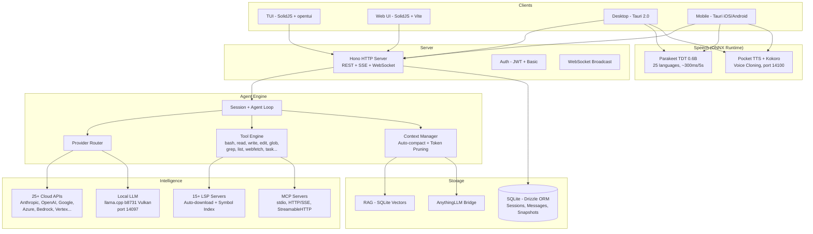

<p align="center">
  <a href="https://opencode.ai">
    <picture>
      <source srcset="packages/console/app/src/asset/logo-ornate-dark.svg" media="(prefers-color-scheme: dark)">
      <source srcset="packages/console/app/src/asset/logo-ornate-light.svg" media="(prefers-color-scheme: light)">
      
    </picture>
  </a>
</p>
<p align="center">The open source AI coding agent.</p>
<p align="center">
  <a href="https://opencode.ai/discord"></a>
  <a href="https://www.npmjs.com/package/opencode-ai"></a>
  <a href="https://github.com/anomalyco/opencode/actions/workflows/publish.yml"></a>
</p>

<p align="center">
  <a href="README.md">English</a> |
  <a href="README.zh.md">简体中文</a> |
  <a href="README.zht.md">繁體中文</a> |
  <a href="README.ko.md">한국어</a> |
  <a href="README.de.md">Deutsch</a> |
  <a href="README.es.md">Español</a> |
  <a href="README.fr.md">Français</a> |
  <a href="README.it.md">Italiano</a> |
  <a href="README.da.md">Dansk</a> |
  <a href="README.ja.md">日本語</a> |
  <a href="README.pl.md">Polski</a> |
  <a href="README.ru.md">Русский</a> |
  <a href="README.bs.md">Bosanski</a> |
  <a href="README.ar.md">العربية</a> |
  <a href="README.no.md">Norsk</a> |
  <a href="README.br.md">Português (Brasil)</a> |
  <a href="README.th.md">ไทย</a> |
  <a href="README.tr.md">Türkçe</a> |
  <a href="README.uk.md">Українська</a> |
  <a href="README.bn.md">বাংলা</a> |
  <a href="README.gr.md">Ελληνικά</a> |
  <a href="README.vi.md">Tiếng Việt</a>
</p>

[](https://opencode.ai)

---

## Fork Features

> This is a fork of [anomalyco/opencode](https://github.com/anomalyco/opencode) maintained by [Rwanbt](https://github.com/Rwanbt).
> Kept in sync with upstream. See [dev branch](https://github.com/Rwanbt/opencode/tree/dev) for latest changes.

#### Local-First AI

OpenCode runs AI models locally on consumer hardware (8 GB VRAM / 16 GB RAM), with zero cloud dependency for 4B–7B models.

**Prompt Optimization (94% reduction)**
- ~1K token system prompt for local models (vs ~16K for cloud)
- Skeleton tool schemas (1-line signatures vs multi-KB prose)
- 7-tool whitelist (bash, read, edit, write, glob, grep, question)
- No skills section, minimal environment info

**Inference Engine (llama.cpp b8731)**
- Vulkan GPU backend, auto-downloaded on first model load
- **Runtime adaptive config** (`packages/opencode/src/local-llm-server/auto-config.ts`): `n_gpu_layers`, threads, batch/ubatch size, KV cache quant and context size derived from detected VRAM, free RAM, big.LITTLE CPU split, GPU backend (CUDA/ROCm/Vulkan/Metal/OpenCL) and thermal state. Replaces the old hardcoded `--n-gpu-layers 99` — a 4 GB Android now runs in CPU fallback instead of OOM-killing, flagship desktops get tuned batch instead of the 512 default.
- `--flash-attn on` — Flash Attention for memory efficiency
- `--cache-type-k/v` — Hadamard rotation KV cache; adaptive tier (f16 / q8_0 / q4_0) based on VRAM headroom
- `--fit on` — fork-only secondary VRAM adjustment (opt-in via `OPENCODE_LLAMA_ENABLE_FIT=1`)
- Speculative decoding (`--model-draft`) with VRAM Guard (auto-disables if < 1.5 GB free)
- Single slot (`-np 1`) to minimize memory footprint
- **Benchmark harness** (`bun run bench:llm`): reproducible FTL / TPS / peak RSS / wall-time measurement per model, per run, JSONL output for CI archival

**Speech-to-Text (Parakeet TDT 0.6B v3 INT8)**
- NVIDIA Parakeet via ONNX Runtime — ~300ms for 5s of audio (18x real-time)
- 25 European languages (English, French, German, Spanish, etc.)
- Zero VRAM: CPU-only (~700 MB RAM)
- Auto-download model (~460 MB) on first mic press
- Waveform animation during recording

**Text-to-Speech (Kyutai Pocket TTS)**
- French-native TTS created by Kyutai (Paris), 100M parameters
- 8 built-in voices: Alba, Fantine, Cosette, Eponine, Azelma, Marius, Javert, Jean
- Zero-shot voice cloning: upload WAV or record from mic
- CPU-only, ~6x real-time, HTTP server on port 14100
- Fallback: Kokoro TTS ONNX engine (54 voices, 9 languages, CMUDict G2P)

**Model Management**
- HuggingFace search with VRAM/RAM compatibility badges per model
- Download, load, unload, delete GGUF models from the UI
- Pre-curated catalog: Gemma 4 E4B, Qwen 3.5 (4B/2B/0.8B), Phi-4 Mini, Llama 3.2
- Dynamic output tokens based on model size
- Draft model auto-detection (0.5B–0.8B) for speculative decoding

**Configuration**
- Presets: Fast / Quality / Eco / Long Context (one-click optimization)
- VRAM monitoring widget with color-coded usage bar (green / yellow / red)
- KV cache type: auto / q8_0 / q4_0 / f16
- GPU offloading: auto / gpu-max / balanced
- Memory mapping: auto / on / off
- Web search toggle (globe icon in prompt toolbar)

**Agent Reliability (local models)**
- Pre-flight guards (code-level, 0 tokens): file-exists check before edit, old_string content verification, read-before-edit enforcement, write-on-existing prevention
- Doom loop auto-break: 2x identical tool calls → error injected (code-level guard, not prompt-only)
- Tool telemetry: per-session success/error rate with per-tool breakdown, logged automatically
- Target: >85% tool success rate on 4B models

**Cross-platform**: Windows (Vulkan), Linux, macOS, Android

#### Background Tasks

Delegate work to subagents that run asynchronously. Set `mode: "background"` on the task tool and it returns a `task_id` immediately while the agent works in the background. Bus events (`TaskCreated`, `TaskCompleted`, `TaskFailed`) are published for lifecycle tracking.

#### Agent Teams

Orchestrate multiple agents in parallel using the `team` tool. Define sub-tasks with dependency edges; `computeWaves()` builds a DAG and executes independent tasks concurrently (up to 5 parallel agents). Budget control via `max_cost` (dollars) and `max_agents`. Context from completed tasks is automatically passed to dependents.

#### Git Worktree Isolation

Each background task automatically gets its own git worktree. The workspace is linked to the session in the database. If a task produces no file changes, the worktree is cleaned up automatically. This provides git-level isolation without containers.

#### Task Management API

Full REST API for task lifecycle management:

| Method | Path | Description |
|--------|------|-------------|
| GET | `/task/` | List tasks (filter by parent, status) |
| GET | `/task/:id` | Get task details + status + worktree info |
| GET | `/task/:id/messages` | Retrieve task session messages |
| POST | `/task/:id/cancel` | Cancel a running or queued task |
| POST | `/task/:id/resume` | Resume completed/failed/blocked task |
| POST | `/task/:id/followup` | Send follow-up message to idle task |
| POST | `/task/:id/promote` | Promote background task to foreground |
| GET | `/task/:id/team` | Aggregated team view (costs, diffs per member) |

#### TUI Task Dashboard

Sidebar plugin showing active background tasks with real-time status icons:

| Icon | Status |
|------|--------|
| `~` | Running / Retrying |
| `?` | Queued / Awaiting input |
| `!` | Blocked |
| `x` | Failed |
| `*` | Completed |
| `-` | Cancelled |

Dialog with actions: open task session, cancel, resume, send follow-up, check status.

#### MCP Agent Scoping

Per-agent allow/deny lists for MCP servers. Configure in `opencode.json` under each agent's `mcp` field. The `toolsForAgent()` function filters available MCP tools based on the calling agent's scope.

```json
{
  "agents": {
    "explore": {
      "mcp": { "deny": ["dangerous-server"] }
    }
  }
}
```

#### 9-State Session Lifecycle

Sessions track one of 9 states, persisted to the database:

`idle` · `busy` · `retry` · `queued` · `blocked` · `awaiting_input` · `completed` · `failed` · `cancelled`

Persistent states (`queued`, `blocked`, `awaiting_input`, `completed`, `failed`, `cancelled`) survive database restarts. In-memory states (`idle`, `busy`, `retry`) reset on restart.

#### Orchestrator Agent

Read-only coordinator agent (50 max steps). Has access to `task` and `team` tools but all edit tools are denied. Delegates implementation to build/general agents and synthesizes results.

---

## Technical Architecture

### Multi-Provider Support

25+ providers out of the box: Anthropic, OpenAI, Google Gemini, Azure, AWS Bedrock, Vertex AI, OpenRouter, GitHub Copilot, XAI, Mistral, Groq, DeepInfra, Cerebras, Cohere, TogetherAI, Perplexity, Vercel, Venice, GitLab, Gateway, Ollama Cloud, plus any OpenAI-compatible endpoint (Ollama, LM Studio, vLLM, LocalAI). Pricing sourced from [models.dev](https://models.dev).

### Agent System

| Agent | Mode | Access | Description |
|-------|------|--------|-------------|
| **build** | primary | full | Default development agent |
| **plan** | primary | read-only | Analysis and code exploration |
| **general** | subagent | full (no todowrite) | Complex multi-step tasks |
| **explore** | subagent | read-only | Fast codebase search |
| **orchestrator** | subagent | read-only + task/team | Multi-agent coordinator (50 steps) |
| **critic** | subagent | read-only + bash + LSP | Code review: bugs, security, performance |
| **tester** | subagent | full (no todowrite) | Write and run tests, verify coverage |
| **documenter** | subagent | full (no todowrite) | JSDoc, README, inline documentation |
| compaction | hidden | none | AI-driven context summarization |
| title | hidden | none | Session title generation |
| summary | hidden | none | Session summarization |

### LSP Integration

Full Language Server Protocol support with symbol indexing, diagnostics, and multi-language support (TypeScript, Deno, Vue, and extensible). The agent navigates code via LSP symbols rather than text search, enabling precise go-to-definition, find-references, and real-time type error detection.

### MCP Support

Model Context Protocol client and server. Supports stdio, HTTP/SSE, and StreamableHTTP transports. OAuth authentication flow for remote servers. Tool, prompt, and resource capabilities. Per-agent scoping via allow/deny lists.

### Client/Server Architecture

Hono-based REST API with typed routes and OpenAPI spec generation. WebSocket support for PTY (pseudo-terminal). SSE for real-time event streaming. Basic auth, CORS, gzip compression. The TUI is one frontend; the server can be driven from any HTTP client, the web UI, or a mobile app.

### Context Management

Auto-compact with AI-driven summarization when token usage approaches the model's context limit. Token-aware pruning with configurable thresholds (`PRUNE_MINIMUM` 20KB, `PRUNE_PROTECT` 40KB). Skill tool outputs are protected from pruning.

### Edit Engine

Unified diff patching with hunk verification. Applies targeted hunks to specific file regions rather than full-file overwrites. Multi-edit tool for batch operations across files.

### Permission System

3-state permissions (`allow` / `deny` / `ask`) with wildcard pattern matching. 100+ bash command arity definitions for fine-grained control. Project boundary enforcement prevents file access outside the workspace.

### Git-Backed Rollback

Snapshot system that records file state before each tool execution. Supports `revert` and `unrevert` with diff computation. Changes can be rolled back per-message or per-session.

### Cost Tracking

Per-message cost with full token breakdown (input, output, reasoning, cache read, cache write). Per-team budget limits (`max_cost`). `stats` command with per-model and per-day aggregation. Real-time session cost displayed in TUI. Pricing data fetched from models.dev.

### Plugin System

Full SDK (`@opencode/plugin`) with hook architecture. Dynamic loading from npm packages or filesystem. Built-in plugins for Codex, GitHub Copilot, GitLab, and Poe authentication.

---

## Common Misconceptions

To prevent confusion from AI-generated summaries of this project:

- The **TUI is TypeScript** (SolidJS + @opentui for terminal rendering), not Rust.
- **Tree-sitter** is used for TUI syntax highlighting and bash command parsing only, not for agent-level code analysis.
- **Docker sandboxing** is optional (`experimental.sandbox.type: "docker"`); default isolation is via git worktrees.
- **RAG** is optional (`experimental.rag.enabled: true`); default context is managed via LSP symbol indexing + auto-compact.
- There is **no "watch mode" that proposes automatic fixes** -- the file watcher exists for infrastructure purposes only.
- **Self-correction** uses the standard agent loop (the LLM sees errors in tool results and retries), not a specialized auto-repair mechanism.

## Capabilities Matrix

### Core Agent Features
| Capability | Status | Notes |
|-----------|--------|-------|
| Background tasks | Implemented | `mode: "background"` on task tool |
| Agent teams (DAG) | Implemented | Wave-based parallel execution, budget control |
| Git worktree isolation | Implemented | Auto-created per background task |
| Task REST API | Implemented | 8 endpoints for full lifecycle |
| TUI task dashboard | Implemented | Sidebar + dialog actions |
| MCP agent scoping | Implemented | Per-agent allow/deny config |
| 9-state lifecycle | Implemented | Persistent to SQLite |
| Orchestrator agent | Implemented | Read-only coordinator |
| Multi-provider (25+) | Implemented | Including local models via OpenAI-compatible API |
| LSP integration | Implemented | Symbols, diagnostics, multi-language |
| MCP protocol | Implemented | Client + server, 3 transports |
| Plugin system | Implemented | SDK + hook architecture |
| Cost tracking | Implemented | Per-message, per-team, per-model |
| Context auto-compact | Implemented | AI summarization + pruning |
| Git rollback/snapshots | Implemented | Revert/unrevert per message |
| Specialized agents | Implemented | critic, tester, documenter subagents |
| Dry run / command preview | Implemented | `dry_run` param on bash/edit/write tools |
| Auto-learn | Implemented | Post-session lesson extraction to `.opencode/learnings/` |
| Web search | Implemented | Globe toggle in prompt toolbar |

### Local AI (Desktop + Mobile)
| Capability | Status | Notes |
|-----------|--------|-------|
| Local LLM (llama.cpp b8731) | Implemented | Vulkan GPU, auto-download runtime, `--fit` auto-VRAM |
| **Adaptive runtime config** | Implemented | `auto-config.ts`: n_gpu_layers / threads / batch / KV quant derived from detected VRAM, RAM, big.LITTLE, GPU backend, thermal state |
| **Benchmark harness** | Implemented | `bun run bench:llm` measures FTL, TPS, peak RSS, wall per model; JSONL output |
| Flash Attention | Implemented | `--flash-attn on` on desktop and mobile |
| KV cache quantization | Implemented | q4_0 / q8_0 / f16 adaptive with Hadamard rotation (72% memory savings) |
| Exact tokenizer (OpenAI) | Implemented | `js-tiktoken` for gpt-*/o1/o3/o4; empirical 3.5 chars/token for Llama/Qwen/Gemma |
| Speculative decoding | Implemented | VRAM Guard (desktop) / RAM Guard (mobile), draft model auto-detection |
| VRAM / RAM monitoring | Implemented | Desktop: nvidia-smi, Mobile: `/proc/meminfo` |
| Configuration presets | Implemented | Fast / Quality / Eco / Long Context |
| HuggingFace model search | Implemented | Zod-validated response, VRAM badges, download manager, 9 pre-curated models |
| **Resumable GGUF downloads** | Implemented | HTTP `Range` header — 4G interruption doesn't restart a 4 GB transfer from zero |
| STT (Parakeet TDT 0.6B) | Implemented | ONNX Runtime, ~300ms/5s, 25 languages, desktop + mobile (mic listener wired both sides) |
| TTS (Pocket TTS) | Implemented | 8 voices, zero-shot voice cloning, French-native (desktop only — no Python sidecar on Android) |
| TTS (Kokoro) | Implemented | 54 voices, 9 languages, ONNX on **desktop + Android** (6 Tauri commands wired in `speech.rs` mobile, CPUExecutionProvider) |
| Prompt reduction (94%) | Implemented | ~1K tokens vs ~16K for cloud, skeleton tool schemas |
| Pre-flight guards | Implemented | File-exists, old_string verification, read-before-edit, write-on-existing (code-level, 0 tokens) |
| Doom loop auto-break | Implemented | Auto-injects error on 2x identical calls (code-level, not prompt) |
| Tool telemetry | Implemented | Per-session success/error rate logging with per-tool breakdown |
| Circuit breaker restart | Implemented | `ensureCorrectModel` bails after 3 restarts in 120 s to avoid burn-cycle loops |

### Security & Governance
| Capability | Status | Notes |
|-----------|--------|-------|
| Docker sandboxing | Implemented | Optional via `experimental.sandbox.type: "docker"` |
| Vulnerability scanner | Implemented | Auto-scan on edit/write for secrets, injections, unsafe patterns |
| DLP / AgentShield | Implemented | `experimental.dlp.enabled: true`, redacts secrets before LLM calls |
| Policy engine | Implemented | `experimental.policy.enabled: true`, conditional rules + custom policies |
| **Strict CSP (desktop + mobile)** | Implemented | `connect-src` scoped to loopback + HuggingFace + HTTPS providers; no `unsafe-eval`, `object-src 'none'`, `frame-ancestors 'none'` |
| **Android release hardening** | Implemented | `isDebuggable=false`, `allowBackup=false`, `isShrinkResources=true`, `FOREGROUND_SERVICE_TYPE_SPECIAL_USE` |
| **Desktop release hardening** | Implemented | Devtools no longer force-enabled — Tauri 2 default (debug-only) restored so an XSS foothold cannot attach to `__TAURI__` in production |
| **Tauri command input validation** | Implemented | `download_model` / `load_llm_model` / `delete_model` guards: filename charset, HTTPS allowlist to `huggingface.co` / `hf.co` |
| **Rust logging chain** | Implemented | `log` + `android_logger` on mobile; no `eprintln!` in release → no path/URL leaks to logcat |
| **Security audit tracker** | Implemented | [`SECURITY_AUDIT.md`](SECURITY_AUDIT.md) — all findings classified S1/S2/S3 with `path:line`, status, and deferred fix rationale |

### Knowledge & Memory
| Capability | Status | Notes |
|-----------|--------|-------|
| Vector DB / RAG | Implemented | `experimental.rag.enabled: true`, SQLite + cosine similarity |
| Confidence/decay | Implemented | Time-based scoring for RAG embeddings, exponential decay |
| Memory conflict resolution | Implemented | Detects and resolves duplicate/contradictory embeddings |

### Platform Extensions (Experimental)
| Capability | Status | Notes |
|-----------|--------|-------|
| Mobile app (Tauri) | Implemented | Android: embedded runtime, on-device LLM, STT + TTS (Kokoro). iOS: remote mode |
| **OAuth callback deep link** | Implemented | `opencode://oauth/callback?providerID=…&code=…&state=…` auto-finalises the token exchange; no copy-paste of the auth code required |
| **Upstream branch watcher** | Implemented | Periodic `git fetch` (warm-up 30 s, interval 5 min) emits `vcs.branch.behind` when local HEAD diverges from tracked upstream; surfaced via `platform.notify()` on desktop and mobile |
| **Viewport-sized PTY spawn** | Implemented | `Pty.create({cols, rows})` uses an estimator from `window.innerWidth/innerHeight` — shells start at their final dimensions instead of 80×24→36×11, fixes the Android first-prompt-invisible bug on mksh/bash |
| Collaborative mode | Experimental | JWT auth, presence, file locking, WebSocket broadcast |
| AnythingLLM bridge | Experimental | MCP adapter, context injection, vector store bridge |
| Per-message token display | Partial | Stored in DB, shown as session aggregate |

---

## Architecture



### Service Ports

| Service | Port | Protocol |
|---------|------|----------|
| OpenCode Server | 4096 | HTTP (REST + SSE + WebSocket) |
| LLM (llama-server) | 14097 | HTTP (OpenAI-compatible) |
| TTS (pocket-tts) | 14100 | HTTP (FastAPI) |

## Security & Governance

| Feature | Description |
|---------|-------------|
| **Sandbox** | Optional Docker execution (`experimental.sandbox.type: "docker"`) or host mode with project boundary enforcement |
| **Permissions** | 3-state system (`allow` / `deny` / `ask`) with wildcard pattern matching. 100+ bash command definitions for fine-grained control |
| **DLP** | Data Loss Prevention (`experimental.dlp`) redacts secrets, API keys, and credentials before sending to LLM providers |
| **Policy Engine** | Conditional rules (`experimental.policy`) with `block` or `warn` actions. Protect paths, limit edit size, custom regex patterns |
| **Privacy** | Local-first: all data in SQLite on disk. No telemetry by default. Secrets never logged. No data sent to third parties beyond the configured LLM provider |

## Intelligence Interface

| Feature | Description |
|---------|-------------|
| **MCP Compliant** | Full Model Context Protocol support — client and server modes, per-agent tool scoping via allow/deny lists |
| **Context Files** | `.opencode/` directory with `opencode.jsonc` config. Agents defined as markdown with YAML frontmatter. Custom instructions via `instructions` config |
| **Provider Router** | 25+ providers via `Provider.parseModel("provider/model")`. Automatic fallback, cost tracking, token-aware routing |
| **RAG System** | Optional local vector search (`experimental.rag`) with configurable embedding models (OpenAI/Google). Auto-indexes modified files |
| **AnythingLLM Bridge** | Optional integration (`experimental.anythingllm`) — context injection, MCP server adapter, vector store bridge, Agent Skills HTTP API |

---

## Feature Branches (Implemented on `dev`)

Three major features have been implemented on dedicated branches and merged into `dev`. Each is feature-gated and backward-compatible.

### Collaborative Mode (`dev_collaborative_mode`)

Multi-user real-time collaboration. Implemented:
- **JWT authentication** — HMAC-SHA256 tokens with refresh rotation, backward-compatible with basic auth
- **User management** — Registration, roles (admin/member/viewer), RBAC enforcement
- **WebSocket broadcast** — Real-time event streaming via GlobalBus → Broadcast wiring
- **Presence system** — Online/idle/away status with 30s heartbeat
- **File locking** — Optimistic locks on edit/write tools with conflict detection
- **Frontend** — Login form, presence indicator, observer badge, WebSocket hooks

Config: `experimental.collaborative.enabled: true`

### Mobile Version (`dev_mobile`)

Native Android/iOS app via Tauri 2.0 with **embedded runtime** — a single APK, zero external dependencies. Implemented:

**Layer 1 — Embedded Runtime (Android, 100% native performance):**
- **Static binaries in APK** — Bun, Git, Bash, Ripgrep (aarch64-linux-musl) extracted at first launch (~15s)
- **Bundled CLI** — OpenCode CLI as a JS bundle run by the embedded Bun, no network required for core
- **Direct process spawning** — No Termux, no intents — `std::process::Command` from Rust directly
- **Auto-start server** — `bun opencode-cli.js serve` on localhost with UUID auth, same as desktop sidecar

**Layer 2 — On-Device LLM Inference:**
- **llama.cpp via JNI** — Kotlin LlamaEngine loads native .so libraries with JNI bridge
- **File-based IPC** — Rust writes commands to `llm_ipc/request`, Kotlin daemon polls and returns results
- **llama-server** — OpenAI-compatible HTTP API on port 14097 for provider integration
- **Model management** — Download GGUF models from HuggingFace, load/unload/delete, 9 pre-curated models
- **Provider registration** — Local model appears as "Local AI" provider in model selector
- **Flash Attention** — `--flash-attn on` for memory-efficient inference
- **KV cache quantization** — `--cache-type-k/v q4_0` with Hadamard rotation (72% memory savings)
- **Speculative decoding** — Auto-detects draft model (0.5B–0.8B) with RAM Guard via `/proc/meminfo`
- **RAM monitoring** — Device memory widget (total/used/free) via `/proc/meminfo`
- **Configuration presets** — Same Fast/Quality/Eco/Long Context presets as desktop
- **Smart GPU selection** — Vulkan for Adreno 730+ (SD 8 Gen 1+), OpenCL for older SoCs, CPU fallback
- **Big-core pinning** — Detects ARM big.LITTLE topology, pins inference to performance cores only

**Layer 3 — Extended Environment (optional download, ~150MB):**
- **proot + Alpine rootfs** — Full Linux with `apt install` for additional packages
- **Bind-mounted Layer 1** — Bun/Git/rg still run at native speed inside proot
- **On-demand** — Downloaded only when user enables "Extended Environment" in settings

**Layer 4 — Speech & Media:**
- **STT (Parakeet TDT 0.6B)** — Same ONNX Runtime engine as desktop, ~300ms/5s audio, 25 languages
- **Waveform animation** — Visual feedback during recording
- **Native file picker** — `tauri-plugin-dialog` for file/directory selection and attachments

**Shared (Android + iOS):**
- **Platform abstraction** — Extended `Platform` type with `"mobile"` + `"ios"/"android"` OS detection
- **Remote connection** — Connect to desktop OpenCode server over network (iOS-only or Android fallback)
- **Interactive terminal** — Full PTY via custom musl `librust_pty.so` (forkpty wrapper), Ghostty WASM renderer with canvas fallback
- **External storage** — Symlinks from server HOME to `/sdcard/` directories (Documents, Downloads, projects)
- **Mobile UI** — Responsive sidebar, touch-optimized message input, mobile diff view, 44px touch targets, safe area support
- **Push notifications** — SSE-to-native notification bridge for background task completion
- **Mode selector** — Choose Local (Android) or Remote (iOS + Android) on first launch
- **Mobile action menu** — Quick access to terminal, fork, search, and settings from session header

### AnythingLLM Fusion (`dev_anything`)

Bridge between OpenCode and AnythingLLM's document RAG platform. Implemented:
- **REST client** — Full API wrapper for AnythingLLM workspaces, documents, search, chat
- **MCP server adapter** — 4 tools: `anythingllm_search`, `anythingllm_list_workspaces`, `anythingllm_get_document`, `anythingllm_chat`
- **Plugin context injection** — `experimental.chat.system.transform` hook injects relevant docs into system prompt
- **Agent Skills HTTP API** — `GET /agent-skills` + `POST /agent-skills/:toolId/execute` to expose OpenCode tools to AnythingLLM
- **Vector store bridge** — Composite search merging local SQLite RAG with AnythingLLM vector DB results
- **Docker Compose** — Ready-to-use `docker-compose.anythingllm.yml` with shared network

Config: `experimental.anythingllm.enabled: true`

---

### Installation

```bash
# YOLO
curl -fsSL https://opencode.ai/install | bash

# Package managers
npm i -g opencode-ai@latest        # or bun/pnpm/yarn
scoop install opencode             # Windows
choco install opencode             # Windows
brew install anomalyco/tap/opencode # macOS and Linux (recommended, always up to date)
brew install opencode              # macOS and Linux (official brew formula, updated less)
sudo pacman -S opencode            # Arch Linux (Stable)
paru -S opencode-bin               # Arch Linux (Latest from AUR)
mise use -g opencode               # Any OS
nix run nixpkgs#opencode           # or github:anomalyco/opencode for latest dev branch
```

> [!TIP]
> Remove versions older than 0.1.x before installing.

### Desktop App (BETA)

OpenCode is also available as a desktop application. Download directly from the [releases page](https://github.com/anomalyco/opencode/releases) or [opencode.ai/download](https://opencode.ai/download).

| Platform              | Download                              |
| --------------------- | ------------------------------------- |
| macOS (Apple Silicon) | `opencode-desktop-darwin-aarch64.dmg` |
| macOS (Intel)         | `opencode-desktop-darwin-x64.dmg`     |
| Windows               | `opencode-desktop-windows-x64.exe`    |
| Linux                 | `.deb`, `.rpm`, or AppImage           |

```bash
# macOS (Homebrew)
brew install --cask opencode-desktop
# Windows (Scoop)
scoop bucket add extras; scoop install extras/opencode-desktop
```

#### Installation Directory

The install script respects the following priority order for the installation path:

1. `$OPENCODE_INSTALL_DIR` - Custom installation directory
2. `$XDG_BIN_DIR` - XDG Base Directory Specification compliant path
3. `$HOME/bin` - Standard user binary directory (if it exists or can be created)
4. `$HOME/.opencode/bin` - Default fallback

```bash
# Examples
OPENCODE_INSTALL_DIR=/usr/local/bin curl -fsSL https://opencode.ai/install | bash
XDG_BIN_DIR=$HOME/.local/bin curl -fsSL https://opencode.ai/install | bash
```

### Agents

OpenCode includes two built-in agents you can switch between with the `Tab` key.

- **build** - Default, full-access agent for development work
- **plan** - Read-only agent for analysis and code exploration
  - Denies file edits by default
  - Asks permission before running bash commands
  - Ideal for exploring unfamiliar codebases or planning changes

Also included is a **general** subagent for complex searches and multistep tasks.
This is used internally and can be invoked using `@general` in messages.

Learn more about [agents](https://opencode.ai/docs/agents).

### Documentation

For more info on how to configure OpenCode, [**head over to our docs**](https://opencode.ai/docs).

### Contributing

If you're interested in contributing to OpenCode, please read our [contributing docs](./CONTRIBUTING.md) before submitting a pull request.

### Building on OpenCode

If you are working on a project that's related to OpenCode and is using "opencode" as part of its name, for example "opencode-dashboard" or "opencode-mobile", please add a note to your README to clarify that it is not built by the OpenCode team and is not affiliated with us in any way.

### FAQ

#### How is this different from Claude Code?

It's very similar to Claude Code in terms of capability. Here are the key differences:

- 100% open source
- Not coupled to any provider. Although we recommend the models we provide through [OpenCode Zen](https://opencode.ai/zen), OpenCode can be used with Claude, OpenAI, Google, or even local models. As models evolve, the gaps between them will close and pricing will drop, so being provider-agnostic is important.
- Out-of-the-box LSP support
- A focus on TUI. OpenCode is built by neovim users and the creators of [terminal.shop](https://terminal.shop); we are going to push the limits of what's possible in the terminal.
- A client/server architecture. This, for example, can allow OpenCode to run on your computer while you drive it remotely from a mobile app, meaning that the TUI frontend is just one of the possible clients.

---

**Join our community** [Discord](https://discord.gg/opencode) | [X.com](https://x.com/opencode)
