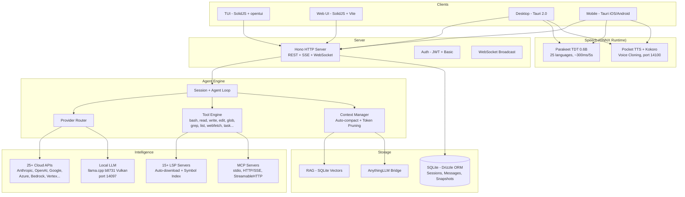

<p align="center">
  <a href="https://opencode.ai">
    <picture>
      <source srcset="packages/console/app/src/asset/logo-ornate-dark.svg" media="(prefers-color-scheme: dark)">
      <source srcset="packages/console/app/src/asset/logo-ornate-light.svg" media="(prefers-color-scheme: light)">
      
    </picture>
  </a>
</p>
<p align="center">Otwartoźródłowy agent kodujący AI.</p>
<p align="center">
  <a href="https://opencode.ai/discord"></a>
  <a href="https://www.npmjs.com/package/opencode-ai"></a>
  <a href="https://github.com/Rwanbt/opencode/actions/workflows/fork-release.yml"></a>
</p>

<p align="center">
  <a href="README.md">English</a> |
  <a href="README.zh.md">简体中文</a> |
  <a href="README.zht.md">繁體中文</a> |
  <a href="README.ko.md">한국어</a> |
  <a href="README.de.md">Deutsch</a> |
  <a href="README.es.md">Español</a> |
  <a href="README.fr.md">Français</a> |
  <a href="README.it.md">Italiano</a> |
  <a href="README.da.md">Dansk</a> |
  <a href="README.ja.md">日本語</a> |
  <a href="README.pl.md">Polski</a> |
  <a href="README.ru.md">Русский</a> |
  <a href="README.bs.md">Bosanski</a> |
  <a href="README.ar.md">العربية</a> |
  <a href="README.no.md">Norsk</a> |
  <a href="README.br.md">Português (Brasil)</a> |
  <a href="README.th.md">ไทย</a> |
  <a href="README.tr.md">Türkçe</a> |
  <a href="README.uk.md">Українська</a> |
  <a href="README.bn.md">বাংলা</a> |
  <a href="README.gr.md">Ελληνικά</a> |
  <a href="README.vi.md">Tiếng Việt</a>
</p>

[](https://opencode.ai)

<!-- WHY-FORK-MATRIX -->
## Dlaczego ten fork?

> **W skrócie** — jedyny open source'owy agent kodujący, który dostarcza orkiestratora opartego na DAG, REST API zadań, scoping MCP per agent, FSM sesji z 9 stanami, wbudowany skaner podatności *oraz* pierwszoligową aplikację Android z wnioskowaniem LLM na urządzeniu. Żaden inny CLI — zamknięty ani otwarty — nie łączy tego wszystkiego.

> See the English [README.md](README.md) for the full positioning prose (vs. vendor-locked CLIs, vs. BYOM peers, vs. specialized CLIs) and architecture diagram.

### Capability matrix — this fork vs. the 2026 landscape

Legend: ✅ shipped · ❌ absent · *partial* limited/incomplete · *plugin* via community add-on · *paid* behind a subscription tier.

#### Orchestration, API surface, governance

| Capability                             | **This fork** | Claude Code | Codex CLI | Gemini CLI | opencode (upstream) | Aider | Goose | Cline | Roo Code | Cursor | Continue | Crush | Qwen Code |
| -------------------------------------- | :-----------: | :---------: | :-------: | :--------: | :-----------------: | :---: | :---: | :---: | :------: | :----: | :------: | :---: | :-------: |
| Open source                            |       ✅       |      ❌      |  partial  |      ✅     |          ✅          |   ✅   |   ✅   |   ✅   |    ✅     |    ❌    |     ✅     |   ✅   |     ✅     |
| BYOM (bring your own model)            |       ✅       |      ❌      |     ❌     |      ❌     |          ✅          |   ✅   |   ✅   |   ✅   |    ✅     |  partial |     ✅     |   ✅   |   partial  |
| Local models (llama.cpp / Ollama)      |       ✅       |      ❌      |     ❌     |      ❌     |          ✅          |   ✅   |   ✅   |   ✅   |    ✅     |    ❌    |     ✅     |   ✅   |     ✅     |
| Parallel agents in isolated worktrees  |    ✅ native   |  ✅ (Teams)  |  partial  |      ❌     |      via plugin     |   ❌   | partial | ✅ (v3.58) | partial | ❌ | ❌ | ❌ |     ❌     |
| Explicit **DAG orchestration**         | ✅ **unique**  |    ad-hoc   |     ❌     |      ❌     |          ❌          |   ❌   | recipes (linear) | ❌ | ❌ | ❌ |     ❌     |   ❌   |     ❌     |
| **REST task API** (programmable)       | ✅ **unique**  | partial (SDK) |  ❌    |      ❌     |          ❌          |   ❌   |   ❌   |   ❌   |    ❌     |    ❌    |     ❌     |   ❌   |     ❌     |
| **TUI task dashboard**                 |       ✅       |      ❌      |     ❌     |      ❌     |       partial       |   ❌   |   ❌   |   ❌   |    ❌     |   n/a   |    n/a    |   ❌   |   partial  |
| MCP support                            | ✅ + **per-agent scoping** | ✅ | ✅ | ✅ | ✅ | via plugins | ✅ | ✅ | ✅ | partial | ✅ |   ❌   |     ✅     |
| **9-state session FSM**                | ✅ **unique** (6/9 persisted) | ❌ |     ❌     |      ❌     |        basic        |   ❌   |   ❌   |   ❌   |    ❌     |    ❌    |     ❌     |   ❌   |     ❌     |
| Built-in **vulnerability scanner**     | ✅ **unique**  |      ❌      |     ❌     |      ❌     |          ❌          |   ❌   |   ❌   |   ❌   |    ❌     |    ❌    |     ❌     |   ❌   |     ❌     |
| **DLP / secret redaction** before LLM call | ✅         |   partial    |     ❌     |      ❌     |          ❌          |   ❌   |   ❌   |   ❌   |    ❌     |    ❌    |     ❌     |   ❌   |     ❌     |
| **Per-agent tool allow/deny**          |       ✅       |   partial    |     ❌     |      ❌     |        basic        |   ❌   |   ❌   |   ❌   |  partial  |    ❌    |     ❌     |   ❌   |     ❌     |
| Docker sandboxing (bash only) | ✅ bash-only | ❌         |     ✅     |      ❌     |          ❌          |   ❌   |   ❌   |   ❌   |    ❌     |    ❌    |     ❌     |   ❌   |     ❌     |
| Git auto-commits / rollback            |       ✅       |      ✅      |     ✅     |      ✅     |      ✅ (signed)     |   ✅   |   ✅   |   ✅   |    ✅     |    ✅    |     ✅     |   ✅   |     ✅     |

#### Intelligence, context, developer UX

| Capability                             | **This fork** | Claude Code | Codex CLI | Gemini CLI | opencode (upstream) | Aider | Goose | Cline | Roo Code | Cursor | Continue | Crush | Qwen Code |
| -------------------------------------- | :-----------: | :---------: | :-------: | :--------: | :-----------------: | :---: | :---: | :---: | :------: | :----: | :------: | :---: | :-------: |
| LSP integration (go-to-def, diagnostics) | ✅           |   partial    |  partial  |   partial   |          ✅          | partial | partial | ✅   |    ✅     |    ✅    |     ✅     | partial |  partial  |
| Plugin SDK (`@opencode/plugin`)        |       ✅       |   partial    |     ❌     |      ❌     |          ✅          |   ❌   |   ✅   |   ✅   |    ✅     |    ✅    |     ✅     |   ❌   |     ❌     |
| Prompt caching (cloud + local KV)      |       ✅       |      ✅      |     ✅     |      ✅     |          ✅          |   ✅   |   ✅   |   ✅   |    ✅     |    ✅    |     ✅     |   ✅   |     ✅     |
| **RAG: BM25 or vector (selectable)** + exponential decay | ✅ | ❌  |     ❌     |      ❌     |          ❌          |   ❌   |   ❌   | vector only | ❌      |  vector only |  vector only |  ❌   |     ❌     |
| **Auto-learn** (requires `learner` agent configured) | opt-in | ❌  |  ❌     |      ❌     |          ❌          |   ❌   |   ❌   |   ❌   |    ❌     |    ❌    |     ❌     |   ❌   |     ❌     |
| Auto-compact (AI summarization)        |       ✅       |      ✅      |     ✅     |      ✅     |          ✅          |   ✅   |   ✅   |   ✅   |    ✅     |    ✅    |     ✅     | partial |     ✅     |
| Unified-diff edit engine               |       ✅       |      ✅      |     ✅     |   partial   |          ✅          |   ✅   | partial | partial |    ✅     | partial |  partial  | partial |  partial  |
| ACP (Agent Client Protocol) layer      |       ✅       |      ❌      |     ❌     |      ❌     |        basic        |   ❌   |   ❌   |   ❌   |    ❌     |    ❌    |     ❌     |   ❌   |     ❌     |

#### Platform reach & multimodal

| Capability                             | **This fork** | Claude Code | Codex CLI | Gemini CLI | opencode (upstream) | Aider | Goose | Cline | Roo Code | Cursor | Continue | Crush | Qwen Code |
| -------------------------------------- | :-----------: | :---------: | :-------: | :--------: | :-----------------: | :---: | :---: | :---: | :------: | :----: | :------: | :---: | :-------: |
| First-class **Android app**            | ✅ **unique**  |      ❌      |     ❌     |      ❌     |          ❌          |   ❌   |   ❌   |   ❌   |    ❌     |    ❌    |     ❌     |   ❌   |     ❌     |
| iOS (remote mode)                      |       ✅       |      ❌      |     ❌     |      ❌     |          ❌          |   ❌   |   ❌   |   ❌   |    ❌     |    ❌    |     ❌     |   ❌   |     ❌     |
| Adaptive runtime (VRAM/CPU, thermal Android-only) | ✅ partial | ❌ |  ❌     |      ❌     |      hardcoded      | hardcoded | hardcoded | hardcoded | hardcoded | n/a | hardcoded | hardcoded | hardcoded |
| **STT** (voice-to-text, Parakeet) | ✅ desktop + mobile | ❌ |     ❌     |      ❌     |          ❌          |   ❌   |   ❌   | partial  |    ❌     |    ❌    |     ❌     |   ❌   |     ❌     |
| **TTS** (Kokoro desktop + mobile; Pocket desktop only + voice clone) | ✅ | ❌ |    ❌     |      ❌     |          ❌          |   ❌   |   ❌   |   ❌   |    ❌     |    ❌    |     ❌     |   ❌   |     ❌     |
| **OAuth deep-link callback** (Tauri)   |       ✅       |      ❌      |     ❌     |      ❌     |          ❌          |   ❌   |   ❌   |   ❌   |    ❌     |    ❌    |     ❌     |   ❌   |     ❌     |
| **mDNS service discovery** (CLI flag `--mdns`) | opt-in | ❌ |   ❌     |      ❌     |          ❌          |   ❌   |   ❌   |   ❌   |    ❌     |    ❌    |     ❌     |   ❌   |     ❌     |
| **Upstream branch watcher** (`vcs.branch.behind`) | ✅ **unique** | ❌ |    ❌     |      ❌     |          ❌          |   ❌   |   ❌   |   ❌   |    ❌     |    ❌    |     ❌     |   ❌   |     ❌     |
| **Collaborative mode** (JWT + presence + file-lock) | ✅ | ❌      |     ❌     |      ❌     |          ❌          |   ❌   |   ❌   |   ❌   |    ❌     | partial |     ❌     |   ❌   |     ❌     |
| **AnythingLLM bridge**                 | ✅ **unique**  |      ❌      |     ❌     |      ❌     |          ❌          |   ❌   |   ❌   |   ❌   |    ❌     |    ❌    |     ❌     |   ❌   |     ❌     |
| **GDPR export/erasure route**          | ✅ **unique**  |      ❌      |     ❌     |      ❌     |          ❌          |   ❌   |   ❌   |   ❌   |    ❌     |    ❌    |     ❌     |   ❌   |     ❌     |
| Price                                  |  free + BYOM  |  $20/mo sub |$20/mo sub |  1000/day free | free + BYOM    | free + BYOM | free + BYOM | free + BYOM | free + BYOM | $20/mo sub | free + BYOM | free + BYOM | free + BYOM |

---

<!-- ACCORDION-APPLIED -->

<details>
<summary><b>⚡ W skrócie</b></summary>
<br>

## ⚡ W skrócie

OpenCode (fork) — zorkiestrowany agent kodujący AI, który działa na **pulpicie, serwerze i telefonie**, z lokalnymi modelami od początku do końca, zero zależności chmurowych i wbudowanymi prymitywami zarządzania klasy enterprise. Fork [anomalyco/opencode](https://github.com/anomalyco/opencode) utrzymywany przez [Rwanbt](https://github.com/Rwanbt).

### Install

```bash
# CLI (macOS / Linux / Windows)
curl -fsSL https://opencode.ai/install | bash

# Desktop app + Android APK
# → https://github.com/Rwanbt/opencode/releases/latest
```

### 8 rzeczy, które tylko ten fork łączy

|   |   |
| - | - |
| 🤖 **DAG orchestration** | Wave-based parallel agents, up to 5 concurrent |
| 🧠 **Local LLM end-to-end** | llama.cpp + runtime that auto-tunes to your VRAM / CPU |
| 📱 **Android app** | On-device inference, terminal, PTY — single APK |
| 🎙️ **Voice STT / TTS** | Parakeet (25 languages) + Kokoro desktop+mobile / Pocket TTS desktop |
| 🔒 **9-state session FSM** | 6 of 9 states persist to SQLite, audit log survives restart |
| 🔌 **REST task API** | 8 endpoints — drive the agent from cron, Temporal, Airflow |
| 🛡️ **Vulnerability scanner** | Auto-scans every edit / write for secrets & injection sinks |
| 🔍 **RAG: BM25 or vector** | Selectable at index time + exponential confidence decay |

### Uruchom pierwsze zadanie

```bash
opencode                                  # TUI
opencode run "fix the failing test in src/"   # one-shot
```

> 💡 Potrzebujesz szczegółów? Każda sekcja poniżej jest zwinięta — kliknij, aby otworzyć tylko to, co cię interesuje.

---


</details>

<details>
<summary><b>Funkcje Forka</b></summary>
<br>

## Funkcje Forka

> To jest fork [anomalyco/opencode](https://github.com/anomalyco/opencode) utrzymywany przez [Rwanbt](https://github.com/Rwanbt).
> Synchronizowany z upstream. Zobacz [gałąź dev](https://github.com/Rwanbt/opencode/tree/dev), aby poznać najnowsze zmiany.

#### Lokalna AI

OpenCode uruchamia modele AI lokalnie na sprzęcie konsumenckim (8 GB VRAM / 16 GB RAM), bez żadnych zależności od chmury dla modeli 4B-7B.

**Optymalizacja Promptu (redukcja o 94%)**
- Prompt systemowy ~1K tokenów dla modeli lokalnych (vs ~16K dla chmury)
- Szkieletowe schematy narzędzi (1-liniowe sygnatury vs wielokilobajtowe opisy)
- Whitelist 7 narzędzi (bash, read, edit, write, glob, grep, question)
- Brak sekcji skills, minimalne informacje o środowisku

**Silnik Inferencji (llama.cpp b8731)**
- Backend GPU Vulkan, automatycznie pobierany przy pierwszym ładowaniu modelu
- **Adaptacyjna konfiguracja runtime** (`packages/opencode/src/local-llm-server/auto-config.ts`): `n_gpu_layers`, wątki, rozmiar batch/ubatch, kwantyzacja cache KV i rozmiar kontekstu wyprowadzane z wykrytej VRAM, wolnej RAM, podziału CPU big.LITTLE, backendu GPU (CUDA/ROCm/Vulkan/Metal/OpenCL) oraz stanu termicznego. Zastępuje dawne zakodowane na stałe `--n-gpu-layers 99` — 4 GB Android działa teraz w trybie awaryjnym CPU zamiast być zabijany przez OOM, flagowe desktopy otrzymują dostrojony batch zamiast domyślnego 512.
- `--flash-attn on` — Flash Attention dla efektywności pamięci
- `--cache-type-k/v` — Cache KV z rotacją a; adaptacyjny poziom (f16 / q8_0 / q4_0) w zależności od zapasu VRAM
- `--fit on` — wtórna korekta VRAM dostępna tylko w forku (opt-in przez `OPENCODE_LLAMA_ENABLE_FIT=1`)
- Dekodowanie spekulatywne (`--model-draft`) z VRAM Guard (automatyczna dezaktywacja jeśli < 4 GB wolnych)
- Pojedynczy slot (`-np 1`) dla minimalizacji zużycia pamięci
- **Harness benchmarkowy** (`bun run bench:llm`): powtarzalny pomiar FTL / TPS / szczytowego RSS / czasu ściennego dla modelu i na uruchomienie, wyjście JSONL do archiwizacji w CI

**Speech-to-Text (Parakeet TDT 0.6B v3 INT8)**
- NVIDIA Parakeet via ONNX Runtime — ~300ms dla 5s audio (18x czas rzeczywisty)
- 25 języków europejskich (angielski, francuski, niemiecki, hiszpański, itp.)
- Zero VRAM: tylko CPU (~700 MB RAM)
- Automatyczne pobieranie modelu (~460 MB) przy pierwszym naciśnięciu mikrofonu
- Animacja przebiegu fali podczas nagrywania

**Text-to-Speech (Kyutai Pocket TTS)**
- Francuski natywny TTS stworzony przez Kyutai (Paryż), 100M parametrów
- 8 wbudowanych głosów: Alba, Fantine, Cosette, Eponine, Azelma, Marius, Javert, Jean
- Klonowanie głosu zero-shot: prześlij WAV lub nagraj z mikrofonu
- Tylko CPU, ~6x czas rzeczywisty, serwer HTTP na porcie 14100
- Fallback: silnik TTS Kokoro ONNX (54 głosy, 9 języków, CMUDict G2P)

**Zarządzanie Modelami**
- Wyszukiwanie HuggingFace z odznakimi kompatybilności VRAM/RAM per model
- Pobieranie, ładowanie, odładowywanie, usuwanie modeli GGUF z interfejsu
- Prekurowany katalog: Gemma 3 4B, Qwen3 4B/1.7B/0.6B
- Dynamiczne tokeny wyjściowe w zależności od rozmiaru modelu
- Automatyczne wykrywanie modelu draft (0.5B–0.8B) do dekodowania spekulatywnego

**Konfiguracja**
- Presety: Fast / Quality / Eco / Long Context (optymalizacja jednym kliknięciem)
- Widget monitorowania VRAM z kolorowym paskiem użycia (zielony / żółty / czerwony)
- Typ cache KV: auto / q8_0 / q4_0 / f16
- Offloading GPU: auto / gpu-max / balanced
- Memory mapping: auto / on / off
- Przełącznik wyszukiwania web (ikona globu na pasku promptu)

**Niezawodność Agenta (modele lokalne)**
- Kontrole pre-flight (na poziomie kodu, 0 tokenów): sprawdzenie istnienia pliku przed edycją, weryfikacja zawartości old_string, wymuszenie odczytu przed edycją, zapobieganie nadpisywaniu istniejącego pliku
- Automatyczne przerwanie doom loop: 2 identyczne wywołania narzędzi → wstrzyknięty błąd (ochrona na poziomie kodu, nie tylko prompt)
- Telemetria narzędzi: wskaźnik sukcesu/błędów per sesja z rozbiciem per narzędzie, rejestrowane automatycznie

**Wieloplatformowość**: Windows (Vulkan), Linux, macOS, Android

#### Zadania w Tle

Deleguj pracę do subagentów działających asynchronicznie. Ustaw `mode: "background"` w narzędziu task, a natychmiast zwróci `task_id`, podczas gdy agent pracuje w tle. Zdarzenia magistrali (`TaskCreated`, `TaskCompleted`, `TaskFailed`) są publikowane do śledzenia cyklu życia.

#### Zespoły Agentów

Orkiestruj wielu agentów równolegle za pomocą narzędzia `team`. Zdefiniuj podzadania z krawędziami zależności; `computeWaves()` buduje DAG i wykonuje niezależne zadania współbieżnie (do 5 równoległych agentów). Kontrola budżetu przez `max_cost` (dolary) i `max_agents`. Kontekst z ukończonych zadań jest automatycznie przekazywany do zależnych.

#### Izolacja Git Worktree

Każde zadanie w tle automatycznie otrzymuje własne git worktree. Przestrzeń robocza jest powiązana z sesją w bazie danych. Jeśli zadanie nie produkuje zmian w plikach, worktree jest automatycznie czyszczone. Zapewnia to izolację na poziomie git bez kontenerów.

#### API Zarządzania Zadaniami

Pełne REST API do zarządzania cyklem życia zadań:

| Method | Path | Description |
|--------|------|-------------|
| GET | `/task/` | List tasks (filter by parent, status) |
| GET | `/task/:id` | Get task details + status + worktree info |
| GET | `/task/:id/messages` | Retrieve task session messages |
| POST | `/task/:id/cancel` | Cancel a running or queued task |
| POST | `/task/:id/resume` | Resume completed/failed/blocked task |
| POST | `/task/:id/followup` | Send follow-up message to idle task |
| POST | `/task/:id/promote` | Promote background task to foreground |
| GET | `/task/:id/team` | Aggregated team view (costs, diffs per member) |

#### Panel Zadań TUI

Plugin paska bocznego pokazujący aktywne zadania w tle z ikonami statusu w czasie rzeczywistym:

| Icon | Status |
|------|--------|
| `~` | Running / Retrying |
| `?` | Queued / Awaiting input |
| `!` | Blocked |
| `x` | Failed |
| `*` | Completed |
| `-` | Cancelled |

Dialog z akcjami: otwórz sesję zadania, anuluj, wznów, wyślij kontynuację, sprawdź status.

#### Zakres MCP na Agenta

Listy zezwoleń/blokad dla serwerów MCP per agent. Konfiguruj w `opencode.json` pod polem `mcp` każdego agenta. Funkcja `toolsForAgent()` filtruje dostępne narzędzia MCP na podstawie zakresu wywołującego agenta.

```json
{
  "agents": {
    "explore": {
      "mcp": { "deny": ["dangerous-server"] }
    }
  }
}
```

#### 9-stanowy Cykl Życia Sesji

Sesje śledzą jeden z 9 stanów, zapisywanych w bazie danych:

`idle` · `busy` · `retry` · `queued` · `blocked` · `awaiting_input` · `completed` · `failed` · `cancelled`

Stany trwałe (`queued`, `blocked`, `awaiting_input`, `completed`, `failed`, `cancelled`) przetrwają restarty bazy danych. Stany w pamięci (`idle`, `busy`, `retry`) resetują się przy restarcie.

#### Agent Orkiestrator

Agent koordynujący tylko do odczytu (maksymalnie 50 kroków). Ma dostęp do narzędzi `task` i `team`, ale wszystkie narzędzia edycji są zablokowane. Deleguje implementację do agentów build/ogólnych i syntetyzuje wyniki.

---


</details>

<details>
<summary><b>Architektura Techniczna</b></summary>
<br>

## Architektura Techniczna

### Wsparcie dla Wielu Dostawców

25+ dostawców gotowych do użycia: Anthropic, OpenAI, Google Gemini, Azure, AWS Bedrock, Vertex AI, OpenRouter, GitHub Copilot, XAI, Mistral, Groq, DeepInfra, Cerebras, Cohere, TogetherAI, Perplexity, Vercel, Venice, GitLab, Gateway, Ollama Cloud, plus dowolny endpoint kompatybilny z OpenAI (Ollama, LM Studio, vLLM, LocalAI). Ceny pochodzą z [models.dev](https://models.dev).

### System Agentów

| Agent | Mode | Access | Description |
|-------|------|--------|-------------|
| **build** | primary | full | Domyślny agent deweloperski |
| **plan** | primary | read-only | Analiza i eksploracja kodu |
| **general** | subagent | full (no todowrite) | Złożone zadania wieloetapowe |
| **explore** | subagent | read-only | Szybkie przeszukiwanie bazy kodu |
| **orchestrator** | subagent | read-only + task/team | Koordynator wielu agentów (50 kroków) |
| **critic** | subagent | read-only + bash + LSP | Przegląd kodu: błędy, bezpieczeństwo, wydajność |
| **tester** | subagent | full (no todowrite) | Pisanie i uruchamianie testów, weryfikacja pokrycia |
| **documenter** | subagent | full (no todowrite) | JSDoc, README, dokumentacja inline |
| compaction | hidden | none | Podsumowanie kontekstu sterowane przez AI |
| title | hidden | none | Generowanie tytułu sesji |
| summary | hidden | none | Podsumowanie sesji |

### Integracja LSP

Pełne wsparcie dla Language Server Protocol z indeksowaniem symboli, diagnostyką i obsługą wielu języków (TypeScript, Deno, Vue i rozszerzalny). Agent nawiguje po kodzie za pomocą symboli LSP zamiast wyszukiwania tekstowego, umożliwiając precyzyjne go-to-definition, find-references i wykrywanie błędów typów w czasie rzeczywistym.

### Wsparcie MCP

Klient i serwer Model Context Protocol. Obsługuje transporty stdio, HTTP/SSE i StreamableHTTP. Przepływ uwierzytelniania OAuth dla serwerów zdalnych. Możliwości narzędzi, promptów i zasobów. Zakres per-agent za pomocą list allow/deny.

### Architektura Client/Server

API REST oparte na Hono z typowanymi trasami i generowaniem specyfikacji OpenAPI. Obsługa WebSocket dla PTY (pseudo-terminal). SSE do strumieniowania zdarzeń w czasie rzeczywistym. Basic auth, CORS, kompresja gzip. TUI jest jednym frontendem; serwer może być sterowany z dowolnego klienta HTTP, interfejsu webowego lub aplikacji mobilnej.

### Zarządzanie Kontekstem

Auto-compact z podsumowaniem sterowanym przez AI, gdy zużycie tokenów zbliża się do limitu kontekstu modelu. Przycinanie świadome tokenów z konfigurowalnymi progami (`PRUNE_MINIMUM` 20KB, `PRUNE_PROTECT` 40KB). Wyjścia narzędzia Skill są chronione przed przycinaniem.

### Silnik Edycji

Patchowanie unified diff z weryfikacją hunków. Stosuje celowane hunki do określonych regionów pliku zamiast pełnego nadpisywania pliku. Narzędzie multi-edit do operacji wsadowych na wielu plikach.

### System Uprawnień

Uprawnienia 3-stanowe (`allow` / `deny` / `ask`) z dopasowaniem wzorców z użyciem znaków wieloznacznych. 100+ definicji arności komend bash dla precyzyjnej kontroli. Egzekwowanie granic projektu zapobiega dostępowi do plików poza workspace.

### Rollback Oparty na Git

System snapshotów rejestrujący stan plików przed każdym wykonaniem narzędzia. Obsługuje `revert` i `unrevert` z obliczaniem różnic. Zmiany mogą być cofane per wiadomość lub per sesja.

### Śledzenie Kosztów

Koszt per wiadomość z pełnym rozbiciem tokenów (input, output, reasoning, cache read, cache write). Limity budżetu per-team (`max_cost`). Komenda `stats` z agregacją per-model i per-dzień. Koszt sesji w czasie rzeczywistym wyświetlany w TUI. Dane cenowe pobierane z models.dev.

### System Wtyczek

Pełne SDK (`@opencode/plugin`) z architekturą hooków. Dynamiczne ładowanie z pakietów npm lub systemu plików. Wbudowane wtyczki do uwierzytelniania Codex, GitHub Copilot, GitLab i Poe.

---


</details>

<details>
<summary><b>Częste Nieporozumienia</b></summary>
<br>

## Częste Nieporozumienia

Aby zapobiec dezinformacji z podsumowań tego projektu generowanych przez AI:

- **TUI jest w TypeScript** (SolidJS + @opentui do renderowania w terminalu), nie w Rust.
- **Tree-sitter** jest używany tylko do podświetlania składni w TUI i parsowania komend bash, nie do analizy kodu na poziomie agenta.
- **Sandboxing Docker** jest opcjonalny (`experimental.sandbox.type: "docker"`); domyślna izolacja jest przez git worktree.
- **RAG** jest opcjonalny (`experimental.rag.enabled: true`); domyślny kontekst jest zarządzany przez indeksowanie symboli LSP + auto-compact.
- **Nie ma "trybu watch", który proponuje automatyczne poprawki** -- file watcher istnieje wyłącznie do celów infrastrukturalnych.
- **Autokorekta** używa standardowej pętli agenta (LLM widzi błędy w wynikach narzędzi i ponawia próbę), a nie wyspecjalizowanego mechanizmu auto-naprawy.


</details>

<details>
<summary><b>Macierz Możliwości</b></summary>
<br>

## Macierz Możliwości

### Podstawowe Funkcje Agenta
| Capability | Status | Notes |
|-----------|--------|-------|
| Background tasks | Implemented | `mode: "background"` on task tool |
| Agent teams (DAG) | Implemented | Wave-based parallel execution, budget control |
| Git worktree isolation | Implemented | Auto-created per background task |
| Task REST API | Implemented | 8 endpoints for full lifecycle |
| TUI task dashboard | Implemented | Sidebar + dialog actions |
| MCP agent scoping | Implemented | Per-agent allow/deny config |
| 9-state lifecycle | Implemented | Persistent to SQLite |
| Orchestrator agent | Implemented | Read-only coordinator |
| Multi-provider (25+) | Implemented | Including local models via OpenAI-compatible API |
| LSP integration | Implemented | Symbols, diagnostics, multi-language |
| MCP protocol | Implemented | Client + server, 3 transports |
| Plugin system | Implemented | SDK + hook architecture |
| Cost tracking | Implemented | Per-message, per-team, per-model |
| Context auto-compact | Implemented | AI summarization + pruning |
| Git rollback/snapshots | Implemented | Revert/unrevert per message |
| Specialized agents | Implemented | critic, tester, documenter subagents |
| Dry run / command preview | Implemented | `dry_run` param on bash/edit/write tools |
| Auto-learn | Implemented | Post-session lesson extraction to `.opencode/learnings/` |
| Web search | Implemented | Globe toggle in prompt toolbar |

### Lokalna AI (Desktop + Mobile)
| Capability | Status | Notes |
|-----------|--------|-------|
| Local LLM (llama.cpp b8731) | Implemented | Vulkan GPU, auto-download runtime, `--fit` auto-VRAM |
| **Adaptacyjna konfiguracja runtime** | Implemented | `auto-config.ts`: n_gpu_layers / wątki / batch / kwantyzacja KV wyprowadzone z wykrytej VRAM, RAM, big.LITTLE, backendu GPU, stanu termicznego |
| **Harness benchmarkowy** | Implemented | `bun run bench:llm` mierzy FTL, TPS, szczytowy RSS, czas ścienny dla modelu; wyjście JSONL |
| Flash Attention | Implemented | `--flash-attn on` on desktop and mobile |
| KV cache quantization | Implemented | q4_0 / q8_0 / f16 adaptive with standard llama.cpp quantization (~50% KV memory savings at q4_0) |
| Exact tokenizer (OpenAI) | Implemented | `js-tiktoken` dla gpt-*/o1/o3/o4; empiryczne 3.5 znaków/token dla Llama/Qwen/Gemma |
| Speculative decoding | Implemented | VRAM Guard (desktop) / RAM Guard (mobile), draft model auto-detection |
| VRAM / RAM monitoring | Implemented | Desktop: nvidia-smi, Mobile: `/proc/meminfo` |
| Configuration presets | Implemented | Fast / Quality / Eco / Long Context |
| HuggingFace model search | Implemented | Odpowiedź walidowana przez Zod, odznaki VRAM, menedżer pobierania, 9 wstępnie dobranych modeli |
| **Wznawiane pobieranie GGUF** | Implemented | Nagłówek HTTP `Range` — przerwanie 4G nie restartuje transferu 4 GB od zera |
| STT (Parakeet TDT 0.6B) | Implemented | ONNX Runtime, ~300ms/5s, 25 języków, desktop + mobile (listener mikrofonu podłączony po obu stronach) |
| TTS (Pocket TTS) | Implemented | 8 głosów, klonowanie głosu zero-shot, natywnie francuski (tylko desktop — brak sidecar Python na Android) |
| TTS (Kokoro) | Implemented | 54 głosy, 9 języków, ONNX na **desktop + Android** (6 poleceń Tauri podłączonych w `speech.rs` mobile, CPUExecutionProvider) |
| Prompt reduction (94%) | Implemented | ~1K tokens vs ~16K for cloud, skeleton tool schemas |
| Pre-flight guards | Implemented | File-exists, old_string verification, read-before-edit, write-on-existing (code-level, 0 tokens) |
| Doom loop auto-break | Implemented | Auto-injects error on 2x identical calls (code-level, not prompt) |
| Tool telemetry | Implemented | Per-session success/error rate logging with per-tool breakdown |
| Restart z wyłącznikiem bezpieczeństwa | Implemented | `ensureCorrectModel` rezygnuje po 3 restartach w 120 s, aby uniknąć pętli burn-cycle |

### Bezpieczeństwo i Zarządzanie
| Capability | Status | Notes |
|-----------|--------|-------|
| Docker sandboxing | Implemented | Optional via `experimental.sandbox.type: "docker"` |
| Vulnerability scanner | Implemented | Auto-scan on edit/write for secrets, injections, unsafe patterns |
| DLP / AgentShield | Implemented | `experimental.dlp.enabled: true`, redacts secrets before LLM calls |
| Policy engine | Implemented | `experimental.policy.enabled: true`, conditional rules + custom policies |
| **Restrykcyjna CSP (desktop + mobile)** | Implemented | `connect-src` ograniczone do loopback + HuggingFace + dostawców HTTPS; brak `unsafe-eval`, `object-src 'none'`, `frame-ancestors 'none'` |
| **Utwardzenie wydania Android** | Implemented | `isDebuggable=false`, `allowBackup=false`, `isShrinkResources=true`, `FOREGROUND_SERVICE_TYPE_SPECIAL_USE` |
| **Utwardzenie wydania desktop** | Implemented | Devtools nie są już wymuszane — przywrócono domyślną wartość Tauri 2 (tylko debug), aby przyczółek XSS nie mógł podłączyć się do `__TAURI__` w produkcji |
| **Walidacja wejścia poleceń Tauri** | Implemented | Strażnicy `download_model` / `load_llm_model` / `delete_model`: charset nazwy pliku, allowlist HTTPS dla `huggingface.co` / `hf.co` |
| **Łańcuch logowania Rust** | Implemented | `log` + `android_logger` na mobile; brak `eprintln!` w release → brak wycieków ścieżek/URL do logcat |
| **Tracker audytu bezpieczeństwa** | Implemented | [`SECURITY_AUDIT.md`](SECURITY_AUDIT.md) — wszystkie ustalenia sklasyfikowane jako S1/S2/S3 z `path:line`, statusem i uzasadnieniem odroczonej poprawki |

### Wiedza i Pamięć
| Capability | Status | Notes |
|-----------|--------|-------|
| Vector DB / RAG | Implemented | `experimental.rag.enabled: true`, SQLite + cosine similarity |
| Confidence/decay | Implemented | Time-based scoring for RAG embeddings, exponential decay |
| Memory conflict resolution | Dead code | `rag/conflict.ts` is unit-tested but not invoked in production; treat as unimplemented |

### Rozszerzenia Platformy (Eksperymentalne)
| Capability | Status | Notes |
|-----------|--------|-------|
| Mobile app (Tauri) | Implemented | Android: wbudowany runtime, LLM na urządzeniu, STT + TTS (Kokoro). iOS: tryb zdalny |
| **Deep link callbacku OAuth** | Implemented | `opencode://oauth/callback?providerID=…&code=…&state=…` automatycznie finalizuje wymianę tokenu; brak potrzeby kopiowania kodu uwierzytelniania |
| **Obserwator gałęzi upstream** | Implemented | Okresowy `git fetch` (rozgrzewka 30 s, interwał 5 min) emituje `vcs.branch.behind`, gdy lokalny HEAD rozchodzi się ze śledzonym upstreamem; pokazywane przez `platform.notify()` na desktopie i mobile |
| **Spawnowanie PTY w rozmiarze viewportu** | Implemented | `Pty.create({cols, rows})` używa estymatora z `window.innerWidth/innerHeight` — powłoki startują od razu w swoich docelowych wymiarach zamiast 80×24→36×11, naprawia bug niewidocznego pierwszego promptu na Androidzie w mksh/bash |
| Collaborative mode | Experimental | JWT auth, presence, file locking, WebSocket broadcast |
| AnythingLLM bridge | Experimental | MCP adapter, context injection, vector store bridge |
| Per-message token display | Partial | Stored in DB, shown as session aggregate |

---


</details>

<details>
<summary><b>Architektura</b></summary>
<br>

## Architektura



### Porty Usług

| Service | Port | Protocol |
|---------|------|----------|
| OpenCode Server | 4096 | HTTP (REST + SSE + WebSocket) |
| LLM (llama-server) | 14097 | HTTP (OpenAI-compatible) |
| TTS (pocket-tts) | 14100 | HTTP (FastAPI) |


</details>

<details>
<summary><b>Bezpieczeństwo i Zarządzanie</b></summary>
<br>

## Bezpieczeństwo i Zarządzanie

| Feature | Description |
|---------|-------------|
| **Sandbox** | Opcjonalne uruchamianie w Dockerze (`experimental.sandbox.type: "docker"`) lub tryb hosta z egzekwowaniem granic projektu |
| **Uprawnienia** | System 3-stanowy (`allow` / `deny` / `ask`) z dopasowaniem wzorców z użyciem znaków wieloznacznych. 100+ definicji komend bash dla precyzyjnej kontroli |
| **DLP** | Data Loss Prevention (`experimental.dlp`) redaguje sekrety, klucze API i poświadczenia przed wysłaniem do dostawców LLM |
| **Policy Engine** | Reguły warunkowe (`experimental.policy`) z akcjami `block` lub `warn`. Ochrona ścieżek, limit rozmiaru edycji, niestandardowe wzorce regex |
| **Prywatność** | Najpierw lokalnie: wszystkie dane w SQLite na dysku. Brak telemetrii domyślnie. Sekrety nigdy nie są logowane. Żadne dane nie są wysyłane do stron trzecich poza skonfigurowanego dostawcę LLM |


</details>

<details>
<summary><b>Interfejs Inteligencji</b></summary>
<br>

## Interfejs Inteligencji

| Feature | Description |
|---------|-------------|
| **MCP Compliant** | Pełne wsparcie Model Context Protocol — tryby klienta i serwera, zakres narzędzi per-agent przez listy allow/deny |
| **Context Files** | Katalog `.opencode/` z konfiguracją `opencode.jsonc`. Agenty definiowane jako markdown z frontmatter YAML. Niestandardowe instrukcje przez konfigurację `instructions` |
| **Provider Router** | 25+ dostawców przez `Provider.parseModel("provider/model")`. Automatyczny fallback, śledzenie kosztów, routing świadomy tokenów |
| **System RAG** | Opcjonalne lokalne wyszukiwanie wektorowe (`experimental.rag`) z konfigurowalnymi modelami embeddingów (OpenAI/Google). Automatyczne indeksowanie zmodyfikowanych plików |
| **Bridge AnythingLLM** | Opcjonalna integracja (`experimental.anythingllm`) — wstrzykiwanie kontekstu, adapter serwera MCP, bridge vector store, API HTTP Agent Skills |

---


</details>

<details>
<summary><b>Gałęzie Funkcjonalności (Zaimplementowane na dev)</b></summary>
<br>

## Gałęzie Funkcjonalności (Zaimplementowane na `dev`)

Trzy główne funkcjonalności zostały zaimplementowane na dedykowanych gałęziach i scalone do `dev`. Każda jest chroniona przez feature gate i wstecznie kompatybilna.

### Tryb Współpracy (`dev_collaborative_mode`)

Wieloużytkownikowa współpraca w czasie rzeczywistym. Zaimplementowano:
- **Uwierzytelnianie JWT** — Tokeny HMAC-SHA256 z rotacją odświeżania, wstecznie kompatybilne z basic auth
- **Zarządzanie użytkownikami** — Rejestracja, role (admin/member/viewer), egzekwowanie RBAC
- **Broadcast WebSocket** — Strumieniowanie zdarzeń w czasie rzeczywistym przez GlobalBus → Broadcast wiring
- **System obecności** — Status online/idle/away z heartbeatem co 30s
- **Blokowanie plików** — Optymistyczne blokady na narzędziach edit/write z wykrywaniem konfliktów
- **Frontend** — Formularz logowania, wskaźnik obecności, odznaka obserwatora, hooki WebSocket

Config: `experimental.collaborative.enabled: true`

### Wersja Mobilna (`dev_mobile`)

Natywna aplikacja Android/iOS przez Tauri 2.0 z **wbudowanym runtime** — jeden APK, zero zewnętrznych zależności. Zaimplementowano:

**Layer 1 — Wbudowany Runtime (Android, 100% natywna wydajność):**
- **Statyczne binaria w APK** — Bun, Bash, Ripgrep, Toybox (aarch64-linux-musl) wyodrębniane przy pierwszym uruchomieniu (~15s)
- **Dołączone CLI** — CLI OpenCode jako bundle JS uruchamiany przez wbudowany Bun, bez sieci wymaganej dla core
- **Bezpośredni spawn procesów** — Bez Termux, bez intentów — `std::process::Command` z Rusta bezpośrednio
- **Automatyczny start serwera** — `bun opencode-cli.js serve` na localhost z uwierzytelnianiem UUID, tak samo jak sidecar desktopowy

**Layer 2 — Inferencja LLM na Urządzeniu:**
- **llama.cpp via JNI** — Kotlin LlamaEngine ładuje natywne biblioteki .so z mostem JNI
- **IPC oparty na plikach** — Rust zapisuje komendy do `llm_ipc/request`, daemon Kotlin odpytuje i zwraca wyniki
- **llama-server** — API HTTP kompatybilne z OpenAI na porcie 14097 do integracji z dostawcami
- **Zarządzanie modelami** — Pobieranie modeli GGUF z HuggingFace, ładowanie/odładowywanie/usuwanie, 9 prekurowanych modeli
- **Rejestracja dostawcy** — Model lokalny pojawia się jako dostawca "Local AI" w selektorze modeli
- **Flash Attention** — `--flash-attn on` dla efektywnej pamięciowo inferencji
- **Kwantyzacja cache KV** — `--cache-type-k/v q4_0` z rotacją a (oszczędność 72% pamięci)
- **Dekodowanie spekulatywne** — Automatyczne wykrywanie modelu draft (0.5B–0.8B) z RAM Guard przez `/proc/meminfo`
- **Monitorowanie RAM** — Widget pamięci urządzenia (total/used/free) przez `/proc/meminfo`
- **Presety konfiguracji** — Te same presety Fast/Quality/Eco/Long Context co na desktopie
- **Inteligentna selekcja GPU** — Vulkan dla Adreno 730+ (SD 8 Gen 1+), OpenCL dla starszych SoC, fallback CPU
- **Pinning big-core** — Wykrywa topologię ARM big.LITTLE, przypina inferencję tylko do rdzeni wydajnościowych

**Layer 3 — Rozszerzone Środowisko (opcjonalne pobieranie, ~150MB):**
- **proot + Alpine rootfs** — Pełny Linux z `apt install` dla dodatkowych pakietów
- **Layer 1 zamontowany przez bind** — Bun/Git/rg nadal działają z natywną prędkością wewnątrz proot
- **Na żądanie** — Pobierane tylko gdy użytkownik włączy "Extended Environment" w ustawieniach

**Layer 4 — Mowa i Media:**
- **STT (Parakeet TDT 0.6B)** — Ten sam silnik ONNX Runtime co na desktopie, ~300ms/5s audio, 25 języków
- **Animacja przebiegu fali** — Wizualny feedback podczas nagrywania
- **Natywny file picker** — `tauri-plugin-dialog` do wyboru plików/katalogów i załączników

**Współdzielone (Android + iOS):**
- **Abstrakcja platformy** — Rozszerzony typ `Platform` z wykrywaniem `"mobile"` + `"ios"/"android"` OS
- **Połączenie zdalne** — Połączenie z serwerem OpenCode desktop przez sieć (tylko iOS lub fallback Android)
- **Interaktywny terminal** — Pełne PTY przez niestandardowe musl `librust_pty.so` (wrapper forkpty), renderer Ghostty WASM z fallbackiem canvas
- **Zewnętrzna pamięć masowa** — Symlinki z HOME serwera do katalogów `/sdcard/` (Documents, Downloads, projects)
- **UI mobilne** — Responsywny pasek boczny, wprowadzanie wiadomości zoptymalizowane pod dotyk, mobilny widok diff, cele dotykowe 44px, wsparcie safe area
- **Powiadomienia push** — Bridge SSE-to-native notification dla ukończenia zadań w tle
- **Selektor trybu** — Wybierz Local (Android) lub Remote (iOS + Android) przy pierwszym uruchomieniu
- **Mobilne menu akcji** — Szybki dostęp do terminala, forka, wyszukiwania i ustawień z nagłówka sesji

### Fuzja AnythingLLM (`dev_anything`)

Bridge między OpenCode a platformą RAG dokumentów AnythingLLM. Zaimplementowano:
- **Klient REST** — Pełny wrapper API dla workspace'ów, dokumentów, wyszukiwania, czatu AnythingLLM
- **Adapter serwera MCP** — 4 narzędzia: `anythingllm_search`, `anythingllm_list_workspaces`, `anythingllm_get_document`, `anythingllm_chat`
- **Wstrzykiwanie kontekstu przez plugin** — Hook `experimental.chat.system.transform` wstrzykuje odpowiednie dokumenty do promptu systemowego
- **API HTTP Agent Skills** — `GET /agent-skills` + `POST /agent-skills/:toolId/execute` aby udostępnić narzędzia OpenCode dla AnythingLLM
- **Bridge vector store** — Wyszukiwanie kompozytowe łączące lokalny RAG SQLite z wynikami vector DB AnythingLLM
- **Docker Compose** — Gotowy do użycia `docker-compose.anythingllm.yml` ze współdzieloną siecią

Config: `experimental.anythingllm.enabled: true`

### Instalacja

```bash
# YOLO
curl -fsSL https://opencode.ai/install | bash

# Menedżery pakietów
npm i -g opencode-ai@latest        # albo bun/pnpm/yarn
scoop install opencode             # Windows
choco install opencode             # Windows
brew install anomalyco/tap/opencode # macOS i Linux (polecane, zawsze aktualne)
brew install opencode              # macOS i Linux (oficjalna formuła brew, rzadziej aktualizowana)
sudo pacman -S opencode            # Arch Linux (Stable)
paru -S opencode-bin               # Arch Linux (Latest from AUR)
mise use -g opencode               # dowolny system
nix run nixpkgs#opencode           # lub github:anomalyco/opencode dla najnowszej gałęzi dev
```

> [!TIP]
> Przed instalacją usuń wersje starsze niż 0.1.x.

### Aplikacja desktopowa (BETA)

OpenCode jest także dostępny jako aplikacja desktopowa. Pobierz ją bezpośrednio ze strony [releases](https://github.com/Rwanbt/opencode/releases) lub z [opencode.ai/download](https://opencode.ai/download).

| Platforma             | Pobieranie                            |
| --------------------- | ------------------------------------- |
| macOS (Apple Silicon) | `opencode-desktop-darwin-aarch64.dmg` |
| macOS (Intel)         | `opencode-desktop-darwin-x64.dmg`     |
| Windows               | `opencode-desktop-windows-x64.exe`    |
| Linux                 | `.deb`, `.rpm` lub AppImage           |

```bash
# macOS (Homebrew)
brew install --cask opencode-desktop
# Windows (Scoop)
scoop bucket add extras; scoop install extras/opencode-desktop
```

#### Katalog instalacji

Skrypt instalacyjny stosuje następujący priorytet wyboru ścieżki instalacji:

1. `$OPENCODE_INSTALL_DIR` - Własny katalog instalacji
2. `$XDG_BIN_DIR` - Ścieżka zgodna ze specyfikacją XDG Base Directory
3. `$HOME/bin` - Standardowy katalog binarny użytkownika (jeśli istnieje lub można go utworzyć)
4. `$HOME/.opencode/bin` - Domyślny fallback

```bash
# Przykłady
OPENCODE_INSTALL_DIR=/usr/local/bin curl -fsSL https://opencode.ai/install | bash
XDG_BIN_DIR=$HOME/.local/bin curl -fsSL https://opencode.ai/install | bash
```

### Agents

OpenCode zawiera dwóch wbudowanych agentów, między którymi możesz przełączać się klawiszem `Tab`.

- **build** - Domyślny agent z pełnym dostępem do pracy developerskiej
- **plan** - Agent tylko do odczytu do analizy i eksploracji kodu
  - Domyślnie odmawia edycji plików
  - Pyta o zgodę przed uruchomieniem komend bash
  - Idealny do poznawania nieznanych baz kodu lub planowania zmian

Dodatkowo jest subagent **general** do złożonych wyszukiwań i wieloetapowych zadań.
Jest używany wewnętrznie i można go wywołać w wiadomościach przez `@general`.

Dowiedz się więcej o [agents](https://opencode.ai/docs/agents).

### Dokumentacja

Więcej informacji o konfiguracji OpenCode znajdziesz w [**dokumentacji**](https://opencode.ai/docs).

### Współtworzenie

Jeśli chcesz współtworzyć OpenCode, przeczytaj [contributing docs](./CONTRIBUTING.md) przed wysłaniem pull requesta.

### Budowanie na OpenCode

Jeśli pracujesz nad projektem związanym z OpenCode i używasz "opencode" jako części nazwy (na przykład "opencode-dashboard" lub "opencode-mobile"), dodaj proszę notatkę do swojego README, aby wyjaśnić, że projekt nie jest tworzony przez zespół OpenCode i nie jest z nami w żaden sposób powiązany.

### FAQ

#### Czym to się różni od Claude Code?

Jest bardzo podobne do Claude Code pod względem możliwości. Oto kluczowe różnice:

- 100% open source
- Niezależne od dostawcy. Chociaż polecamy modele oferowane przez [OpenCode Zen](https://opencode.ai/zen); OpenCode może być używany z Claude, OpenAI, Google, a nawet z modelami lokalnymi. W miarę jak modele ewoluują, różnice będą się zmniejszać, a ceny spadać, więc ważna jest niezależność od dostawcy.
- Wbudowane wsparcie LSP
- Skupienie na TUI. OpenCode jest budowany przez użytkowników neovim i twórców [terminal.shop](https://terminal.shop); przesuwamy granice tego, co jest możliwe w terminalu.
- Architektura klient/serwer. Pozwala np. uruchomić OpenCode na twoim komputerze, a sterować nim zdalnie z aplikacji mobilnej. To znaczy, że frontend TUI jest tylko jednym z możliwych klientów.

---

**Dołącz do naszej społeczności** [Discord](https://discord.gg/opencode) | [X.com](https://x.com/opencode)


</details>