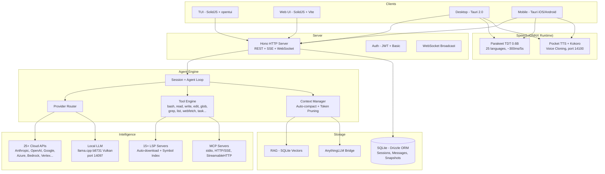

<p align="center">
  <a href="https://opencode.ai">
    <picture>
      <source srcset="packages/console/app/src/asset/logo-ornate-dark.svg" media="(prefers-color-scheme: dark)">
      <source srcset="packages/console/app/src/asset/logo-ornate-light.svg" media="(prefers-color-scheme: light)">
      
    </picture>
  </a>
</p>
<p align="center">Открытый AI-агент для программирования.</p>
<p align="center">
  <a href="https://opencode.ai/discord"></a>
  <a href="https://www.npmjs.com/package/opencode-ai"></a>
  <a href="https://github.com/anomalyco/opencode/actions/workflows/publish.yml"></a>
</p>

<p align="center">
  <a href="README.md">English</a> |
  <a href="README.zh.md">简体中文</a> |
  <a href="README.zht.md">繁體中文</a> |
  <a href="README.ko.md">한국어</a> |
  <a href="README.de.md">Deutsch</a> |
  <a href="README.es.md">Español</a> |
  <a href="README.fr.md">Français</a> |
  <a href="README.it.md">Italiano</a> |
  <a href="README.da.md">Dansk</a> |
  <a href="README.ja.md">日本語</a> |
  <a href="README.pl.md">Polski</a> |
  <a href="README.ru.md">Русский</a> |
  <a href="README.bs.md">Bosanski</a> |
  <a href="README.ar.md">العربية</a> |
  <a href="README.no.md">Norsk</a> |
  <a href="README.br.md">Português (Brasil)</a> |
  <a href="README.th.md">ไทย</a> |
  <a href="README.tr.md">Türkçe</a> |
  <a href="README.uk.md">Українська</a> |
  <a href="README.bn.md">বাংলা</a> |
  <a href="README.gr.md">Ελληνικά</a> |
  <a href="README.vi.md">Tiếng Việt</a>
</p>

[](https://opencode.ai)

---

## Функции Форка

> Это форк [anomalyco/opencode](https://github.com/anomalyco/opencode), поддерживаемый [Rwanbt](https://github.com/Rwanbt).
> Синхронизируется с upstream. Смотрите [ветку dev](https://github.com/Rwanbt/opencode/tree/dev) для последних изменений.

#### Локальный AI

OpenCode запускает AI-модели локально на потребительском оборудовании (8 ГБ VRAM / 16 ГБ RAM), без облачных зависимостей для моделей 4B–7B.

**Оптимизация промптов (сокращение на 94%)**
- ~1K токенов системный промпт для локальных моделей (против ~16K для облачных)
- Скелетные схемы инструментов (однострочные сигнатуры вместо многокилобайтных описаний)
- Белый список из 7 инструментов (bash, read, edit, write, glob, grep, question)
- Без секции skills, минимальная информация об окружении

**Движок вывода (llama.cpp b8731)**
- GPU-бэкенд Vulkan, автоматическая загрузка при первом запуске модели
- **Адаптивная конфигурация во время выполнения** (`packages/opencode/src/local-llm-server/auto-config.ts`): `n_gpu_layers`, потоки, размер batch/ubatch, квантование KV-кэша и размер контекста выводятся из обнаруженной VRAM, свободной RAM, разбиения CPU big.LITTLE, бэкенда GPU (CUDA/ROCm/Vulkan/Metal/OpenCL) и теплового состояния. Заменяет старый жёстко зашитый `--n-gpu-layers 99` — Android с 4 ГБ теперь работает в CPU-откате вместо OOM-убийства, флагманские десктопы получают настроенный batch вместо стандартного 512.
- `--flash-attn on` — Flash Attention для эффективного использования памяти
- `--cache-type-k/v` — KV-кэш с поворотом Адамара; адаптивный уровень (f16 / q8_0 / q4_0) в зависимости от запаса VRAM
- `--fit on` — вторичная корректировка VRAM только в форке (opt-in через `OPENCODE_LLAMA_ENABLE_FIT=1`)
- Спекулятивное декодирование (`--model-draft`) с защитой VRAM (автоотключение при < 1.5 ГБ свободной)
- Один слот (`-np 1`) для минимального потребления памяти
- **Стенд для бенчмарков** (`bun run bench:llm`): воспроизводимое измерение FTL / TPS / пикового RSS / общего времени на модель и запуск, вывод JSONL для архивации в CI

**Распознавание речи (Parakeet TDT 0.6B v3 INT8)**
- NVIDIA Parakeet через ONNX Runtime — ~300мс для 5с аудио (18x реального времени)
- 25 европейских языков (английский, французский, немецкий, испанский и т.д.)
- Без использования VRAM: только CPU (~700 МБ RAM)
- Автозагрузка модели (~460 МБ) при первом нажатии микрофона
- Анимация волны во время записи

**Синтез речи (Kyutai Pocket TTS)**
- Французский TTS от Kyutai (Париж), 100M параметров
- 8 встроенных голосов: Alba, Fantine, Cosette, Eponine, Azelma, Marius, Javert, Jean
- Клонирование голоса zero-shot: загрузите WAV или запишите с микрофона
- Только CPU, ~6x реального времени, HTTP-сервер на порту 14100
- Резервный вариант: Kokoro TTS ONNX (54 голоса, 9 языков, CMUDict G2P)

**Управление моделями**
- Поиск по HuggingFace с бейджами совместимости VRAM/RAM для каждой модели
- Загрузка, подключение, отключение, удаление GGUF-моделей из интерфейса
- Предварительный каталог: Gemma 4 E4B, Qwen 3.5 (4B/2B/0.8B), Phi-4 Mini, Llama 3.2
- Динамическое количество выходных токенов в зависимости от размера модели
- Автоопределение draft-модели (0.5B–0.8B) для спекулятивного декодирования

**Конфигурация**
- Пресеты: Fast / Quality / Eco / Long Context (оптимизация в один клик)
- Виджет мониторинга VRAM с цветовой шкалой (зелёный / жёлтый / красный)
- Тип KV-кэша: auto / q8_0 / q4_0 / f16
- Выгрузка на GPU: auto / gpu-max / balanced
- Маппинг памяти: auto / on / off
- Переключатель веб-поиска (иконка глобуса в панели промпта)

**Надёжность агента (локальные модели)**
- Pre-flight проверки (на уровне кода, 0 токенов): проверка существования файла перед edit, верификация содержимого old_string, принудительное чтение перед edit, защита от write в существующий файл
- Автоматический выход из зацикливания: 2 одинаковых вызова инструмента → инъекция ошибки (на уровне кода, не промпта)
- Телеметрия инструментов: процент успехов/ошибок за сессию с разбивкой по инструментам, автоматическое логирование
- Цель: >85% успешности вызовов инструментов на моделях 4B

**Кроссплатформенность**: Windows (Vulkan), Linux, macOS, Android

#### Фоновые Задачи

Делегируйте работу субагентам, работающим асинхронно. Установите `mode: "background"` в инструменте task, и он немедленно вернёт `task_id`, пока агент работает в фоне. События шины (`TaskCreated`, `TaskCompleted`, `TaskFailed`) публикуются для отслеживания жизненного цикла.

#### Команды Агентов

Оркестрируйте несколько агентов параллельно с помощью инструмента `team`. Определите подзадачи с рёбрами зависимостей; `computeWaves()` строит DAG и выполняет независимые задачи одновременно (до 5 параллельных агентов). Контроль бюджета через `max_cost` (доллары) и `max_agents`. Контекст завершённых задач автоматически передаётся зависимым.

#### Изоляция Git Worktree

Каждая фоновая задача автоматически получает собственное git worktree. Рабочее пространство привязано к сессии в базе данных. Если задача не производит изменений файлов, worktree автоматически очищается. Это обеспечивает изоляцию на уровне git без контейнеров.

#### API Управления Задачами

Полный REST API для управления жизненным циклом задач:

| Method | Path | Description |
|--------|------|-------------|
| GET | `/task/` | List tasks (filter by parent, status) |
| GET | `/task/:id` | Get task details + status + worktree info |
| GET | `/task/:id/messages` | Retrieve task session messages |
| POST | `/task/:id/cancel` | Cancel a running or queued task |
| POST | `/task/:id/resume` | Resume completed/failed/blocked task |
| POST | `/task/:id/followup` | Send follow-up message to idle task |
| POST | `/task/:id/promote` | Promote background task to foreground |
| GET | `/task/:id/team` | Aggregated team view (costs, diffs per member) |

#### TUI-панель Задач

Плагин боковой панели, показывающий активные фоновые задачи с иконками статуса в реальном времени:

| Icon | Status |
|------|--------|
| `~` | Running / Retrying |
| `?` | Queued / Awaiting input |
| `!` | Blocked |
| `x` | Failed |
| `*` | Completed |
| `-` | Cancelled |

Диалог с действиями: открыть сессию задачи, отменить, возобновить, отправить продолжение, проверить статус.

#### Область Видимости MCP по Агентам

Списки разрешений/запретов для MCP-серверов по каждому агенту. Настройте в `opencode.json` в поле `mcp` каждого агента. Функция `toolsForAgent()` фильтрует доступные инструменты MCP на основе области видимости вызывающего агента.

```json
{
  "agents": {
    "explore": {
      "mcp": { "deny": ["dangerous-server"] }
    }
  }
}
```

#### 9-состоянийный Жизненный Цикл Сессии

Сессии отслеживают одно из 9 состояний, сохраняемых в базе данных:

`idle` · `busy` · `retry` · `queued` · `blocked` · `awaiting_input` · `completed` · `failed` · `cancelled`

Постоянные состояния (`queued`, `blocked`, `awaiting_input`, `completed`, `failed`, `cancelled`) переживают перезапуски базы данных. Состояния в памяти (`idle`, `busy`, `retry`) сбрасываются при перезапуске.

#### Агент-оркестратор

Координирующий агент только для чтения (максимум 50 шагов). Имеет доступ к инструментам `task` и `team`, но все инструменты редактирования запрещены. Делегирует реализацию build-/общим агентам и синтезирует результаты.

---

## Техническая Архитектура

### Поддержка Множества Провайдеров

25+ провайдеров из коробки: Anthropic, OpenAI, Google Gemini, Azure, AWS Bedrock, Vertex AI, OpenRouter, GitHub Copilot, XAI, Mistral, Groq, DeepInfra, Cerebras, Cohere, TogetherAI, Perplexity, Vercel, Venice, GitLab, Gateway, Ollama Cloud, плюс любой OpenAI-совместимый endpoint (Ollama, LM Studio, vLLM, LocalAI). Цены получены с [models.dev](https://models.dev).

### Система Агентов

| Agent | Mode | Access | Description |
|-------|------|--------|-------------|
| **build** | primary | full | Агент разработки по умолчанию |
| **plan** | primary | read-only | Анализ и исследование кода |
| **general** | subagent | full (no todowrite) | Сложные многоэтапные задачи |
| **explore** | subagent | read-only | Быстрый поиск по кодовой базе |
| **orchestrator** | subagent | read-only + task/team | Мульти-агентный координатор (50 шагов) |
| **critic** | subagent | read-only + bash + LSP | Ревью кода: баги, безопасность, производительность |
| **tester** | subagent | full (no todowrite) | Написание и запуск тестов, проверка покрытия |
| **documenter** | subagent | full (no todowrite) | JSDoc, README, inline-документация |
| compaction | hidden | none | AI-управляемое сжатие контекста |
| title | hidden | none | Генерация заголовка сессии |
| summary | hidden | none | Резюмирование сессии |

### Интеграция LSP

Полная поддержка Language Server Protocol с индексацией символов, диагностикой и поддержкой нескольких языков (TypeScript, Deno, Vue и расширяемый). Агент навигирует по коду через символы LSP, а не текстовый поиск, обеспечивая точное go-to-definition, find-references и обнаружение ошибок типов в реальном времени.

### Поддержка MCP

Клиент и сервер Model Context Protocol. Поддерживает транспорты stdio, HTTP/SSE и StreamableHTTP. Поток аутентификации OAuth для удалённых серверов. Возможности инструментов, промптов и ресурсов. Область действия per-agent через списки allow/deny.

### Архитектура Client/Server

REST API на основе Hono с типизированными маршрутами и генерацией спецификации OpenAPI. Поддержка WebSocket для PTY (псевдо-терминал). SSE для потоковой передачи событий в реальном времени. Basic auth, CORS, gzip-сжатие. TUI — один из фронтендов; сервер может управляться из любого HTTP-клиента, веб-интерфейса или мобильного приложения.

### Управление Контекстом

Auto-compact с AI-управляемым резюмированием при приближении использования токенов к лимиту контекста модели. Обрезка с учётом токенов и настраиваемыми порогами (`PRUNE_MINIMUM` 20KB, `PRUNE_PROTECT` 40KB). Выходные данные инструмента Skill защищены от обрезки.

### Движок Редактирования

Unified diff-патчинг с верификацией hunks. Применяет целевые hunks к определённым участкам файла вместо полной перезаписи файла. Инструмент multi-edit для пакетных операций над файлами.

### Система Разрешений

3-уровневые разрешения (`allow` / `deny` / `ask`) с сопоставлением шаблонов с подстановочными знаками. 100+ определений арности bash-команд для детального контроля. Принудительное соблюдение границ проекта предотвращает доступ к файлам за пределами workspace.

### Откат на Основе Git

Система снимков, записывающая состояние файлов перед каждым выполнением инструмента. Поддерживает `revert` и `unrevert` с вычислением различий. Изменения могут быть отменены по сообщению или по сессии.

### Отслеживание Затрат

Стоимость за сообщение с полной разбивкой токенов (input, output, reasoning, cache read, cache write). Лимиты бюджета per-team (`max_cost`). Команда `stats` с агрегацией per-model и per-day. Стоимость сессии в реальном времени отображается в TUI. Данные о ценах получены с models.dev.

### Система Плагинов

Полный SDK (`@opencode/plugin`) с архитектурой хуков. Динамическая загрузка из npm-пакетов или файловой системы. Встроенные плагины для аутентификации Codex, GitHub Copilot, GitLab и Poe.

---

## Распространённые Заблуждения

Для предотвращения путаницы из-за AI-сгенерированных резюме этого проекта:

- **TUI написан на TypeScript** (SolidJS + @opentui для рендеринга в терминале), не на Rust.
- **Tree-sitter** используется только для подсветки синтаксиса в TUI и парсинга bash-команд, а не для анализа кода на уровне агента.
- **Docker-песочница** опциональна (`experimental.sandbox.type: "docker"`); изоляция по умолчанию обеспечивается git worktree.
- **RAG** опциональна (`experimental.rag.enabled: true`); контекст по умолчанию управляется через индексацию символов LSP + auto-compact.
- **Нет "режима наблюдения", предлагающего автоматические исправления** -- file watcher существует только для инфраструктурных целей.
- **Самокоррекция** использует стандартный цикл агента (LLM видит ошибки в результатах инструментов и повторяет попытку), а не специализированный механизм авто-восстановления.

## Матрица Возможностей

### Основные функции агента
| Capability | Status | Notes |
|-----------|--------|-------|
| Background tasks | Implemented | `mode: "background"` on task tool |
| Agent teams (DAG) | Implemented | Wave-based parallel execution, budget control |
| Git worktree isolation | Implemented | Auto-created per background task |
| Task REST API | Implemented | 8 endpoints for full lifecycle |
| TUI task dashboard | Implemented | Sidebar + dialog actions |
| MCP agent scoping | Implemented | Per-agent allow/deny config |
| 9-state lifecycle | Implemented | Persistent to SQLite |
| Orchestrator agent | Implemented | Read-only coordinator |
| Multi-provider (25+) | Implemented | Including local models via OpenAI-compatible API |
| LSP integration | Implemented | Symbols, diagnostics, multi-language |
| MCP protocol | Implemented | Client + server, 3 transports |
| Plugin system | Implemented | SDK + hook architecture |
| Cost tracking | Implemented | Per-message, per-team, per-model |
| Context auto-compact | Implemented | AI summarization + pruning |
| Git rollback/snapshots | Implemented | Revert/unrevert per message |
| Specialized agents | Implemented | critic, tester, documenter subagents |
| Dry run / command preview | Implemented | `dry_run` param on bash/edit/write tools |
| Auto-learn | Implemented | Post-session lesson extraction to `.opencode/learnings/` |
| Web search | Implemented | Globe toggle in prompt toolbar |

### Локальный AI (десктоп + мобильные)
| Capability | Status | Notes |
|-----------|--------|-------|
| Local LLM (llama.cpp b8731) | Implemented | Vulkan GPU, auto-download runtime, `--fit` auto-VRAM |
| **Адаптивная конфигурация во время выполнения** | Implemented | `auto-config.ts`: n_gpu_layers / потоки / batch / квантование KV выводятся из обнаруженной VRAM, RAM, big.LITTLE, бэкенда GPU, теплового состояния |
| **Стенд для бенчмарков** | Implemented | `bun run bench:llm` измеряет FTL, TPS, пиковый RSS, общее время на модель; вывод JSONL |
| Flash Attention | Implemented | `--flash-attn on` on desktop and mobile |
| KV cache quantization | Implemented | q4_0 / q8_0 / f16 adaptive with Hadamard rotation (72% memory savings) |
| Exact tokenizer (OpenAI) | Implemented | `js-tiktoken` для gpt-*/o1/o3/o4; эмпирически 3.5 символов/токен для Llama/Qwen/Gemma |
| Speculative decoding | Implemented | VRAM Guard (desktop) / RAM Guard (mobile), draft model auto-detection |
| VRAM / RAM monitoring | Implemented | Desktop: nvidia-smi, Mobile: `/proc/meminfo` |
| Configuration presets | Implemented | Fast / Quality / Eco / Long Context |
| HuggingFace model search | Implemented | Валидация ответа через Zod, значки VRAM, менеджер загрузок, 9 заранее отобранных моделей |
| **Возобновляемые загрузки GGUF** | Implemented | HTTP-заголовок `Range` — прерывание 4G не перезапускает передачу 4 ГБ с нуля |
| STT (Parakeet TDT 0.6B) | Implemented | ONNX Runtime, ~300ms/5s, 25 языков, desktop + mobile (слушатель микрофона подключён с обеих сторон) |
| TTS (Pocket TTS) | Implemented | 8 голосов, zero-shot клонирование голоса, нативный французский (только desktop — нет Python-сайдкара на Android) |
| TTS (Kokoro) | Implemented | 54 голоса, 9 языков, ONNX на **desktop + Android** (6 команд Tauri подключены в `speech.rs` mobile, CPUExecutionProvider) |
| Prompt reduction (94%) | Implemented | ~1K tokens vs ~16K for cloud, skeleton tool schemas |
| Pre-flight guards | Implemented | File-exists, old_string verification, read-before-edit, write-on-existing (code-level, 0 tokens) |
| Doom loop auto-break | Implemented | Auto-injects error on 2x identical calls (code-level, not prompt) |
| Tool telemetry | Implemented | Per-session success/error rate logging with per-tool breakdown |
| Перезапуск с предохранителем | Implemented | `ensureCorrectModel` прекращает после 3 перезапусков за 120 с, чтобы избежать burn-cycle циклов |

### Безопасность и управление
| Capability | Status | Notes |
|-----------|--------|-------|
| Docker sandboxing | Implemented | Optional via `experimental.sandbox.type: "docker"` |
| Vulnerability scanner | Implemented | Auto-scan on edit/write for secrets, injections, unsafe patterns |
| DLP / AgentShield | Implemented | `experimental.dlp.enabled: true`, redacts secrets before LLM calls |
| Policy engine | Implemented | `experimental.policy.enabled: true`, conditional rules + custom policies |
| **Строгий CSP (desktop + mobile)** | Implemented | `connect-src` ограничен loopback + HuggingFace + HTTPS-провайдерами; без `unsafe-eval`, `object-src 'none'`, `frame-ancestors 'none'` |
| **Ужесточение Android-релиза** | Implemented | `isDebuggable=false`, `allowBackup=false`, `isShrinkResources=true`, `FOREGROUND_SERVICE_TYPE_SPECIAL_USE` |
| **Ужесточение desktop-релиза** | Implemented | Devtools больше не форсятся — восстановлен дефолт Tauri 2 (только в debug), чтобы опорная точка XSS не могла прицепиться к `__TAURI__` в продакшене |
| **Валидация входных данных команд Tauri** | Implemented | Стражи `download_model` / `load_llm_model` / `delete_model`: charset имени файла, allowlist HTTPS для `huggingface.co` / `hf.co` |
| **Цепочка логирования Rust** | Implemented | `log` + `android_logger` на мобильных; никаких `eprintln!` в релизе → никаких утечек путей/URL в logcat |
| **Трекер аудита безопасности** | Implemented | [`SECURITY_AUDIT.md`](SECURITY_AUDIT.md) — все находки классифицированы как S1/S2/S3 с `path:line`, статусом и обоснованием отложенного исправления |

### Знания и память
| Capability | Status | Notes |
|-----------|--------|-------|
| Vector DB / RAG | Implemented | `experimental.rag.enabled: true`, SQLite + cosine similarity |
| Confidence/decay | Implemented | Time-based scoring for RAG embeddings, exponential decay |
| Memory conflict resolution | Implemented | Detects and resolves duplicate/contradictory embeddings |

### Расширения платформы (экспериментальные)
| Capability | Status | Notes |
|-----------|--------|-------|
| Mobile app (Tauri) | Implemented | Android: встроенный runtime, on-device LLM, STT + TTS (Kokoro). iOS: удалённый режим |
| **Deep link для OAuth callback** | Implemented | `opencode://oauth/callback?providerID=…&code=…&state=…` автоматически завершает обмен токенами; копирование auth-кода не требуется |
| **Наблюдатель за upstream-веткой** | Implemented | Периодический `git fetch` (прогрев 30 с, интервал 5 мин) публикует `vcs.branch.behind`, когда локальный HEAD расходится с отслеживаемым upstream; отображается через `platform.notify()` на desktop и mobile |
| **Запуск PTY по размеру viewport** | Implemented | `Pty.create({cols, rows})` использует оценщик из `window.innerWidth/innerHeight` — шеллы стартуют сразу с финальными размерами вместо 80×24→36×11, исправляет баг невидимого первого prompt на Android для mksh/bash |
| Collaborative mode | Experimental | JWT auth, presence, file locking, WebSocket broadcast |
| AnythingLLM bridge | Experimental | MCP adapter, context injection, vector store bridge |
| Per-message token display | Partial | Stored in DB, shown as session aggregate |

---

## Архитектура



### Порты сервисов

| Service | Port | Protocol |
|---------|------|----------|
| OpenCode Server | 4096 | HTTP (REST + SSE + WebSocket) |
| LLM (llama-server) | 14097 | HTTP (OpenAI-compatible) |
| TTS (pocket-tts) | 14100 | HTTP (FastAPI) |

## Безопасность и Управление

| Feature | Description |
|---------|-------------|
| **Sandbox** | Опциональное выполнение в Docker (`experimental.sandbox.type: "docker"`) или хост-режим с принудительными границами проекта |
| **Permissions** | 3-уровневая система (`allow` / `deny` / `ask`) с wildcard-паттернами. 100+ определений bash-команд для детального контроля |
| **DLP** | Предотвращение утечки данных (`experimental.dlp`) — маскировка секретов, API-ключей и учётных данных перед отправкой LLM-провайдерам |
| **Policy Engine** | Условные правила (`experimental.policy`) с действиями `block` или `warn`. Защита путей, ограничение размера edit, пользовательские regex-паттерны |
| **Privacy** | Приоритет локальности: все данные в SQLite на диске. Без телеметрии по умолчанию. Секреты никогда не логируются. Данные не передаются третьим сторонам кроме настроенного LLM-провайдера |

## Интеллектуальный Интерфейс

| Feature | Description |
|---------|-------------|
| **MCP Compliant** | Полная поддержка Model Context Protocol — клиентский и серверный режимы, область действия инструментов per-agent через списки allow/deny |
| **Context Files** | Каталог `.opencode/` с конфигурацией `opencode.jsonc`. Агенты определяются как markdown с YAML frontmatter. Пользовательские инструкции через параметр `instructions` |
| **Provider Router** | 25+ провайдеров через `Provider.parseModel("provider/model")`. Автоматический fallback, отслеживание затрат, маршрутизация с учётом токенов |
| **RAG System** | Опциональный локальный векторный поиск (`experimental.rag`) с настраиваемыми моделями эмбеддингов (OpenAI/Google). Автоиндексация изменённых файлов |
| **AnythingLLM Bridge** | Опциональная интеграция (`experimental.anythingllm`) — инъекция контекста, MCP-адаптер, мост к векторному хранилищу, Agent Skills HTTP API |

---

## Реализованные ветки функций (на `dev`)

Три крупных функции были реализованы в выделенных ветках и влиты в `dev`. Каждая управляется feature-флагами и обратно совместима.

### Совместный режим (`dev_collaborative_mode`)

Многопользовательская совместная работа в реальном времени. Реализовано:
- **JWT-аутентификация** — токены HMAC-SHA256 с ротацией обновления, обратная совместимость с basic auth
- **Управление пользователями** — Регистрация, роли (admin/member/viewer), применение RBAC
- **WebSocket broadcast** — Потоковая передача событий в реальном времени через GlobalBus → Broadcast
- **Система присутствия** — Статус online/idle/away с heartbeat каждые 30с
- **Блокировка файлов** — Оптимистичные блокировки на инструментах edit/write с обнаружением конфликтов
- **Фронтенд** — Форма входа, индикатор присутствия, бейдж наблюдателя, WebSocket-хуки

Настройка: `experimental.collaborative.enabled: true`

### Мобильная версия (`dev_mobile`)

Нативное Android/iOS-приложение через Tauri 2.0 со **встроенной средой выполнения** — один APK, ноль внешних зависимостей. Реализовано:

**Уровень 1 — Встроенная среда выполнения (Android, 100% нативная производительность):**
- **Статические бинарники в APK** — Bun, Git, Bash, Ripgrep (aarch64-linux-musl), извлечение при первом запуске (~15с)
- **Встроенный CLI** — OpenCode CLI как JS-бандл, запускаемый встроенным Bun, сеть не требуется для ядра
- **Прямой запуск процессов** — Без Termux, без intents — `std::process::Command` из Rust напрямую
- **Автозапуск сервера** — `bun opencode-cli.js serve` на localhost с UUID-аутентификацией, как десктопный sidecar

**Уровень 2 — Локальный вывод LLM на устройстве:**
- **llama.cpp через JNI** — Kotlin LlamaEngine загружает нативные .so библиотеки через JNI-мост
- **IPC через файлы** — Rust записывает команды в `llm_ipc/request`, Kotlin-демон опрашивает и возвращает результаты
- **llama-server** — OpenAI-совместимый HTTP API на порту 14097 для интеграции с провайдером
- **Управление моделями** — Загрузка GGUF-моделей с HuggingFace, подключение/отключение/удаление, 9 предустановленных моделей
- **Регистрация провайдера** — Локальная модель отображается как "Local AI" провайдер в выборе модели
- **Flash Attention** — `--flash-attn on` для эффективного использования памяти при выводе
- **Квантование KV-кэша** — `--cache-type-k/v q4_0` с поворотом Адамара (экономия памяти 72%)
- **Спекулятивное декодирование** — Автоопределение draft-модели (0.5B–0.8B) с RAM Guard через `/proc/meminfo`
- **Мониторинг RAM** — Виджет памяти устройства (всего/использовано/свободно) через `/proc/meminfo`
- **Пресеты конфигурации** — Те же Fast/Quality/Eco/Long Context пресеты, что и на десктопе
- **Умный выбор GPU** — Vulkan для Adreno 730+ (SD 8 Gen 1+), OpenCL для старых SoC, CPU fallback
- **Привязка к большим ядрам** — Определяет топологию ARM big.LITTLE, привязывает вывод только к производительным ядрам

**Уровень 3 — Расширенное окружение (опциональная загрузка, ~150MB):**
- **proot + Alpine rootfs** — Полный Linux с `apt install` для дополнительных пакетов
- **Bind-mounted Уровень 1** — Bun/Git/rg по-прежнему работают на нативной скорости внутри proot
- **По запросу** — Загружается только при включении "Extended Environment" в настройках

**Уровень 4 — Речь и медиа:**
- **STT (Parakeet TDT 0.6B)** — Тот же ONNX Runtime движок, что и на десктопе, ~300мс/5с аудио, 25 языков
- **Анимация волны** — Визуальная обратная связь во время записи
- **Нативный выбор файлов** — `tauri-plugin-dialog` для выбора файлов/каталогов и вложений

**Общее (Android + iOS):**
- **Абстракция платформы** — Расширенный тип `Platform` с `"mobile"` + определение ОС `"ios"/"android"`
- **Удалённое подключение** — Подключение к десктопному серверу OpenCode по сети (только iOS или Android fallback)
- **Интерактивный терминал** — Полный PTY через пользовательскую musl `librust_pty.so` (обёртка forkpty), Ghostty WASM renderer с canvas fallback
- **Внешнее хранилище** — Символьные ссылки из HOME сервера на каталоги `/sdcard/` (Documents, Downloads, projects)
- **Мобильный UI** — Адаптивная боковая панель, сенсорный ввод сообщений, мобильный diff view, 44px сенсорные цели, поддержка safe area
- **Push-уведомления** — Мост SSE→нативные уведомления для завершения фоновых задач
- **Выбор режима** — Выбор Local (Android) или Remote (iOS + Android) при первом запуске
- **Мобильное меню действий** — Быстрый доступ к терминалу, fork, поиску и настройкам из заголовка сессии

### Слияние с AnythingLLM (`dev_anything`)

Мост между OpenCode и платформой документального RAG AnythingLLM. Реализовано:
- **REST-клиент** — Полная обёртка API для рабочих пространств, документов, поиска, чата AnythingLLM
- **MCP-адаптер** — 4 инструмента: `anythingllm_search`, `anythingllm_list_workspaces`, `anythingllm_get_document`, `anythingllm_chat`
- **Инъекция контекста через плагин** — Хук `experimental.chat.system.transform` внедряет релевантные документы в системный промпт
- **Agent Skills HTTP API** — `GET /agent-skills` + `POST /agent-skills/:toolId/execute` для предоставления инструментов OpenCode в AnythingLLM
- **Мост векторного хранилища** — Композитный поиск, объединяющий локальный SQLite RAG с результатами векторной БД AnythingLLM
- **Docker Compose** — Готовый `docker-compose.anythingllm.yml` с общей сетью

Настройка: `experimental.anythingllm.enabled: true`

### Установка

```bash
# YOLO
curl -fsSL https://opencode.ai/install | bash

# Менеджеры пакетов
npm i -g opencode-ai@latest        # или bun/pnpm/yarn
scoop install opencode             # Windows
choco install opencode             # Windows
brew install anomalyco/tap/opencode # macOS и Linux (рекомендуем, всегда актуально)
brew install opencode              # macOS и Linux (официальная формула brew, обновляется реже)
sudo pacman -S opencode            # Arch Linux (Stable)
paru -S opencode-bin               # Arch Linux (Latest from AUR)
mise use -g opencode               # любая ОС
nix run nixpkgs#opencode           # или github:anomalyco/opencode для самой свежей ветки dev
```

> [!TIP]
> Перед установкой удалите версии старше 0.1.x.

### Десктопное приложение (BETA)

OpenCode также доступен как десктопное приложение. Скачайте его со [страницы релизов](https://github.com/anomalyco/opencode/releases) или с [opencode.ai/download](https://opencode.ai/download).

| Платформа             | Загрузка                              |
| --------------------- | ------------------------------------- |
| macOS (Apple Silicon) | `opencode-desktop-darwin-aarch64.dmg` |
| macOS (Intel)         | `opencode-desktop-darwin-x64.dmg`     |
| Windows               | `opencode-desktop-windows-x64.exe`    |
| Linux                 | `.deb`, `.rpm` или AppImage           |

```bash
# macOS (Homebrew)
brew install --cask opencode-desktop
# Windows (Scoop)
scoop bucket add extras; scoop install extras/opencode-desktop
```

#### Каталог установки

Скрипт установки выбирает путь установки в следующем порядке приоритета:

1. `$OPENCODE_INSTALL_DIR` - Пользовательский каталог установки
2. `$XDG_BIN_DIR` - Путь, совместимый со спецификацией XDG Base Directory
3. `$HOME/bin` - Стандартный каталог пользовательских бинарников (если существует или можно создать)
4. `$HOME/.opencode/bin` - Fallback по умолчанию

```bash
# Примеры
OPENCODE_INSTALL_DIR=/usr/local/bin curl -fsSL https://opencode.ai/install | bash
XDG_BIN_DIR=$HOME/.local/bin curl -fsSL https://opencode.ai/install | bash
```

### Agents

В OpenCode есть два встроенных агента, между которыми можно переключаться клавишей `Tab`.

- **build** - По умолчанию, агент с полным доступом для разработки
- **plan** - Агент только для чтения для анализа и изучения кода
  - По умолчанию запрещает редактирование файлов
  - Запрашивает разрешение перед выполнением bash-команд
  - Идеален для изучения незнакомых кодовых баз или планирования изменений

Также включен сабагент **general** для сложных поисков и многошаговых задач.
Он используется внутренне и может быть вызван в сообщениях через `@general`.

Подробнее об [agents](https://opencode.ai/docs/agents).

### Документация

Больше информации о том, как настроить OpenCode: [**наши docs**](https://opencode.ai/docs).

### Вклад

Если вы хотите внести вклад в OpenCode, прочитайте [contributing docs](./CONTRIBUTING.md) перед тем, как отправлять pull request.

### Разработка на базе OpenCode

Если вы делаете проект, связанный с OpenCode, и используете "opencode" как часть имени (например, "opencode-dashboard" или "opencode-mobile"), добавьте примечание в README, чтобы уточнить, что проект не создан командой OpenCode и не аффилирован с нами.

### FAQ

#### Чем это отличается от Claude Code?

По возможностям это очень похоже на Claude Code. Вот ключевые отличия:

- 100% open source
- Не привязано к одному провайдеру. Мы рекомендуем модели из [OpenCode Zen](https://opencode.ai/zen); но OpenCode можно использовать с Claude, OpenAI, Google или даже локальными моделями. По мере развития моделей разрыв будет сокращаться, а цены падать, поэтому важна независимость от провайдера.
- Поддержка LSP из коробки
- Фокус на TUI. OpenCode построен пользователями neovim и создателями [terminal.shop](https://terminal.shop); мы будем раздвигать границы того, что возможно в терминале.
- Архитектура клиент/сервер. Например, это позволяет запускать OpenCode на вашем компьютере, а управлять им удаленно из мобильного приложения. Это значит, что TUI-фронтенд - лишь один из возможных клиентов.

---

**Присоединяйтесь к нашему сообществу** [Discord](https://discord.gg/opencode) | [X.com](https://x.com/opencode)
