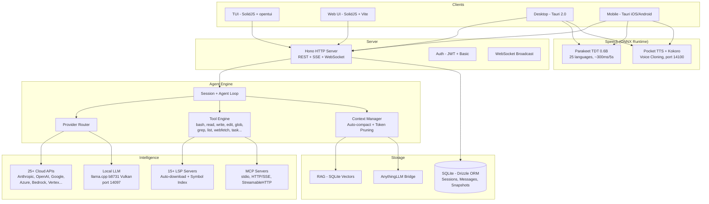

<p align="center">
  <a href="https://opencode.ai">
    <picture>
      <source srcset="packages/console/app/src/asset/logo-ornate-dark.svg" media="(prefers-color-scheme: dark)">
      <source srcset="packages/console/app/src/asset/logo-ornate-light.svg" media="(prefers-color-scheme: light)">
      
    </picture>
  </a>
</p>
<p align="center">Açık kaynaklı yapay zeka kodlama asistanı.</p>
<p align="center">
  <a href="https://opencode.ai/discord"></a>
  <a href="https://www.npmjs.com/package/opencode-ai"></a>
  <a href="https://github.com/Rwanbt/opencode/actions/workflows/fork-release.yml"></a>
</p>

<p align="center">
  <a href="README.md">English</a> |
  <a href="README.zh.md">简体中文</a> |
  <a href="README.zht.md">繁體中文</a> |
  <a href="README.ko.md">한국어</a> |
  <a href="README.de.md">Deutsch</a> |
  <a href="README.es.md">Español</a> |
  <a href="README.fr.md">Français</a> |
  <a href="README.it.md">Italiano</a> |
  <a href="README.da.md">Dansk</a> |
  <a href="README.ja.md">日本語</a> |
  <a href="README.pl.md">Polski</a> |
  <a href="README.ru.md">Русский</a> |
  <a href="README.bs.md">Bosanski</a> |
  <a href="README.ar.md">العربية</a> |
  <a href="README.no.md">Norsk</a> |
  <a href="README.br.md">Português (Brasil)</a> |
  <a href="README.th.md">ไทย</a> |
  <a href="README.tr.md">Türkçe</a> |
  <a href="README.uk.md">Українська</a> |
  <a href="README.bn.md">বাংলা</a> |
  <a href="README.gr.md">Ελληνικά</a> |
  <a href="README.vi.md">Tiếng Việt</a>
</p>

[](https://opencode.ai)

<!-- WHY-FORK-MATRIX -->
## Neden bu fork?

> **Özet** — DAG tabanlı bir orkestratör, REST görev API'si, ajan başına MCP kapsamı, 9 durumlu oturum FSM'i, yerleşik güvenlik açığı tarayıcısı *ve* cihaz üstü LLM çıkarımı yapan birinci sınıf bir Android uygulaması sunan tek açık kaynak kodlama ajanı. Tescilli ya da açık başka hiçbir CLI bunların tamamını birleştirmiyor.

> See the English [README.md](README.md) for the full positioning prose (vs. vendor-locked CLIs, vs. BYOM peers, vs. specialized CLIs) and architecture diagram.

### Capability matrix — this fork vs. the 2026 landscape

Legend: ✅ shipped · ❌ absent · *partial* limited/incomplete · *plugin* via community add-on · *paid* behind a subscription tier.

#### Orchestration, API surface, governance

| Capability                             | **This fork** | Claude Code | Codex CLI | Gemini CLI | opencode (upstream) | Aider | Goose | Cline | Roo Code | Cursor | Continue | Crush | Qwen Code |
| -------------------------------------- | :-----------: | :---------: | :-------: | :--------: | :-----------------: | :---: | :---: | :---: | :------: | :----: | :------: | :---: | :-------: |
| Open source                            |       ✅       |      ❌      |  partial  |      ✅     |          ✅          |   ✅   |   ✅   |   ✅   |    ✅     |    ❌    |     ✅     |   ✅   |     ✅     |
| BYOM (bring your own model)            |       ✅       |      ❌      |     ❌     |      ❌     |          ✅          |   ✅   |   ✅   |   ✅   |    ✅     |  partial |     ✅     |   ✅   |   partial  |
| Local models (llama.cpp / Ollama)      |       ✅       |      ❌      |     ❌     |      ❌     |          ✅          |   ✅   |   ✅   |   ✅   |    ✅     |    ❌    |     ✅     |   ✅   |     ✅     |
| Parallel agents in isolated worktrees  |    ✅ native   |  ✅ (Teams)  |  partial  |      ❌     |      via plugin     |   ❌   | partial | ✅ (v3.58) | partial | ❌ | ❌ | ❌ |     ❌     |
| Explicit **DAG orchestration**         | ✅ **unique**  |    ad-hoc   |     ❌     |      ❌     |          ❌          |   ❌   | recipes (linear) | ❌ | ❌ | ❌ |     ❌     |   ❌   |     ❌     |
| **REST task API** (programmable)       | ✅ **unique**  | partial (SDK) |  ❌    |      ❌     |          ❌          |   ❌   |   ❌   |   ❌   |    ❌     |    ❌    |     ❌     |   ❌   |     ❌     |
| **TUI task dashboard**                 |       ✅       |      ❌      |     ❌     |      ❌     |       partial       |   ❌   |   ❌   |   ❌   |    ❌     |   n/a   |    n/a    |   ❌   |   partial  |
| MCP support                            | ✅ + **per-agent scoping** | ✅ | ✅ | ✅ | ✅ | via plugins | ✅ | ✅ | ✅ | partial | ✅ |   ❌   |     ✅     |
| **9-state session FSM**                | ✅ **unique** (6/9 persisted) | ❌ |     ❌     |      ❌     |        basic        |   ❌   |   ❌   |   ❌   |    ❌     |    ❌    |     ❌     |   ❌   |     ❌     |
| Built-in **vulnerability scanner**     | ✅ **unique**  |      ❌      |     ❌     |      ❌     |          ❌          |   ❌   |   ❌   |   ❌   |    ❌     |    ❌    |     ❌     |   ❌   |     ❌     |
| **DLP / secret redaction** before LLM call | ✅         |   partial    |     ❌     |      ❌     |          ❌          |   ❌   |   ❌   |   ❌   |    ❌     |    ❌    |     ❌     |   ❌   |     ❌     |
| **Per-agent tool allow/deny**          |       ✅       |   partial    |     ❌     |      ❌     |        basic        |   ❌   |   ❌   |   ❌   |  partial  |    ❌    |     ❌     |   ❌   |     ❌     |
| Docker sandboxing (bash only) | ✅ bash-only | ❌         |     ✅     |      ❌     |          ❌          |   ❌   |   ❌   |   ❌   |    ❌     |    ❌    |     ❌     |   ❌   |     ❌     |
| Git auto-commits / rollback            |       ✅       |      ✅      |     ✅     |      ✅     |      ✅ (signed)     |   ✅   |   ✅   |   ✅   |    ✅     |    ✅    |     ✅     |   ✅   |     ✅     |

#### Intelligence, context, developer UX

| Capability                             | **This fork** | Claude Code | Codex CLI | Gemini CLI | opencode (upstream) | Aider | Goose | Cline | Roo Code | Cursor | Continue | Crush | Qwen Code |
| -------------------------------------- | :-----------: | :---------: | :-------: | :--------: | :-----------------: | :---: | :---: | :---: | :------: | :----: | :------: | :---: | :-------: |
| LSP integration (go-to-def, diagnostics) | ✅           |   partial    |  partial  |   partial   |          ✅          | partial | partial | ✅   |    ✅     |    ✅    |     ✅     | partial |  partial  |
| Plugin SDK (`@opencode/plugin`)        |       ✅       |   partial    |     ❌     |      ❌     |          ✅          |   ❌   |   ✅   |   ✅   |    ✅     |    ✅    |     ✅     |   ❌   |     ❌     |
| Prompt caching (cloud + local KV)      |       ✅       |      ✅      |     ✅     |      ✅     |          ✅          |   ✅   |   ✅   |   ✅   |    ✅     |    ✅    |     ✅     |   ✅   |     ✅     |
| **RAG: BM25 or vector (selectable)** + exponential decay | ✅ | ❌  |     ❌     |      ❌     |          ❌          |   ❌   |   ❌   | vector only | ❌      |  vector only |  vector only |  ❌   |     ❌     |
| **Auto-learn** (requires `learner` agent configured) | opt-in | ❌  |  ❌     |      ❌     |          ❌          |   ❌   |   ❌   |   ❌   |    ❌     |    ❌    |     ❌     |   ❌   |     ❌     |
| Auto-compact (AI summarization)        |       ✅       |      ✅      |     ✅     |      ✅     |          ✅          |   ✅   |   ✅   |   ✅   |    ✅     |    ✅    |     ✅     | partial |     ✅     |
| Unified-diff edit engine               |       ✅       |      ✅      |     ✅     |   partial   |          ✅          |   ✅   | partial | partial |    ✅     | partial |  partial  | partial |  partial  |
| ACP (Agent Client Protocol) layer      |       ✅       |      ❌      |     ❌     |      ❌     |        basic        |   ❌   |   ❌   |   ❌   |    ❌     |    ❌    |     ❌     |   ❌   |     ❌     |

#### Platform reach & multimodal

| Capability                             | **This fork** | Claude Code | Codex CLI | Gemini CLI | opencode (upstream) | Aider | Goose | Cline | Roo Code | Cursor | Continue | Crush | Qwen Code |
| -------------------------------------- | :-----------: | :---------: | :-------: | :--------: | :-----------------: | :---: | :---: | :---: | :------: | :----: | :------: | :---: | :-------: |
| First-class **Android app**            | ✅ **unique**  |      ❌      |     ❌     |      ❌     |          ❌          |   ❌   |   ❌   |   ❌   |    ❌     |    ❌    |     ❌     |   ❌   |     ❌     |
| iOS (remote mode)                      |       ✅       |      ❌      |     ❌     |      ❌     |          ❌          |   ❌   |   ❌   |   ❌   |    ❌     |    ❌    |     ❌     |   ❌   |     ❌     |
| Adaptive runtime (VRAM/CPU, thermal Android-only) | ✅ partial | ❌ |  ❌     |      ❌     |      hardcoded      | hardcoded | hardcoded | hardcoded | hardcoded | n/a | hardcoded | hardcoded | hardcoded |
| **STT** (voice-to-text, Parakeet) | ✅ desktop + mobile | ❌ |     ❌     |      ❌     |          ❌          |   ❌   |   ❌   | partial  |    ❌     |    ❌    |     ❌     |   ❌   |     ❌     |
| **TTS** (Kokoro desktop + mobile; Pocket desktop only + voice clone) | ✅ | ❌ |    ❌     |      ❌     |          ❌          |   ❌   |   ❌   |   ❌   |    ❌     |    ❌    |     ❌     |   ❌   |     ❌     |
| **OAuth deep-link callback** (Tauri)   |       ✅       |      ❌      |     ❌     |      ❌     |          ❌          |   ❌   |   ❌   |   ❌   |    ❌     |    ❌    |     ❌     |   ❌   |     ❌     |
| **mDNS service discovery** (CLI flag `--mdns`) | opt-in | ❌ |   ❌     |      ❌     |          ❌          |   ❌   |   ❌   |   ❌   |    ❌     |    ❌    |     ❌     |   ❌   |     ❌     |
| **Upstream branch watcher** (`vcs.branch.behind`) | ✅ **unique** | ❌ |    ❌     |      ❌     |          ❌          |   ❌   |   ❌   |   ❌   |    ❌     |    ❌    |     ❌     |   ❌   |     ❌     |
| **Collaborative mode** (JWT + presence + file-lock) | ✅ | ❌      |     ❌     |      ❌     |          ❌          |   ❌   |   ❌   |   ❌   |    ❌     | partial |     ❌     |   ❌   |     ❌     |
| **AnythingLLM bridge**                 | ✅ **unique**  |      ❌      |     ❌     |      ❌     |          ❌          |   ❌   |   ❌   |   ❌   |    ❌     |    ❌    |     ❌     |   ❌   |     ❌     |
| **GDPR export/erasure route**          | ✅ **unique**  |      ❌      |     ❌     |      ❌     |          ❌          |   ❌   |   ❌   |   ❌   |    ❌     |    ❌    |     ❌     |   ❌   |     ❌     |
| Price                                  |  free + BYOM  |  $20/mo sub |$20/mo sub |  1000/day free | free + BYOM    | free + BYOM | free + BYOM | free + BYOM | free + BYOM | $20/mo sub | free + BYOM | free + BYOM | free + BYOM |

---

## Fork Özellikleri

> Bu, [anomalyco/opencode](https://github.com/anomalyco/opencode) projesinin [Rwanbt](https://github.com/Rwanbt) tarafından sürdürülen bir fork'udur.
> Upstream ile senkronize tutulmaktadır. En son değişiklikler için [dev dalına](https://github.com/Rwanbt/opencode/tree/dev) bakın.

#### Yerel Öncelikli AI

OpenCode, AI modellerini tüketici donanımında (8 GB VRAM / 16 GB RAM) yerel olarak çalıştırır; 4B–7B modeller için sıfır bulut bağımlılığı.

**Prompt Optimizasyonu (%94 azaltma)**
- Yerel modeller için ~1K token sistem promptu (bulut için ~16K'ya karşılık)
- İskelet araç şemaları (çok KB'lik açıklamalar yerine tek satırlık imzalar)
- 7 araçlık beyaz liste (bash, read, edit, write, glob, grep, question)
- Skills bölümü yok, minimum ortam bilgisi

**Çıkarım Motoru (llama.cpp b8731)**
- Vulkan GPU arka ucu, ilk model yüklemesinde otomatik indirilir
- **Çalışma zamanı uyarlamalı yapılandırma** (`packages/opencode/src/local-llm-server/auto-config.ts`): `n_gpu_layers`, iş parçacıkları, batch/ubatch boyutu, KV önbellek kuantizasyonu ve bağlam boyutu algılanan VRAM, boş RAM, big.LITTLE CPU bölünmesi, GPU arka ucu (CUDA/ROCm/Vulkan/Metal/OpenCL) ve termal durumdan türetilir. Eski sabit kodlanmış `--n-gpu-layers 99`'un yerine geçer — 4 GB'lık bir Android artık OOM ile öldürülmek yerine CPU geri dönüşünde çalışır, amiral gemisi masaüstleri varsayılan 512 yerine ayarlı batch alır.
- `--flash-attn on` — Bellek verimliliği için Flash Attention
- `--cache-type-k/v` —  rotasyonlu KV önbelleği; VRAM payına göre uyarlamalı katman (f16 / q8_0 / q4_0)
- `--fit on` — fork'a özel ikincil VRAM ayarı (`OPENCODE_LLAMA_ENABLE_FIT=1` ile opt-in)
- Spekülatif kod çözme (`--model-draft`) ile VRAM Koruması (< 4 GB boş olduğunda otomatik devre dışı)
- Bellek ayak izini minimize etmek için tek slot (`-np 1`)
- **Benchmark altyapısı** (`bun run bench:llm`): model başına, çalıştırma başına FTL / TPS / zirve RSS / duvar saati süresinin tekrarlanabilir ölçümü, CI arşivi için JSONL çıktısı

**Konuşmadan Metne (Parakeet TDT 0.6B v3 INT8)**
- ONNX Runtime üzerinden NVIDIA Parakeet — 5 saniyelik ses için ~300ms (18x gerçek zamanlı)
- 25 Avrupa dili (İngilizce, Fransızca, Almanca, İspanyolca vb.)
- Sıfır VRAM: Yalnızca CPU (~700 MB RAM)
- İlk mikrofon basışında modelin otomatik indirilmesi (~460 MB)
- Kayıt sırasında dalga formu animasyonu

**Metinden Konuşmaya (Kyutai Pocket TTS)**
- Kyutai (Paris) tarafından oluşturulmuş Fransızca-doğal TTS, 100M parametre
- 8 yerleşik ses: Alba, Fantine, Cosette, Eponine, Azelma, Marius, Javert, Jean
- Zero-shot ses klonlama: WAV yükleyin veya mikrofondan kaydedin
- Yalnızca CPU, ~6x gerçek zamanlı, port 14100'de HTTP sunucu
- Yedek: Kokoro TTS ONNX motoru (54 ses, 9 dil, CMUDict G2P)

**Model Yönetimi**
- Model başına VRAM/RAM uyumluluk rozetleriyle HuggingFace araması
- Arayüzden GGUF modellerini indirme, yükleme, kaldırma, silme
- Önceden seçilmiş katalog: Gemma 3 4B, Qwen3 4B/1.7B/0.6B
- Model boyutuna göre dinamik çıktı token sayısı
- Spekülatif kod çözme için draft model otomatik algılama (0.5B–0.8B)

**Yapılandırma**
- Ön ayarlar: Fast / Quality / Eco / Long Context (tek tıkla optimizasyon)
- Renk kodlu kullanım çubuğuyla VRAM izleme widget'ı (yeşil / sarı / kırmızı)
- KV önbellek türü: auto / q8_0 / q4_0 / f16
- GPU aktarımı: auto / gpu-max / balanced
- Bellek eşleme: auto / on / off
- Web arama geçişi (prompt araç çubuğundaki küre simgesi)

**Ajan Güvenilirliği (yerel modeller)**
- Uçuş öncesi korumalar (kod düzeyinde, 0 token): edit öncesi dosya-var-mı kontrolü, old_string içerik doğrulama, edit öncesi okuma zorunluluğu, var olan dosyaya write engelleme
- Sonsuz döngü otomatik kırma: 2x özdeş araç çağrısı → hata enjeksiyonu (kod düzeyinde koruma, prompt değil)
- Araç telemetrisi: araç bazında dökümle oturum başına başarı/hata oranı, otomatik günlükleme
- Hedef: 4B modellerde >%85 araç başarı oranı

**Çapraz platform**: Windows (Vulkan), Linux, macOS, Android

#### Arka Plan Görevleri

İşleri asenkron çalışan alt ajanlara devredin. Task aracında `mode: "background"` ayarlayın; ajan arka planda çalışırken hemen bir `task_id` döner. Yaşam döngüsü takibi için bus olayları (`TaskCreated`, `TaskCompleted`, `TaskFailed`) yayınlanır.

#### Ajan Takımları

`team` aracını kullanarak birden fazla ajanı paralel olarak orkestre edin. Bağımlılık kenarlarıyla alt görevler tanımlayın; `computeWaves()` bir DAG oluşturur ve bağımsız görevleri eşzamanlı olarak yürütür (en fazla 5 paralel ajan). `max_cost` (dolar) ve `max_agents` ile bütçe kontrolü. Tamamlanan görevlerden bağlam otomatik olarak bağımlı görevlere aktarılır.

#### Git Worktree İzolasyonu

Her arka plan görevi otomatik olarak kendi git worktree'sini alır. Çalışma alanı veritabanında oturuma bağlanır. Bir görev dosya değişikliği üretmezse worktree otomatik olarak temizlenir. Bu, konteyner olmadan git düzeyinde izolasyon sağlar.

#### Görev Yönetimi API'si

Görev yaşam döngüsü yönetimi için tam REST API:

| Method | Path | Açıklama |
|--------|------|----------|
| GET | `/task/` | Görevleri listele (parent, status'a göre filtrele) |
| GET | `/task/:id` | Görev detayları + status + worktree bilgisi |
| GET | `/task/:id/messages` | Görev oturum mesajlarını getir |
| POST | `/task/:id/cancel` | Çalışan veya sıradaki görevi iptal et |
| POST | `/task/:id/resume` | Tamamlanan/başarısız/engellenen görevi devam ettir |
| POST | `/task/:id/followup` | Boşta olan göreve takip mesajı gönder |
| POST | `/task/:id/promote` | Arka plan görevini ön plana terfi ettir |
| GET | `/task/:id/team` | Toplu takım görünümü (maliyetler, üye başına diff'ler) |

#### TUI Görev Paneli

Gerçek zamanlı durum simgeleriyle aktif arka plan görevlerini gösteren kenar çubuğu eklentisi:

| Simge | Durum |
|-------|-------|
| `~` | Running / Retrying |
| `?` | Queued / Awaiting input |
| `!` | Blocked |
| `x` | Failed |
| `*` | Completed |
| `-` | Cancelled |

Eylemler içeren iletişim kutusu: görev oturumunu aç, iptal et, devam ettir, takip mesajı gönder, durumu kontrol et.

#### MCP Ajan Kapsamı

MCP sunucuları için ajan başına izin ver/engelle listeleri. `opencode.json` dosyasında her ajanın `mcp` alanı altında yapılandırılır. `toolsForAgent()` fonksiyonu, çağıran ajanın kapsamına göre kullanılabilir MCP araçlarını filtreler.

```json
{
  "agents": {
    "explore": {
      "mcp": { "deny": ["dangerous-server"] }
    }
  }
}
```

#### 9 Durumlu Oturum Yaşam Döngüsü

Oturumlar veritabanında kalıcı olarak saklanan 9 durumdan birini takip eder:

`idle` · `busy` · `retry` · `queued` · `blocked` · `awaiting_input` · `completed` · `failed` · `cancelled`

Kalıcı durumlar (`queued`, `blocked`, `awaiting_input`, `completed`, `failed`, `cancelled`) veritabanı yeniden başlatmalarında korunur. Bellek içi durumlar (`idle`, `busy`, `retry`) yeniden başlatmada sıfırlanır.

#### Orkestratör Ajanı

Salt okunur koordinatör ajan (en fazla 50 adım). `task` ve `team` araçlarına erişimi vardır ancak tüm düzenleme araçları reddedilmiştir. Uygulamayı build/general ajanlara devreder ve sonuçları sentezler.

---

## Teknik Mimari

### Çoklu Sağlayıcı Desteği

25+ sağlayıcı kullanıma hazır: Anthropic, OpenAI, Google Gemini, Azure, AWS Bedrock, Vertex AI, OpenRouter, GitHub Copilot, XAI, Mistral, Groq, DeepInfra, Cerebras, Cohere, TogetherAI, Perplexity, Vercel, Venice, GitLab, Gateway, Ollama Cloud ve herhangi bir OpenAI uyumlu endpoint (Ollama, LM Studio, vLLM, LocalAI). Fiyatlandırma [models.dev](https://models.dev) kaynağından alınmıştır.

### Ajan Sistemi

| Agent | Mode | Access | Description |
|-------|------|--------|-------------|
| **build** | primary | full | Varsayılan geliştirme ajanı |
| **plan** | primary | read-only | Analiz ve kod keşfi |
| **general** | subagent | full (no todowrite) | Karmaşık çok adımlı görevler |
| **explore** | subagent | read-only | Hızlı kod tabanı araması |
| **orchestrator** | subagent | read-only + task/team | Çoklu ajan koordinatörü (50 adım) |
| **critic** | subagent | read-only + bash + LSP | Kod incelemesi: hatalar, güvenlik, performans |
| **tester** | subagent | full (no todowrite) | Test yazma ve çalıştırma, kapsam doğrulama |
| **documenter** | subagent | full (no todowrite) | JSDoc, README, satır içi belgeleme |
| compaction | hidden | none | AI güdümlü bağlam özetleme |
| title | hidden | none | Oturum başlığı oluşturma |
| summary | hidden | none | Oturum özetleme |

### LSP Entegrasyonu

Sembol indeksleme, tanılama ve çoklu dil desteği (TypeScript, Deno, Vue ve genişletilebilir) ile tam Language Server Protocol desteği. Ajan, metin araması yerine LSP sembolleri aracılığıyla kodda gezinir; bu sayede hassas go-to-definition, find-references ve gerçek zamanlı tür hatası algılama sağlanır.

### MCP Desteği

Model Context Protocol istemci ve sunucu. stdio, HTTP/SSE ve StreamableHTTP aktarımlarını destekler. Uzak sunucular için OAuth kimlik doğrulama akışı. Tool, prompt ve resource yetenekleri. Allow/deny listeleri aracılığıyla ajan bazında kapsam belirleme.

### İstemci/Sunucu Mimarisi

Typed routes ve OpenAPI spec oluşturma özellikli Hono tabanlı REST API. PTY (pseudo-terminal) için WebSocket desteği. Gerçek zamanlı olay akışı için SSE. Basic auth, CORS, gzip sıkıştırma. TUI bir frontend'dir; sunucu herhangi bir HTTP istemcisi, web UI veya mobil uygulamadan yönetilebilir.

### Bağlam Yönetimi

Token kullanımı modelin bağlam sınırına yaklaştığında AI güdümlü özetleme ile auto-compact. Yapılandırılabilir eşiklerle token farkındalıklı budama (`PRUNE_MINIMUM` 20KB, `PRUNE_PROTECT` 40KB). Skill tool çıktıları budamadan korunur.

### Düzenleme Motoru

Hunk doğrulamalı unified diff yamalama. Tam dosya üzerine yazma yerine belirli dosya bölgelerine hedefli hunk'lar uygular. Dosyalar arası toplu işlemler için multi-edit tool.

### İzin Sistemi

Wildcard desen eşleştirmeli 3 durumlu izinler (`allow` / `deny` / `ask`). Ayrıntılı kontrol için 100+ bash komutu arity tanımı. Proje sınır uygulaması, workspace dışındaki dosya erişimini engeller.

### Git Destekli Geri Alma

Her araç çalıştırması öncesinde dosya durumunu kaydeden snapshot sistemi. Diff hesaplamalı `revert` ve `unrevert` desteği. Değişiklikler mesaj veya oturum bazında geri alınabilir.

### Maliyet Takibi

Tam token dökümüyle mesaj başına maliyet (input, output, reasoning, cache read, cache write). Takım başına bütçe limitleri (`max_cost`). Model ve gün bazında toplama yapan `stats` komutu. TUI'da gerçek zamanlı oturum maliyeti gösterimi. Fiyatlandırma verileri models.dev'den alınır.

### Eklenti Sistemi

Hook mimarili tam SDK (`@opencode/plugin`). npm paketlerinden veya dosya sisteminden dinamik yükleme. Codex, GitHub Copilot, GitLab ve Poe kimlik doğrulaması için yerleşik eklentiler.

---

## Yaygın Yanlış Anlamalar

Bu projenin AI tarafından oluşturulan özetlerinden kaynaklanan karışıklığı önlemek için:

- **TUI TypeScript'tir** (terminal render için SolidJS + @opentui), Rust değil.
- **Tree-sitter** yalnızca TUI sözdizimi vurgulama ve bash komut ayrıştırma için kullanılır, ajan düzeyinde kod analizi için değil.
- **Docker sandboxing** isteğe bağlıdır (`experimental.sandbox.type: "docker"`); varsayılan izolasyon git worktree'ler tarafından sağlanır.
- **RAG** isteğe bağlıdır (`experimental.rag.enabled: true`); varsayılan bağlam LSP symbol indexing + auto-compact ile yönetilir.
- **Otomatik düzeltmeler öneren bir "watch mode" yoktur** -- file watcher yalnızca altyapı amaçlıdır.
- **Kendini düzeltme** standart ajan döngüsünü kullanır (LLM araç sonuçlarındaki hataları görür ve yeniden dener), özel bir otomatik onarım mekanizması değil.

## Yetenek Matrisi

### Temel Ajan Özellikleri
| Yetenek | Status | Notes |
|-----------|--------|-------|
| Background tasks | Implemented | `mode: "background"` on task tool |
| Agent teams (DAG) | Implemented | Wave-based parallel execution, budget control |
| Git worktree isolation | Implemented | Auto-created per background task |
| Task REST API | Implemented | 8 endpoints for full lifecycle |
| TUI task dashboard | Implemented | Sidebar + dialog actions |
| MCP agent scoping | Implemented | Per-agent allow/deny config |
| 9-state lifecycle | Implemented | Persistent to SQLite |
| Orchestrator agent | Implemented | Read-only coordinator |
| Multi-provider (25+) | Implemented | Including local models via OpenAI-compatible API |
| LSP integration | Implemented | Symbols, diagnostics, multi-language |
| MCP protocol | Implemented | Client + server, 3 transports |
| Plugin system | Implemented | SDK + hook architecture |
| Cost tracking | Implemented | Per-message, per-team, per-model |
| Context auto-compact | Implemented | AI summarization + pruning |
| Git rollback/snapshots | Implemented | Revert/unrevert per message |
| Specialized agents | Implemented | critic, tester, documenter subagents |
| Dry run / command preview | Implemented | `dry_run` param on bash/edit/write tools |
| Auto-learn | Implemented | Post-session lesson extraction to `.opencode/learnings/` |
| Web search | Implemented | Globe toggle in prompt toolbar |

### Yerel AI (Masaüstü + Mobil)
| Yetenek | Status | Notes |
|-----------|--------|-------|
| Local LLM (llama.cpp b8731) | Implemented | Vulkan GPU, auto-download runtime, `--fit` auto-VRAM |
| **Çalışma zamanı uyarlamalı yapılandırma** | Implemented | `auto-config.ts`: n_gpu_layers / iş parçacığı / batch / KV kuantizasyonu algılanan VRAM, RAM, big.LITTLE, GPU arka ucu ve termal durumdan türetilir |
| **Benchmark altyapısı** | Implemented | `bun run bench:llm` model başına FTL, TPS, zirve RSS, duvar saati süresini ölçer; JSONL çıktı |
| Flash Attention | Implemented | `--flash-attn on` on desktop and mobile |
| KV cache quantization | Implemented | q4_0 / q8_0 / f16 adaptive with standard llama.cpp quantization (~50% KV memory savings at q4_0) |
| Exact tokenizer (OpenAI) | Implemented | gpt-*/o1/o3/o4 için `js-tiktoken`; Llama/Qwen/Gemma için deneysel 3.5 karakter/token |
| Speculative decoding | Implemented | VRAM Guard (desktop) / RAM Guard (mobile), draft model auto-detection |
| VRAM / RAM monitoring | Implemented | Desktop: nvidia-smi, Mobile: `/proc/meminfo` |
| Configuration presets | Implemented | Fast / Quality / Eco / Long Context |
| HuggingFace model search | Implemented | Zod ile doğrulanmış yanıt, VRAM rozetleri, indirme yöneticisi, önceden derlenmiş 9 model |
| **Devam ettirilebilir GGUF indirmeleri** | Implemented | HTTP `Range` başlığı — 4G kesintisi 4 GB'lık transferi sıfırdan başlatmaz |
| STT (Parakeet TDT 0.6B) | Implemented | ONNX Runtime, ~300ms/5s, 25 dil, masaüstü + mobil (mikrofon dinleyicisi her iki tarafta bağlı) |
| TTS (Pocket TTS) | Implemented | 8 ses, sıfır atışlı ses klonlama, Fransızca yerel (yalnızca masaüstü — Android'de Python sidecar yok) |
| TTS (Kokoro) | Implemented | 54 ses, 9 dil, **masaüstü + Android** üzerinde ONNX (mobil `speech.rs`'de 6 Tauri komutu bağlı, CPUExecutionProvider) |
| Prompt reduction (94%) | Implemented | ~1K tokens vs ~16K for cloud, skeleton tool schemas |
| Pre-flight guards | Implemented | File-exists, old_string verification, read-before-edit, write-on-existing (code-level, 0 tokens) |
| Doom loop auto-break | Implemented | Auto-injects error on 2x identical calls (code-level, not prompt) |
| Tool telemetry | Implemented | Per-session success/error rate logging with per-tool breakdown |
| Devre kesici ile yeniden başlatma | Implemented | `ensureCorrectModel` 120 sn içinde 3 yeniden başlatmadan sonra yanıyor-döngüleri önlemek için vazgeçer |

### Güvenlik ve Yönetişim
| Yetenek | Status | Notes |
|-----------|--------|-------|
| Docker sandboxing | Implemented | Optional via `experimental.sandbox.type: "docker"` |
| Vulnerability scanner | Implemented | Auto-scan on edit/write for secrets, injections, unsafe patterns |
| DLP / AgentShield | Implemented | `experimental.dlp.enabled: true`, redacts secrets before LLM calls |
| Policy engine | Implemented | `experimental.policy.enabled: true`, conditional rules + custom policies |
| **Sıkı CSP (masaüstü + mobil)** | Implemented | `connect-src` loopback + HuggingFace + HTTPS sağlayıcılarla sınırlı; `unsafe-eval` yok, `object-src 'none'`, `frame-ancestors 'none'` |
| **Android sürüm sertleştirme** | Implemented | `isDebuggable=false`, `allowBackup=false`, `isShrinkResources=true`, `FOREGROUND_SERVICE_TYPE_SPECIAL_USE` |
| **Masaüstü sürüm sertleştirme** | Implemented | Devtools artık zorla etkinleştirilmiyor — Tauri 2 varsayılanı (yalnızca hata ayıklama) geri yüklendi; böylece bir XSS dayanağı üretimde `__TAURI__`'ye bağlanamaz |
| **Tauri komut giriş doğrulaması** | Implemented | `download_model` / `load_llm_model` / `delete_model` korumaları: dosya adı charset, `huggingface.co` / `hf.co` için HTTPS izin listesi |
| **Rust günlükleme zinciri** | Implemented | Mobilde `log` + `android_logger`; sürümde `eprintln!` yok → logcat'e yol/URL sızıntısı yok |
| **Güvenlik denetim takipçisi** | Implemented | [`SECURITY_AUDIT.md`](SECURITY_AUDIT.md) — tüm bulgular `path:line`, durum ve ertelenen düzeltme gerekçesi ile birlikte S1/S2/S3 olarak sınıflandırıldı |

### Bilgi ve Bellek
| Yetenek | Status | Notes |
|-----------|--------|-------|
| Vector DB / RAG | Implemented | `experimental.rag.enabled: true`, SQLite + cosine similarity |
| Confidence/decay | Implemented | Time-based scoring for RAG embeddings, exponential decay |
| Memory conflict resolution | Dead code | `rag/conflict.ts` is unit-tested but not invoked in production; treat as unimplemented |

### Platform Uzantıları (Deneysel)
| Yetenek | Status | Notes |
|-----------|--------|-------|
| Mobile app (Tauri) | Implemented | Android: gömülü çalışma zamanı, cihaz üzerinde LLM, STT + TTS (Kokoro). iOS: uzaktan modu |
| **OAuth geri çağrı derin bağlantısı** | Implemented | `opencode://oauth/callback?providerID=…&code=…&state=…` token değişimini otomatik olarak sonlandırır; kimlik doğrulama kodunu kopyala-yapıştıra gerek yok |
| **Upstream dal gözlemcisi** | Implemented | Periyodik `git fetch` (30 sn ısınma, 5 dk aralık) yerel HEAD izlenen upstream'den ayrıldığında `vcs.branch.behind` yayınlar; masaüstü ve mobilde `platform.notify()` üzerinden gösterilir |
| **Viewport boyutunda PTY oluşturma** | Implemented | `Pty.create({cols, rows})` `window.innerWidth/innerHeight` tahmin ediciyi kullanır — kabuklar 80×24→36×11 yerine son boyutlarıyla başlar, mksh/bash üzerinde Android ilk prompt görünmez hatasını düzeltir |
| Collaborative mode | Experimental | JWT auth, presence, file locking, WebSocket broadcast |
| AnythingLLM bridge | Experimental | MCP adapter, context injection, vector store bridge |
| Per-message token display | Partial | Stored in DB, shown as session aggregate |

---

## Mimari



### Servis Portları

| Service | Port | Protocol |
|---------|------|----------|
| OpenCode Server | 4096 | HTTP (REST + SSE + WebSocket) |
| LLM (llama-server) | 14097 | HTTP (OpenAI-compatible) |
| TTS (pocket-tts) | 14100 | HTTP (FastAPI) |

## Güvenlik ve Yönetişim

| Feature | Description |
|---------|-------------|
| **Sandbox** | İsteğe bağlı Docker yürütmesi (`experimental.sandbox.type: "docker"`) veya proje sınır uygulamalı ana makine modu |
| **Permissions** | 3 durumlu sistem (`allow` / `deny` / `ask`) wildcard desen eşleştirmeli. Ayrıntılı kontrol için 100+ bash komutu tanımı |
| **DLP** | Veri Kaybı Önleme (`experimental.dlp`) — gizli anahtarlar, API anahtarları ve kimlik bilgilerini LLM sağlayıcılarına göndermeden önce maskeler |
| **Policy Engine** | Koşullu kurallar (`experimental.policy`) `block` veya `warn` eylemleriyle. Yol koruması, düzenleme boyutu sınırlama, özel regex desenleri |
| **Privacy** | Yerel öncelikli: tüm veriler diskte SQLite'ta. Varsayılan olarak telemetri yok. Gizli anahtarlar asla günlüklenmez. Yapılandırılan LLM sağlayıcısı dışında üçüncü taraflara veri gönderilmez |

## Zeka Arayüzü

| Feature | Description |
|---------|-------------|
| **MCP Compliant** | Tam Model Context Protocol desteği — istemci ve sunucu modları, allow/deny listeleri ile ajan bazında araç kapsamı |
| **Context Files** | `opencode.jsonc` yapılandırmalı `.opencode/` dizini. Ajanlar YAML frontmatter'lı markdown olarak tanımlanır. `instructions` yapılandırması ile özel talimatlar |
| **Provider Router** | `Provider.parseModel("provider/model")` ile 25+ sağlayıcı. Otomatik yedek, maliyet takibi, token farkındalıklı yönlendirme |
| **RAG System** | İsteğe bağlı yerel vektör araması (`experimental.rag`) yapılandırılabilir embedding modelleri ile (OpenAI/Google). Değiştirilen dosyaları otomatik indeksler |
| **AnythingLLM Bridge** | İsteğe bağlı entegrasyon (`experimental.anythingllm`) — bağlam enjeksiyonu, MCP sunucu adaptörü, vektör deposu köprüsü, Agent Skills HTTP API |

---

## Özellik Dalları (`dev` üzerinde uygulanmış)

Üç büyük özellik özel dallarda uygulanmış ve `dev`'e birleştirilmiştir. Her biri özellik bayraklarıyla yönetilir ve geriye dönük uyumludur.

### İşbirlikçi Mod (`dev_collaborative_mode`)

Çok kullanıcılı gerçek zamanlı işbirliği. Uygulanan:
- **JWT kimlik doğrulama** — Yenileme rotasyonlu HMAC-SHA256 tokenları, basic auth ile geriye dönük uyumlu
- **Kullanıcı yönetimi** — Kayıt, roller (admin/member/viewer), RBAC uygulaması
- **WebSocket broadcast** — GlobalBus → Broadcast bağlantısı ile gerçek zamanlı olay akışı
- **Durum sistemi** — 30 saniyelik heartbeat ile online/idle/away durumu
- **Dosya kilitleme** — Çakışma algılamalı edit/write araçlarında iyimser kilitler
- **Frontend** — Giriş formu, durum göstergesi, gözlemci rozeti, WebSocket hook'ları

Yapılandırma: `experimental.collaborative.enabled: true`

### Mobil Sürüm (`dev_mobile`)

Tauri 2.0 ile **gömülü çalışma zamanına** sahip yerel Android/iOS uygulaması — tek APK, sıfır dış bağımlılık. Uygulanan:

**Katman 1 — Gömülü Çalışma Zamanı (Android, %100 yerel performans):**
- **APK'da statik ikili dosyalar** — Bun, Bash, Ripgrep, Toybox (aarch64-linux-musl) ilk başlatmada çıkarılır (~15s)
- **Paketlenmiş CLI** — Gömülü Bun tarafından çalıştırılan JS paketi olarak OpenCode CLI, çekirdek için ağ gerekmez
- **Doğrudan süreç başlatma** — Termux yok, intent yok — Rust'tan doğrudan `std::process::Command`
- **Sunucu otomatik başlatma** — UUID kimlik doğrulamalı localhost'ta `bun opencode-cli.js serve`, masaüstü sidecar ile aynı

**Katman 2 — Cihaz Üzerinde LLM Çıkarımı:**
- **JNI üzerinden llama.cpp** — Kotlin LlamaEngine, JNI köprüsü ile yerel .so kütüphanelerini yükler
- **Dosya tabanlı IPC** — Rust, `llm_ipc/request`'e komutlar yazar, Kotlin daemon'u yoklar ve sonuçları döndürür
- **llama-server** — Sağlayıcı entegrasyonu için port 14097'de OpenAI uyumlu HTTP API
- **Model yönetimi** — HuggingFace'den GGUF modelleri indirme, yükleme/kaldırma/silme, 9 önceden seçilmiş model
- **Sağlayıcı kaydı** — Yerel model, model seçicide "Local AI" sağlayıcısı olarak görünür
- **Flash Attention** — Bellek verimli çıkarım için `--flash-attn on`
- **KV önbellek kuantizasyonu** —  rotasyonlu `--cache-type-k/v q4_0` (%72 bellek tasarrufu)
- **Spekülatif kod çözme** — `/proc/meminfo` üzerinden RAM Guard ile draft model otomatik algılama (0.5B–0.8B)
- **RAM izleme** — `/proc/meminfo` üzerinden cihaz bellek widget'ı (toplam/kullanılan/boş)
- **Yapılandırma ön ayarları** — Masaüstüyle aynı Fast/Quality/Eco/Long Context ön ayarları
- **Akıllı GPU seçimi** — Adreno 730+ (SD 8 Gen 1+) için Vulkan, eski SoC'ler için OpenCL, CPU yedek
- **Büyük çekirdek sabitleme** — ARM big.LITTLE topolojisini algılar, çıkarımı yalnızca performans çekirdeklerine sabitler

**Katman 3 — Genişletilmiş Ortam (isteğe bağlı indirme, ~150MB):**
- **proot + Alpine rootfs** — Ek paketler için `apt install` ile tam Linux
- **Bind-mounted Katman 1** — Bun/Git/rg proot içinde hâlâ yerel hızda çalışır
- **İsteğe bağlı** — Yalnızca kullanıcı ayarlarda "Extended Environment"ı etkinleştirdiğinde indirilir

**Katman 4 — Konuşma ve Medya:**
- **STT (Parakeet TDT 0.6B)** — Masaüstüyle aynı ONNX Runtime motoru, ~300ms/5s ses, 25 dil
- **Dalga formu animasyonu** — Kayıt sırasında görsel geri bildirim
- **Yerel dosya seçici** — Dosya/dizin seçimi ve ekler için `tauri-plugin-dialog`

**Ortak (Android + iOS):**
- **Platform soyutlama** — `"mobile"` + `"ios"/"android"` OS algılamalı genişletilmiş `Platform` tipi
- **Uzak bağlantı** — Ağ üzerinden masaüstü OpenCode sunucusuna bağlanma (yalnızca iOS veya Android yedek)
- **Etkileşimli terminal** — Özel musl `librust_pty.so` (forkpty wrapper) ile tam PTY, canvas yedekli Ghostty WASM renderer
- **Harici depolama** — Sunucu HOME'undan `/sdcard/` dizinlerine sembolik bağlantılar (Documents, Downloads, projects)
- **Mobil UI** — Duyarlı kenar çubuğu, dokunma optimize mesaj girişi, mobil diff görünümü, 44px dokunma hedefleri, safe area desteği
- **Push bildirimleri** — Arka plan görev tamamlama için SSE→yerel bildirim köprüsü
- **Mod seçici** — İlk başlatmada Local (Android) veya Remote (iOS + Android) seçimi
- **Mobil eylem menüsü** — Oturum başlığından terminal, fork, arama ve ayarlara hızlı erişim

### AnythingLLM Birleşimi (`dev_anything`)

OpenCode ile AnythingLLM'in belge RAG platformu arasında köprü. Uygulanan:
- **REST istemcisi** — AnythingLLM çalışma alanları, belgeler, arama, sohbet için tam API wrapper
- **MCP sunucu adaptörü** — 4 araç: `anythingllm_search`, `anythingllm_list_workspaces`, `anythingllm_get_document`, `anythingllm_chat`
- **Eklenti bağlam enjeksiyonu** — `experimental.chat.system.transform` hook'u ilgili belgeleri sistem promptuna enjekte eder
- **Agent Skills HTTP API** — OpenCode araçlarını AnythingLLM'e sunmak için `GET /agent-skills` + `POST /agent-skills/:toolId/execute`
- **Vektör deposu köprüsü** — Yerel SQLite RAG'ı AnythingLLM vektör DB sonuçlarıyla birleştiren kompozit arama
- **Docker Compose** — Paylaşılan ağlı kullanıma hazır `docker-compose.anythingllm.yml`

Yapılandırma: `experimental.anythingllm.enabled: true`

### Kurulum

```bash
# YOLO
curl -fsSL https://opencode.ai/install | bash

# Paket yöneticileri
npm i -g opencode-ai@latest        # veya bun/pnpm/yarn
scoop install opencode             # Windows
choco install opencode             # Windows
brew install anomalyco/tap/opencode # macOS ve Linux (önerilir, her zaman güncel)
brew install opencode              # macOS ve Linux (resmi brew formülü, daha az güncellenir)
sudo pacman -S opencode            # Arch Linux (Stable)
paru -S opencode-bin               # Arch Linux (Latest from AUR)
mise use -g opencode               # Tüm işletim sistemleri
nix run nixpkgs#opencode           # veya en güncel geliştirme dalı için github:anomalyco/opencode
```

> [!TIP]
> Kurulumdan önce 0.1.x'ten eski sürümleri kaldırın.

### Masaüstü Uygulaması (BETA)

OpenCode ayrıca masaüstü uygulaması olarak da mevcuttur. Doğrudan [sürüm sayfasından](https://github.com/Rwanbt/opencode/releases) veya [opencode.ai/download](https://opencode.ai/download) adresinden indirebilirsiniz.

| Platform              | İndirme                               |
| --------------------- | ------------------------------------- |
| macOS (Apple Silicon) | `opencode-desktop-darwin-aarch64.dmg` |
| macOS (Intel)         | `opencode-desktop-darwin-x64.dmg`     |
| Windows               | `opencode-desktop-windows-x64.exe`    |
| Linux                 | `.deb`, `.rpm` veya AppImage          |

```bash
# macOS (Homebrew)
brew install --cask opencode-desktop
# Windows (Scoop)
scoop bucket add extras; scoop install extras/opencode-desktop
```

#### Kurulum Dizini (Installation Directory)

Kurulum betiği (install script), kurulum yolu (installation path) için aşağıdaki öncelik sırasını takip eder:

1. `$OPENCODE_INSTALL_DIR` - Özel kurulum dizini
2. `$XDG_BIN_DIR` - XDG Base Directory Specification uyumlu yol
3. `$HOME/bin` - Standart kullanıcı binary dizini (varsa veya oluşturulabiliyorsa)
4. `$HOME/.opencode/bin` - Varsayılan yedek konum

```bash
# Örnekler
OPENCODE_INSTALL_DIR=/usr/local/bin curl -fsSL https://opencode.ai/install | bash
XDG_BIN_DIR=$HOME/.local/bin curl -fsSL https://opencode.ai/install | bash
```

### Ajanlar

OpenCode, `Tab` tuşuyla aralarında geçiş yapabileceğiniz iki yerleşik (built-in) ajan içerir.

- **build** - Varsayılan, geliştirme çalışmaları için tam erişimli ajan
- **plan** - Analiz ve kod keşfi için salt okunur ajan
  - Varsayılan olarak dosya düzenlemelerini reddeder
  - Bash komutlarını çalıştırmadan önce izin ister
  - Tanımadığınız kod tabanlarını keşfetmek veya değişiklikleri planlamak için ideal

Ayrıca, karmaşık aramalar ve çok adımlı görevler için bir **genel** alt ajan bulunmaktadır.
Bu dahili olarak kullanılır ve mesajlarda `@general` ile çağrılabilir.

[Ajanlar](https://opencode.ai/docs/agents) hakkında daha fazla bilgi edinin.

### Dokümantasyon

OpenCode'u nasıl yapılandıracağınız hakkında daha fazla bilgi için [**dokümantasyonumuza göz atın**](https://opencode.ai/docs).

### Katkıda Bulunma

OpenCode'a katkıda bulunmak istiyorsanız, lütfen bir pull request göndermeden önce [katkıda bulunma dokümanlarımızı](./CONTRIBUTING.md) okuyun.

### OpenCode Üzerine Geliştirme

OpenCode ile ilgili bir proje üzerinde çalışıyorsanız ve projenizin adının bir parçası olarak "opencode" kullanıyorsanız (örneğin, "opencode-dashboard" veya "opencode-mobile"), lütfen README dosyanıza projenin OpenCode ekibi tarafından geliştirilmediğini ve bizimle hiçbir şekilde bağlantılı olmadığını belirten bir not ekleyin.

### SSS

#### Bu Claude Code'dan nasıl farklı?

Yetenekler açısından Claude Code'a çok benzer. İşte temel farklar:

- %100 açık kaynak
- Herhangi bir sağlayıcıya bağlı değil. [OpenCode Zen](https://opencode.ai/zen) üzerinden sunduğumuz modelleri önermekle birlikte; OpenCode, Claude, OpenAI, Google veya hatta yerel modellerle kullanılabilir. Modeller geliştikçe aralarındaki farklar kapanacak ve fiyatlar düşecek, bu nedenle sağlayıcıdan bağımsız olmak önemlidir.
- Kurulum gerektirmeyen hazır LSP desteği
- TUI odaklı yaklaşım. OpenCode, neovim kullanıcıları ve [terminal.shop](https://terminal.shop)'un geliştiricileri tarafından geliştirilmektedir; terminalde olabileceklerin sınırlarını zorlayacağız.
- İstemci/sunucu (client/server) mimarisi. Bu, örneğin OpenCode'un bilgisayarınızda çalışması ve siz onu bir mobil uygulamadan uzaktan yönetmenizi sağlar. TUI arayüzü olası istemcilerden sadece biridir.

---

**Topluluğumuza katılın** [Discord](https://discord.gg/opencode) | [X.com](https://x.com/opencode)
