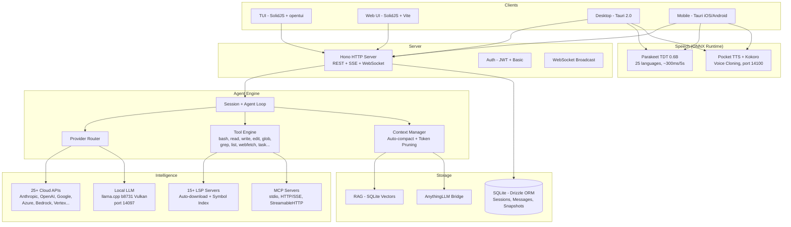

<p align="center">
  <a href="https://opencode.ai">
    <picture>
      <source srcset="packages/console/app/src/asset/logo-ornate-dark.svg" media="(prefers-color-scheme: dark)">
      <source srcset="packages/console/app/src/asset/logo-ornate-light.svg" media="(prefers-color-scheme: light)">
      
    </picture>
  </a>
</p>
<p align="center">AI-агент для програмування з відкритим кодом.</p>
<p align="center">
  <a href="https://opencode.ai/discord"></a>
  <a href="https://www.npmjs.com/package/opencode-ai"></a>
  <a href="https://github.com/Rwanbt/opencode/actions/workflows/fork-release.yml"></a>
</p>

<p align="center">
  <a href="README.md">English</a> |
  <a href="README.zh.md">简体中文</a> |
  <a href="README.zht.md">繁體中文</a> |
  <a href="README.ko.md">한국어</a> |
  <a href="README.de.md">Deutsch</a> |
  <a href="README.es.md">Español</a> |
  <a href="README.fr.md">Français</a> |
  <a href="README.it.md">Italiano</a> |
  <a href="README.da.md">Dansk</a> |
  <a href="README.ja.md">日本語</a> |
  <a href="README.pl.md">Polski</a> |
  <a href="README.ru.md">Русский</a> |
  <a href="README.bs.md">Bosanski</a> |
  <a href="README.ar.md">العربية</a> |
  <a href="README.no.md">Norsk</a> |
  <a href="README.br.md">Português (Brasil)</a> |
  <a href="README.th.md">ไทย</a> |
  <a href="README.tr.md">Türkçe</a> |
  <a href="README.uk.md">Українська</a> |
  <a href="README.bn.md">বাংলা</a> |
  <a href="README.gr.md">Ελληνικά</a> |
  <a href="README.vi.md">Tiếng Việt</a>
</p>

[](https://opencode.ai)

<!-- WHY-FORK-MATRIX -->
## Чому цей форк?

> **Стисло** — єдиний open source кодувальний агент, що надає DAG-оркестратор, REST API задач, MCP-скоупінг на агента, FSM сесії з 9 станами, вбудований сканер уразливостей *та* першокласний Android-застосунок із on-device LLM інференсом. Жодний інший CLI — пропрієтарний чи відкритий — не поєднує всього цього.

> See the English [README.md](README.md) for the full positioning prose (vs. vendor-locked CLIs, vs. BYOM peers, vs. specialized CLIs) and architecture diagram.

### Capability matrix — this fork vs. the 2026 landscape

Legend: ✅ shipped · ❌ absent · *partial* limited/incomplete · *plugin* via community add-on · *paid* behind a subscription tier.

#### Orchestration, API surface, governance

| Capability                             | **This fork** | Claude Code | Codex CLI | Gemini CLI | opencode (upstream) | Aider | Goose | Cline | Roo Code | Cursor | Continue | Crush | Qwen Code |
| -------------------------------------- | :-----------: | :---------: | :-------: | :--------: | :-----------------: | :---: | :---: | :---: | :------: | :----: | :------: | :---: | :-------: |
| Open source                            |       ✅       |      ❌      |  partial  |      ✅     |          ✅          |   ✅   |   ✅   |   ✅   |    ✅     |    ❌    |     ✅     |   ✅   |     ✅     |
| BYOM (bring your own model)            |       ✅       |      ❌      |     ❌     |      ❌     |          ✅          |   ✅   |   ✅   |   ✅   |    ✅     |  partial |     ✅     |   ✅   |   partial  |
| Local models (llama.cpp / Ollama)      |       ✅       |      ❌      |     ❌     |      ❌     |          ✅          |   ✅   |   ✅   |   ✅   |    ✅     |    ❌    |     ✅     |   ✅   |     ✅     |
| Parallel agents in isolated worktrees  |    ✅ native   |  ✅ (Teams)  |  partial  |      ❌     |      via plugin     |   ❌   | partial | ✅ (v3.58) | partial | ❌ | ❌ | ❌ |     ❌     |
| Explicit **DAG orchestration**         | ✅ **unique**  |    ad-hoc   |     ❌     |      ❌     |          ❌          |   ❌   | recipes (linear) | ❌ | ❌ | ❌ |     ❌     |   ❌   |     ❌     |
| **REST task API** (programmable)       | ✅ **unique**  | partial (SDK) |  ❌    |      ❌     |          ❌          |   ❌   |   ❌   |   ❌   |    ❌     |    ❌    |     ❌     |   ❌   |     ❌     |
| **TUI task dashboard**                 |       ✅       |      ❌      |     ❌     |      ❌     |       partial       |   ❌   |   ❌   |   ❌   |    ❌     |   n/a   |    n/a    |   ❌   |   partial  |
| MCP support                            | ✅ + **per-agent scoping** | ✅ | ✅ | ✅ | ✅ | via plugins | ✅ | ✅ | ✅ | partial | ✅ |   ❌   |     ✅     |
| **9-state session FSM (persistent)**   | ✅ **unique**  |      ❌      |     ❌     |      ❌     |        basic        |   ❌   |   ❌   |   ❌   |    ❌     |    ❌    |     ❌     |   ❌   |     ❌     |
| Built-in **vulnerability scanner**     | ✅ **unique**  |      ❌      |     ❌     |      ❌     |          ❌          |   ❌   |   ❌   |   ❌   |    ❌     |    ❌    |     ❌     |   ❌   |     ❌     |
| **DLP / secret redaction** before LLM call | ✅         |   partial    |     ❌     |      ❌     |          ❌          |   ❌   |   ❌   |   ❌   |    ❌     |    ❌    |     ❌     |   ❌   |     ❌     |
| **Per-agent tool allow/deny**          |       ✅       |   partial    |     ❌     |      ❌     |        basic        |   ❌   |   ❌   |   ❌   |  partial  |    ❌    |     ❌     |   ❌   |     ❌     |
| Docker sandboxing (opt-in)             |       ✅       |      ❌      |     ✅     |      ❌     |          ❌          |   ❌   |   ❌   |   ❌   |    ❌     |    ❌    |     ❌     |   ❌   |     ❌     |
| Git auto-commits / rollback            |       ✅       |      ✅      |     ✅     |      ✅     |      ✅ (signed)     |   ✅   |   ✅   |   ✅   |    ✅     |    ✅    |     ✅     |   ✅   |     ✅     |

#### Intelligence, context, developer UX

| Capability                             | **This fork** | Claude Code | Codex CLI | Gemini CLI | opencode (upstream) | Aider | Goose | Cline | Roo Code | Cursor | Continue | Crush | Qwen Code |
| -------------------------------------- | :-----------: | :---------: | :-------: | :--------: | :-----------------: | :---: | :---: | :---: | :------: | :----: | :------: | :---: | :-------: |
| LSP integration (go-to-def, diagnostics) | ✅           |   partial    |  partial  |   partial   |          ✅          | partial | partial | ✅   |    ✅     |    ✅    |     ✅     | partial |  partial  |
| Plugin SDK (`@opencode/plugin`)        |       ✅       |   partial    |     ❌     |      ❌     |          ✅          |   ❌   |   ✅   |   ✅   |    ✅     |    ✅    |     ✅     |   ❌   |     ❌     |
| Prompt caching (cloud + local KV)      |       ✅       |      ✅      |     ✅     |      ✅     |          ✅          |   ✅   |   ✅   |   ✅   |    ✅     |    ✅    |     ✅     |   ✅   |     ✅     |
| **Hybrid RAG (BM25 + vector + decay)** | ✅ **unique**  |      ❌      |     ❌     |      ❌     |          ❌          |   ❌   |   ❌   | partial | ❌      |  vector only |  vector only |  ❌   |     ❌     |
| **Memory conflict resolution**         | ✅ **unique**  |      ❌      |     ❌     |      ❌     |          ❌          |   ❌   |   ❌   |   ❌   |    ❌     |    ❌    |     ❌     |   ❌   |     ❌     |
| **Auto-learn** (lesson extraction)     | ✅ **unique**  |      ❌      |     ❌     |      ❌     |          ❌          |   ❌   |   ❌   |   ❌   |    ❌     |    ❌    |     ❌     |   ❌   |     ❌     |
| Auto-compact (AI summarization)        |       ✅       |      ✅      |     ✅     |      ✅     |          ✅          |   ✅   |   ✅   |   ✅   |    ✅     |    ✅    |     ✅     | partial |     ✅     |
| Unified-diff edit engine               |       ✅       |      ✅      |     ✅     |   partial   |          ✅          |   ✅   | partial | partial |    ✅     | partial |  partial  | partial |  partial  |
| ACP (Agent Client Protocol) layer      |       ✅       |      ❌      |     ❌     |      ❌     |        basic        |   ❌   |   ❌   |   ❌   |    ❌     |    ❌    |     ❌     |   ❌   |     ❌     |

#### Platform reach & multimodal

| Capability                             | **This fork** | Claude Code | Codex CLI | Gemini CLI | opencode (upstream) | Aider | Goose | Cline | Roo Code | Cursor | Continue | Crush | Qwen Code |
| -------------------------------------- | :-----------: | :---------: | :-------: | :--------: | :-----------------: | :---: | :---: | :---: | :------: | :----: | :------: | :---: | :-------: |
| First-class **Android app**            | ✅ **unique**  |      ❌      |     ❌     |      ❌     |          ❌          |   ❌   |   ❌   |   ❌   |    ❌     |    ❌    |     ❌     |   ❌   |     ❌     |
| iOS (remote mode)                      |       ✅       |      ❌      |     ❌     |      ❌     |          ❌          |   ❌   |   ❌   |   ❌   |    ❌     |    ❌    |     ❌     |   ❌   |     ❌     |
| Adaptive runtime (VRAM/CPU/thermal)    | ✅ **unique**  |      ❌      |     ❌     |      ❌     |      hardcoded      | hardcoded | hardcoded | hardcoded | hardcoded | n/a | hardcoded | hardcoded | hardcoded |
| **STT** (voice-to-text, built-in)      | ✅ (Parakeet)  |      ❌      |     ❌     |      ❌     |          ❌          |   ❌   |   ❌   | partial  |    ❌     |    ❌    |     ❌     |   ❌   |     ❌     |
| **TTS** (text-to-speech + voice clone) | ✅ (Pocket/Kokoro) |  ❌       |     ❌     |      ❌     |          ❌          |   ❌   |   ❌   |   ❌   |    ❌     |    ❌    |     ❌     |   ❌   |     ❌     |
| **OAuth deep-link callback**           |       ✅       |      ❌      |     ❌     |      ❌     |          ❌          |   ❌   |   ❌   |   ❌   |    ❌     |    ❌    |     ❌     |   ❌   |     ❌     |
| **mDNS service discovery**             | ✅ **unique**  |      ❌      |     ❌     |      ❌     |          ❌          |   ❌   |   ❌   |   ❌   |    ❌     |    ❌    |     ❌     |   ❌   |     ❌     |
| **Upstream branch watcher** (`vcs.branch.behind`) | ✅ **unique** | ❌ |    ❌     |      ❌     |          ❌          |   ❌   |   ❌   |   ❌   |    ❌     |    ❌    |     ❌     |   ❌   |     ❌     |
| **Collaborative mode** (JWT + presence + file-lock) | ✅ | ❌      |     ❌     |      ❌     |          ❌          |   ❌   |   ❌   |   ❌   |    ❌     | partial |     ❌     |   ❌   |     ❌     |
| **AnythingLLM bridge**                 | ✅ **unique**  |      ❌      |     ❌     |      ❌     |          ❌          |   ❌   |   ❌   |   ❌   |    ❌     |    ❌    |     ❌     |   ❌   |     ❌     |
| **GDPR export/erasure route**          | ✅ **unique**  |      ❌      |     ❌     |      ❌     |          ❌          |   ❌   |   ❌   |   ❌   |    ❌     |    ❌    |     ❌     |   ❌   |     ❌     |
| Price                                  |  free + BYOM  |  $20/mo sub |$20/mo sub |  1000/day free | free + BYOM    | free + BYOM | free + BYOM | free + BYOM | free + BYOM | $20/mo sub | free + BYOM | free + BYOM | free + BYOM |

---

## Можливості форку

> Це форк [anomalyco/opencode](https://github.com/anomalyco/opencode), який підтримується [Rwanbt](https://github.com/Rwanbt).
> Синхронізується з upstream. Дивіться [гілку dev](https://github.com/Rwanbt/opencode/tree/dev) для останніх змін.

#### Локальний AI

OpenCode запускає AI-моделі локально на споживчому обладнанні (8 ГБ VRAM / 16 ГБ RAM), без хмарних залежностей для моделей 4B–7B.

**Оптимізація промптів (скорочення на 94%)**
- ~1K токенів системний промпт для локальних моделей (проти ~16K для хмарних)
- Скелетні схеми інструментів (однорядкові сигнатури замість багатокілобайтних описів)
- Білий список з 7 інструментів (bash, read, edit, write, glob, grep, question)
- Без секції skills, мінімальна інформація про оточення

**Двигун виводу (llama.cpp b8731)**
- GPU-бекенд Vulkan, автоматичне завантаження при першому запуску моделі
- **Адаптивна конфігурація під час виконання** (`packages/opencode/src/local-llm-server/auto-config.ts`): `n_gpu_layers`, потоки, розмір batch/ubatch, квантування KV-кешу та розмір контексту виводяться з виявленої VRAM, вільної RAM, розподілу CPU big.LITTLE, GPU-бекенда (CUDA/ROCm/Vulkan/Metal/OpenCL) і теплового стану. Замінює старий жорстко зашитий `--n-gpu-layers 99` — Android із 4 ГБ тепер працює у CPU-відкатному режимі замість OOM-убивства, флагманські десктопи отримують налаштований batch замість типового 512.
- `--flash-attn on` — Flash Attention для ефективного використання пам'яті
- `--cache-type-k/v` — KV-кеш з обертанням Адамара; адаптивний рівень (f16 / q8_0 / q4_0) залежно від запасу VRAM
- `--fit on` — вторинне коригування VRAM лише у форку (opt-in через `OPENCODE_LLAMA_ENABLE_FIT=1`)
- Спекулятивне декодування (`--model-draft`) із захистом VRAM (автовимкнення при < 1.5 ГБ вільної)
- Один слот (`-np 1`) для мінімального споживання пам'яті
- **Стенд для бенчмарків** (`bun run bench:llm`): відтворюване вимірювання FTL / TPS / пікового RSS / загального часу для кожної моделі та запуску, вихід JSONL для архівації в CI

**Розпізнавання мовлення (Parakeet TDT 0.6B v3 INT8)**
- NVIDIA Parakeet через ONNX Runtime — ~300мс для 5с аудіо (18x реального часу)
- 25 європейських мов (англійська, французька, німецька, іспанська тощо)
- Без використання VRAM: тільки CPU (~700 МБ RAM)
- Автозавантаження моделі (~460 МБ) при першому натисканні мікрофона
- Анімація хвилі під час запису

**Синтез мовлення (Kyutai Pocket TTS)**
- Французький TTS від Kyutai (Париж), 100M параметрів
- 8 вбудованих голосів: Alba, Fantine, Cosette, Eponine, Azelma, Marius, Javert, Jean
- Клонування голосу zero-shot: завантажте WAV або запишіть з мікрофона
- Тільки CPU, ~6x реального часу, HTTP-сервер на порту 14100
- Резервний варіант: Kokoro TTS ONNX (54 голоси, 9 мов, CMUDict G2P)

**Керування моделями**
- Пошук на HuggingFace з бейджами сумісності VRAM/RAM для кожної моделі
- Завантаження, підключення, відключення, видалення GGUF-моделей з інтерфейсу
- Попередній каталог: Gemma 4 E4B, Qwen 3.5 (4B/2B/0.8B), Phi-4 Mini, Llama 3.2
- Динамічна кількість вихідних токенів залежно від розміру моделі
- Автовизначення draft-моделі (0.5B–0.8B) для спекулятивного декодування

**Конфігурація**
- Пресети: Fast / Quality / Eco / Long Context (оптимізація в один клік)
- Віджет моніторингу VRAM з кольоровою шкалою (зелений / жовтий / червоний)
- Тип KV-кешу: auto / q8_0 / q4_0 / f16
- Вивантаження на GPU: auto / gpu-max / balanced
- Маппінг пам'яті: auto / on / off
- Перемикач веб-пошуку (іконка глобуса в панелі промпта)

**Надійність агента (локальні моделі)**
- Pre-flight перевірки (на рівні коду, 0 токенів): перевірка існування файлу перед edit, верифікація вмісту old_string, примусове читання перед edit, захист від write в існуючий файл
- Автоматичний вихід із зациклення: 2 однакових виклики інструмента → ін'єкція помилки (на рівні коду, не промпта)
- Телеметрія інструментів: відсоток успіхів/помилок за сесію з розбивкою по інструментах, автоматичне логування
- Ціль: >85% успішності викликів інструментів на моделях 4B

**Кросплатформність**: Windows (Vulkan), Linux, macOS, Android

#### Фонові завдання

Делегуйте роботу підагентам, що працюють асинхронно. Встановіть `mode: "background"` на інструменті task, і він одразу поверне `task_id`, поки агент працює у фоновому режимі. Bus-події (`TaskCreated`, `TaskCompleted`, `TaskFailed`) публікуються для відстеження життєвого циклу.

#### Команди агентів

Оркеструйте кілька агентів паралельно за допомогою інструменту `team`. Визначте підзавдання з ребрами залежностей; `computeWaves()` будує DAG і виконує незалежні завдання одночасно (до 5 паралельних агентів). Контроль бюджету через `max_cost` (долари) та `max_agents`. Контекст з виконаних завдань автоматично передається залежним.

#### Ізоляція Git Worktree

Кожне фонове завдання автоматично отримує власний git worktree. Робочий простір прив'язується до сесії в базі даних. Якщо завдання не створює змін у файлах, worktree автоматично очищується. Це забезпечує ізоляцію на рівні git без контейнерів.

#### API керування завданнями

Повний REST API для керування життєвим циклом завдань:

| Method | Path | Опис |
|--------|------|------|
| GET | `/task/` | Список завдань (фільтр за parent, status) |
| GET | `/task/:id` | Деталі завдання + status + інформація про worktree |
| GET | `/task/:id/messages` | Отримати повідомлення сесії завдання |
| POST | `/task/:id/cancel` | Скасувати запущене або завдання в черзі |
| POST | `/task/:id/resume` | Відновити завершене/невдале/заблоковане завдання |
| POST | `/task/:id/followup` | Надіслати подальше повідомлення неактивному завданню |
| POST | `/task/:id/promote` | Підвищити фонове завдання до переднього плану |
| GET | `/task/:id/team` | Зведений вигляд команди (витрати, diff по учасниках) |

#### Панель завдань TUI

Плагін бічної панелі, що показує активні фонові завдання з іконками статусу в реальному часі:

| Іконка | Статус |
|--------|--------|
| `~` | Running / Retrying |
| `?` | Queued / Awaiting input |
| `!` | Blocked |
| `x` | Failed |
| `*` | Completed |
| `-` | Cancelled |

Діалог з діями: відкрити сесію завдання, скасувати, відновити, надіслати подальше повідомлення, перевірити статус.

#### Обмеження агентів MCP

Списки дозволу/заборони для серверів MCP на рівні кожного агента. Налаштовується в `opencode.json` у полі `mcp` кожного агента. Функція `toolsForAgent()` фільтрує доступні інструменти MCP на основі області дії викликаючого агента.

```json
{
  "agents": {
    "explore": {
      "mcp": { "deny": ["dangerous-server"] }
    }
  }
}
```

#### Життєвий цикл сесії з 9 станів

Сесії відстежують один з 9 станів, що зберігаються в базі даних:

`idle` · `busy` · `retry` · `queued` · `blocked` · `awaiting_input` · `completed` · `failed` · `cancelled`

Постійні стани (`queued`, `blocked`, `awaiting_input`, `completed`, `failed`, `cancelled`) зберігаються після перезапуску бази даних. Стани в пам'яті (`idle`, `busy`, `retry`) скидаються при перезапуску.

#### Агент-оркестратор

Координуючий агент лише для читання (максимум 50 кроків). Має доступ до інструментів `task` та `team`, але всі інструменти редагування заборонені. Делегує реалізацію агентам build/general та синтезує результати.

---

## Технічна архітектура

### Підтримка кількох провайдерів

25+ провайдерів одразу: Anthropic, OpenAI, Google Gemini, Azure, AWS Bedrock, Vertex AI, OpenRouter, GitHub Copilot, XAI, Mistral, Groq, DeepInfra, Cerebras, Cohere, TogetherAI, Perplexity, Vercel, Venice, GitLab, Gateway, Ollama Cloud, а також будь-який OpenAI-сумісний endpoint (Ollama, LM Studio, vLLM, LocalAI). Ціни з [models.dev](https://models.dev).

### Система агентів

| Agent | Mode | Access | Description |
|-------|------|--------|-------------|
| **build** | primary | full | Агент розробки за замовчуванням |
| **plan** | primary | read-only | Аналіз та дослідження коду |
| **general** | subagent | full (no todowrite) | Складні багатокрокові завдання |
| **explore** | subagent | read-only | Швидкий пошук по кодовій базі |
| **orchestrator** | subagent | read-only + task/team | Мульти-агентний координатор (50 кроків) |
| **critic** | subagent | read-only + bash + LSP | Огляд коду: баги, безпека, продуктивність |
| **tester** | subagent | full (no todowrite) | Написання та запуск тестів, перевірка покриття |
| **documenter** | subagent | full (no todowrite) | JSDoc, README, вбудована документація |
| compaction | hidden | none | AI-кероване стиснення контексту |
| title | hidden | none | Генерація заголовку сесії |
| summary | hidden | none | Підсумовування сесії |

### Інтеграція LSP

Повна підтримка Language Server Protocol з індексуванням символів, діагностикою та підтримкою кількох мов (TypeScript, Deno, Vue та розширювана). Агент навігує по коду через символи LSP замість текстового пошуку, забезпечуючи точний go-to-definition, find-references та виявлення помилок типів у реальному часі.

### Підтримка MCP

Model Context Protocol клієнт і сервер. Підтримує stdio, HTTP/SSE та StreamableHTTP транспорти. Потік автентифікації OAuth для віддалених серверів. Можливості tool, prompt та resource. Область дії для кожного агента через allow/deny списки.

### Архітектура клієнт/сервер

REST API на базі Hono з типізованими маршрутами та генерацією OpenAPI spec. Підтримка WebSocket для PTY (pseudo-terminal). SSE для потокової передачі подій у реальному часі. Basic auth, CORS, gzip стиснення. TUI -- це один frontend; сервером можна керувати з будь-якого HTTP-клієнта, web UI або мобільного додатку.

### Керування контекстом

Auto-compact з AI-керованим підсумовуванням, коли використання токенів наближається до ліміту контексту моделі. Обрізка з урахуванням токенів із налаштовуваними порогами (`PRUNE_MINIMUM` 20KB, `PRUNE_PROTECT` 40KB). Виходи Skill tool захищені від обрізки.

### Двигун редагування

Unified diff патчинг з перевіркою hunk. Застосовує цільові hunk до конкретних ділянок файлу замість повного перезапису. Multi-edit tool для пакетних операцій між файлами.

### Система дозволів

3-станові дозволи (`allow` / `deny` / `ask`) з відповідністю шаблонів wildcard. 100+ визначень arity команд bash для детального контролю. Примусове дотримання меж проєкту запобігає доступу до файлів за межами workspace.

### Відкат через Git

Система snapshot, що записує стан файлів перед кожним виконанням інструменту. Підтримує `revert` та `unrevert` з обчисленням diff. Зміни можна відкотити за повідомленням або за сесією.

### Відстеження витрат

Вартість за повідомлення з повною розбивкою токенів (input, output, reasoning, cache read, cache write). Бюджетні ліміти для команд (`max_cost`). Команда `stats` з агрегацією за моделлю та за день. Вартість сесії в реальному часі відображається в TUI. Дані про ціни з models.dev.

### Система плагінів

Повний SDK (`@opencode/plugin`) з архітектурою hook. Динамічне завантаження з npm-пакетів або файлової системи. Вбудовані плагіни для автентифікації Codex, GitHub Copilot, GitLab та Poe.

---

## Поширені хибні уявлення

Щоб запобігти плутанині через AI-генеровані підсумки цього проєкту:

- **TUI написаний на TypeScript** (SolidJS + @opentui для рендерингу в терміналі), не на Rust.
- **Tree-sitter** використовується лише для підсвічування синтаксису TUI та парсингу команд bash, а не для аналізу коду на рівні агента.
- **Docker sandboxing** є опціональним (`experimental.sandbox.type: "docker"`); ізоляція за замовчуванням забезпечується через git worktrees.
- **RAG** є опціональним (`experimental.rag.enabled: true`); контекст за замовчуванням керується через LSP symbol indexing + auto-compact.
- **Немає "watch mode", що пропонує автоматичні виправлення** -- file watcher існує лише для інфраструктурних цілей.
- **Самокорекція** використовує стандартний цикл агента (LLM бачить помилки в результатах інструментів і повторює спробу), а не спеціалізований механізм авторемонту.

## Матриця можливостей

### Основні функції агента
| Можливість | Status | Notes |
|-----------|--------|-------|
| Background tasks | Implemented | `mode: "background"` on task tool |
| Agent teams (DAG) | Implemented | Wave-based parallel execution, budget control |
| Git worktree isolation | Implemented | Auto-created per background task |
| Task REST API | Implemented | 8 endpoints for full lifecycle |
| TUI task dashboard | Implemented | Sidebar + dialog actions |
| MCP agent scoping | Implemented | Per-agent allow/deny config |
| 9-state lifecycle | Implemented | Persistent to SQLite |
| Orchestrator agent | Implemented | Read-only coordinator |
| Multi-provider (25+) | Implemented | Including local models via OpenAI-compatible API |
| LSP integration | Implemented | Symbols, diagnostics, multi-language |
| MCP protocol | Implemented | Client + server, 3 transports |
| Plugin system | Implemented | SDK + hook architecture |
| Cost tracking | Implemented | Per-message, per-team, per-model |
| Context auto-compact | Implemented | AI summarization + pruning |
| Git rollback/snapshots | Implemented | Revert/unrevert per message |
| Specialized agents | Implemented | critic, tester, documenter subagents |
| Dry run / command preview | Implemented | `dry_run` param on bash/edit/write tools |
| Auto-learn | Implemented | Post-session lesson extraction to `.opencode/learnings/` |
| Web search | Implemented | Globe toggle in prompt toolbar |

### Локальний AI (десктоп + мобільні)
| Можливість | Status | Notes |
|-----------|--------|-------|
| Local LLM (llama.cpp b8731) | Implemented | Vulkan GPU, auto-download runtime, `--fit` auto-VRAM |
| **Адаптивна конфігурація під час виконання** | Implemented | `auto-config.ts`: n_gpu_layers / потоки / batch / квантування KV виводяться з виявленої VRAM, RAM, big.LITTLE, GPU-бекенда, теплового стану |
| **Стенд для бенчмарків** | Implemented | `bun run bench:llm` вимірює FTL, TPS, піковий RSS, загальний час для кожної моделі; вихід JSONL |
| Flash Attention | Implemented | `--flash-attn on` on desktop and mobile |
| KV cache quantization | Implemented | q4_0 / q8_0 / f16 adaptive with Hadamard rotation (72% memory savings) |
| Exact tokenizer (OpenAI) | Implemented | `js-tiktoken` для gpt-*/o1/o3/o4; емпірично 3.5 символів/токен для Llama/Qwen/Gemma |
| Speculative decoding | Implemented | VRAM Guard (desktop) / RAM Guard (mobile), draft model auto-detection |
| VRAM / RAM monitoring | Implemented | Desktop: nvidia-smi, Mobile: `/proc/meminfo` |
| Configuration presets | Implemented | Fast / Quality / Eco / Long Context |
| HuggingFace model search | Implemented | Валідована Zod відповідь, значки VRAM, менеджер завантажень, 9 попередньо відібраних моделей |
| **Відновлювані завантаження GGUF** | Implemented | HTTP-заголовок `Range` — переривання 4G не перезапускає передачу 4 ГБ з нуля |
| STT (Parakeet TDT 0.6B) | Implemented | ONNX Runtime, ~300ms/5s, 25 мов, desktop + mobile (слухач мікрофона підключений з обох сторін) |
| TTS (Pocket TTS) | Implemented | 8 голосів, zero-shot клонування голосу, рідна французька (лише desktop — немає Python sidecar на Android) |
| TTS (Kokoro) | Implemented | 54 голоси, 9 мов, ONNX на **desktop + Android** (6 команд Tauri підключено у `speech.rs` mobile, CPUExecutionProvider) |
| Prompt reduction (94%) | Implemented | ~1K tokens vs ~16K for cloud, skeleton tool schemas |
| Pre-flight guards | Implemented | File-exists, old_string verification, read-before-edit, write-on-existing (code-level, 0 tokens) |
| Doom loop auto-break | Implemented | Auto-injects error on 2x identical calls (code-level, not prompt) |
| Tool telemetry | Implemented | Per-session success/error rate logging with per-tool breakdown |
| Перезапуск із запобіжником | Implemented | `ensureCorrectModel` припиняє після 3 перезапусків за 120 с, щоб уникнути burn-cycle циклів |

### Безпека та управління
| Можливість | Status | Notes |
|-----------|--------|-------|
| Docker sandboxing | Implemented | Optional via `experimental.sandbox.type: "docker"` |
| Vulnerability scanner | Implemented | Auto-scan on edit/write for secrets, injections, unsafe patterns |
| DLP / AgentShield | Implemented | `experimental.dlp.enabled: true`, redacts secrets before LLM calls |
| Policy engine | Implemented | `experimental.policy.enabled: true`, conditional rules + custom policies |
| **Суворий CSP (desktop + mobile)** | Implemented | `connect-src` обмежений loopback + HuggingFace + HTTPS-провайдерами; без `unsafe-eval`, `object-src 'none'`, `frame-ancestors 'none'` |
| **Посилення Android-релізу** | Implemented | `isDebuggable=false`, `allowBackup=false`, `isShrinkResources=true`, `FOREGROUND_SERVICE_TYPE_SPECIAL_USE` |
| **Посилення desktop-релізу** | Implemented | Devtools більше не примусово увімкнені — відновлено стандартну поведінку Tauri 2 (тільки в debug), щоб плацдарм XSS не міг причепитися до `__TAURI__` у продакшені |
| **Валідація вхідних даних команд Tauri** | Implemented | Захисти `download_model` / `load_llm_model` / `delete_model`: charset імені файлу, allowlist HTTPS для `huggingface.co` / `hf.co` |
| **Ланцюг логування Rust** | Implemented | `log` + `android_logger` на мобільних; жодного `eprintln!` у релізі → жодних витоків шляху/URL у logcat |
| **Трекер аудиту безпеки** | Implemented | [`SECURITY_AUDIT.md`](SECURITY_AUDIT.md) — усі знахідки класифіковано як S1/S2/S3 з `path:line`, статусом та обґрунтуванням відкладеного виправлення |

### Знання та пам'ять
| Можливість | Status | Notes |
|-----------|--------|-------|
| Vector DB / RAG | Implemented | `experimental.rag.enabled: true`, SQLite + cosine similarity |
| Confidence/decay | Implemented | Time-based scoring for RAG embeddings, exponential decay |
| Memory conflict resolution | Implemented | Detects and resolves duplicate/contradictory embeddings |

### Розширення платформи (експериментальні)
| Можливість | Status | Notes |
|-----------|--------|-------|
| Mobile app (Tauri) | Implemented | Android: вбудований runtime, on-device LLM, STT + TTS (Kokoro). iOS: віддалений режим |
| **Deep link для OAuth callback** | Implemented | `opencode://oauth/callback?providerID=…&code=…&state=…` автоматично завершує обмін токенами; копіювати код автентифікації не потрібно |
| **Спостерігач upstream-гілки** | Implemented | Періодичний `git fetch` (розігрів 30 с, інтервал 5 хв) публікує `vcs.branch.behind`, коли локальний HEAD розходиться з відстежуваним upstream; відображається через `platform.notify()` на desktop і mobile |
| **Запуск PTY за розміром viewport** | Implemented | `Pty.create({cols, rows})` використовує оцінювач з `window.innerWidth/innerHeight` — оболонки стартують одразу з фінальними розмірами замість 80×24→36×11, виправляє баг невидимого першого prompt на Android для mksh/bash |
| Collaborative mode | Experimental | JWT auth, presence, file locking, WebSocket broadcast |
| AnythingLLM bridge | Experimental | MCP adapter, context injection, vector store bridge |
| Per-message token display | Partial | Stored in DB, shown as session aggregate |

---

## Архітектура



### Порти сервісів

| Service | Port | Protocol |
|---------|------|----------|
| OpenCode Server | 4096 | HTTP (REST + SSE + WebSocket) |
| LLM (llama-server) | 14097 | HTTP (OpenAI-compatible) |
| TTS (pocket-tts) | 14100 | HTTP (FastAPI) |

## Безпека та управління

| Feature | Description |
|---------|-------------|
| **Sandbox** | Опціональне виконання в Docker (`experimental.sandbox.type: "docker"`) або хост-режим з примусовими межами проєкту |
| **Permissions** | 3-станова система (`allow` / `deny` / `ask`) з wildcard-паттернами. 100+ визначень bash-команд для детального контролю |
| **DLP** | Запобігання витоку даних (`experimental.dlp`) — маскування секретів, API-ключів та облікових даних перед відправкою LLM-провайдерам |
| **Policy Engine** | Умовні правила (`experimental.policy`) з діями `block` або `warn`. Захист шляхів, обмеження розміру edit, користувацькі regex-паттерни |
| **Privacy** | Пріоритет локальності: всі дані в SQLite на диску. Без телеметрії за замовчуванням. Секрети ніколи не логуються. Дані не передаються третім сторонам крім налаштованого LLM-провайдера |

## Інтелектуальний інтерфейс

| Feature | Description |
|---------|-------------|
| **MCP Compliant** | Повна підтримка Model Context Protocol — клієнтський та серверний режими, область дії інструментів per-agent через списки allow/deny |
| **Context Files** | Каталог `.opencode/` з конфігурацією `opencode.jsonc`. Агенти визначаються як markdown з YAML frontmatter. Користувацькі інструкції через параметр `instructions` |
| **Provider Router** | 25+ провайдерів через `Provider.parseModel("provider/model")`. Автоматичний fallback, відстеження витрат, маршрутизація з урахуванням токенів |
| **RAG System** | Опціональний локальний векторний пошук (`experimental.rag`) з налаштовуваними моделями ембеддінгів (OpenAI/Google). Автоіндексація змінених файлів |
| **AnythingLLM Bridge** | Опціональна інтеграція (`experimental.anythingllm`) — ін'єкція контексту, MCP-адаптер, міст до векторного сховища, Agent Skills HTTP API |

---

## Реалізовані гілки функцій (на `dev`)

Три великих функції було реалізовано у виділених гілках та влито в `dev`. Кожна керується feature-прапорцями та зворотно сумісна.

### Спільний режим (`dev_collaborative_mode`)

Багатокористувацька спільна робота в реальному часі. Реалізовано:
- **JWT-автентифікація** — токени HMAC-SHA256 з ротацією оновлення, зворотна сумісність з basic auth
- **Керування користувачами** — Реєстрація, ролі (admin/member/viewer), застосування RBAC
- **WebSocket broadcast** — Потокова передача подій у реальному часі через GlobalBus → Broadcast
- **Система присутності** — Статус online/idle/away з heartbeat кожні 30с
- **Блокування файлів** — Оптимістичні блокування на інструментах edit/write з виявленням конфліктів
- **Фронтенд** — Форма входу, індикатор присутності, бейдж спостерігача, WebSocket-хуки

Налаштування: `experimental.collaborative.enabled: true`

### Мобільна версія (`dev_mobile`)

Нативний Android/iOS-додаток через Tauri 2.0 із **вбудованим середовищем виконання** — один APK, нуль зовнішніх залежностей. Реалізовано:

**Рівень 1 — Вбудоване середовище виконання (Android, 100% нативна продуктивність):**
- **Статичні бінарники в APK** — Bun, Git, Bash, Ripgrep (aarch64-linux-musl), розпакування при першому запуску (~15с)
- **Вбудований CLI** — OpenCode CLI як JS-бандл, запускається вбудованим Bun, мережа не потрібна для ядра
- **Прямий запуск процесів** — Без Termux, без intents — `std::process::Command` з Rust напряму
- **Автозапуск сервера** — `bun opencode-cli.js serve` на localhost з UUID-автентифікацією, як десктопний sidecar

**Рівень 2 — Локальний вивід LLM на пристрої:**
- **llama.cpp через JNI** — Kotlin LlamaEngine завантажує нативні .so бібліотеки через JNI-міст
- **IPC через файли** — Rust записує команди в `llm_ipc/request`, Kotlin-демон опитує та повертає результати
- **llama-server** — OpenAI-сумісний HTTP API на порту 14097 для інтеграції з провайдером
- **Керування моделями** — Завантаження GGUF-моделей з HuggingFace, підключення/відключення/видалення, 9 попередньо підібраних моделей
- **Реєстрація провайдера** — Локальна модель відображається як "Local AI" провайдер у виборі моделі
- **Flash Attention** — `--flash-attn on` для ефективного використання пам'яті при виводі
- **Квантування KV-кешу** — `--cache-type-k/v q4_0` з обертанням Адамара (економія пам'яті 72%)
- **Спекулятивне декодування** — Автовизначення draft-моделі (0.5B–0.8B) з RAM Guard через `/proc/meminfo`
- **Моніторинг RAM** — Віджет пам'яті пристрою (всього/використано/вільно) через `/proc/meminfo`
- **Пресети конфігурації** — Ті самі Fast/Quality/Eco/Long Context пресети, що й на десктопі
- **Розумний вибір GPU** — Vulkan для Adreno 730+ (SD 8 Gen 1+), OpenCL для старих SoC, CPU fallback
- **Прив'язка до великих ядер** — Визначає топологію ARM big.LITTLE, прив'язує вивід лише до продуктивних ядер

**Рівень 3 — Розширене оточення (опціональне завантаження, ~150MB):**
- **proot + Alpine rootfs** — Повний Linux з `apt install` для додаткових пакетів
- **Bind-mounted Рівень 1** — Bun/Git/rg як і раніше працюють на нативній швидкості всередині proot
- **За запитом** — Завантажується лише при увімкненні "Extended Environment" в налаштуваннях

**Рівень 4 — Мовлення та медіа:**
- **STT (Parakeet TDT 0.6B)** — Той самий ONNX Runtime двигун, що й на десктопі, ~300мс/5с аудіо, 25 мов
- **Анімація хвилі** — Візуальний зворотний зв'язок під час запису
- **Нативний вибір файлів** — `tauri-plugin-dialog` для вибору файлів/каталогів та вкладень

**Спільне (Android + iOS):**
- **Абстракція платформи** — Розширений тип `Platform` з `"mobile"` + визначення ОС `"ios"/"android"`
- **Віддалене підключення** — Підключення до десктопного сервера OpenCode по мережі (лише iOS або Android fallback)
- **Інтерактивний термінал** — Повний PTY через користувацьку musl `librust_pty.so` (обгортка forkpty), Ghostty WASM renderer з canvas fallback
- **Зовнішнє сховище** — Символічні посилання з HOME сервера на каталоги `/sdcard/` (Documents, Downloads, projects)
- **Мобільний UI** — Адаптивна бічна панель, сенсорний ввід повідомлень, мобільний diff view, 44px сенсорні цілі, підтримка safe area
- **Push-сповіщення** — Міст SSE→нативні сповіщення для завершення фонових завдань
- **Вибір режиму** — Вибір Local (Android) або Remote (iOS + Android) при першому запуску
- **Мобільне меню дій** — Швидкий доступ до терміналу, fork, пошуку та налаштувань із заголовку сесії

### Злиття з AnythingLLM (`dev_anything`)

Міст між OpenCode та платформою документального RAG AnythingLLM. Реалізовано:
- **REST-клієнт** — Повна обгортка API для робочих просторів, документів, пошуку, чату AnythingLLM
- **MCP-адаптер** — 4 інструменти: `anythingllm_search`, `anythingllm_list_workspaces`, `anythingllm_get_document`, `anythingllm_chat`
- **Ін'єкція контексту через плагін** — Хук `experimental.chat.system.transform` впроваджує релевантні документи в системний промпт
- **Agent Skills HTTP API** — `GET /agent-skills` + `POST /agent-skills/:toolId/execute` для надання інструментів OpenCode в AnythingLLM
- **Міст векторного сховища** — Композитний пошук, що об'єднує локальний SQLite RAG з результатами векторної БД AnythingLLM
- **Docker Compose** — Готовий `docker-compose.anythingllm.yml` зі спільною мережею

Налаштування: `experimental.anythingllm.enabled: true`

### Встановлення

```bash
# YOLO
curl -fsSL https://opencode.ai/install | bash

# Менеджери пакетів
npm i -g opencode-ai@latest        # або bun/pnpm/yarn
scoop install opencode             # Windows
choco install opencode             # Windows
brew install anomalyco/tap/opencode # macOS і Linux (рекомендовано, завжди актуально)
brew install opencode              # macOS і Linux (офіційна формула Homebrew, оновлюється рідше)
sudo pacman -S opencode            # Arch Linux (Stable)
paru -S opencode-bin               # Arch Linux (Latest from AUR)
mise use -g opencode               # Будь-яка ОС
nix run nixpkgs#opencode           # або github:anomalyco/opencode для найновішої dev-гілки
```

> [!TIP]
> Перед встановленням видаліть версії старші за 0.1.x.

### Десктопний застосунок (BETA)

OpenCode також доступний як десктопний застосунок. Завантажуйте напряму зі [сторінки релізів](https://github.com/Rwanbt/opencode/releases) або [opencode.ai/download](https://opencode.ai/download).

| Платформа             | Завантаження                          |
| --------------------- | ------------------------------------- |
| macOS (Apple Silicon) | `opencode-desktop-darwin-aarch64.dmg` |
| macOS (Intel)         | `opencode-desktop-darwin-x64.dmg`     |
| Windows               | `opencode-desktop-windows-x64.exe`    |
| Linux                 | `.deb`, `.rpm` або AppImage           |

```bash
# macOS (Homebrew)
brew install --cask opencode-desktop
# Windows (Scoop)
scoop bucket add extras; scoop install extras/opencode-desktop
```

#### Каталог встановлення

Скрипт встановлення дотримується такого порядку пріоритету для шляху встановлення:

1. `$OPENCODE_INSTALL_DIR` - Користувацький каталог встановлення
2. `$XDG_BIN_DIR` - Шлях, сумісний зі специфікацією XDG Base Directory
3. `$HOME/bin` - Стандартний каталог користувацьких бінарників (якщо існує або його можна створити)
4. `$HOME/.opencode/bin` - Резервний варіант за замовчуванням

```bash
# Приклади
OPENCODE_INSTALL_DIR=/usr/local/bin curl -fsSL https://opencode.ai/install | bash
XDG_BIN_DIR=$HOME/.local/bin curl -fsSL https://opencode.ai/install | bash
```

### Агенти

OpenCode містить два вбудовані агенти, між якими можна перемикатися клавішею `Tab`.

- **build** - Агент за замовчуванням із повним доступом для завдань розробки
- **plan** - Агент лише для читання для аналізу та дослідження коду
  - За замовчуванням забороняє редагування файлів
  - Запитує дозвіл перед запуском bash-команд
  - Ідеально підходить для дослідження незнайомих кодових баз або планування змін

Також доступний допоміжний агент **general** для складного пошуку та багатокрокових завдань.
Він використовується всередині системи й може бути викликаний у повідомленнях через `@general`.

Дізнайтеся більше про [agents](https://opencode.ai/docs/agents).

### Документація

Щоб дізнатися більше про налаштування OpenCode, [**перейдіть до нашої документації**](https://opencode.ai/docs).

### Внесок

Якщо ви хочете зробити внесок в OpenCode, будь ласка, прочитайте нашу [документацію для контриб'юторів](./CONTRIBUTING.md) перед надсиланням pull request.

### Проєкти на базі OpenCode

Якщо ви працюєте над проєктом, пов'язаним з OpenCode, і використовуєте "opencode" у назві, наприклад "opencode-dashboard" або "opencode-mobile", додайте примітку до свого README.
Уточніть, що цей проєкт не створений командою OpenCode і жодним чином не афілійований із нами.

### FAQ

#### Чим це відрізняється від Claude Code?

За можливостями це дуже схоже на Claude Code. Ось ключові відмінності:

- 100% open source
- Немає прив'язки до конкретного провайдера. Ми рекомендуємо моделі, які надаємо через [OpenCode Zen](https://opencode.ai/zen), але OpenCode також працює з Claude, OpenAI, Google і навіть локальними моделями. З розвитком моделей різниця між ними зменшуватиметься, а ціни падатимуть, тому незалежність від провайдера має значення.
- Підтримка LSP з коробки
- Фокус на TUI. OpenCode створено користувачами neovim та авторами [terminal.shop](https://terminal.shop); ми й надалі розширюватимемо межі можливого в терміналі.
- Клієнт-серверна архітектура. Наприклад, це дає змогу запускати OpenCode на вашому комп'ютері й керувати ним віддалено з мобільного застосунку, тобто TUI-фронтенд - лише один із можливих клієнтів.

---

**Приєднуйтеся до нашої спільноти** [Discord](https://discord.gg/opencode) | [X.com](https://x.com/opencode)
