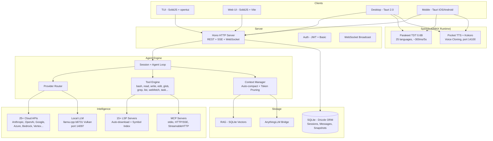

<p align="center">
  <a href="https://opencode.ai">
    <picture>
      <source srcset="packages/console/app/src/asset/logo-ornate-dark.svg" media="(prefers-color-scheme: dark)">
      <source srcset="packages/console/app/src/asset/logo-ornate-light.svg" media="(prefers-color-scheme: light)">
      
    </picture>
  </a>
</p>
<p align="center">开源的 AI Coding Agent。</p>
<p align="center">
  <a href="https://opencode.ai/discord"></a>
  <a href="https://www.npmjs.com/package/opencode-ai"></a>
  <a href="https://github.com/Rwanbt/opencode/actions/workflows/fork-release.yml"></a>
</p>

<p align="center">
  <a href="README.md">English</a> |
  <a href="README.zh.md">简体中文</a> |
  <a href="README.zht.md">繁體中文</a> |
  <a href="README.ko.md">한국어</a> |
  <a href="README.de.md">Deutsch</a> |
  <a href="README.es.md">Español</a> |
  <a href="README.fr.md">Français</a> |
  <a href="README.it.md">Italiano</a> |
  <a href="README.da.md">Dansk</a> |
  <a href="README.ja.md">日本語</a> |
  <a href="README.pl.md">Polski</a> |
  <a href="README.ru.md">Русский</a> |
  <a href="README.bs.md">Bosanski</a> |
  <a href="README.ar.md">العربية</a> |
  <a href="README.no.md">Norsk</a> |
  <a href="README.br.md">Português (Brasil)</a> |
  <a href="README.th.md">ไทย</a> |
  <a href="README.tr.md">Türkçe</a> |
  <a href="README.uk.md">Українська</a> |
  <a href="README.bn.md">বাংলা</a> |
  <a href="README.gr.md">Ελληνικά</a> |
  <a href="README.vi.md">Tiếng Việt</a>
</p>

[](https://opencode.ai)

<!-- WHY-FORK-MATRIX -->
## 为何选择此 Fork？

> **要点** — 目前唯一集 DAG 编排器、REST 任务 API、每代理 MCP 作用域、9 状态会话 FSM、内置漏洞扫描器 *及* 具备端侧 LLM 推理的一流 Android 应用于一身的开源编码代理。没有其他 CLI（无论专有或开源）能全部覆盖这些能力。

> See the English [README.md](README.md) for the full positioning prose (vs. vendor-locked CLIs, vs. BYOM peers, vs. specialized CLIs) and architecture diagram.

### Capability matrix — this fork vs. the 2026 landscape

Legend: ✅ shipped · ❌ absent · *partial* limited/incomplete · *plugin* via community add-on · *paid* behind a subscription tier.

#### Orchestration, API surface, governance

| Capability                             | **This fork** | Claude Code | Codex CLI | Gemini CLI | opencode (upstream) | Aider | Goose | Cline | Roo Code | Cursor | Continue | Crush | Qwen Code |
| -------------------------------------- | :-----------: | :---------: | :-------: | :--------: | :-----------------: | :---: | :---: | :---: | :------: | :----: | :------: | :---: | :-------: |
| Open source                            |       ✅       |      ❌      |  partial  |      ✅     |          ✅          |   ✅   |   ✅   |   ✅   |    ✅     |    ❌    |     ✅     |   ✅   |     ✅     |
| BYOM (bring your own model)            |       ✅       |      ❌      |     ❌     |      ❌     |          ✅          |   ✅   |   ✅   |   ✅   |    ✅     |  partial |     ✅     |   ✅   |   partial  |
| Local models (llama.cpp / Ollama)      |       ✅       |      ❌      |     ❌     |      ❌     |          ✅          |   ✅   |   ✅   |   ✅   |    ✅     |    ❌    |     ✅     |   ✅   |     ✅     |
| Parallel agents in isolated worktrees  |    ✅ native   |  ✅ (Teams)  |  partial  |      ❌     |      via plugin     |   ❌   | partial | ✅ (v3.58) | partial | ❌ | ❌ | ❌ |     ❌     |
| Explicit **DAG orchestration**         | ✅ **unique**  |    ad-hoc   |     ❌     |      ❌     |          ❌          |   ❌   | recipes (linear) | ❌ | ❌ | ❌ |     ❌     |   ❌   |     ❌     |
| **REST task API** (programmable)       | ✅ **unique**  | partial (SDK) |  ❌    |      ❌     |          ❌          |   ❌   |   ❌   |   ❌   |    ❌     |    ❌    |     ❌     |   ❌   |     ❌     |
| **TUI task dashboard**                 |       ✅       |      ❌      |     ❌     |      ❌     |       partial       |   ❌   |   ❌   |   ❌   |    ❌     |   n/a   |    n/a    |   ❌   |   partial  |
| MCP support                            | ✅ + **per-agent scoping** | ✅ | ✅ | ✅ | ✅ | via plugins | ✅ | ✅ | ✅ | partial | ✅ |   ❌   |     ✅     |
| **9-state session FSM**                | ✅ **unique** (6/9 persisted) | ❌ |     ❌     |      ❌     |        basic        |   ❌   |   ❌   |   ❌   |    ❌     |    ❌    |     ❌     |   ❌   |     ❌     |
| Built-in **vulnerability scanner**     | ✅ **unique**  |      ❌      |     ❌     |      ❌     |          ❌          |   ❌   |   ❌   |   ❌   |    ❌     |    ❌    |     ❌     |   ❌   |     ❌     |
| **DLP / secret redaction** before LLM call | ✅         |   partial    |     ❌     |      ❌     |          ❌          |   ❌   |   ❌   |   ❌   |    ❌     |    ❌    |     ❌     |   ❌   |     ❌     |
| **Per-agent tool allow/deny**          |       ✅       |   partial    |     ❌     |      ❌     |        basic        |   ❌   |   ❌   |   ❌   |  partial  |    ❌    |     ❌     |   ❌   |     ❌     |
| Docker sandboxing (bash only) | ✅ bash-only | ❌         |     ✅     |      ❌     |          ❌          |   ❌   |   ❌   |   ❌   |    ❌     |    ❌    |     ❌     |   ❌   |     ❌     |
| Git auto-commits / rollback            |       ✅       |      ✅      |     ✅     |      ✅     |      ✅ (signed)     |   ✅   |   ✅   |   ✅   |    ✅     |    ✅    |     ✅     |   ✅   |     ✅     |

#### Intelligence, context, developer UX

| Capability                             | **This fork** | Claude Code | Codex CLI | Gemini CLI | opencode (upstream) | Aider | Goose | Cline | Roo Code | Cursor | Continue | Crush | Qwen Code |
| -------------------------------------- | :-----------: | :---------: | :-------: | :--------: | :-----------------: | :---: | :---: | :---: | :------: | :----: | :------: | :---: | :-------: |
| LSP integration (go-to-def, diagnostics) | ✅           |   partial    |  partial  |   partial   |          ✅          | partial | partial | ✅   |    ✅     |    ✅    |     ✅     | partial |  partial  |
| Plugin SDK (`@opencode/plugin`)        |       ✅       |   partial    |     ❌     |      ❌     |          ✅          |   ❌   |   ✅   |   ✅   |    ✅     |    ✅    |     ✅     |   ❌   |     ❌     |
| Prompt caching (cloud + local KV)      |       ✅       |      ✅      |     ✅     |      ✅     |          ✅          |   ✅   |   ✅   |   ✅   |    ✅     |    ✅    |     ✅     |   ✅   |     ✅     |
| **RAG: BM25 or vector (selectable)** + exponential decay | ✅ | ❌  |     ❌     |      ❌     |          ❌          |   ❌   |   ❌   | vector only | ❌      |  vector only |  vector only |  ❌   |     ❌     |
| **Auto-learn** (requires `learner` agent configured) | opt-in | ❌  |  ❌     |      ❌     |          ❌          |   ❌   |   ❌   |   ❌   |    ❌     |    ❌    |     ❌     |   ❌   |     ❌     |
| Auto-compact (AI summarization)        |       ✅       |      ✅      |     ✅     |      ✅     |          ✅          |   ✅   |   ✅   |   ✅   |    ✅     |    ✅    |     ✅     | partial |     ✅     |
| Unified-diff edit engine               |       ✅       |      ✅      |     ✅     |   partial   |          ✅          |   ✅   | partial | partial |    ✅     | partial |  partial  | partial |  partial  |
| ACP (Agent Client Protocol) layer      |       ✅       |      ❌      |     ❌     |      ❌     |        basic        |   ❌   |   ❌   |   ❌   |    ❌     |    ❌    |     ❌     |   ❌   |     ❌     |

#### Platform reach & multimodal

| Capability                             | **This fork** | Claude Code | Codex CLI | Gemini CLI | opencode (upstream) | Aider | Goose | Cline | Roo Code | Cursor | Continue | Crush | Qwen Code |
| -------------------------------------- | :-----------: | :---------: | :-------: | :--------: | :-----------------: | :---: | :---: | :---: | :------: | :----: | :------: | :---: | :-------: |
| First-class **Android app**            | ✅ **unique**  |      ❌      |     ❌     |      ❌     |          ❌          |   ❌   |   ❌   |   ❌   |    ❌     |    ❌    |     ❌     |   ❌   |     ❌     |
| iOS (remote mode)                      |       ✅       |      ❌      |     ❌     |      ❌     |          ❌          |   ❌   |   ❌   |   ❌   |    ❌     |    ❌    |     ❌     |   ❌   |     ❌     |
| Adaptive runtime (VRAM/CPU, thermal Android-only) | ✅ partial | ❌ |  ❌     |      ❌     |      hardcoded      | hardcoded | hardcoded | hardcoded | hardcoded | n/a | hardcoded | hardcoded | hardcoded |
| **STT** (voice-to-text, Parakeet) | ✅ desktop + mobile | ❌ |     ❌     |      ❌     |          ❌          |   ❌   |   ❌   | partial  |    ❌     |    ❌    |     ❌     |   ❌   |     ❌     |
| **TTS** (Kokoro desktop + mobile; Pocket desktop only + voice clone) | ✅ | ❌ |    ❌     |      ❌     |          ❌          |   ❌   |   ❌   |   ❌   |    ❌     |    ❌    |     ❌     |   ❌   |     ❌     |
| **OAuth deep-link callback** (Tauri)   |       ✅       |      ❌      |     ❌     |      ❌     |          ❌          |   ❌   |   ❌   |   ❌   |    ❌     |    ❌    |     ❌     |   ❌   |     ❌     |
| **mDNS service discovery** (CLI flag `--mdns`) | opt-in | ❌ |   ❌     |      ❌     |          ❌          |   ❌   |   ❌   |   ❌   |    ❌     |    ❌    |     ❌     |   ❌   |     ❌     |
| **Upstream branch watcher** (`vcs.branch.behind`) | ✅ **unique** | ❌ |    ❌     |      ❌     |          ❌          |   ❌   |   ❌   |   ❌   |    ❌     |    ❌    |     ❌     |   ❌   |     ❌     |
| **Collaborative mode** (JWT + presence + file-lock) | ✅ | ❌      |     ❌     |      ❌     |          ❌          |   ❌   |   ❌   |   ❌   |    ❌     | partial |     ❌     |   ❌   |     ❌     |
| **AnythingLLM bridge**                 | ✅ **unique**  |      ❌      |     ❌     |      ❌     |          ❌          |   ❌   |   ❌   |   ❌   |    ❌     |    ❌    |     ❌     |   ❌   |     ❌     |
| **GDPR export/erasure route**          | ✅ **unique**  |      ❌      |     ❌     |      ❌     |          ❌          |   ❌   |   ❌   |   ❌   |    ❌     |    ❌    |     ❌     |   ❌   |     ❌     |
| Price                                  |  free + BYOM  |  $20/mo sub |$20/mo sub |  1000/day free | free + BYOM    | free + BYOM | free + BYOM | free + BYOM | free + BYOM | $20/mo sub | free + BYOM | free + BYOM | free + BYOM |

---

## Fork 功能

> 这是 [anomalyco/opencode](https://github.com/anomalyco/opencode) 的 fork，由 [Rwanbt](https://github.com/Rwanbt) 维护。
> 与上游保持同步。查看 [dev 分支](https://github.com/Rwanbt/opencode/tree/dev) 了解最新更改。

#### 本地优先 AI

OpenCode 在消费级硬件（VRAM 8 GB / RAM 16 GB）上本地运行 AI 模型，4B~7B 模型零云端依赖。

**提示词优化（94% 缩减）**
- 本地模型使用 ~1K token 系统提示（对比云端 ~16K）
- 骨架工具模式（1 行签名 vs 多 KB 的详细描述）
- 7 工具白名单（bash, read, edit, write, glob, grep, question）
- 无 skills 部分，最少环境信息

**推理引擎 (llama.cpp b8731)**
- Vulkan GPU 后端，首次模型加载时自动下载
- **运行时自适应配置**（`packages/opencode/src/local-llm-server/auto-config.ts`）：`n_gpu_layers`、线程数、batch/ubatch 大小、KV 缓存量化和上下文大小均基于检测到的 VRAM、可用 RAM、big.LITTLE CPU 拆分、GPU 后端（CUDA/ROCm/Vulkan/Metal/OpenCL）和热状态推导。取代旧的硬编码 `--n-gpu-layers 99` — 4 GB Android 现在以 CPU 回退运行而不是被 OOM 杀死，旗舰桌面获得调优后的 batch 而非默认 512。
- `--flash-attn on` — Flash Attention 提高内存效率
- `--cache-type-k/v` — llama.cpp 标准量化；根据 VRAM 余量自适应分级（f16 / q8_0 / q4_0）
- `--fit on` — 仅分叉提供的辅助 VRAM 调整（通过 `OPENCODE_LLAMA_ENABLE_FIT=1` 启用）
- 推测性解码（`--model-draft`）及 VRAM 守卫（可用空间 < 4 GB 时自动禁用）
- 单槽位（`-np 1`）最小化内存占用
- **基准测试工具**（`bun run bench:llm`）：每模型、每次运行可复现地测量 FTL / TPS / 峰值 RSS / 墙钟时间，JSONL 输出用于 CI 归档

**语音识别 (Parakeet TDT 0.6B v3 INT8)**
- NVIDIA Parakeet（通过 ONNX Runtime）— 5 秒音频约 300ms（18 倍实时）
- 25 种欧洲语言（英语、法语、德语、西班牙语等）
- 零 VRAM：仅 CPU（约 700 MB RAM）
- 首次按麦克风时自动下载模型（约 460 MB）
- 录音时波形动画

**文字转语音 (Kyutai Pocket TTS)**
- Kyutai（巴黎）开发的法语原生 TTS，1 亿参数
- 8 种内置语音：Alba, Fantine, Cosette, Eponine, Azelma, Marius, Javert, Jean
- 零样本语音克隆：上传 WAV 或从麦克风录制
- 仅 CPU，约 6 倍实时，端口 14100 HTTP 服务器
- 备选：Kokoro TTS ONNX 引擎（54 种语音，9 种语言，CMUDict G2P）

**模型管理**
- HuggingFace 搜索（每个模型附带 VRAM/RAM 兼容性徽章）
- 从 UI 下载、加载、卸载、删除 GGUF 模型
- 预筛选目录：Gemma 3 4B, Qwen3 4B/1.7B/0.6B
- 基于模型大小的动态输出 token
- 推测性解码的草稿模型自动检测（0.5B~0.8B）

**配置**
- 预设：Fast / Quality / Eco / Long Context（一键优化）
- 带颜色编码使用率条（绿 / 黄 / 红）的 VRAM 监控小部件
- KV 缓存类型：auto / q8_0 / q4_0 / f16
- GPU 卸载：auto / gpu-max / balanced
- 内存映射：auto / on / off
- Web 搜索切换（提示工具栏的地球图标）

**代理可靠性（本地模型）**
- 预检守卫（代码级别，0 token）：编辑前文件存在检查、old_string 内容验证、read-before-edit 强制、防止对已有文件 write
- 死循环自动中断：相同工具调用 2 次即注入错误（代码级守卫，非仅提示词）
- 工具遥测：每会话成功/错误率及每工具分类自动记录

**跨平台**：Windows (Vulkan)、Linux、macOS、Android

#### 后台任务

将工作委派给异步运行的子代理。在 task 工具上设置 `mode: "background"`，它会立即返回一个 `task_id`，同时代理在后台工作。发布总线事件（`TaskCreated`、`TaskCompleted`、`TaskFailed`）用于生命周期跟踪。

#### 代理团队

使用 `team` 工具并行编排多个代理。定义具有依赖边的子任务；`computeWaves()` 构建 DAG 并同时执行独立任务（最多 5 个并行代理）。通过 `max_cost`（美元）和 `max_agents` 进行预算控制。已完成任务的上下文会自动传递给依赖任务。

#### Git Worktree 隔离

每个后台任务自动获得独立的 git worktree。工作区与数据库中的会话关联。如果任务未产生文件更改，worktree 会自动清理。无需容器即可提供 git 级别的隔离。

#### 任务管理 API

用于任务生命周期管理的完整 REST API：

| Method | Path | Description |
|--------|------|-------------|
| GET | `/task/` | List tasks (filter by parent, status) |
| GET | `/task/:id` | Get task details + status + worktree info |
| GET | `/task/:id/messages` | Retrieve task session messages |
| POST | `/task/:id/cancel` | Cancel a running or queued task |
| POST | `/task/:id/resume` | Resume completed/failed/blocked task |
| POST | `/task/:id/followup` | Send follow-up message to idle task |
| POST | `/task/:id/promote` | Promote background task to foreground |
| GET | `/task/:id/team` | Aggregated team view (costs, diffs per member) |

#### TUI 任务仪表板

侧边栏插件，使用实时状态图标显示活动的后台任务：

| Icon | Status |
|------|--------|
| `~` | Running / Retrying |
| `?` | Queued / Awaiting input |
| `!` | Blocked |
| `x` | Failed |
| `*` | Completed |
| `-` | Cancelled |

带操作的对话框：打开任务会话、取消、恢复、发送后续消息、检查状态。

#### MCP 代理作用域

按代理的 MCP 服务器允许/拒绝列表。在 `opencode.json` 中各代理的 `mcp` 字段进行配置。`toolsForAgent()` 函数根据调用代理的作用域过滤可用的 MCP 工具。

```json
{
  "agents": {
    "explore": {
      "mcp": { "deny": ["dangerous-server"] }
    }
  }
}
```

#### 9 状态会话生命周期

会话跟踪 9 种状态之一，持久化到数据库：

`idle` · `busy` · `retry` · `queued` · `blocked` · `awaiting_input` · `completed` · `failed` · `cancelled`

持久状态（`queued`、`blocked`、`awaiting_input`、`completed`、`failed`、`cancelled`）在数据库重启后保留。内存状态（`idle`、`busy`、`retry`）在重启时重置。

#### 编排代理

只读协调代理（最多 50 步）。可访问 `task` 和 `team` 工具，但所有编辑工具被拒绝。将实现委派给构建/通用代理并综合结果。

---

## 技术架构

### 多供应商支持

开箱即用支持 25+ 个供应商：Anthropic、OpenAI、Google Gemini、Azure、AWS Bedrock、Vertex AI、OpenRouter、GitHub Copilot、XAI、Mistral、Groq、DeepInfra、Cerebras、Cohere、TogetherAI、Perplexity、Vercel、Venice、GitLab、Gateway、Ollama Cloud，以及任何 OpenAI 兼容端点（Ollama、LM Studio、vLLM、LocalAI）。定价来源于 [models.dev](https://models.dev)。

### 代理系统

| Agent | Mode | Access | Description |
|-------|------|--------|-------------|
| **build** | primary | full | 默认开发代理 |
| **plan** | primary | read-only | 分析与代码探索 |
| **general** | subagent | full (no todowrite) | 复杂的多步任务 |
| **explore** | subagent | read-only | 快速代码库搜索 |
| **orchestrator** | subagent | read-only + task/team | 多代理协调器（50 步） |
| **critic** | subagent | read-only + bash + LSP | 代码审查：缺陷、安全、性能 |
| **tester** | subagent | full (no todowrite) | 编写和运行测试，验证覆盖率 |
| **documenter** | subagent | full (no todowrite) | JSDoc、README、内联文档 |
| compaction | hidden | none | AI 驱动的上下文摘要 |
| title | hidden | none | 会话标题生成 |
| summary | hidden | none | 会话摘要 |

### LSP 集成

完整的 Language Server Protocol 支持，包括符号索引、诊断和多语言支持（TypeScript、Deno、Vue，可扩展）。代理通过 LSP 符号而非文本搜索来导航代码，实现精确的 go-to-definition、find-references 和实时类型错误检测。

### MCP 支持

Model Context Protocol 客户端与服务器。支持 stdio、HTTP/SSE 和 StreamableHTTP 传输。远程服务器的 OAuth 认证流程。工具、提示词和资源能力。通过允许/拒绝列表实现按代理作用域控制。

### 客户端/服务器架构

基于 Hono 的 REST API，带类型化路由和 OpenAPI 规范生成。用于 PTY（伪终端）的 WebSocket 支持。用于实时事件推送的 SSE。Basic 认证、CORS、gzip 压缩。TUI 只是一个前端；服务器可由任何 HTTP 客户端、Web UI 或移动应用驱动。

### 上下文管理

当 token 使用量接近模型上下文限制时，通过 AI 驱动的摘要进行自动压缩。可配置阈值的 token 感知裁剪（`PRUNE_MINIMUM` 20KB、`PRUNE_PROTECT` 40KB）。skill 工具输出受保护，不会被裁剪。

### 编辑引擎

带 hunk 验证的 unified diff 补丁。将目标 hunk 应用于文件的特定区域，而非整文件覆盖。用于跨文件批量操作的 multi-edit 工具。

### 权限系统

3 状态权限（`allow` / `deny` / `ask`），支持通配符模式匹配。100 多个 bash 命令粒度定义，实现精细控制。项目边界限制，防止访问工作区外的文件。

### 基于 Git 的回滚

快照系统，在每次工具执行前记录文件状态。支持 `revert` 和 `unrevert`，带 diff 计算。可按消息或按会话回滚更改。

### 成本跟踪

每条消息的成本及完整 token 明细（input、output、reasoning、cache read、cache write）。按团队的预算限额（`max_cost`）。`stats` 命令支持按模型和按天聚合。TUI 中实时显示会话成本。定价数据来自 models.dev。

### 插件系统

完整的 SDK（`@opencode/plugin`），带 hook 架构。支持从 npm 包或文件系统动态加载。内置 Codex、GitHub Copilot、GitLab 和 Poe 认证插件。

---

## 常见误解

为防止 AI 生成摘要对本项目造成的误导：

- **TUI 是 TypeScript** 编写的（SolidJS + @opentui 用于终端渲染），不是 Rust。
- **Tree-sitter** 仅用于 TUI 语法高亮和 bash 命令解析，不用于代理级别的代码分析。
- **Docker 沙箱**是可选的（`experimental.sandbox.type: "docker"`）；默认隔离方式是 git worktree。
- **RAG** 是可选的（`experimental.rag.enabled: true`）；默认上下文通过 LSP 符号索引 + 自动压缩进行管理。
- **没有会自动提出修复建议的"监听模式"** -- 文件监听器仅用于基础设施目的。
- **自我修正**使用标准代理循环（LLM 查看工具结果中的错误并重试），不是专门的自动修复机制。

## 能力矩阵

### 核心代理功能
| 能力 | Status | Notes |
|------|--------|-------|
| Background tasks | Implemented | `mode: "background"` on task tool |
| Agent teams (DAG) | Implemented | Wave-based parallel execution, budget control |
| Git worktree isolation | Implemented | Auto-created per background task |
| Task REST API | Implemented | 8 endpoints for full lifecycle |
| TUI task dashboard | Implemented | Sidebar + dialog actions |
| MCP agent scoping | Implemented | Per-agent allow/deny config |
| 9-state lifecycle | Implemented | Persistent to SQLite |
| Orchestrator agent | Implemented | Read-only coordinator |
| Multi-provider (25+) | Implemented | Including local models via OpenAI-compatible API |
| LSP integration | Implemented | Symbols, diagnostics, multi-language |
| MCP protocol | Implemented | Client + server, 3 transports |
| Plugin system | Implemented | SDK + hook architecture |
| Cost tracking | Implemented | Per-message, per-team, per-model |
| Context auto-compact | Implemented | AI summarization + pruning |
| Git rollback/snapshots | Implemented | Revert/unrevert per message |
| Specialized agents | Implemented | critic, tester, documenter subagents |
| Dry run / command preview | Implemented | `dry_run` param on bash/edit/write tools |
| Auto-learn | Implemented | Post-session lesson extraction to `.opencode/learnings/` |
| Web search | Implemented | Globe toggle in prompt toolbar |

### 本地 AI（桌面 + 移动端）
| 能力 | Status | Notes |
|------|--------|-------|
| Local LLM (llama.cpp b8731) | Implemented | Vulkan GPU, auto-download runtime, `--fit` auto-VRAM |
| **运行时自适应配置** | Implemented | `auto-config.ts`：n_gpu_layers / 线程 / batch / KV 量化均基于检测到的 VRAM、RAM、big.LITTLE、GPU 后端和热状态推导 |
| **基准测试工具** | Implemented | `bun run bench:llm` 按模型测量 FTL、TPS、峰值 RSS 和墙钟时间；JSONL 输出 |
| Flash Attention | Implemented | `--flash-attn on` on desktop and mobile |
| KV cache quantization | Implemented | q4_0 / q8_0 / f16 adaptive with standard llama.cpp quantization (~50% KV memory savings at q4_0) |
| Exact tokenizer (OpenAI) | Implemented | gpt-*/o1/o3/o4 使用 `js-tiktoken`；Llama/Qwen/Gemma 经验值 3.5 字符/token |
| Speculative decoding | Implemented | VRAM Guard (desktop) / RAM Guard (mobile), draft model auto-detection |
| VRAM / RAM monitoring | Implemented | Desktop: nvidia-smi, Mobile: `/proc/meminfo` |
| Configuration presets | Implemented | Fast / Quality / Eco / Long Context |
| HuggingFace model search | Implemented | 经 Zod 验证的响应、VRAM 徽章、下载管理器、9 个预选模型 |
| **可续传 GGUF 下载** | Implemented | HTTP `Range` 头部 — 4G 中断不会让 4 GB 传输从零重启 |
| STT (Parakeet TDT 0.6B) | Implemented | ONNX Runtime，~300ms/5s，25 种语言，桌面 + 移动（麦克风监听在两端均已接入） |
| TTS (Pocket TTS) | Implemented | 8 种声音，零样本声音克隆，法语原生（仅桌面 — Android 上无 Python sidecar） |
| TTS (Kokoro) | Implemented | 54 种声音，9 种语言，ONNX 运行于 **桌面 + Android**（在移动端 `speech.rs` 中接入 6 个 Tauri 命令，CPUExecutionProvider） |
| Prompt reduction (94%) | Implemented | ~1K tokens vs ~16K for cloud, skeleton tool schemas |
| Pre-flight guards | Implemented | File-exists, old_string verification, read-before-edit, write-on-existing (code-level, 0 tokens) |
| Doom loop auto-break | Implemented | Auto-injects error on 2x identical calls (code-level, not prompt) |
| Tool telemetry | Implemented | Per-session success/error rate logging with per-tool breakdown |
| 熔断器重启 | Implemented | `ensureCorrectModel` 在 120 秒内 3 次重启后停止，避免 burn-cycle 循环 |

### 安全与治理
| 能力 | Status | Notes |
|------|--------|-------|
| Docker sandboxing | Implemented | Optional via `experimental.sandbox.type: "docker"` |
| Vulnerability scanner | Implemented | Auto-scan on edit/write for secrets, injections, unsafe patterns |
| DLP / AgentShield | Implemented | `experimental.dlp.enabled: true`, redacts secrets before LLM calls |
| Policy engine | Implemented | `experimental.policy.enabled: true`, conditional rules + custom policies |
| **严格 CSP（桌面 + 移动）** | Implemented | `connect-src` 限定为 loopback + HuggingFace + HTTPS 提供商；无 `unsafe-eval`、`object-src 'none'`、`frame-ancestors 'none'` |
| **Android 发布加固** | Implemented | `isDebuggable=false`、`allowBackup=false`、`isShrinkResources=true`、`FOREGROUND_SERVICE_TYPE_SPECIAL_USE` |
| **桌面发布加固** | Implemented | 不再强制启用 Devtools — 恢复 Tauri 2 默认值（仅在 debug 中），使 XSS 立足点无法在生产环境挂接到 `__TAURI__` |
| **Tauri 命令输入验证** | Implemented | `download_model` / `load_llm_model` / `delete_model` 守卫：文件名字符集，HTTPS 允许列表 `huggingface.co` / `hf.co` |
| **Rust 日志链** | Implemented | 移动端 `log` + `android_logger`；发布版无 `eprintln!` → 不会向 logcat 泄露路径/URL |
| **安全审计追踪器** | Implemented | [`SECURITY_AUDIT.md`](SECURITY_AUDIT.md) — 所有发现按 S1/S2/S3 分类，附 `path:line`、状态及延期修复理由 |

### 知识与记忆
| 能力 | Status | Notes |
|------|--------|-------|
| Vector DB / RAG | Implemented | `experimental.rag.enabled: true`, SQLite + cosine similarity |
| Confidence/decay | Implemented | Time-based scoring for RAG embeddings, exponential decay |
| Memory conflict resolution | Dead code | `rag/conflict.ts` is unit-tested but not invoked in production; treat as unimplemented |

### 平台扩展（实验性）
| 能力 | Status | Notes |
|------|--------|-------|
| Mobile app (Tauri) | Implemented | Android：嵌入式运行时、设备端 LLM、STT + TTS (Kokoro)。iOS：远程模式 |
| **OAuth 回调深层链接** | Implemented | `opencode://oauth/callback?providerID=…&code=…&state=…` 自动完成 token 交换；无需复制粘贴认证码 |
| **上游分支监视器** | Implemented | 周期性 `git fetch`（预热 30 秒，间隔 5 分钟）在本地 HEAD 与跟踪的 upstream 分叉时触发 `vcs.branch.behind`；通过 `platform.notify()` 在桌面和移动端呈现 |
| **按 viewport 尺寸启动 PTY** | Implemented | `Pty.create({cols, rows})` 使用来自 `window.innerWidth/innerHeight` 的估算器 — shell 直接以最终尺寸启动，而非 80×24→36×11，修复 mksh/bash 在 Android 上首个 prompt 不可见的 bug |
| Collaborative mode | Experimental | JWT auth, presence, file locking, WebSocket broadcast |
| AnythingLLM bridge | Experimental | MCP adapter, context injection, vector store bridge |
| Per-message token display | Partial | Stored in DB, shown as session aggregate |

---

## 架构



### 服务端口

| Service | Port | Protocol |
|---------|------|----------|
| OpenCode Server | 4096 | HTTP (REST + SSE + WebSocket) |
| LLM (llama-server) | 14097 | HTTP (OpenAI-compatible) |
| TTS (pocket-tts) | 14100 | HTTP (FastAPI) |

## 安全与治理

| 功能 | 描述 |
|------|------|
| **沙箱** | 可选 Docker 执行（`experimental.sandbox.type: "docker"`）或带项目边界限制的主机模式 |
| **权限** | 3 状态系统（`allow` / `deny` / `ask`），支持通配符模式匹配。100 多个 bash 命令定义实现精细控制 |
| **DLP** | 数据防泄漏（`experimental.dlp`），在发送给 LLM 供应商前对密钥、API 密钥和凭据进行脱敏 |
| **策略引擎** | 条件规则（`experimental.policy`），支持 `block` 或 `warn` 动作。路径保护、编辑大小限制、自定义正则表达式模式 |
| **隐私** | 本地优先：所有数据存储在磁盘上的 SQLite 中。默认无遥测。密钥不记录日志。除配置的 LLM 供应商外不向第三方发送数据 |

## 智能接口

| 功能 | 描述 |
|------|------|
| **MCP 合规** | 完整的 Model Context Protocol 支持 — 客户端/服务器模式，通过允许/拒绝列表实现按代理工具作用域 |
| **上下文文件** | `.opencode/` 目录，`opencode.jsonc` 配置文件。代理以带 YAML 前置元数据的 Markdown 定义。通过 `instructions` 配置自定义指令 |
| **供应商路由器** | 通过 `Provider.parseModel("provider/model")` 支持 25+ 个供应商。自动回退、成本跟踪、token 感知路由 |
| **RAG 系统** | 可选的本地向量搜索（`experimental.rag`），可配置嵌入模型（OpenAI/Google）。自动索引已修改文件 |
| **AnythingLLM 桥接** | 可选集成（`experimental.anythingllm`）— 上下文注入、MCP 服务器适配器、向量存储桥接、Agent Skills HTTP API |

---

## 功能分支（已在 `dev` 上实现）

三个主要功能已在专用分支上实现并合并到 `dev`。每个功能都有功能开关且向后兼容。

### 协作模式 (`dev_collaborative_mode`)

多用户实时协作。已实现：
- **JWT 认证** — HMAC-SHA256 令牌，带刷新轮换，与 Basic 认证向后兼容
- **用户管理** — 注册、角色（admin/member/viewer）、RBAC 强制执行
- **WebSocket 广播** — 通过 GlobalBus → Broadcast 连接实现实时事件推送
- **在线状态系统** — 30 秒心跳的在线/空闲/离开状态
- **文件锁定** — edit/write 工具上的乐观锁及冲突检测
- **前端** — 登录表单、在线状态指示器、观察者徽章、WebSocket 钩子

配置：`experimental.collaborative.enabled: true`

### 移动版 (`dev_mobile`)

通过 Tauri 2.0 的 Android/iOS 原生应用，**内嵌运行时** — 单个 APK，零外部依赖。已实现：

**第 1 层 — 内嵌运行时（Android，100% 原生性能）：**
- **APK 中的静态二进制文件** — Bun、Bash、Ripgrep、Toybox (aarch64-linux-musl)，首次启动时解压（约 15 秒）
- **捆绑 CLI** — OpenCode CLI 作为 JS 包由内嵌 Bun 运行，核心功能无需网络
- **直接进程生成** — 无 Termux、无 intent — 从 Rust 直接 `std::process::Command`
- **自动启动服务器** — `bun opencode-cli.js serve`，与桌面 sidecar 相同的 UUID 认证，localhost

**第 2 层 — 设备端 LLM 推理：**
- **通过 JNI 的 llama.cpp** — Kotlin LlamaEngine 通过 JNI 桥接加载原生 .so 库
- **基于文件的 IPC** — Rust 将命令写入 `llm_ipc/request`，Kotlin 守护进程轮询并返回结果
- **llama-server** — 端口 14097 的 OpenAI 兼容 HTTP API（用于供应商集成）
- **模型管理** — 从 HuggingFace 下载 GGUF 模型，加载/卸载/删除，9 个预筛选模型
- **供应商注册** — 本地模型在模型选择器中显示为 "Local AI" 供应商
- **Flash Attention** — 用于内存高效推理的 `--flash-attn on`
- **KV 缓存量化** — 带  旋转的 `--cache-type-k/v q4_0`（72% 内存节省）
- **推测性解码** — 通过 `/proc/meminfo` 的 RAM 守卫自动检测草稿模型（0.5B~0.8B）
- **RAM 监控** — 通过 `/proc/meminfo` 的设备内存小部件（总量/已用/可用）
- **配置预设** — 与桌面相同的 Fast/Quality/Eco/Long Context 预设
- **智能 GPU 选择** — Adreno 730+（SD 8 Gen 1+）用 Vulkan，旧 SoC 用 OpenCL，CPU 回退
- **大核绑定** — 检测 ARM big.LITTLE 拓扑，将推理绑定到性能核心

**第 3 层 — 扩展环境（可选下载，约 150MB）：**
- **proot + Alpine rootfs** — 完整 Linux，可 `apt install` 安装额外软件包
- **绑定挂载第 1 层** — Bun/Git/rg 在 proot 内仍以原生速度运行
- **按需下载** — 仅在用户启用设置中的"扩展环境"时下载

**第 4 层 — 语音与媒体：**
- **STT (Parakeet TDT 0.6B)** — 与桌面相同的 ONNX Runtime 引擎，约 300ms/5 秒音频，25 种语言
- **波形动画** — 录音时的视觉反馈
- **原生文件选择器** — 用于文件/目录选择和附件的 `tauri-plugin-dialog`

**共享（Android + iOS）：**
- **平台抽象** — 扩展的 `Platform` 类型，包含 `"mobile"` + `"ios"/"android"` 系统检测
- **远程连接** — 通过网络连接桌面 OpenCode 服务器（仅 iOS 或 Android 回退）
- **交互式终端** — 通过自定义 musl `librust_pty.so`（forkpty 包装器）的完整 PTY，Ghostty WASM 渲染器带 canvas 回退
- **外部存储** — 从服务器 HOME 到 `/sdcard/` 目录（Documents、Downloads、projects）的符号链接
- **移动端 UI** — 响应式侧边栏、触控优化消息输入、移动端 diff 视图、44px 触控目标、安全区域支持
- **推送通知** — 用于后台任务完成的 SSE 转原生通知桥接
- **模式选择器** — 首次启动时选择 Local（Android）或 Remote（iOS + Android）
- **移动端操作菜单** — 从会话标题栏快速访问终端、fork、搜索和设置

### AnythingLLM Fusion (`dev_anything`)

OpenCode 与 AnythingLLM 文档 RAG 平台之间的桥接。已实现：
- **REST 客户端** — AnythingLLM 工作区、文档、搜索、聊天的完整 API 封装
- **MCP 服务器适配器** — 4 个工具：`anythingllm_search`、`anythingllm_list_workspaces`、`anythingllm_get_document`、`anythingllm_chat`
- **插件上下文注入** — `experimental.chat.system.transform` 钩子将相关文档注入系统提示
- **Agent Skills HTTP API** — `GET /agent-skills` + `POST /agent-skills/:toolId/execute` 将 OpenCode 工具暴露给 AnythingLLM
- **向量存储桥接** — 合并本地 SQLite RAG 与 AnythingLLM 向量 DB 结果的复合搜索
- **Docker Compose** — 带共享网络的 `docker-compose.anythingllm.yml`

配置：`experimental.anythingllm.enabled: true`

---

### 安装

```bash
# 直接安装 (YOLO)
curl -fsSL https://opencode.ai/install | bash

# 软件包管理器
npm i -g opencode-ai@latest        # 也可使用 bun/pnpm/yarn
scoop install opencode             # Windows
choco install opencode             # Windows
brew install anomalyco/tap/opencode # macOS 和 Linux（推荐，始终保持最新）
brew install opencode              # macOS 和 Linux（官方 brew formula，更新频率较低）
sudo pacman -S opencode            # Arch Linux (Stable)
paru -S opencode-bin               # Arch Linux (Latest from AUR)
mise use -g opencode               # 任意系统
nix run nixpkgs#opencode           # 或用 github:anomalyco/opencode 获取最新 dev 分支
```

> [!TIP]
> 安装前请先移除 0.1.x 之前的旧版本。

### 桌面应用程序 (BETA)

OpenCode 也提供桌面版应用。可直接从 [发布页 (releases page)](https://github.com/Rwanbt/opencode/releases) 或 [opencode.ai/download](https://opencode.ai/download) 下载。

| 平台                  | 下载文件                              |
| --------------------- | ------------------------------------- |
| macOS (Apple Silicon) | `opencode-desktop-darwin-aarch64.dmg` |
| macOS (Intel)         | `opencode-desktop-darwin-x64.dmg`     |
| Windows               | `opencode-desktop-windows-x64.exe`    |
| Linux                 | `.deb`、`.rpm` 或 AppImage            |

```bash
# macOS (Homebrew Cask)
brew install --cask opencode-desktop
# Windows (Scoop)
scoop bucket add extras; scoop install extras/opencode-desktop
```

#### 安装目录

安装脚本按照以下优先级决定安装路径：

1. `$OPENCODE_INSTALL_DIR` - 自定义安装目录
2. `$XDG_BIN_DIR` - 符合 XDG 基础目录规范的路径
3. `$HOME/bin` - 如果存在或可创建的用户二进制目录
4. `$HOME/.opencode/bin` - 默认备用路径

```bash
# 示例
OPENCODE_INSTALL_DIR=/usr/local/bin curl -fsSL https://opencode.ai/install | bash
XDG_BIN_DIR=$HOME/.local/bin curl -fsSL https://opencode.ai/install | bash
```

### Agents

OpenCode 内置两种 Agent，可用 `Tab` 键快速切换：

- **build** - 默认模式，具备完整权限，适合开发工作
- **plan** - 只读模式，适合代码分析与探索
  - 默认拒绝修改文件
  - 运行 bash 命令前会询问
  - 便于探索未知代码库或规划改动

另外还包含一个 **general** 子 Agent，用于复杂搜索和多步任务，内部使用，也可在消息中输入 `@general` 调用。

了解更多 [Agents](https://opencode.ai/docs/agents) 相关信息。

### 文档

更多配置说明请查看我们的 [**官方文档**](https://opencode.ai/docs)。

### 参与贡献

如有兴趣贡献代码，请在提交 PR 前阅读 [贡献指南 (Contributing Docs)](./CONTRIBUTING.md)。

### 基于 OpenCode 进行开发

如果你在项目名中使用了 “opencode”（如 “opencode-dashboard” 或 “opencode-mobile”），请在 README 里注明该项目不是 OpenCode 团队官方开发，且不存在隶属关系。

### 常见问题 (FAQ)

#### 这和 Claude Code 有什么不同？

功能上很相似，关键差异：

- 100% 开源。
- 不绑定特定提供商。推荐使用 [OpenCode Zen](https://opencode.ai/zen) 的模型，但也可搭配 Claude、OpenAI、Google 甚至本地模型。模型迭代会缩小差异、降低成本，因此保持 provider-agnostic 很重要。
- 内置 LSP 支持。
- 聚焦终端界面 (TUI)。OpenCode 由 Neovim 爱好者和 [terminal.shop](https://terminal.shop) 的创建者打造，会持续探索终端的极限。
- 客户端/服务器架构。可在本机运行，同时用移动设备远程驱动。TUI 只是众多潜在客户端之一。

---

**加入我们的社区** [飞书](https://applink.feishu.cn/client/chat/chatter/add_by_link?link_token=738j8655-cd59-4633-a30a-1124e0096789&qr_code=true) | [X.com](https://x.com/opencode)
