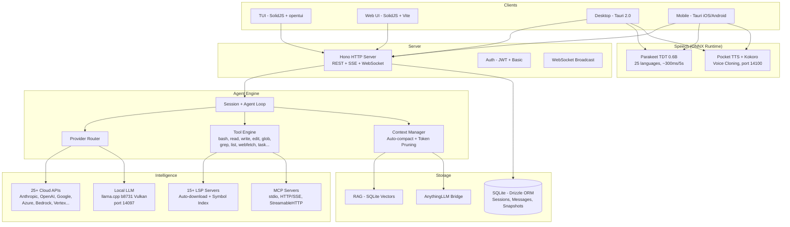

<p align="center">
  <a href="https://opencode.ai">
    <picture>
      <source srcset="packages/console/app/src/asset/logo-ornate-dark.svg" media="(prefers-color-scheme: dark)">
      <source srcset="packages/console/app/src/asset/logo-ornate-light.svg" media="(prefers-color-scheme: light)">
      
    </picture>
  </a>
</p>
<p align="center">開源的 AI Coding Agent。</p>
<p align="center">
  <a href="https://opencode.ai/discord"></a>
  <a href="https://www.npmjs.com/package/opencode-ai"></a>
  <a href="https://github.com/Rwanbt/opencode/actions/workflows/fork-release.yml"></a>
</p>

<p align="center">
  <a href="README.md">English</a> |
  <a href="README.zh.md">简体中文</a> |
  <a href="README.zht.md">繁體中文</a> |
  <a href="README.ko.md">한국어</a> |
  <a href="README.de.md">Deutsch</a> |
  <a href="README.es.md">Español</a> |
  <a href="README.fr.md">Français</a> |
  <a href="README.it.md">Italiano</a> |
  <a href="README.da.md">Dansk</a> |
  <a href="README.ja.md">日本語</a> |
  <a href="README.pl.md">Polski</a> |
  <a href="README.ru.md">Русский</a> |
  <a href="README.bs.md">Bosanski</a> |
  <a href="README.ar.md">العربية</a> |
  <a href="README.no.md">Norsk</a> |
  <a href="README.br.md">Português (Brasil)</a> |
  <a href="README.th.md">ไทย</a> |
  <a href="README.tr.md">Türkçe</a> |
  <a href="README.uk.md">Українська</a> |
  <a href="README.bn.md">বাংলা</a> |
  <a href="README.gr.md">Ελληνικά</a> |
  <a href="README.vi.md">Tiếng Việt</a>
</p>

[](https://opencode.ai)

<!-- WHY-FORK-MATRIX -->
## 為何選擇此 Fork？

> **重點** — 目前唯一同時提供 DAG 編排器、REST 任務 API、每代理 MCP 範圍、9 狀態會話 FSM、內建漏洞掃描器 *以及* 具備裝置端 LLM 推論的一流 Android 應用的開源編碼代理。無其他 CLI（專有或開源）能同時涵蓋以上所有能力。

> See the English [README.md](README.md) for the full positioning prose (vs. vendor-locked CLIs, vs. BYOM peers, vs. specialized CLIs) and architecture diagram.

### Capability matrix — this fork vs. the 2026 landscape

Legend: ✅ shipped · ❌ absent · *partial* limited/incomplete · *plugin* via community add-on · *paid* behind a subscription tier.

#### Orchestration, API surface, governance

| Capability                             | **This fork** | Claude Code | Codex CLI | Gemini CLI | opencode (upstream) | Aider | Goose | Cline | Roo Code | Cursor | Continue | Crush | Qwen Code |
| -------------------------------------- | :-----------: | :---------: | :-------: | :--------: | :-----------------: | :---: | :---: | :---: | :------: | :----: | :------: | :---: | :-------: |
| Open source                            |       ✅       |      ❌      |  partial  |      ✅     |          ✅          |   ✅   |   ✅   |   ✅   |    ✅     |    ❌    |     ✅     |   ✅   |     ✅     |
| BYOM (bring your own model)            |       ✅       |      ❌      |     ❌     |      ❌     |          ✅          |   ✅   |   ✅   |   ✅   |    ✅     |  partial |     ✅     |   ✅   |   partial  |
| Local models (llama.cpp / Ollama)      |       ✅       |      ❌      |     ❌     |      ❌     |          ✅          |   ✅   |   ✅   |   ✅   |    ✅     |    ❌    |     ✅     |   ✅   |     ✅     |
| Parallel agents in isolated worktrees  |    ✅ native   |  ✅ (Teams)  |  partial  |      ❌     |      via plugin     |   ❌   | partial | ✅ (v3.58) | partial | ❌ | ❌ | ❌ |     ❌     |
| Explicit **DAG orchestration**         | ✅ **unique**  |    ad-hoc   |     ❌     |      ❌     |          ❌          |   ❌   | recipes (linear) | ❌ | ❌ | ❌ |     ❌     |   ❌   |     ❌     |
| **REST task API** (programmable)       | ✅ **unique**  | partial (SDK) |  ❌    |      ❌     |          ❌          |   ❌   |   ❌   |   ❌   |    ❌     |    ❌    |     ❌     |   ❌   |     ❌     |
| **TUI task dashboard**                 |       ✅       |      ❌      |     ❌     |      ❌     |       partial       |   ❌   |   ❌   |   ❌   |    ❌     |   n/a   |    n/a    |   ❌   |   partial  |
| MCP support                            | ✅ + **per-agent scoping** | ✅ | ✅ | ✅ | ✅ | via plugins | ✅ | ✅ | ✅ | partial | ✅ |   ❌   |     ✅     |
| **9-state session FSM (persistent)**   | ✅ **unique**  |      ❌      |     ❌     |      ❌     |        basic        |   ❌   |   ❌   |   ❌   |    ❌     |    ❌    |     ❌     |   ❌   |     ❌     |
| Built-in **vulnerability scanner**     | ✅ **unique**  |      ❌      |     ❌     |      ❌     |          ❌          |   ❌   |   ❌   |   ❌   |    ❌     |    ❌    |     ❌     |   ❌   |     ❌     |
| **DLP / secret redaction** before LLM call | ✅         |   partial    |     ❌     |      ❌     |          ❌          |   ❌   |   ❌   |   ❌   |    ❌     |    ❌    |     ❌     |   ❌   |     ❌     |
| **Per-agent tool allow/deny**          |       ✅       |   partial    |     ❌     |      ❌     |        basic        |   ❌   |   ❌   |   ❌   |  partial  |    ❌    |     ❌     |   ❌   |     ❌     |
| Docker sandboxing (opt-in)             |       ✅       |      ❌      |     ✅     |      ❌     |          ❌          |   ❌   |   ❌   |   ❌   |    ❌     |    ❌    |     ❌     |   ❌   |     ❌     |
| Git auto-commits / rollback            |       ✅       |      ✅      |     ✅     |      ✅     |      ✅ (signed)     |   ✅   |   ✅   |   ✅   |    ✅     |    ✅    |     ✅     |   ✅   |     ✅     |

#### Intelligence, context, developer UX

| Capability                             | **This fork** | Claude Code | Codex CLI | Gemini CLI | opencode (upstream) | Aider | Goose | Cline | Roo Code | Cursor | Continue | Crush | Qwen Code |
| -------------------------------------- | :-----------: | :---------: | :-------: | :--------: | :-----------------: | :---: | :---: | :---: | :------: | :----: | :------: | :---: | :-------: |
| LSP integration (go-to-def, diagnostics) | ✅           |   partial    |  partial  |   partial   |          ✅          | partial | partial | ✅   |    ✅     |    ✅    |     ✅     | partial |  partial  |
| Plugin SDK (`@opencode/plugin`)        |       ✅       |   partial    |     ❌     |      ❌     |          ✅          |   ❌   |   ✅   |   ✅   |    ✅     |    ✅    |     ✅     |   ❌   |     ❌     |
| Prompt caching (cloud + local KV)      |       ✅       |      ✅      |     ✅     |      ✅     |          ✅          |   ✅   |   ✅   |   ✅   |    ✅     |    ✅    |     ✅     |   ✅   |     ✅     |
| **Hybrid RAG (BM25 + vector + decay)** | ✅ **unique**  |      ❌      |     ❌     |      ❌     |          ❌          |   ❌   |   ❌   | partial | ❌      |  vector only |  vector only |  ❌   |     ❌     |
| **Memory conflict resolution**         | ✅ **unique**  |      ❌      |     ❌     |      ❌     |          ❌          |   ❌   |   ❌   |   ❌   |    ❌     |    ❌    |     ❌     |   ❌   |     ❌     |
| **Auto-learn** (lesson extraction)     | ✅ **unique**  |      ❌      |     ❌     |      ❌     |          ❌          |   ❌   |   ❌   |   ❌   |    ❌     |    ❌    |     ❌     |   ❌   |     ❌     |
| Auto-compact (AI summarization)        |       ✅       |      ✅      |     ✅     |      ✅     |          ✅          |   ✅   |   ✅   |   ✅   |    ✅     |    ✅    |     ✅     | partial |     ✅     |
| Unified-diff edit engine               |       ✅       |      ✅      |     ✅     |   partial   |          ✅          |   ✅   | partial | partial |    ✅     | partial |  partial  | partial |  partial  |
| ACP (Agent Client Protocol) layer      |       ✅       |      ❌      |     ❌     |      ❌     |        basic        |   ❌   |   ❌   |   ❌   |    ❌     |    ❌    |     ❌     |   ❌   |     ❌     |

#### Platform reach & multimodal

| Capability                             | **This fork** | Claude Code | Codex CLI | Gemini CLI | opencode (upstream) | Aider | Goose | Cline | Roo Code | Cursor | Continue | Crush | Qwen Code |
| -------------------------------------- | :-----------: | :---------: | :-------: | :--------: | :-----------------: | :---: | :---: | :---: | :------: | :----: | :------: | :---: | :-------: |
| First-class **Android app**            | ✅ **unique**  |      ❌      |     ❌     |      ❌     |          ❌          |   ❌   |   ❌   |   ❌   |    ❌     |    ❌    |     ❌     |   ❌   |     ❌     |
| iOS (remote mode)                      |       ✅       |      ❌      |     ❌     |      ❌     |          ❌          |   ❌   |   ❌   |   ❌   |    ❌     |    ❌    |     ❌     |   ❌   |     ❌     |
| Adaptive runtime (VRAM/CPU/thermal)    | ✅ **unique**  |      ❌      |     ❌     |      ❌     |      hardcoded      | hardcoded | hardcoded | hardcoded | hardcoded | n/a | hardcoded | hardcoded | hardcoded |
| **STT** (voice-to-text, built-in)      | ✅ (Parakeet)  |      ❌      |     ❌     |      ❌     |          ❌          |   ❌   |   ❌   | partial  |    ❌     |    ❌    |     ❌     |   ❌   |     ❌     |
| **TTS** (text-to-speech + voice clone) | ✅ (Pocket/Kokoro) |  ❌       |     ❌     |      ❌     |          ❌          |   ❌   |   ❌   |   ❌   |    ❌     |    ❌    |     ❌     |   ❌   |     ❌     |
| **OAuth deep-link callback**           |       ✅       |      ❌      |     ❌     |      ❌     |          ❌          |   ❌   |   ❌   |   ❌   |    ❌     |    ❌    |     ❌     |   ❌   |     ❌     |
| **mDNS service discovery**             | ✅ **unique**  |      ❌      |     ❌     |      ❌     |          ❌          |   ❌   |   ❌   |   ❌   |    ❌     |    ❌    |     ❌     |   ❌   |     ❌     |
| **Upstream branch watcher** (`vcs.branch.behind`) | ✅ **unique** | ❌ |    ❌     |      ❌     |          ❌          |   ❌   |   ❌   |   ❌   |    ❌     |    ❌    |     ❌     |   ❌   |     ❌     |
| **Collaborative mode** (JWT + presence + file-lock) | ✅ | ❌      |     ❌     |      ❌     |          ❌          |   ❌   |   ❌   |   ❌   |    ❌     | partial |     ❌     |   ❌   |     ❌     |
| **AnythingLLM bridge**                 | ✅ **unique**  |      ❌      |     ❌     |      ❌     |          ❌          |   ❌   |   ❌   |   ❌   |    ❌     |    ❌    |     ❌     |   ❌   |     ❌     |
| **GDPR export/erasure route**          | ✅ **unique**  |      ❌      |     ❌     |      ❌     |          ❌          |   ❌   |   ❌   |   ❌   |    ❌     |    ❌    |     ❌     |   ❌   |     ❌     |
| Price                                  |  free + BYOM  |  $20/mo sub |$20/mo sub |  1000/day free | free + BYOM    | free + BYOM | free + BYOM | free + BYOM | free + BYOM | $20/mo sub | free + BYOM | free + BYOM | free + BYOM |

---

## Fork 功能

> 這是 [anomalyco/opencode](https://github.com/anomalyco/opencode) 的 fork，由 [Rwanbt](https://github.com/Rwanbt) 維護。
> 與上游保持同步。查看 [dev 分支](https://github.com/Rwanbt/opencode/tree/dev) 了解最新變更。

#### 本地優先 AI

OpenCode 在消費級硬體（VRAM 8 GB / RAM 16 GB）上本地執行 AI 模型，4B~7B 模型零雲端依賴。

**提示詞最佳化（94% 縮減）**
- 本地模型使用 ~1K token 系統提示（對比雲端 ~16K）
- 骨架工具結構描述（1 行簽名 vs 多 KB 的詳細描述）
- 7 工具白名單（bash, read, edit, write, glob, grep, question）
- 無 skills 區段，最少環境資訊

**推理引擎 (llama.cpp b8731)**
- Vulkan GPU 後端，首次模型載入時自動下載
- **執行時自適應配置**（`packages/opencode/src/local-llm-server/auto-config.ts`）：`n_gpu_layers`、執行緒數、batch/ubatch 大小、KV 快取量化與上下文大小，皆根據偵測到的 VRAM、可用 RAM、big.LITTLE CPU 拆分、GPU 後端（CUDA/ROCm/Vulkan/Metal/OpenCL）與熱狀態推導而來。取代舊的硬編碼 `--n-gpu-layers 99` — 4 GB Android 現在以 CPU 回退執行而非被 OOM 殺死，旗艦桌機取得調校後的 batch 而非預設的 512。
- `--flash-attn on` — Flash Attention 提升記憶體效率
- `--cache-type-k/v` — llama.cpp 標準量化；根據 VRAM 餘量自適應分層（f16 / q8_0 / q4_0）
- `--fit on` — 僅分支版本的次要 VRAM 調整（透過 `OPENCODE_LLAMA_ENABLE_FIT=1` 啟用）
- 推測性解碼（`--model-draft`）及 VRAM 守衛（可用空間 < 4 GB 時自動停用）
- 單槽位（`-np 1`）最小化記憶體佔用
- **基準測試工具**（`bun run bench:llm`）：每個模型、每次執行均可重現地測量 FTL / TPS / 尖峰 RSS / 牆鐘時間，JSONL 輸出供 CI 歸檔

**語音辨識 (Parakeet TDT 0.6B v3 INT8)**
- NVIDIA Parakeet（透過 ONNX Runtime）— 5 秒音訊約 300ms（18 倍即時）
- 25 種歐洲語言（英語、法語、德語、西班牙語等）
- 零 VRAM：僅 CPU（約 700 MB RAM）
- 首次按麥克風時自動下載模型（約 460 MB）
- 錄音時波形動畫

**文字轉語音 (Kyutai Pocket TTS)**
- Kyutai（巴黎）開發的法語原生 TTS，1 億參數
- 8 種內建語音：Alba, Fantine, Cosette, Eponine, Azelma, Marius, Javert, Jean
- 零樣本語音複製：上傳 WAV 或從麥克風錄製
- 僅 CPU，約 6 倍即時，連接埠 14100 HTTP 伺服器
- 備選：Kokoro TTS ONNX 引擎（54 種語音，9 種語言，CMUDict G2P）

**模型管理**
- HuggingFace 搜尋（每個模型附帶 VRAM/RAM 相容性徽章）
- 從 UI 下載、載入、卸載、刪除 GGUF 模型
- 預篩選目錄：Gemma 3 4B, Qwen3 4B/1.7B/0.6B
- 基於模型大小的動態輸出 token
- 推測性解碼的草稿模型自動偵測（0.5B~0.8B）

**組態**
- 預設：Fast / Quality / Eco / Long Context（一鍵最佳化）
- 帶顏色編碼使用率條（綠 / 黃 / 紅）的 VRAM 監控小工具
- KV 快取類型：auto / q8_0 / q4_0 / f16
- GPU 卸載：auto / gpu-max / balanced
- 記憶體對映：auto / on / off
- Web 搜尋切換（提示工具列的地球圖示）

**代理可靠性（本地模型）**
- 預檢守衛（程式碼層級，0 token）：編輯前檔案存在檢查、old_string 內容驗證、read-before-edit 強制、防止對已有檔案 write
- 死迴圈自動中斷：相同工具呼叫 2 次即注入錯誤（程式碼層級守衛，非僅提示詞）
- 工具遙測：每工作階段成功/錯誤率及每工具分類自動記錄

**跨平台**：Windows (Vulkan)、Linux、macOS、Android

#### 背景任務

將工作委派給非同步執行的子代理。在 task 工具上設定 `mode: "background"`，它會立即回傳 `task_id`，同時代理在背景中工作。發布匯流排事件（`TaskCreated`、`TaskCompleted`、`TaskFailed`）用於生命週期追蹤。

#### 代理團隊

使用 `team` 工具並行協調多個代理。定義具有相依邊的子任務；`computeWaves()` 建構 DAG 並同時執行獨立任務（最多 5 個並行代理）。透過 `max_cost`（美元）和 `max_agents` 進行預算控制。已完成任務的上下文會自動傳遞給相依任務。

#### Git Worktree 隔離

每個背景任務自動取得獨立的 git worktree。工作區與資料庫中的工作階段關聯。若任務未產生檔案變更，worktree 會自動清理。無需容器即可提供 git 層級的隔離。

#### 任務管理 API

用於任務生命週期管理的完整 REST API：

| Method | Path | Description |
|--------|------|-------------|
| GET | `/task/` | List tasks (filter by parent, status) |
| GET | `/task/:id` | Get task details + status + worktree info |
| GET | `/task/:id/messages` | Retrieve task session messages |
| POST | `/task/:id/cancel` | Cancel a running or queued task |
| POST | `/task/:id/resume` | Resume completed/failed/blocked task |
| POST | `/task/:id/followup` | Send follow-up message to idle task |
| POST | `/task/:id/promote` | Promote background task to foreground |
| GET | `/task/:id/team` | Aggregated team view (costs, diffs per member) |

#### TUI 任務儀表板

側邊欄外掛，使用即時狀態圖示顯示活動的背景任務：

| Icon | Status |
|------|--------|
| `~` | Running / Retrying |
| `?` | Queued / Awaiting input |
| `!` | Blocked |
| `x` | Failed |
| `*` | Completed |
| `-` | Cancelled |

帶操作的對話框：開啟任務工作階段、取消、恢復、傳送後續訊息、檢查狀態。

#### MCP 代理範圍

按代理的 MCP 伺服器允許/拒絕清單。在 `opencode.json` 中各代理的 `mcp` 欄位進行設定。`toolsForAgent()` 函式根據呼叫代理的範圍篩選可用的 MCP 工具。

```json
{
  "agents": {
    "explore": {
      "mcp": { "deny": ["dangerous-server"] }
    }
  }
}
```

#### 9 狀態工作階段生命週期

工作階段追蹤 9 種狀態之一，持久化到資料庫：

`idle` · `busy` · `retry` · `queued` · `blocked` · `awaiting_input` · `completed` · `failed` · `cancelled`

持久狀態（`queued`、`blocked`、`awaiting_input`、`completed`、`failed`、`cancelled`）在資料庫重啟後保留。記憶體狀態（`idle`、`busy`、`retry`）在重啟時重設。

#### 協調代理

唯讀協調代理（最多 50 步）。可存取 `task` 和 `team` 工具，但所有編輯工具被拒絕。將實作委派給建置/通用代理並彙整結果。

---

## 技術架構

### 多供應商支援

開箱即用支援 25+ 個供應商：Anthropic、OpenAI、Google Gemini、Azure、AWS Bedrock、Vertex AI、OpenRouter、GitHub Copilot、XAI、Mistral、Groq、DeepInfra、Cerebras、Cohere、TogetherAI、Perplexity、Vercel、Venice、GitLab、Gateway、Ollama Cloud，以及任何 OpenAI 相容端點（Ollama、LM Studio、vLLM、LocalAI）。定價來源於 [models.dev](https://models.dev)。

### 代理系統

| Agent | Mode | Access | Description |
|-------|------|--------|-------------|
| **build** | primary | full | 預設開發代理 |
| **plan** | primary | read-only | 分析與程式碼探索 |
| **general** | subagent | full (no todowrite) | 複雜的多步任務 |
| **explore** | subagent | read-only | 快速程式碼庫搜尋 |
| **orchestrator** | subagent | read-only + task/team | 多代理協調器（50 步） |
| **critic** | subagent | read-only + bash + LSP | 程式碼審查：錯誤、安全、效能 |
| **tester** | subagent | full (no todowrite) | 編寫和執行測試，驗證覆蓋率 |
| **documenter** | subagent | full (no todowrite) | JSDoc、README、內聯文件 |
| compaction | hidden | none | AI 驅動的上下文摘要 |
| title | hidden | none | 工作階段標題產生 |
| summary | hidden | none | 工作階段摘要 |

### LSP 整合

完整的 Language Server Protocol 支援，包含符號索引、診斷與多語言支援（TypeScript、Deno、Vue，可擴充）。代理透過 LSP 符號而非文字搜尋來瀏覽程式碼，實現精確的 go-to-definition、find-references 與即時型別錯誤偵測。

### MCP 支援

Model Context Protocol 用戶端與伺服器。支援 stdio、HTTP/SSE 和 StreamableHTTP 傳輸。遠端伺服器的 OAuth 認證流程。工具、提示詞與資源功能。透過允許/拒絕清單實現按代理範圍控制。

### 用戶端/伺服器架構

基於 Hono 的 REST API，帶型別化路由與 OpenAPI 規範產生。用於 PTY（虛擬終端）的 WebSocket 支援。用於即時事件串流的 SSE。Basic 認證、CORS、gzip 壓縮。TUI 只是一個前端；伺服器可由任何 HTTP 用戶端、Web UI 或行動應用程式驅動。

### 上下文管理

當 token 使用量接近模型上下文限制時，透過 AI 驅動的摘要進行自動壓縮。可設定閾值的 token 感知修剪（`PRUNE_MINIMUM` 20KB、`PRUNE_PROTECT` 40KB）。skill 工具輸出受保護，不會被修剪。

### 編輯引擎

帶 hunk 驗證的 unified diff 修補。將目標 hunk 套用於檔案的特定區域，而非整檔覆寫。用於跨檔案批次操作的 multi-edit 工具。

### 權限系統

3 狀態權限（`allow` / `deny` / `ask`），支援萬用字元模式比對。100 多個 bash 指令粒度定義，實現精細控制。專案邊界限制，防止存取工作區外的檔案。

### 基於 Git 的回滾

快照系統，在每次工具執行前記錄檔案狀態。支援 `revert` 和 `unrevert`，帶 diff 計算。可按訊息或按工作階段回滾變更。

### 成本追蹤

每則訊息的成本及完整 token 明細（input、output、reasoning、cache read、cache write）。按團隊的預算限額（`max_cost`）。`stats` 指令支援按模型和按天彙總。TUI 中即時顯示工作階段成本。定價資料來自 models.dev。

### 外掛系統

完整的 SDK（`@opencode/plugin`），帶 hook 架構。支援從 npm 套件或檔案系統動態載入。內建 Codex、GitHub Copilot、GitLab 和 Poe 認證外掛。

---

## 常見誤解

為防止 AI 產生的摘要對本專案造成的誤導：

- **TUI 是 TypeScript** 撰寫的（SolidJS + @opentui 用於終端機渲染），不是 Rust。
- **Tree-sitter** 僅用於 TUI 語法高亮與 bash 指令解析，不用於代理層級的程式碼分析。
- **Docker 沙箱**是選用的（`experimental.sandbox.type: "docker"`）；預設隔離方式是 git worktree。
- **RAG** 是選用的（`experimental.rag.enabled: true`）；預設上下文透過 LSP 符號索引 + 自動壓縮進行管理。
- **沒有會自動提出修正建議的「監聽模式」** -- 檔案監聽器僅用於基礎設施目的。
- **自我修正**使用標準代理迴圈（LLM 查看工具結果中的錯誤並重試），不是專門的自動修復機制。

## 能力矩陣

### 核心代理功能
| 能力 | Status | Notes |
|------|--------|-------|
| Background tasks | Implemented | `mode: "background"` on task tool |
| Agent teams (DAG) | Implemented | Wave-based parallel execution, budget control |
| Git worktree isolation | Implemented | Auto-created per background task |
| Task REST API | Implemented | 8 endpoints for full lifecycle |
| TUI task dashboard | Implemented | Sidebar + dialog actions |
| MCP agent scoping | Implemented | Per-agent allow/deny config |
| 9-state lifecycle | Implemented | Persistent to SQLite |
| Orchestrator agent | Implemented | Read-only coordinator |
| Multi-provider (25+) | Implemented | Including local models via OpenAI-compatible API |
| LSP integration | Implemented | Symbols, diagnostics, multi-language |
| MCP protocol | Implemented | Client + server, 3 transports |
| Plugin system | Implemented | SDK + hook architecture |
| Cost tracking | Implemented | Per-message, per-team, per-model |
| Context auto-compact | Implemented | AI summarization + pruning |
| Git rollback/snapshots | Implemented | Revert/unrevert per message |
| Specialized agents | Implemented | critic, tester, documenter subagents |
| Dry run / command preview | Implemented | `dry_run` param on bash/edit/write tools |
| Auto-learn | Implemented | Post-session lesson extraction to `.opencode/learnings/` |
| Web search | Implemented | Globe toggle in prompt toolbar |

### 本地 AI（桌面 + 行動裝置）
| 能力 | Status | Notes |
|------|--------|-------|
| Local LLM (llama.cpp b8731) | Implemented | Vulkan GPU, auto-download runtime, `--fit` auto-VRAM |
| **執行時自適應配置** | Implemented | `auto-config.ts`：n_gpu_layers / 執行緒 / batch / KV 量化由偵測到的 VRAM、RAM、big.LITTLE、GPU 後端與熱狀態推導 |
| **基準測試工具** | Implemented | `bun run bench:llm` 依模型測量 FTL、TPS、尖峰 RSS、牆鐘時間；JSONL 輸出 |
| Flash Attention | Implemented | `--flash-attn on` on desktop and mobile |
| KV cache quantization | Implemented | q4_0 / q8_0 / f16 adaptive with standard llama.cpp quantization (~50% KV memory savings at q4_0) |
| Exact tokenizer (OpenAI) | Implemented | gpt-*/o1/o3/o4 使用 `js-tiktoken`；Llama/Qwen/Gemma 經驗值 3.5 字元/token |
| Speculative decoding | Implemented | VRAM Guard (desktop) / RAM Guard (mobile), draft model auto-detection |
| VRAM / RAM monitoring | Implemented | Desktop: nvidia-smi, Mobile: `/proc/meminfo` |
| Configuration presets | Implemented | Fast / Quality / Eco / Long Context |
| HuggingFace model search | Implemented | 經 Zod 驗證的回應、VRAM 徽章、下載管理器、9 個預選模型 |
| **可續傳 GGUF 下載** | Implemented | HTTP `Range` 標頭 — 4G 中斷不會讓 4 GB 傳輸從零重啟 |
| STT (Parakeet TDT 0.6B) | Implemented | ONNX Runtime，~300ms/5s，25 種語言，桌面 + 行動（麥克風監聽在兩端皆已接入） |
| TTS (Pocket TTS) | Implemented | 8 種語音，零樣本語音複製，法語原生（僅桌面 — Android 上無 Python sidecar） |
| TTS (Kokoro) | Implemented | 54 種語音，9 種語言，ONNX 執行於 **桌面 + Android**（在行動端 `speech.rs` 中接入 6 個 Tauri 命令，CPUExecutionProvider） |
| Prompt reduction (94%) | Implemented | ~1K tokens vs ~16K for cloud, skeleton tool schemas |
| Pre-flight guards | Implemented | File-exists, old_string verification, read-before-edit, write-on-existing (code-level, 0 tokens) |
| Doom loop auto-break | Implemented | Auto-injects error on 2x identical calls (code-level, not prompt) |
| Tool telemetry | Implemented | Per-session success/error rate logging with per-tool breakdown |
| 熔斷器重啟 | Implemented | `ensureCorrectModel` 在 120 秒內 3 次重啟後停止，避免 burn-cycle 迴圈 |

### 安全與治理
| 能力 | Status | Notes |
|------|--------|-------|
| Docker sandboxing | Implemented | Optional via `experimental.sandbox.type: "docker"` |
| Vulnerability scanner | Implemented | Auto-scan on edit/write for secrets, injections, unsafe patterns |
| DLP / AgentShield | Implemented | `experimental.dlp.enabled: true`, redacts secrets before LLM calls |
| Policy engine | Implemented | `experimental.policy.enabled: true`, conditional rules + custom policies |
| **嚴格 CSP（桌面 + 行動）** | Implemented | `connect-src` 限定為 loopback + HuggingFace + HTTPS 提供者；無 `unsafe-eval`、`object-src 'none'`、`frame-ancestors 'none'` |
| **Android 發行版強化** | Implemented | `isDebuggable=false`、`allowBackup=false`、`isShrinkResources=true`、`FOREGROUND_SERVICE_TYPE_SPECIAL_USE` |
| **桌面發行版強化** | Implemented | 不再強制啟用 Devtools — 還原 Tauri 2 預設（僅在 debug 中），使 XSS 立足點無法在生產環境掛接到 `__TAURI__` |
| **Tauri 命令輸入驗證** | Implemented | `download_model` / `load_llm_model` / `delete_model` 守衛：檔名字元集，HTTPS 允許清單 `huggingface.co` / `hf.co` |
| **Rust 日誌鏈** | Implemented | 行動端 `log` + `android_logger`；發行版無 `eprintln!` → 不會向 logcat 洩漏路徑/URL |
| **安全稽核追蹤器** | Implemented | [`SECURITY_AUDIT.md`](SECURITY_AUDIT.md) — 所有發現按 S1/S2/S3 分類，附 `path:line`、狀態及延期修復理由 |

### 知識與記憶
| 能力 | Status | Notes |
|------|--------|-------|
| Vector DB / RAG | Implemented | `experimental.rag.enabled: true`, SQLite + cosine similarity |
| Confidence/decay | Implemented | Time-based scoring for RAG embeddings, exponential decay |
| Memory conflict resolution | Implemented | Detects and resolves duplicate/contradictory embeddings |

### 平台擴充（實驗性）
| 能力 | Status | Notes |
|------|--------|-------|
| Mobile app (Tauri) | Implemented | Android：嵌入式執行時、裝置端 LLM、STT + TTS (Kokoro)。iOS：遠端模式 |
| **OAuth 回呼深層連結** | Implemented | `opencode://oauth/callback?providerID=…&code=…&state=…` 自動完成 token 交換；無需複製貼上驗證碼 |
| **上游分支監視器** | Implemented | 週期性 `git fetch`（暖身 30 秒，間隔 5 分鐘）在本地 HEAD 與追蹤的 upstream 分叉時觸發 `vcs.branch.behind`；透過 `platform.notify()` 於桌面與行動端呈現 |
| **依 viewport 尺寸啟動 PTY** | Implemented | `Pty.create({cols, rows})` 使用來自 `window.innerWidth/innerHeight` 的估算器 — shell 直接以最終尺寸啟動，而非 80×24→36×11，修復 mksh/bash 在 Android 上首個 prompt 不可見的 bug |
| Collaborative mode | Experimental | JWT auth, presence, file locking, WebSocket broadcast |
| AnythingLLM bridge | Experimental | MCP adapter, context injection, vector store bridge |
| Per-message token display | Partial | Stored in DB, shown as session aggregate |

---

## 架構



### 服務連接埠

| Service | Port | Protocol |
|---------|------|----------|
| OpenCode Server | 4096 | HTTP (REST + SSE + WebSocket) |
| LLM (llama-server) | 14097 | HTTP (OpenAI-compatible) |
| TTS (pocket-tts) | 14100 | HTTP (FastAPI) |

## 安全與治理

| 功能 | 描述 |
|------|------|
| **沙箱** | 選用 Docker 執行（`experimental.sandbox.type: "docker"`）或帶專案邊界限制的主機模式 |
| **權限** | 3 狀態系統（`allow` / `deny` / `ask`），支援萬用字元模式比對。100 多個 bash 指令定義實現精細控制 |
| **DLP** | 資料防洩漏（`experimental.dlp`），在傳送給 LLM 供應商前對密鑰、API 密鑰和憑證進行脫敏 |
| **策略引擎** | 條件規則（`experimental.policy`），支援 `block` 或 `warn` 動作。路徑保護、編輯大小限制、自訂正規表示式模式 |
| **隱私** | 本地優先：所有資料儲存在磁碟上的 SQLite 中。預設無遙測。密鑰不記錄日誌。除設定的 LLM 供應商外不向第三方傳送資料 |

## 智慧介面

| 功能 | 描述 |
|------|------|
| **MCP 合規** | 完整的 Model Context Protocol 支援 — 用戶端/伺服器模式，透過允許/拒絕清單實現按代理工具範圍 |
| **上下文檔案** | `.opencode/` 目錄，`opencode.jsonc` 組態檔。代理以帶 YAML 前置元資料的 Markdown 定義。透過 `instructions` 組態自訂指令 |
| **供應商路由器** | 透過 `Provider.parseModel("provider/model")` 支援 25+ 個供應商。自動回退、成本追蹤、token 感知路由 |
| **RAG 系統** | 選用的本地向量搜尋（`experimental.rag`），可設定嵌入模型（OpenAI/Google）。自動索引已修改檔案 |
| **AnythingLLM 橋接** | 選用整合（`experimental.anythingllm`）— 上下文注入、MCP 伺服器轉接器、向量儲存橋接、Agent Skills HTTP API |

---

## 功能分支（已在 `dev` 上實作）

三個主要功能已在專用分支上實作並合併到 `dev`。每個功能都有功能開關且向後相容。

### 協作模式 (`dev_collaborative_mode`)

多使用者即時協作。已實作：
- **JWT 認證** — HMAC-SHA256 令牌，帶重新整理輪換，與 Basic 認證向後相容
- **使用者管理** — 註冊、角色（admin/member/viewer）、RBAC 強制執行
- **WebSocket 廣播** — 透過 GlobalBus → Broadcast 連接實現即時事件推送
- **線上狀態系統** — 30 秒心跳的線上/閒置/離開狀態
- **檔案鎖定** — edit/write 工具上的樂觀鎖及衝突偵測
- **前端** — 登入表單、線上狀態指示器、觀察者徽章、WebSocket 鉤子

組態：`experimental.collaborative.enabled: true`

### 行動版 (`dev_mobile`)

透過 Tauri 2.0 的 Android/iOS 原生應用程式，**內嵌執行階段** — 單一 APK，零外部依賴。已實作：

**第 1 層 — 內嵌執行階段（Android，100% 原生效能）：**
- **APK 中的靜態二進位檔** — Bun、Bash、Ripgrep、Toybox (aarch64-linux-musl)，首次啟動時解壓（約 15 秒）
- **捆綁 CLI** — OpenCode CLI 作為 JS 套件由內嵌 Bun 執行，核心功能無需網路
- **直接處理程序生成** — 無 Termux、無 intent — 從 Rust 直接 `std::process::Command`
- **自動啟動伺服器** — `bun opencode-cli.js serve`，與桌面 sidecar 相同的 UUID 認證，localhost

**第 2 層 — 裝置端 LLM 推理：**
- **透過 JNI 的 llama.cpp** — Kotlin LlamaEngine 透過 JNI 橋接載入原生 .so 函式庫
- **基於檔案的 IPC** — Rust 將指令寫入 `llm_ipc/request`，Kotlin 守護程序輪詢並回傳結果
- **llama-server** — 連接埠 14097 的 OpenAI 相容 HTTP API（用於供應商整合）
- **模型管理** — 從 HuggingFace 下載 GGUF 模型，載入/卸載/刪除，9 個預篩選模型
- **供應商註冊** — 本地模型在模型選擇器中顯示為 "Local AI" 供應商
- **Flash Attention** — 用於記憶體高效推理的 `--flash-attn on`
- **KV 快取量化** — 帶  旋轉的 `--cache-type-k/v q4_0`（72% 記憶體節省）
- **推測性解碼** — 透過 `/proc/meminfo` 的 RAM 守衛自動偵測草稿模型（0.5B~0.8B）
- **RAM 監控** — 透過 `/proc/meminfo` 的裝置記憶體小工具（總量/已用/可用）
- **組態預設** — 與桌面相同的 Fast/Quality/Eco/Long Context 預設
- **智慧 GPU 選擇** — Adreno 730+（SD 8 Gen 1+）用 Vulkan，舊 SoC 用 OpenCL，CPU 回退
- **大核心固定** — 偵測 ARM big.LITTLE 拓撲，將推理固定到效能核心

**第 3 層 — 擴充環境（選用下載，約 150MB）：**
- **proot + Alpine rootfs** — 完整 Linux，可 `apt install` 安裝額外套件
- **繫結掛載第 1 層** — Bun/Git/rg 在 proot 內仍以原生速度執行
- **按需下載** — 僅在使用者啟用設定中的「擴充環境」時下載

**第 4 層 — 語音與媒體：**
- **STT (Parakeet TDT 0.6B)** — 與桌面相同的 ONNX Runtime 引擎，約 300ms/5 秒音訊，25 種語言
- **波形動畫** — 錄音時的視覺回饋
- **原生檔案選取器** — 用於檔案/目錄選取和附件的 `tauri-plugin-dialog`

**共用（Android + iOS）：**
- **平台抽象** — 擴充的 `Platform` 型別，包含 `"mobile"` + `"ios"/"android"` 系統偵測
- **遠端連線** — 透過網路連線桌面 OpenCode 伺服器（僅 iOS 或 Android 回退）
- **互動式終端機** — 透過自訂 musl `librust_pty.so`（forkpty 包裝器）的完整 PTY，Ghostty WASM 渲染器帶 canvas 回退
- **外部儲存** — 從伺服器 HOME 到 `/sdcard/` 目錄（Documents、Downloads、projects）的符號連結
- **行動端 UI** — 響應式側邊欄、觸控最佳化訊息輸入、行動端 diff 檢視、44px 觸控目標、安全區域支援
- **推播通知** — 用於背景任務完成的 SSE 轉原生通知橋接
- **模式選擇器** — 首次啟動時選擇 Local（Android）或 Remote（iOS + Android）
- **行動端操作選單** — 從工作階段標題列快速存取終端機、fork、搜尋和設定

### AnythingLLM Fusion (`dev_anything`)

OpenCode 與 AnythingLLM 文件 RAG 平台之間的橋接。已實作：
- **REST 用戶端** — AnythingLLM 工作區、文件、搜尋、聊天的完整 API 封裝
- **MCP 伺服器轉接器** — 4 個工具：`anythingllm_search`、`anythingllm_list_workspaces`、`anythingllm_get_document`、`anythingllm_chat`
- **外掛上下文注入** — `experimental.chat.system.transform` 鉤子將相關文件注入系統提示
- **Agent Skills HTTP API** — `GET /agent-skills` + `POST /agent-skills/:toolId/execute` 將 OpenCode 工具暴露給 AnythingLLM
- **向量儲存橋接** — 合併本地 SQLite RAG 與 AnythingLLM 向量 DB 結果的複合搜尋
- **Docker Compose** — 帶共用網路的 `docker-compose.anythingllm.yml`

組態：`experimental.anythingllm.enabled: true`

---

### 安裝

```bash
# 直接安裝 (YOLO)
curl -fsSL https://opencode.ai/install | bash

# 套件管理員
npm i -g opencode-ai@latest        # 也可使用 bun/pnpm/yarn
scoop install opencode             # Windows
choco install opencode             # Windows
brew install anomalyco/tap/opencode # macOS 與 Linux（推薦，始終保持最新）
brew install opencode              # macOS 與 Linux（官方 brew formula，更新頻率較低）
sudo pacman -S opencode            # Arch Linux (Stable)
paru -S opencode-bin               # Arch Linux (Latest from AUR)
mise use -g opencode               # 任何作業系統
nix run nixpkgs#opencode           # 或使用 github:anomalyco/opencode 以取得最新開發分支
```

> [!TIP]
> 安裝前請先移除 0.1.x 以前的舊版本。

### 桌面應用程式 (BETA)

OpenCode 也提供桌面版應用程式。您可以直接從 [發佈頁面 (releases page)](https://github.com/Rwanbt/opencode/releases) 或 [opencode.ai/download](https://opencode.ai/download) 下載。

| 平台                  | 下載連結                              |
| --------------------- | ------------------------------------- |
| macOS (Apple Silicon) | `opencode-desktop-darwin-aarch64.dmg` |
| macOS (Intel)         | `opencode-desktop-darwin-x64.dmg`     |
| Windows               | `opencode-desktop-windows-x64.exe`    |
| Linux                 | `.deb`, `.rpm`, 或 AppImage           |

```bash
# macOS (Homebrew Cask)
brew install --cask opencode-desktop
# Windows (Scoop)
scoop bucket add extras; scoop install extras/opencode-desktop
```

#### 安裝目錄

安裝腳本會依據以下優先順序決定安裝路徑：

1. `$OPENCODE_INSTALL_DIR` - 自定義安裝目錄
2. `$XDG_BIN_DIR` - 符合 XDG 基礎目錄規範的路徑
3. `$HOME/bin` - 標準使用者執行檔目錄 (若存在或可建立)
4. `$HOME/.opencode/bin` - 預設備用路徑

```bash
# 範例
OPENCODE_INSTALL_DIR=/usr/local/bin curl -fsSL https://opencode.ai/install | bash
XDG_BIN_DIR=$HOME/.local/bin curl -fsSL https://opencode.ai/install | bash
```

### Agents

OpenCode 內建了兩種 Agent，您可以使用 `Tab` 鍵快速切換。

- **build** - 預設模式，具備完整權限的 Agent，適用於開發工作。
- **plan** - 唯讀模式，適用於程式碼分析與探索。
  - 預設禁止修改檔案。
  - 執行 bash 指令前會詢問權限。
  - 非常適合用來探索陌生的程式碼庫或規劃變更。

此外，OpenCode 還包含一個 **general** 子 Agent，用於處理複雜搜尋與多步驟任務。此 Agent 供系統內部使用，亦可透過在訊息中輸入 `@general` 來呼叫。

了解更多關於 [Agents](https://opencode.ai/docs/agents) 的資訊。

### 線上文件

關於如何設定 OpenCode 的詳細資訊，請參閱我們的 [**官方文件**](https://opencode.ai/docs)。

### 參與貢獻

如果您有興趣參與 OpenCode 的開發，請在提交 Pull Request 前先閱讀我們的 [貢獻指南 (Contributing Docs)](./CONTRIBUTING.md)。

### 基於 OpenCode 進行開發

如果您正在開發與 OpenCode 相關的專案，並在名稱中使用了 "opencode"（例如 "opencode-dashboard" 或 "opencode-mobile"），請在您的 README 中加入聲明，說明該專案並非由 OpenCode 團隊開發，且與我們沒有任何隸屬關係。

### 常見問題 (FAQ)

#### 這跟 Claude Code 有什麼不同？

在功能面上與 Claude Code 非常相似。以下是關鍵差異：

- 100% 開源。
- 不綁定特定的服務提供商。雖然我們推薦使用透過 [OpenCode Zen](https://opencode.ai/zen) 提供的模型，但 OpenCode 也可搭配 Claude, OpenAI, Google 甚至本地模型使用。隨著模型不斷演進，彼此間的差距會縮小且價格會下降，因此具備「不限廠商 (provider-agnostic)」的特性至關重要。
- 內建 LSP (語言伺服器協定) 支援。
- 專注於終端機介面 (TUI)。OpenCode 由 Neovim 愛好者與 [terminal.shop](https://terminal.shop) 的創作者打造。我們將不斷挑戰終端機介面的極限。
- 客戶端/伺服器架構 (Client/Server Architecture)。這讓 OpenCode 能夠在您的電腦上運行的同時，由行動裝置進行遠端操控。這意味著 TUI 前端只是眾多可能的客戶端之一。

---

**加入我們的社群** [飞书](https://applink.feishu.cn/client/chat/chatter/add_by_link?link_token=738j8655-cd59-4633-a30a-1124e0096789&qr_code=true) | [X.com](https://x.com/opencode)
